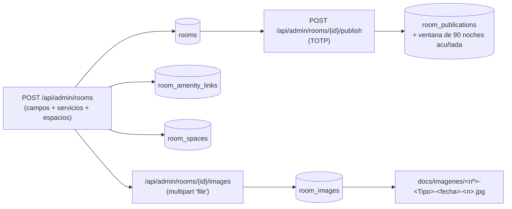
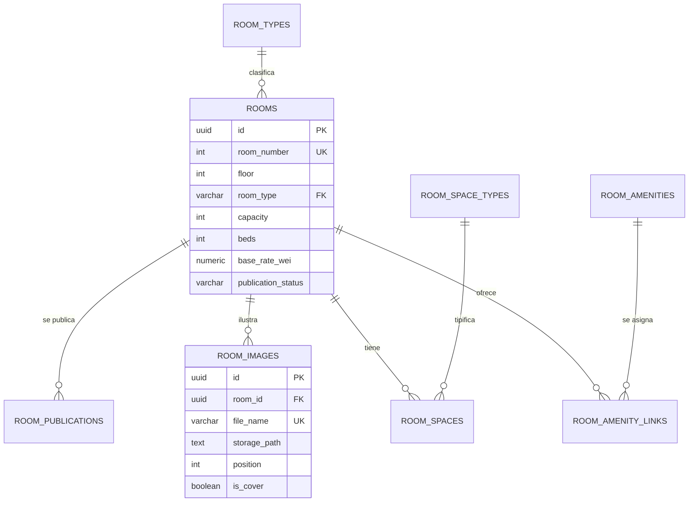
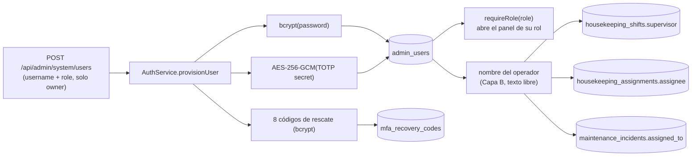
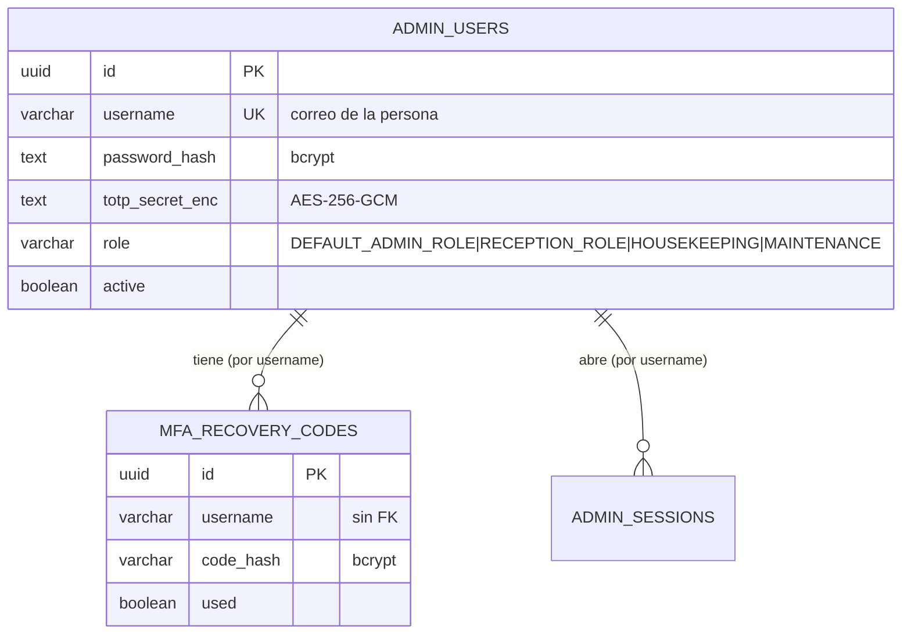
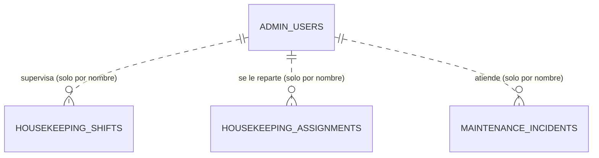

# Estructura de datos — alta de habitación y personal (2026-10-05)

> **Parte I** (§1–§4): alta de una habitación → script [`scripts/planta.ts`](../../scripts/planta.ts).
> **Parte II** (§5–§7): alta del personal del hotel → script `scripts/personal.ts` (pendiente de aprobación).

> **Skill**: `@inyecta-datos` · **Proyecto**: `hotel-room-mcp-trazable`
> **Contexto**: la base off-chain se inicializó a cero (§42 de `estado_proyecto.md`); este documento
> describe **todo lo que hay que escribir** para que una habitación exista y se vea en la web, que es
> la base del script `@planta`.

## 1. Proceso: qué se crea al dar de alta una habitación

Reglas que condicionan la inyección:

1. **El alta crea la ficha, no la publicación.** La habitación nace en `DRAFT`; publicar exige TOTP y
   acuña la ventana de noches (es un caso de uso aparte).
2. **La foto es un fichero + una fila.** El nombre es canónico
   (`<nº>-<Simple|Doble|Suite>-<AAAA-MM-DD>-<1..5>.jpg`), el fichero vive en `docs/imagenes/` y
   `room_images.file_name` es **UNIQUE**: dos habitaciones no pueden compartir el mismo nombre de
   fichero, así que cada habitación necesita el suyo (se materializa copiando la foto de su tipo).
3. **Servicios y espacios son opcionales en el alta** y se validan contra el catálogo
   (`room_amenities`, `room_space_types`): un código que no exista en el catálogo se rechaza.

## 2. Entidades implicadas

| Tabla | Papel | Campos que escribe el alta |
|---|---|---|
| `rooms` | Maestro de la habitación | `room_number` (único), `floor`, `room_type`, `capacity`, `beds`, `size_m2`, `description_es/en/ru`, `base_rate_wei`, `view_kind`, `has_balcony`, `is_accessible`, `decor_style`, `decor_palette`, `decor_materials`, `decor_notes_es/en/ru`, `publication_status`, `operational_status` |
| `room_amenity_links` | Servicios asignados (N:M) | `room_id`, `amenity_code` |
| `room_spaces` | Espacios con su superficie | `room_id`, `space_code`, `size_m2`, `sort_order` |
| `room_images` | Galería (fichero + metadatos) | `room_id`, `file_name` (UK), `storage_path`, `position`, `is_cover`, `alt_text_es/en/ru`, `mime_type`, `byte_size`, `uploaded_by` |
| `room_amenities` | **Catálogo** de servicios | `code`, `name_es/en/ru`, `sort_order` |
| `room_space_types` | **Catálogo** de espacios | `code`, `name_es/en/ru`, `sort_order` |
| `room_types` | **Catálogo** de tipos | `code` (`SIMPLE`/`DOBLE`/`SUITE`), capacidad base, `royalty_bps` |

### Relaciones

## 3. Catálogos vigentes (lo que se puede asignar hoy)

| Catálogo | Códigos |
|---|---|
| Tipos de habitación | `SIMPLE`, `DOBLE`, `SUITE` |
| Servicios (`room_amenities`) | `WIFI`, `AC`, `HEATING`, `TV`, `PRIVATE_BATH`, `BALCONY`, `SEA_VIEW`, `MINIBAR` |
| Espacios (`room_space_types`) | `DORMITORIO`, `SALON`, `BANO`, `TERRAZA`, `COCINA`, `VESTIDOR` |
| Vistas (`rooms.view_kind`, CHECK) | `SEA`, `GARDEN`, `INTERIOR` |

**Gaps detectados y decididos con el responsable:** «servicio a la habitación», «escritorio de
trabajo», «jacuzzi» e «iluminación graduable» **no tienen código** de servicio, así que quedan
redactados en las descripciones (no se amplía el catálogo). «Vista a la piscina» se representa con
`view_kind = GARDEN` (la piscina está en la zona de jardín), también descrito en el texto.

## 4. Datos del plan `@planta` (aprobados)

- **40 habitaciones**: plantas **1, 2, 3 y 4** · 10 por planta.
- Por planta: `x01`–`x03` **dobles**, `x04`–`x05` **suites**, `x06`–`x10` **simples**.
- Precios: **simple 0,06 ETH · doble 0,10 ETH · suite 0,80 ETH**.
- Estado inicial: **`DRAFT`** (publicar forma parte del recorrido de casos de uso).
- Fotos: se reutiliza **una imagen por tipo** de `docs/imagenes/`
  (`101-Simple-…`, `116-Doble-…`, `201-Suite-…`) materializada con el nombre canónico de cada
  habitación.

---

# Parte II · Personal del hotel (operadores del back-office)

## 5. Proceso: qué se crea al dar de alta a una persona del personal

El personal tiene **dos capas** en esta plataforma, y solo la primera es una entidad con tabla:

- **Capa A — acceso al panel (lo que se inyecta):** `admin_users` + `mfa_recovery_codes`. Es la
  pantalla **Sistemas → Usuarios** y la única fuente de verdad de «quién trabaja aquí y con qué rol».
- **Capa B — personal operativo referenciado por nombre (texto libre, sin tabla maestra):** el
  nombre del operador se copia como texto en `housekeeping_shifts.supervisor`,
  `housekeeping_assignments.assignee`, `maintenance_incidents.assigned_to`/`reported_by`,
  `additional_charges.created_by`, etc. **No hay catálogo de empleados**: crear la cuenta no crea
  automáticamente al supervisor de un turno; hay que nombrarlo en el turno.

Reglas que condicionan la inyección:

1. **Cuatro roles, uno por tipo de trabajo** (D-56, `BACK_OFFICE_ROLE_NAMES`): `DEFAULT_ADMIN_ROLE`
   (dueño, acceso total), `RECEPTION_ROLE` (recepción, ligado a la wallet de check-in),
   `HOUSEKEEPING` y `MAINTENANCE` (**sin wallet**: nunca firman en cadena).
2. **La contraseña y la semilla TOTP se enseñan una sola vez.** No se pueden recuperar de la BD
   (solo su hash bcrypt y su criptograma AES): o se entregan al crearlas o hay que rotarlas.
3. **`AES_SECRET_KEY` es obligatoria.** Sin ella el aprovisionamiento falla en cerrado; no hay valor
   por defecto (CWE-798). El script debe abortar con un mensaje claro si falta.
4. **`password_hash` es bcrypt (10 rondas, `bcryptjs`)** y los códigos de rescate son 8 cadenas
   hex de 10 caracteres, también con bcrypt.
5. **Idempotencia por `username`** (`UNIQUE`): el `upsert` **rota** las credenciales de quien ya
   existía. Rotar invalida el autenticador de esa persona, así que por defecto solo se crean los que
   faltan (`--rotate` para forzar la rotación explícita).
6. **No se pueden borrar cuentas, solo desactivar** (`active = false` revoca sus sesiones). Dar de
   baja a alguien es un `PATCH`, no un `DELETE`.

## 6. Entidades implicadas

| Tabla | Papel | Campos que escribe el alta |
|---|---|---|
| `admin_users` | **Maestro del personal con acceso** | `username` (único, correo), `password_hash` (bcrypt), `totp_secret_enc` (AES-256-GCM), `role`, `active`, `failed_attempts`/`locked_until` (reseteados por el upsert) |
| `mfa_recovery_codes` | Códigos de rescate de un solo uso | `username` (sin FK, ligado por nombre), `code_hash` (bcrypt), `used` |
| `admin_sessions` | Sesiones del personal | Solo lectura/revocación: al desactivar se invalidan (`revokeAllUserSessions`) |
| `housekeeping_shifts` | Turno y **supervisor** (Capa B) | `shift_date`, `label` (`MANANA`/`TARDE`/`NOCHE`), `supervisor` |
| `housekeeping_assignments` | Reparto por persona (Capa B) | `shift_id`, `room_id`, `assignee`, `status` |
| `maintenance_incidents` | Incidencia asignada a una persona | `assigned_to`, `reported_by` |

### Relaciones

## 7. Roles vigentes (lo que se puede asignar hoy)

| `role` | Etiqueta del panel | Paneles que abre | Wallet asociada |
|---|---|---|---|
| `DEFAULT_ADMIN_ROLE` | Dueño / Administración | Todos (admin, recepción, housekeeping, mantenimiento) | cuenta 1 (Anvil) — la usa el back-office, no la BD |
| `RECEPTION_ROLE` | Recepción | Front Office / check-in y check-out | cuenta 3 (hot-wallet de recepción) |
| `HOUSEKEEPING` | Housekeeping | Tablero de limpieza, turnos y reparto | **ninguna** (D-56) |
| `MAINTENANCE` | Mantenimiento | Incidencias y plan preventivo | **ninguna** (D-56) |

**Restricción del alta:** el `username` debe ser un correo (`includes("@")`, ≤ 100 caracteres) y la
contraseña, si se aporta, **≥ 12 caracteres**. El script puede generar la contraseña
(18 bytes en base64url) o aceptar una fija para pruebas.
