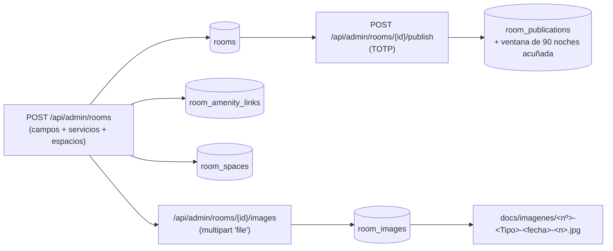
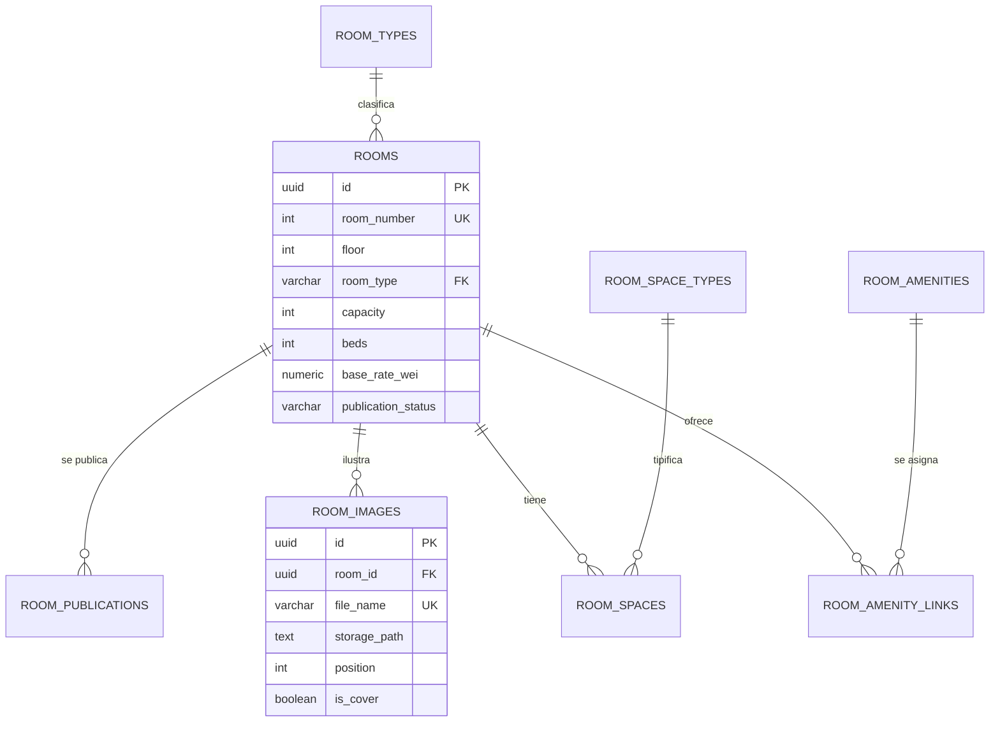

# Estructura de datos — alta de una habitación (2026-10-05)

> **Alcance de este documento** (§1–§4): alta de una habitación → script [`scripts/planta.ts`](../../scripts/planta.ts).
> **Personal que opera el sistema** (§5): documento propio → [`estructura_datos_personal.md`](estructura_datos_personal.md).

> **Skill**: `@inyecta-datos` · **Proyecto**: `hotel-room-mcp-trazable`
> **Contexto**: la base off-chain se inicializó a cero (§42 de `estado_proyecto.md`); este documento
> describe **todo lo que hay que escribir** para que una habitación exista y se vea en la web, que es
> la base del script `@planta`.

## 1. Proceso: qué se crea al dar de alta una habitación

Reglas que condicionan la inyección:

1. **El alta crea la ficha, no la publicación.** La habitación nace en `DRAFT`; publicar exige TOTP y
   acuña la ventana de noches (es un caso de uso aparte).
2. **La foto es un fichero + una fila.** El nombre es canónico
   (`<nº>-<Simple|Doble|Suite>-<AAAA-MM-DD>-<1..5>.jpg`), el fichero vive en `docs/imagenes/` y
   `room_images.file_name` es **UNIQUE**: dos habitaciones no pueden compartir el mismo nombre de
   fichero, así que cada habitación necesita el suyo (se materializa copiando la foto de su tipo).
3. **Servicios y espacios son opcionales en el alta** y se validan contra el catálogo
   (`room_amenities`, `room_space_types`): un código que no exista en el catálogo se rechaza.

## 2. Entidades implicadas

| Tabla | Papel | Campos que escribe el alta |
|---|---|---|
| `rooms` | Maestro de la habitación | `room_number` (único), `floor`, `room_type`, `capacity`, `beds`, `size_m2`, `description_es/en/ru`, `base_rate_wei`, `view_kind`, `has_balcony`, `is_accessible`, `decor_style`, `decor_palette`, `decor_materials`, `decor_notes_es/en/ru`, `publication_status`, `operational_status` |
| `room_amenity_links` | Servicios asignados (N:M) | `room_id`, `amenity_code` |
| `room_spaces` | Espacios con su superficie | `room_id`, `space_code`, `size_m2`, `sort_order` |
| `room_images` | Galería (fichero + metadatos) | `room_id`, `file_name` (UK), `storage_path`, `position`, `is_cover`, `alt_text_es/en/ru`, `mime_type`, `byte_size`, `uploaded_by` |
| `room_amenities` | **Catálogo** de servicios | `code`, `name_es/en/ru`, `sort_order` |
| `room_space_types` | **Catálogo** de espacios | `code`, `name_es/en/ru`, `sort_order` |
| `room_types` | **Catálogo** de tipos | `code` (`SIMPLE`/`DOBLE`/`SUITE`), capacidad base, `royalty_bps` |

### Relaciones

## 3. Catálogos vigentes (lo que se puede asignar hoy)

| Catálogo | Códigos |
|---|---|
| Tipos de habitación | `SIMPLE`, `DOBLE`, `SUITE` |
| Servicios (`room_amenities`) | `WIFI`, `AC`, `HEATING`, `TV`, `PRIVATE_BATH`, `BALCONY`, `SEA_VIEW`, `MINIBAR` |
| Espacios (`room_space_types`) | `DORMITORIO`, `SALON`, `BANO`, `TERRAZA`, `COCINA`, `VESTIDOR` |
| Vistas (`rooms.view_kind`, CHECK) | `SEA`, `GARDEN`, `INTERIOR` |

**Gaps detectados y decididos con el responsable:** «servicio a la habitación», «escritorio de
trabajo», «jacuzzi» e «iluminación graduable» **no tienen código** de servicio, así que quedan
redactados en las descripciones (no se amplía el catálogo). «Vista a la piscina» se representa con
`view_kind = GARDEN` (la piscina está en la zona de jardín), también descrito en el texto.

## 4. Datos del plan `@planta` (aprobados)

- **40 habitaciones**: plantas **1, 2, 3 y 4** · 10 por planta.
- Por planta: `x01`–`x03` **dobles**, `x04`–`x05` **suites**, `x06`–`x10` **simples**.
- Precios: **simple 0,06 ETH · doble 0,10 ETH · suite 0,80 ETH**.
- Estado inicial: **`DRAFT`** (publicar forma parte del recorrido de casos de uso).
- Fotos: se reutiliza **una imagen por tipo** de `docs/imagenes/`
  (`101-Simple-…`, `116-Doble-…`, `201-Suite-…`) materializada con el nombre canónico de cada
  habitación.

---

## 5. Personal del hotel (operadores del back-office)

El alta del personal que opera el sistema tiene **documento propio**:
[`estructura_datos_personal.md`](estructura_datos_personal.md). Allí están el diccionario completo de
`admin_users` y `mfa_recovery_codes`, el catálogo de roles (D-56), las reglas de validación, el
proceso `provisionUser` y la relación con el personal operativo (capa B, sin FK).

En resumen: la cuenta vive en **`admin_users`** (bcrypt + TOTP cifrado + rol) con sus 8 códigos de
rescate en **`mfa_recovery_codes`**, y el nombre de la persona se referencia después como **texto
libre** en turnos, repartos e incidencias.
