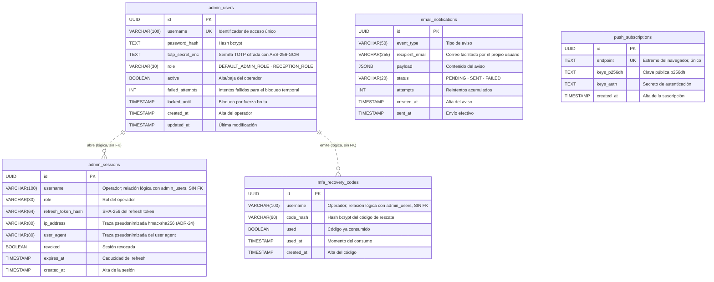

# Diagrama entidad-relación — Hotel Marina del Sol

> **Qué es este documento**: es la **fuente ER del esquema real** en PostgreSQL. Modela las tablas,
> columnas y relaciones tal y como las aplica la aplicación en runtime.
>
> **Fuente de verdad**: `packages/shared/src/db/migrator.ts` (constante `INITIAL_SCHEMA_SQL`).
>
> **Sincronización obligatoria**: este diagrama se mantiene sincronizado, tabla por tabla y columna
> por columna, con:
> - `RepoTecnico/base_datos.sql` — esquema físico ejecutable (`psql -f`).
> - `RepoTecnico/diccionario_datos.md` — diccionario de datos con descripción de cada campo.
>
> **Cobertura**: **16 tablas** (nfts, listings, sale_events, admin_sessions, admin_users,
> mfa_recovery_codes, email_notifications, push_subscriptions, checkin_contingency_logs,
> additional_charges, stay_checkouts, checkout_incidents, worker_checkpoints,
> worker_processed_logs, worker_aggregate_counters, worker_sale_history).
>
> **Convenciones de notación**
> - Entidades = nombre real de tabla (snake_case, plural).
> - Atributos con su tipo PostgreSQL real, sin espacio tras la coma (`NUMERIC(78,0)`).
> - Marca `PK` (clave primaria), `FK` (clave foránea) y `UK` (clave única).
> - Línea sólida `--` = relación identificativa con FK y `ON DELETE`; línea discontinua `..` =
>   relación **lógica** sin restricción de FK en la base (se indica en la etiqueta).
> - Notación de gallo (crow's foot): `||--o{` uno a cero-o-muchos, `||--o|` uno a cero-o-uno.

---

## 2. Dominio inventario y mercado secundario

### 2.1 `nfts`, `listings`, `sale_events`

```mermaid
erDiagram
    nfts {
        VARCHAR(66) token_id PK "Identificador canónico: room x 10^8 + AAAAMMDD"
        INT room_number "Habitación 101-130, 201-220"
        VARCHAR(10) room_type "SIMPLE · DOBLE · SUITE"
        DATE check_in_date "Noche de estancia AAAA-MM-DD"
        NUMERIC(78,0) base_price_wei "Precio de venta primaria en wei"
        VARCHAR(20) status "AVAILABLE · CONFIRMING · SOLD · BURNED · CHECKED_IN"
        VARCHAR(42) current_owner "Titular actual (dirección 0x)"
        TEXT check_in_secret_enc "Secreto de check-in cifrado; en retirada (ADR-05)"
        TIMESTAMP minted_at "Alta del registro"
        TIMESTAMP checked_in_at "Momento del check-in"
        TIMESTAMP burned_at "Momento de la quema"
        VARCHAR(66) tx_hash_mint "Transacción de alta o hash centinela"
        BOOLEAN on_chain_anchored "FALSE deja la fila fuera del catálogo público"
        VARCHAR(16) recovery_code UK "Código estable de recuperación; único si no es NULL"
    }

    listings {
        UUID id PK
        VARCHAR(66) token_id FK "FK a nfts ON DELETE CASCADE"
        VARCHAR(42) seller "Vendedor (dirección 0x)"
        NUMERIC(78,0) price_in_wei "Precio de la oferta en wei"
        BOOLEAN active "Oferta vigente"
        TIMESTAMP listed_at "Alta de la oferta"
        TIMESTAMP cancelled_at "Cancelación de la oferta"
        VARCHAR(66) tx_hash_list "Transacción del listado"
    }

    sale_events {
        UUID id PK
        VARCHAR(66) token_id FK "FK a nfts ON DELETE CASCADE"
        VARCHAR(42) seller "Vendedor (dirección 0x)"
        VARCHAR(42) buyer "Comprador (dirección 0x)"
        NUMERIC(78,0) price_in_wei "Precio de la venta en wei"
        NUMERIC(78,0) royalty_amount_wei "Royalty abonado en wei; 0 en venta primaria"
        BOOLEAN is_secondary "TRUE si es reventa"
        VARCHAR(66) tx_hash "Transacción de la venta"
        BIGINT block_number "Bloque de la venta"
        TIMESTAMP block_timestamp "Marca temporal del bloque"
    }

    nfts ||--o{ listings : "posee"
    nfts ||--o{ sale_events : "registra"
```

- `listings.token_id` y `sale_events.token_id` son `NOT NULL` con `ON DELETE CASCADE`: al borrar una
  noche desaparecen sus ofertas y sus ventas.
- `nfts.status` y `nfts.room_type` son vocabularios cerrados documentados (no hay `CREATE TYPE`).

---

## 3. Dominio estancia y recepción off-chain

### 3.1 `checkin_contingency_logs`, `additional_charges`, `stay_checkouts`, `checkout_incidents`

> La entidad `nfts` se repite aquí (con sus mismos atributos que en §2.1) para que este diagrama sea
> autocontenido; es la **misma tabla** en las dos vistas.

```mermaid
erDiagram
    nfts {
        VARCHAR(66) token_id PK "Identificador canónico: room x 10^8 + AAAAMMDD"
        INT room_number "Habitación 101-130, 201-220"
        VARCHAR(10) room_type "SIMPLE · DOBLE · SUITE"
        DATE check_in_date "Noche de estancia AAAA-MM-DD"
        NUMERIC(78,0) base_price_wei "Precio de venta primaria en wei"
        VARCHAR(20) status "AVAILABLE · CONFIRMING · SOLD · BURNED · CHECKED_IN"
        VARCHAR(42) current_owner "Titular actual (dirección 0x)"
        TEXT check_in_secret_enc "Secreto de check-in cifrado; en retirada (ADR-05)"
        TIMESTAMP minted_at "Alta del registro"
        TIMESTAMP checked_in_at "Momento del check-in"
        TIMESTAMP burned_at "Momento de la quema"
        VARCHAR(66) tx_hash_mint "Transacción de alta o hash centinela"
        BOOLEAN on_chain_anchored "FALSE deja la fila fuera del catálogo público"
        VARCHAR(16) recovery_code UK "Código estable de recuperación; único si no es NULL"
    }

    checkin_contingency_logs {
        UUID id PK
        VARCHAR(66) token_id FK "FK a nfts ON DELETE CASCADE"
        INT room_number "Habitación"
        DATE check_in_date "Noche de estancia"
        VARCHAR(50) possession_proof_type "Tipo de prueba de posesión"
        TEXT possession_proof_value "Valor de la prueba; sin PII"
        TEXT reason "Motivo de la contingencia"
        BOOLEAN pms_registered "Marca heredada; la plataforma no envía PII al PMS (ADR-20)"
        TIMESTAMP processed_at "Momento del check-in asistido"
    }

    additional_charges {
        UUID id PK
        VARCHAR(66) token_id FK "FK a nfts ON DELETE CASCADE"
        VARCHAR(120) concept "Concepto del cargo"
        BIGINT amount_cents "Importe en céntimos; CHECK amount_cents mayor que 0"
        VARCHAR(3) currency "Moneda ISO-4217; por defecto EUR"
        VARCHAR(12) status "PENDING · CANCELLED · PAID; por defecto PENDING"
        VARCHAR(100) created_by "Operador que crea el cargo"
        TIMESTAMP created_at "Alta del cargo"
        VARCHAR(100) cancelled_by "Operador que cancela el cargo"
        TIMESTAMP cancelled_at "Momento de la cancelación"
        VARCHAR(200) cancel_reason "Motivo de la cancelación"
    }

    stay_checkouts {
        UUID id PK
        VARCHAR(66) token_id FK "FK a nfts; UNIQUE: idempotencia del check-out (RNF-34)"
        INT room_number "Habitación"
        DATE check_in_date "Noche de estancia"
        VARCHAR(20) room_condition "OK · INCIDENCIA"
        TEXT notes "Notas libres del check-out"
        INTEGER charges_cancelled "Cargos cancelados al cerrar la estancia"
        VARCHAR(100) processed_by "Operador que procesa el check-out"
        TIMESTAMP created_at "Momento del check-out"
    }

    checkout_incidents {
        UUID id PK
        UUID checkout_id FK "FK a stay_checkouts(id) ON DELETE CASCADE"
        VARCHAR(40) kind "Tipo de incidencia"
        VARCHAR(200) description "Descripción libre de la incidencia"
        TIMESTAMP created_at "Alta de la incidencia"
    }

    nfts ||--o{ checkin_contingency_logs : "origina"
    nfts ||--o{ additional_charges : "acumula"
    nfts ||--o| stay_checkouts : "se cierra con"
    stay_checkouts ||--o{ checkout_incidents : "registra"
```

- `stay_checkouts.token_id` es `UNIQUE` además de `FK`: una noche tiene **como mucho un** check-out y un
  segundo intento devuelve el registro existente (idempotencia).
- `checkout_incidents.checkout_id` es `NOT NULL` con `ON DELETE CASCADE`: las incidencias no existen sin
  su check-out (relación identificativa).
- El check-out y los cargos viven **solo off-chain**; no alteran el contrato canónico.

---

## 4. Dominio operadores y comunicaciones

### 4.1 `admin_users`, `admin_sessions`, `mfa_recovery_codes`, `email_notifications`, `push_subscriptions`



- **No existen FK** entre `admin_users` y `admin_sessions`/`mfa_recovery_codes`: el vínculo es por
  `username` (línea discontinua). `mfa_recovery_codes` se purga a partir del `username` y
  `admin_sessions` puede sobrevivir a la baja del operador hasta que caduque el refresh.
- `email_notifications` y `push_subscriptions` son colas/suscripciones **sin relación** con el resto:
  no guardan PII de viajeros y se identifican por su propio `id`/`endpoint`.

---

## 5. Dominio estado del mini-worker

### 5.1 `worker_checkpoints`, `worker_processed_logs`, `worker_aggregate_counters`, `worker_sale_history`

```mermaid
erDiagram
    worker_checkpoints {
        VARCHAR(42) contract_address PK "Contrato vigilado, normalizado a minúsculas"
        BIGINT last_block "Último bloque consolidado"
        TIMESTAMP updated_at "Última actualización del checkpoint"
    }

    worker_processed_logs {
        VARCHAR(120) log_key PK "txHash:logIndex o keccak256(txHash, logIndex)"
        BIGINT block_number "Bloque del evento (trazabilidad)"
        VARCHAR(42) contract_address "Contrato que emitió el evento"
        TIMESTAMP processed_at "Momento del procesamiento"
    }

    worker_aggregate_counters {
        INTEGER id PK "CHECK id = 0: fila única"
        NUMERIC(78,0) primary_volume_wei "Volumen de ventas primarias en wei"
        NUMERIC(78,0) royalties_wei "Royalties acumulados en wei"
        NUMERIC(78,0) secondary_volume_wei "Volumen de reventas en wei"
        INTEGER sold_count "Ventas primarias contadas"
        INTEGER minted_count "Tokens minteados contados"
        INTEGER burned_count "Tokens quemados contados"
        BIGINT last_block "Último bloque agregado"
        VARCHAR(42) contract_address "Detecta un redeploy para resetear el estado"
    }

    worker_sale_history {
        VARCHAR(66) tx_hash PK "PK compuesta con log_index"
        INTEGER log_index PK "PK compuesta con tx_hash"
        VARCHAR(66) token_id "Noche vendida, derivada del tokenId"
        INT room "Habitación derivada del tokenId"
        INT date_yyyymmdd "Noche en formato AAAAMMDD"
        VARCHAR(20) room_type "Tipo de habitación en la venta"
        NUMERIC(78,0) price_wei "Precio de la venta en wei"
        INT sale_type_raw "0 primaria, 1 reventa"
        VARCHAR(42) seller "Vendedor (dirección 0x)"
        VARCHAR(42) buyer "Comprador (dirección 0x)"
        BIGINT block_number "Bloque del evento"
        TIMESTAMPTZ block_timestamp "Marca temporal del bloque; NULL en filas previas a M7"
    }
```

- Estas cuatro tablas **no tienen FK** entre sí ni con el resto: el worker las indexa por la clave de
  idempotencia (`log_key`), por contrato (`contract_address`) o por la PK compuesta del log.
- `worker_sale_history.token_id` referencia una noche de `nfts` **a nivel lógico** (no hay FK): es el
  histórico que alimenta el dashboard y la serie mensual (D-16).

---

## 6. Matriz de relaciones (restricciones reales)

| # | Tabla hija | Columna | Tabla padre | Cardinalidad | `ON DELETE` |
|---|---|---|---|---|---|
| 1 | `listings` | `token_id` | `nfts(token_id)` | N:1 | `CASCADE` |
| 2 | `sale_events` | `token_id` | `nfts(token_id)` | N:1 | `CASCADE` |
| 3 | `checkin_contingency_logs` | `token_id` | `nfts(token_id)` | N:1 | `CASCADE` |
| 4 | `additional_charges` | `token_id` | `nfts(token_id)` | N:1 | `CASCADE` |
| 5 | `stay_checkouts` | `token_id` (UNIQUE) | `nfts(token_id)` | 1:0..1 | `CASCADE` |
| 6 | `checkout_incidents` | `checkout_id` | `stay_checkouts(id)` | N:1 | `CASCADE` |

**Relaciones lógicas sin FK** (documentadas, no impuestas por la base): `admin_sessions.username` y
`mfa_recovery_codes.username` apuntan a `admin_users.username`.

---

## 7. Trazabilidad

| Artefacto | Contenido | Relación |
|---|---|---|
| `packages/shared/src/db/migrator.ts` | `INITIAL_SCHEMA_SQL` (SQL idempotente de runtime) | **Fuente de verdad** |
| `RepoTecnico/base_datos.sql` | Esquema físico ejecutable con `psql -f` | Réplica exacta del migrator |
| `RepoTecnico/diccionario_datos.md` | Descripción funcional campo a campo | Deriva del migrator |
| `RepoTecnico/diagrama_er.md` (este documento) | Modelo entidad-relación | Deriva del migrator |

Cualquier cambio de esquema debe partir de `migrator.ts` y propagarse a los tres artefactos en el mismo
cambio. El guardián `packages/shared/src/architecture-guardian.test.ts` comprueba la paridad entre
`migrator.ts` y `schema.sql`.
