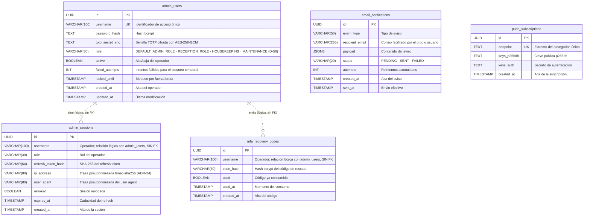
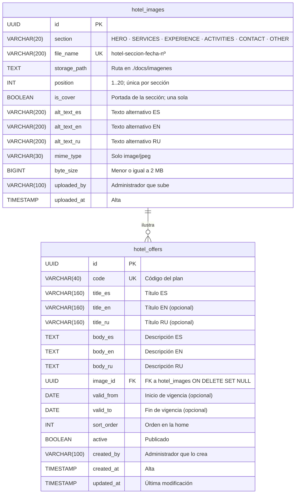

# Diagrama entidad-relación — Hotel Marina del Sol

> **Qué es este documento**: es la **fuente ER del esquema real** en PostgreSQL. Modela las tablas,
> columnas y relaciones tal y como las aplica la aplicación en runtime.
>
> **Fuente de verdad**: `packages/shared/src/db/migrator.ts` (constante `INITIAL_SCHEMA_SQL`).
>
> **Sincronización obligatoria**: este diagrama se mantiene sincronizado, tabla por tabla y columna
> por columna, con:
> - `RepoTecnico/base_datos.sql` — esquema físico ejecutable (`psql -f`).
> - `RepoTecnico/diccionario_datos.md` — diccionario de datos con descripción de cada campo.
>
> **Cobertura**: **16 tablas base** (nfts, listings, sale_events, admin_sessions, admin_users,
> mfa_recovery_codes, email_notifications, push_subscriptions, checkin_contingency_logs,
> additional_charges, stay_checkouts, checkout_incidents, worker_checkpoints,
> worker_processed_logs, worker_aggregate_counters, worker_sale_history) **+ 9 tablas de la sección
> Habitación y reseñas** (§6) **+ 2 de contenido público** (`hotel_images`, `hotel_offers`, §6.2) **+ 17
> del bloque 2** — reservas, actividades, housekeeping y mantenimiento (§7). **Total: 44 tablas**, todas
> sincronizadas con `migrator.ts`, `base_datos.sql` y `diccionario_datos.md`.
>
> **Convenciones de notación**
> - Entidades = nombre real de tabla (snake_case, plural).
> - Atributos con su tipo PostgreSQL real, sin espacio tras la coma (`NUMERIC(78,0)`).
> - Marca `PK` (clave primaria), `FK` (clave foránea) y `UK` (clave única).
> - Línea sólida `--` = relación identificativa con FK y `ON DELETE`; línea discontinua `..` =
>   relación **lógica** sin restricción de FK en la base (se indica en la etiqueta).
> - Notación de gallo (crow's foot): `||--o{` uno a cero-o-muchos, `||--o|` uno a cero-o-uno.

---

## 2. Dominio inventario y mercado secundario

### 2.1 `nfts`, `listings`, `sale_events`

```mermaid
erDiagram
    nfts {
        VARCHAR(66) token_id PK "Identificador canónico: room x 10^8 + AAAAMMDD"
        INT room_number "Habitación 101-130, 201-220"
        VARCHAR(10) room_type "SIMPLE · DOBLE · SUITE"
        DATE check_in_date "Noche de estancia AAAA-MM-DD"
        NUMERIC(78,0) base_price_wei "Precio de venta primaria en wei"
        VARCHAR(20) status "AVAILABLE · CONFIRMING · SOLD · BURNED · CHECKED_IN"
        VARCHAR(42) current_owner "Titular actual (dirección 0x)"
        TEXT check_in_secret_enc "Secreto de check-in cifrado; en retirada (ADR-05)"
        TIMESTAMP minted_at "Alta del registro"
        TIMESTAMP checked_in_at "Momento del check-in"
        TIMESTAMP burned_at "Momento de la quema"
        VARCHAR(66) tx_hash_mint "Transacción de alta o hash centinela"
        BOOLEAN on_chain_anchored "FALSE deja la fila fuera del catálogo público"
        VARCHAR(16) recovery_code UK "Código estable de recuperación; único si no es NULL"
    }

    listings {
        UUID id PK
        VARCHAR(66) token_id FK "FK a nfts ON DELETE CASCADE"
        VARCHAR(42) seller "Vendedor (dirección 0x)"
        NUMERIC(78,0) price_in_wei "Precio de la oferta en wei"
        BOOLEAN active "Oferta vigente"
        TIMESTAMP listed_at "Alta de la oferta"
        TIMESTAMP cancelled_at "Cancelación de la oferta"
        VARCHAR(66) tx_hash_list "Transacción del listado"
    }

    sale_events {
        UUID id PK
        VARCHAR(66) token_id FK "FK a nfts ON DELETE CASCADE"
        VARCHAR(42) seller "Vendedor (dirección 0x)"
        VARCHAR(42) buyer "Comprador (dirección 0x)"
        NUMERIC(78,0) price_in_wei "Precio de la venta en wei"
        NUMERIC(78,0) royalty_amount_wei "Royalty abonado en wei; 0 en venta primaria"
        BOOLEAN is_secondary "TRUE si es reventa"
        VARCHAR(66) tx_hash "Transacción de la venta"
        BIGINT block_number "Bloque de la venta"
        TIMESTAMP block_timestamp "Marca temporal del bloque"
    }

    nfts ||--o{ listings : "posee"
    nfts ||--o{ sale_events : "registra"
```

- `listings.token_id` y `sale_events.token_id` son `NOT NULL` con `ON DELETE CASCADE`: al borrar una
  noche desaparecen sus ofertas y sus ventas.
- `nfts.status` y `nfts.room_type` son vocabularios cerrados documentados (no hay `CREATE TYPE`).

---

## 3. Dominio estancia y recepción off-chain

### 3.1 `checkin_contingency_logs`, `additional_charges`, `stay_checkouts`, `checkout_incidents`

> La entidad `nfts` se repite aquí (con sus mismos atributos que en §2.1) para que este diagrama sea
> autocontenido; es la **misma tabla** en las dos vistas.

```mermaid
erDiagram
    nfts {
        VARCHAR(66) token_id PK "Identificador canónico: room x 10^8 + AAAAMMDD"
        INT room_number "Habitación 101-130, 201-220"
        VARCHAR(10) room_type "SIMPLE · DOBLE · SUITE"
        DATE check_in_date "Noche de estancia AAAA-MM-DD"
        NUMERIC(78,0) base_price_wei "Precio de venta primaria en wei"
        VARCHAR(20) status "AVAILABLE · CONFIRMING · SOLD · BURNED · CHECKED_IN"
        VARCHAR(42) current_owner "Titular actual (dirección 0x)"
        TEXT check_in_secret_enc "Secreto de check-in cifrado; en retirada (ADR-05)"
        TIMESTAMP minted_at "Alta del registro"
        TIMESTAMP checked_in_at "Momento del check-in"
        TIMESTAMP burned_at "Momento de la quema"
        VARCHAR(66) tx_hash_mint "Transacción de alta o hash centinela"
        BOOLEAN on_chain_anchored "FALSE deja la fila fuera del catálogo público"
        VARCHAR(16) recovery_code UK "Código estable de recuperación; único si no es NULL"
    }

    checkin_contingency_logs {
        UUID id PK
        VARCHAR(66) token_id FK "FK a nfts ON DELETE CASCADE"
        INT room_number "Habitación"
        DATE check_in_date "Noche de estancia"
        VARCHAR(50) possession_proof_type "Tipo de prueba de posesión"
        TEXT possession_proof_value "Valor de la prueba; sin PII"
        TEXT reason "Motivo de la contingencia"
        BOOLEAN pms_registered "Marca heredada; la plataforma no envía PII al PMS (ADR-20)"
        TIMESTAMP processed_at "Momento del check-in asistido"
    }

    additional_charges {
        UUID id PK
        VARCHAR(66) token_id FK "FK a nfts ON DELETE CASCADE"
        VARCHAR(120) concept "Concepto del cargo"
        BIGINT amount_cents "Importe en céntimos; CHECK amount_cents mayor que 0"
        VARCHAR(3) currency "Moneda ISO-4217; por defecto EUR"
        VARCHAR(12) status "PENDING · CANCELLED · PAID; por defecto PENDING"
        VARCHAR(100) created_by "Operador que crea el cargo"
        TIMESTAMP created_at "Alta del cargo"
        VARCHAR(100) cancelled_by "Operador que cancela el cargo"
        TIMESTAMP cancelled_at "Momento de la cancelación"
        VARCHAR(200) cancel_reason "Motivo de la cancelación"
    }

    stay_checkouts {
        UUID id PK
        VARCHAR(66) token_id FK "FK a nfts; UNIQUE: idempotencia del check-out (RNF-34)"
        INT room_number "Habitación"
        DATE check_in_date "Noche de estancia"
        VARCHAR(20) room_condition "OK · INCIDENCIA"
        TEXT notes "Notas libres del check-out"
        INTEGER charges_cancelled "Cargos cancelados al cerrar la estancia"
        VARCHAR(100) processed_by "Operador que procesa el check-out"
        TIMESTAMP created_at "Momento del check-out"
    }

    checkout_incidents {
        UUID id PK
        UUID checkout_id FK "FK a stay_checkouts(id) ON DELETE CASCADE"
        VARCHAR(40) kind "Tipo de incidencia"
        VARCHAR(200) description "Descripción libre de la incidencia"
        TIMESTAMP created_at "Alta de la incidencia"
    }

    nfts ||--o{ checkin_contingency_logs : "origina"
    nfts ||--o{ additional_charges : "acumula"
    nfts ||--o| stay_checkouts : "se cierra con"
    stay_checkouts ||--o{ checkout_incidents : "registra"
```

- `stay_checkouts.token_id` es `UNIQUE` además de `FK`: una noche tiene **como mucho un** check-out y un
  segundo intento devuelve el registro existente (idempotencia).
- `checkout_incidents.checkout_id` es `NOT NULL` con `ON DELETE CASCADE`: las incidencias no existen sin
  su check-out (relación identificativa).
- El check-out y los cargos viven **solo off-chain**; no alteran el contrato canónico.

---

## 4. Dominio operadores y comunicaciones

### 4.1 `admin_users`, `admin_sessions`, `mfa_recovery_codes`, `email_notifications`, `push_subscriptions`



- **No existen FK** entre `admin_users` y `admin_sessions`/`mfa_recovery_codes`: el vínculo es por
  `username` (línea discontinua). `mfa_recovery_codes` se purga a partir del `username` y
  `admin_sessions` puede sobrevivir a la baja del operador hasta que caduque el refresh.
- `email_notifications` y `push_subscriptions` son colas/suscripciones **sin relación** con el resto:
  no guardan PII de viajeros y se identifican por su propio `id`/`endpoint`.

---

## 5. Dominio estado del mini-worker

### 5.1 `worker_checkpoints`, `worker_processed_logs`, `worker_aggregate_counters`, `worker_sale_history`

```mermaid
erDiagram
    worker_checkpoints {
        VARCHAR(42) contract_address PK "Contrato vigilado, normalizado a minúsculas"
        BIGINT last_block "Último bloque consolidado"
        TIMESTAMP updated_at "Última actualización del checkpoint"
    }

    worker_processed_logs {
        VARCHAR(120) log_key PK "txHash:logIndex o keccak256(txHash, logIndex)"
        BIGINT block_number "Bloque del evento (trazabilidad)"
        VARCHAR(42) contract_address "Contrato que emitió el evento"
        TIMESTAMP processed_at "Momento del procesamiento"
    }

    worker_aggregate_counters {
        INTEGER id PK "CHECK id = 0: fila única"
        NUMERIC(78,0) primary_volume_wei "Volumen de ventas primarias en wei"
        NUMERIC(78,0) royalties_wei "Royalties acumulados en wei"
        NUMERIC(78,0) secondary_volume_wei "Volumen de reventas en wei"
        INTEGER sold_count "Ventas primarias contadas"
        INTEGER minted_count "Tokens minteados contados"
        INTEGER burned_count "Tokens quemados contados"
        BIGINT last_block "Último bloque agregado"
        VARCHAR(42) contract_address "Detecta un redeploy para resetear el estado"
    }

    worker_sale_history {
        VARCHAR(66) tx_hash PK "PK compuesta con log_index"
        INTEGER log_index PK "PK compuesta con tx_hash"
        VARCHAR(66) token_id "Noche vendida, derivada del tokenId"
        INT room "Habitación derivada del tokenId"
        INT date_yyyymmdd "Noche en formato AAAAMMDD"
        VARCHAR(20) room_type "Tipo de habitación en la venta"
        NUMERIC(78,0) price_wei "Precio de la venta en wei"
        INT sale_type_raw "0 primaria, 1 reventa"
        VARCHAR(42) seller "Vendedor (dirección 0x)"
        VARCHAR(42) buyer "Comprador (dirección 0x)"
        BIGINT block_number "Bloque del evento"
        TIMESTAMPTZ block_timestamp "Marca temporal del bloque; NULL en filas previas a M7"
    }
```

- Estas cuatro tablas **no tienen FK** entre sí ni con el resto: el worker las indexa por la clave de
  idempotencia (`log_key`), por contrato (`contract_address`) o por la PK compuesta del log.
- `worker_sale_history.token_id` referencia una noche de `nfts` **a nivel lógico** (no hay FK): es el
  histórico que alimenta el dashboard y la serie mensual (D-16).

---

## 6. Dominio habitaciones, reseñas y contenido público (F1/F5)

### 6.1 `room_types`, `rooms`, `room_images`, `room_amenities`, `room_amenity_links`, `room_publications`, `room_status_history`, `reviews`, `platform_settings`

> Modelo del ente *Habitación* (Suite Administración → sección 1.1) y de las **reseñas** de la suite
> pública. Decisiones D-1…D-28. `nfts` se referencia sin repetir sus atributos (está definida en §2.1).
> Las 9 tablas están sincronizadas con el runtime (`migrator.ts`), `base_datos.sql` y
> `diccionario_datos.md`.

```mermaid
erDiagram
    room_types {
        VARCHAR(10) code PK "SIMPLE · DOBLE · SUITE (D-22)"
        VARCHAR(40) name_es "Nombre ES"
        VARCHAR(40) name_en "Nombre EN"
        VARCHAR(40) name_ru "Nombre RU"
        INT base_capacity "Capacidad base orientativa"
        INT royalty_bps "Royalty en bps: 500 = 5 por ciento, 1000 = 10 por ciento (ADR-18)"
        INT sort_order "Orden de presentación"
    }

    rooms {
        UUID id PK
        INT room_number UK "Número único, no repetible (D-7)"
        INT floor "Planta (opcional)"
        VARCHAR(10) room_type FK "FK a room_types(code)"
        INT capacity "Capacidad; obligatoria (D-21)"
        INT beds "Camas; obligatoria (D-21)"
        NUMERIC(6,2) size_m2 "Superficie (opcional)"
        TEXT description_es "Descripción ES; obligatoria para publicar (D-6, D-21)"
        TEXT description_en "Descripción EN (opcional; respaldo)"
        TEXT description_ru "Descripción RU (opcional; respaldo)"
        NUMERIC(78,0) base_rate_wei "Tarifa base (opcional)"
        VARCHAR(20) publication_status "DRAFT · PUBLISHED · PAUSED · MAINTENANCE · OUT_OF_SERVICE (D-19)"
        VARCHAR(12) operational_status "CLEAN · DIRTY · OCCUPIED (D-19)"
        TIMESTAMP archived_at "NULL = vigente; con fecha = archivada (D-8)"
        TIMESTAMP created_at "Alta"
        TIMESTAMP updated_at "Última modificación"
    }

    room_images {
        UUID id PK
        UUID room_id FK "FK a rooms ON DELETE CASCADE"
        VARCHAR(200) file_name UK "habitación-tipo-fecha-nº imagen (D-5, D-12)"
        TEXT storage_path "Ruta en ./docs/imagenes"
        INT position "1..5; máx. 5 fotos (D-20)"
        BOOLEAN is_cover "Portada; una sola por habitación"
        VARCHAR(200) alt_text_es "Texto alternativo ES"
        VARCHAR(200) alt_text_en "Texto alternativo EN"
        VARCHAR(200) alt_text_ru "Texto alternativo RU"
        VARCHAR(30) mime_type "Solo image/jpeg (D-20)"
        BIGINT byte_size "Menor o igual a 2 MB (D-20)"
        VARCHAR(100) uploaded_by "Operador que sube"
        TIMESTAMP uploaded_at "Alta"
    }

    room_amenities {
        VARCHAR(40) code PK "Código del servicio"
        VARCHAR(60) name_es "Nombre ES"
        VARCHAR(60) name_en "Nombre EN"
        VARCHAR(60) name_ru "Nombre RU"
        INT sort_order "Orden"
    }

    room_amenity_links {
        UUID room_id PK "PK compuesta; FK a rooms"
        VARCHAR(40) amenity_code PK "PK compuesta; FK a room_amenities"
    }

    room_publications {
        UUID id PK
        UUID room_id FK "FK a rooms ON DELETE CASCADE"
        VARCHAR(66) content_hash "Huella keccak256 de la ficha (D-18)"
        VARCHAR(66) tx_hash "Transacción de anclaje; NULL si pendiente"
        BOOLEAN on_chain_anchored "TRUE si el anclaje se confirma"
        TEXT signature "Firma EIP-191 del administrador sobre la huella (D-1/D-2)"
        VARCHAR(42) signer_address "Wallet que firma; NULL si no se firmó"
        VARCHAR(100) published_by "Administrador que publica"
        TIMESTAMP published_at "Alta"
        TIMESTAMP unpublished_at "Despublicación"
    }

    room_status_history {
        UUID id PK
        UUID room_id FK "FK a rooms ON DELETE CASCADE"
        VARCHAR(12) status_kind "PUBLICATION · OPERATIONAL"
        VARCHAR(20) from_value "Valor anterior"
        VARCHAR(20) to_value "Valor nuevo"
        VARCHAR(100) changed_by "Quién cambia"
        VARCHAR(200) reason "Motivo"
        TIMESTAMP changed_at "Momento"
    }

    reviews {
        UUID id PK
        VARCHAR(66) token_id FK "FK a nfts; UNIQUE: una reseña por noche consumida"
        VARCHAR(10) room_type FK "FK a room_types; es lo único que se publica (D-28)"
        UUID room_id FK "Referencia interna; no se publica"
        SMALLINT rating "1..5"
        TEXT comment "Comentario; sin PII"
        VARCHAR(12) status "PENDING · APPROVED · REJECTED"
        TIMESTAMP created_at "Alta"
        VARCHAR(100) moderated_by "Administrador que modera"
        TIMESTAMP moderated_at "Momento de la moderación"
    }

    platform_settings {
        VARCHAR(60) key PK "Clave del ajuste (p. ej. mint_window_days)"
        TEXT value "Valor"
        VARCHAR(100) updated_by "Quién lo cambia"
        TIMESTAMP updated_at "Última modificación"
    }

    room_types ||--o{ rooms : "clasifica"
    rooms ||--o{ room_images : "tiene"
    rooms ||--o{ room_amenity_links : "ofrece"
    room_amenities ||--o{ room_amenity_links : "se asigna a"
    rooms ||--o{ room_publications : "se publica con"
    rooms ||--o{ room_status_history : "registra"
    room_types ||--o{ reviews : "se reseña como"
    rooms ||--o{ reviews : "referencia interna"
    nfts ||--o| reviews : "origina una"
```

- `room_images` admite **una sola portada** por habitación (índice único parcial `is_cover = TRUE`) y
  **máx. 5 fotos** (índice único `(room_id, position)` con `position` entre 1 y 5).
- `reviews.token_id` es `UNIQUE` además de `FK`: una noche consumida genera **como mucho una** reseña.
- `platform_settings` no tiene relaciones: es una tabla de ajustes clave/valor.

### 6.2 `hotel_images`, `hotel_offers` — contenido público de la home (D-66, D-69, D-73, D-74)

> Galería propia del hotel y planes informativos, gestionados por el administrador con wallet. Mismas
> reglas de imagen que `room_images` (solo JPG, ≤2 MB) y mismo almacenamiento local.



- `hotel_images` admite **una sola portada por sección** (índice único parcial `is_cover = TRUE`) y una
  posición única por sección.
- `hotel_offers` no tiene precios (D-69): es contenido informativo con vigencia opcional.

---

## 7. Dominio reservas, actividades, housekeeping y mantenimiento (bloque 2)

### 7.1 `reservations`, `reservation_nights`, `reservation_contacts`, `reservation_status_history`, `folios`, `activities`, `activity_schedules`, `activity_bookings`, `housekeeping_shifts`, `housekeeping_assignments`, `housekeeping_room_logs`, `supply_items`, `supply_stock_movements`, `maintenance_incidents`, `maintenance_incident_events`, `preventive_plans`, `preventive_tasks`

> Decisiones D-34…D-55. `rooms` (§6) y `nfts` (§2.1) se referencian sin repetir sus atributos.
> Sincronizado con `migrator.ts` y `base_datos.sql`.

```mermaid
erDiagram
    reservations {
        UUID id PK
        UUID room_id FK "FK a rooms ON DELETE RESTRICT"
        DATE check_in_date "Entrada"
        DATE check_out_date "Salida; posterior a la entrada"
        VARCHAR(12) channel "WEB · COUNTER"
        VARCHAR(12) status "PENDING · CONFIRMED · CANCELLED · NO_SHOW · COMPLETED"
        BIGINT total_cents "Importe total"
        BIGINT deposit_required_cents "Anticipo exigido (30 por ciento)"
        BIGINT deposit_paid_cents "Anticipo cobrado"
        TIMESTAMP hold_expires_at "Vencimiento del bloqueo (D-37)"
        VARCHAR(100) created_by "Operador que crea"
        TIMESTAMP created_at "Alta"
        TIMESTAMP updated_at "Última modificación"
        TIMESTAMP confirmed_at "Confirmación"
        TIMESTAMP cancelled_at "Cancelación"
        VARCHAR(200) cancel_reason "Motivo (D-40)"
    }

    reservation_nights {
        UUID id PK
        UUID reservation_id FK "FK a reservations ON DELETE CASCADE"
        UUID room_id FK "FK a rooms"
        DATE night_date "Noche retenida"
        VARCHAR(66) token_id FK "Token emitido al pagar el 100 por ciento (D-39); NULL si no"
        BOOLEAN active "FALSE libera la retención"
    }

    reservation_contacts {
        UUID id PK
        UUID reservation_id FK "FK a reservations ON DELETE CASCADE"
        VARCHAR(12) channel "EMAIL · TELEGRAM · WEB"
        TEXT value_enc "Dirección CIFRADA (AES-256-GCM); D-55"
        TIMESTAMP created_at "Alta"
        TIMESTAMP purge_at "Purga al finalizar la estancia"
        TIMESTAMP purged_at "Momento de la purga"
    }

    reservation_status_history {
        UUID id PK
        UUID reservation_id FK "FK a reservations ON DELETE CASCADE"
        VARCHAR(12) from_value "Estado anterior"
        VARCHAR(12) to_value "Estado nuevo"
        VARCHAR(100) changed_by "Quién cambia"
        VARCHAR(200) reason "Motivo"
        TIMESTAMP changed_at "Momento"
    }

    folios {
        UUID id PK
        UUID reservation_id FK "FK a reservations; UNIQUE"
        VARCHAR(10) status "OPEN · CLOSED"
        TIMESTAMP opened_at "Apertura"
        TIMESTAMP closed_at "Cierre"
        BIGINT total_cents "Total del estado de cuenta"
    }

    activities {
        UUID id PK
        VARCHAR(40) code UK "Código"
        VARCHAR(120) name_es "Nombre ES"
        VARCHAR(120) name_en "Nombre EN"
        VARCHAR(120) name_ru "Nombre RU"
        TEXT description_es "Descripción ES"
        TEXT description_en "Descripción EN"
        TEXT description_ru "Descripción RU"
        BIGINT price_cents "Precio"
        VARCHAR(3) currency "Moneda ISO-4217"
        BOOLEAN active "Activa"
        VARCHAR(100) created_by "Quién la crea"
        TIMESTAMP created_at "Alta"
        TIMESTAMP updated_at "Última modificación"
    }

    activity_schedules {
        UUID id PK
        UUID activity_id FK "FK a activities ON DELETE CASCADE"
        TIMESTAMP starts_at "Inicio"
        TIMESTAMP ends_at "Fin"
        INT capacity "Cupo estricto (D-47)"
        BOOLEAN active "Horario activo"
        TIMESTAMP created_at "Alta"
    }

    activity_bookings {
        UUID id PK
        UUID schedule_id FK "FK a activity_schedules"
        UUID reservation_id FK "FK a reservations"
        INT seats "Plazas"
        VARCHAR(12) status "BOOKED · WAITLIST · CANCELLED · ATTENDED"
        UUID charge_id FK "Cargo al folio (D-46)"
        VARCHAR(100) created_by "Quién inscribe"
        TIMESTAMP created_at "Alta"
        TIMESTAMP cancelled_at "Cancelación"
    }

    housekeeping_shifts {
        UUID id PK
        DATE shift_date "Día"
        VARCHAR(20) label "MANANA · TARDE · NOCHE"
        VARCHAR(100) supervisor "Supervisor"
        TIMESTAMP created_at "Alta"
    }

    housekeeping_assignments {
        UUID id PK
        UUID shift_id FK "FK a housekeeping_shifts"
        UUID room_id FK "FK a rooms"
        VARCHAR(100) assignee "Mucama/camarera"
        VARCHAR(12) status "PENDING · IN_PROGRESS · DONE"
        TIMESTAMP assigned_at "Asignación"
        TIMESTAMP completed_at "Finalización"
    }

    housekeeping_room_logs {
        UUID id PK
        UUID room_id FK "FK a rooms"
        UUID assignment_id FK "Asignación (opcional)"
        VARCHAR(12) from_value "Estado operativo anterior"
        VARCHAR(12) to_value "Estado operativo nuevo"
        VARCHAR(100) changed_by "Quién cambia"
        TIMESTAMP changed_at "Momento"
    }

    supply_items {
        UUID id PK
        VARCHAR(40) code UK "Código"
        VARCHAR(80) name_es "Nombre ES"
        VARCHAR(80) name_en "Nombre EN"
        VARCHAR(80) name_ru "Nombre RU"
        VARCHAR(20) unit "Unidad"
        NUMERIC(12,2) stock_qty "Stock actual"
        NUMERIC(12,2) threshold_qty "Umbral crítico (D-51)"
        TIMESTAMP updated_at "Última modificación"
    }

    supply_stock_movements {
        UUID id PK
        UUID item_id FK "FK a supply_items"
        NUMERIC(12,2) delta_qty "Consumo negativo o reposición positiva"
        VARCHAR(20) reason "ROOM_CLEANED · GUEST_CHECKIN · RESTOCK · ADJUSTMENT"
        UUID room_id FK "Habitación (opcional)"
        UUID reservation_id FK "Reserva (opcional)"
        VARCHAR(100) created_by "Quién registra"
        TIMESTAMP created_at "Momento"
    }

    maintenance_incidents {
        UUID id PK
        UUID room_id FK "FK a rooms"
        VARCHAR(40) kind "Tipo de avería"
        TEXT description "Descripción"
        VARCHAR(10) priority "LOW · MEDIUM · HIGH"
        VARCHAR(12) status "OPEN · IN_PROGRESS · RESOLVED · CANCELLED"
        BOOLEAN blocks_sale "TRUE retira la habitación de la venta (D-53)"
        VARCHAR(100) reported_by "Quién reporta (recepción/limpieza)"
        VARCHAR(100) assigned_to "Técnico asignado"
        TIMESTAMP created_at "Reporte"
        TIMESTAMP resolved_at "Resolución"
        VARCHAR(100) resolved_by "Quién resuelve"
    }

    maintenance_incident_events {
        UUID id PK
        UUID incident_id FK "FK a maintenance_incidents"
        VARCHAR(20) event_type "REPORTED · ASSIGNED · RESOLVED · CANCELLED"
        VARCHAR(200) notes "Notas"
        VARCHAR(100) actor "Quién ejecuta"
        TIMESTAMP created_at "Momento"
    }

    preventive_plans {
        UUID id PK
        VARCHAR(40) code UK "Código"
        VARCHAR(120) name "Nombre del plan"
        VARCHAR(120) equipment "Equipo"
        UUID room_id FK "Habitación (opcional)"
        VARCHAR(12) periodicity "WEEKLY · MONTHLY · QUARTERLY"
        BOOLEAN active "Activo"
        TIMESTAMP created_at "Alta"
    }

    preventive_tasks {
        UUID id PK
        UUID plan_id FK "FK a preventive_plans"
        DATE due_date "Vencimiento"
        VARCHAR(10) status "PENDING · DONE · SKIPPED"
        VARCHAR(100) completed_by "Quién la completa"
        TIMESTAMP completed_at "Momento"
        VARCHAR(200) notes "Notas"
    }

    rooms ||--o{ reservations : "se reserva en"
    reservations ||--o{ reservation_nights : "retiene"
    rooms ||--o{ reservation_nights : "ubica"
    nfts ||--o| reservation_nights : "se acuña como"
    reservations ||--o{ reservation_contacts : "contacta por"
    reservations ||--o{ reservation_status_history : "registra"
    reservations ||--o| folios : "abre"
    activities ||--o{ activity_schedules : "programa"
    activity_schedules ||--o{ activity_bookings : "admite"
    reservations ||--o{ activity_bookings : "inscribe"
    housekeeping_shifts ||--o{ housekeeping_assignments : "reparte"
    rooms ||--o{ housekeeping_assignments : "se asigna"
    rooms ||--o{ housekeeping_room_logs : "registra estado"
    supply_items ||--o{ supply_stock_movements : "mueve"
    rooms ||--o{ maintenance_incidents : "sufre"
    maintenance_incidents ||--o{ maintenance_incident_events : "registra"
    preventive_plans ||--o{ preventive_tasks : "genera"
    rooms ||--o{ preventive_plans : "aplica a"
```

- **Sin sobreventa (D-41):** índice único parcial `reservation_nights(room_id, night_date) WHERE active`.
- **Contacto mínimo (D-55):** `reservation_contacts.value_enc` cifrado y purgable; nunca PII completa.
- **Bloqueo por avería (D-53):** `maintenance_incidents.blocks_sale` retira la habitación de la venta.
- `additional_charges.folio_id` (columna añadida) liga los cargos al folio de la reserva.

---

## 8. Matriz de relaciones (restricciones reales)

| # | Tabla hija | Columna | Tabla padre | Cardinalidad | `ON DELETE` |
|---|---|---|---|---|---|
| 1 | `listings` | `token_id` | `nfts(token_id)` | N:1 | `CASCADE` |
| 2 | `sale_events` | `token_id` | `nfts(token_id)` | N:1 | `CASCADE` |
| 3 | `checkin_contingency_logs` | `token_id` | `nfts(token_id)` | N:1 | `CASCADE` |
| 4 | `additional_charges` | `token_id` | `nfts(token_id)` | N:1 | `CASCADE` |
| 5 | `stay_checkouts` | `token_id` (UNIQUE) | `nfts(token_id)` | 1:0..1 | `CASCADE` |
| 6 | `checkout_incidents` | `checkout_id` | `stay_checkouts(id)` | N:1 | `CASCADE` |
| 7 | `rooms` | `room_type` | `room_types(code)` | N:1 | `ON UPDATE CASCADE` |
| 8 | `room_images` | `room_id` | `rooms(id)` | N:1 | `CASCADE` |
| 9 | `room_amenity_links` | `room_id` | `rooms(id)` | N:1 | `CASCADE` |
| 10 | `room_amenity_links` | `amenity_code` | `room_amenities(code)` | N:1 | `ON UPDATE CASCADE` |
| 11 | `room_publications` | `room_id` | `rooms(id)` | N:1 | `CASCADE` |
| 12 | `room_status_history` | `room_id` | `rooms(id)` | N:1 | `CASCADE` |
| 13 | `reviews` | `token_id` (UNIQUE) | `nfts(token_id)` | 1:0..1 | `CASCADE` |
| 14 | `reviews` | `room_type` | `room_types(code)` | N:1 | `ON UPDATE CASCADE` |
| 15 | `reviews` | `room_id` | `rooms(id)` | N:0..1 | `SET NULL` |
| 16 | `reservations` | `room_id` | `rooms(id)` | N:1 | `RESTRICT` |
| 17 | `reservation_nights` | `reservation_id` | `reservations(id)` | N:1 | `CASCADE` |
| 18 | `reservation_nights` | `room_id` | `rooms(id)` | N:1 | `RESTRICT` |
| 19 | `reservation_nights` | `token_id` | `nfts(token_id)` | N:0..1 | `SET NULL` |
| 20 | `reservation_contacts` | `reservation_id` | `reservations(id)` | N:1 | `CASCADE` |
| 21 | `reservation_status_history` | `reservation_id` | `reservations(id)` | N:1 | `CASCADE` |
| 22 | `folios` | `reservation_id` (UNIQUE) | `reservations(id)` | 1:1 | `CASCADE` |
| 23 | `activity_schedules` | `activity_id` | `activities(id)` | N:1 | `CASCADE` |
| 24 | `activity_bookings` | `schedule_id` | `activity_schedules(id)` | N:1 | `CASCADE` |
| 25 | `activity_bookings` | `reservation_id` | `reservations(id)` | N:1 | `CASCADE` |
| 26 | `activity_bookings` | `charge_id` | `additional_charges(id)` | N:0..1 | `SET NULL` |
| 27 | `housekeeping_assignments` | `shift_id` | `housekeeping_shifts(id)` | N:1 | `CASCADE` |
| 28 | `housekeeping_assignments` | `room_id` | `rooms(id)` | N:1 | `CASCADE` |
| 29 | `housekeeping_room_logs` | `room_id` | `rooms(id)` | N:1 | `CASCADE` |
| 30 | `housekeeping_room_logs` | `assignment_id` | `housekeeping_assignments(id)` | N:0..1 | `SET NULL` |
| 31 | `supply_stock_movements` | `item_id` | `supply_items(id)` | N:1 | `CASCADE` |
| 32 | `supply_stock_movements` | `room_id` | `rooms(id)` | N:0..1 | `SET NULL` |
| 33 | `supply_stock_movements` | `reservation_id` | `reservations(id)` | N:0..1 | `SET NULL` |
| 34 | `maintenance_incidents` | `room_id` | `rooms(id)` | N:1 | `RESTRICT` |
| 35 | `maintenance_incident_events` | `incident_id` | `maintenance_incidents(id)` | N:1 | `CASCADE` |
| 36 | `preventive_plans` | `room_id` | `rooms(id)` | N:0..1 | `SET NULL` |
| 37 | `preventive_tasks` | `plan_id` | `preventive_plans(id)` | N:1 | `CASCADE` |
| 38 | `additional_charges` | `folio_id` | `folios(id)` | N:0..1 | `SET NULL` |
| 39 | `hotel_offers` | `image_id` | `hotel_images(id)` | N:0..1 | `SET NULL` |

Las filas 7–15 corresponden a **habitaciones y reseñas** (§6), la fila 39 a **contenido público** (§6.2) y
las filas 16–38 al **bloque 2** (§7). `platform_settings` queda fuera de la matriz por no tener
relaciones.

**Índice único parcial relevante (no es FK):** `reservation_nights(room_id, night_date) WHERE active`
impone la ausencia de sobreventa (D-41) a nivel de base de datos.

**Relaciones lógicas sin FK** (documentadas, no impuestas por la base): `admin_sessions.username` y
`mfa_recovery_codes.username` apuntan a `admin_users.username`; `nfts.room_number` se corresponde con
`rooms.room_number` (la BD es la fuente del maestro, D-3).

---

## 9. Trazabilidad

| Artefacto | Contenido | Relación |
|---|---|---|
| `packages/shared/src/db/migrator.ts` | `INITIAL_SCHEMA_SQL` (SQL idempotente de runtime) | **Fuente de verdad** (44 tablas) |
| `RepoTecnico/base_datos.sql` | Esquema físico ejecutable con `psql -f` | Réplica del migrator (44 tablas) |
| `RepoTecnico/diccionario_datos.md` | Descripción funcional campo a campo | Deriva del migrator |
| `RepoTecnico/diagrama_er.md` (este documento) | Modelo entidad-relación | Deriva del migrator |

Cualquier cambio de esquema debe partir de `migrator.ts` y propagarse a los tres artefactos en el mismo
cambio. El guardián `packages/shared/src/architecture-guardian.test.ts` comprueba la paridad entre
`migrator.ts` y `schema.sql`.

> **Estado F1/F2/F5**: las 9 tablas de §6 (habitaciones y reseñas), las 2 de §6.2 (contenido público) y
> las 17 de §7 (bloque 2) ya están en `migrator.ts` (`INITIAL_SCHEMA_SQL`) y en los tres artefactos
> documentales. `schema.sql` se conserva como referencia histórica (subconjunto de 6 tablas) y el guardián
> sigue en verde.
