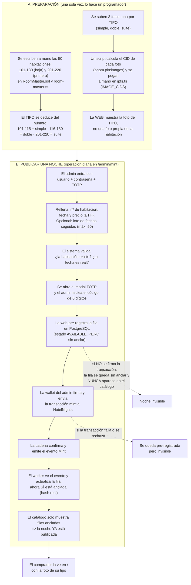
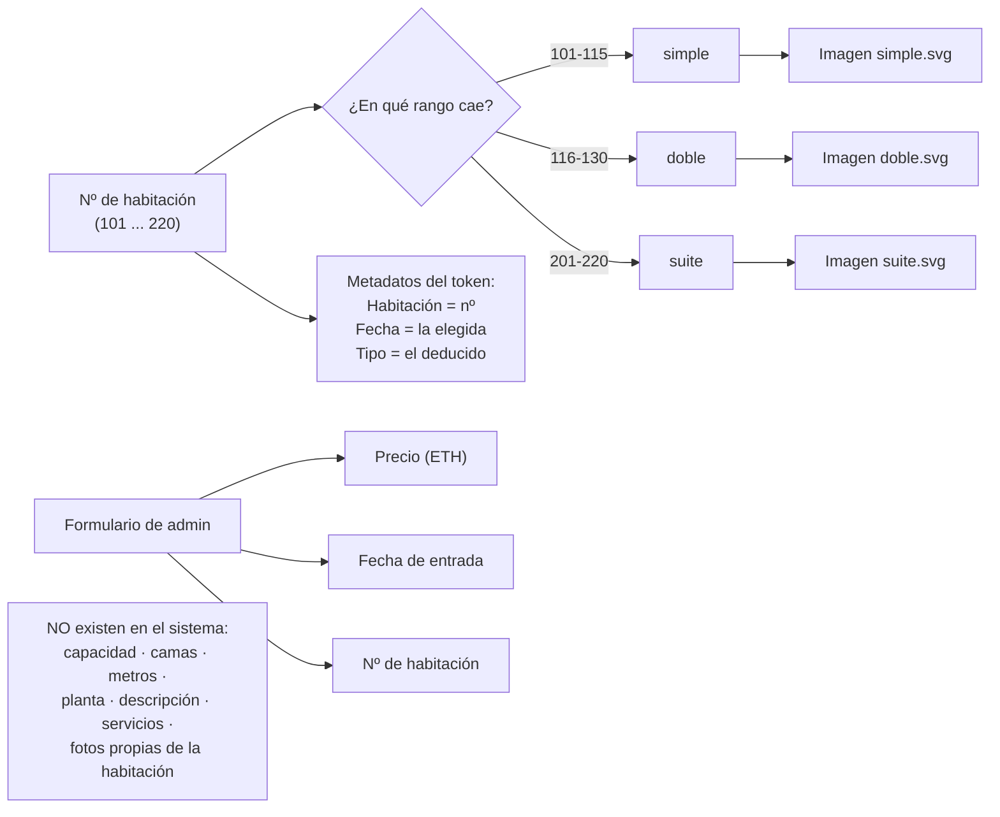
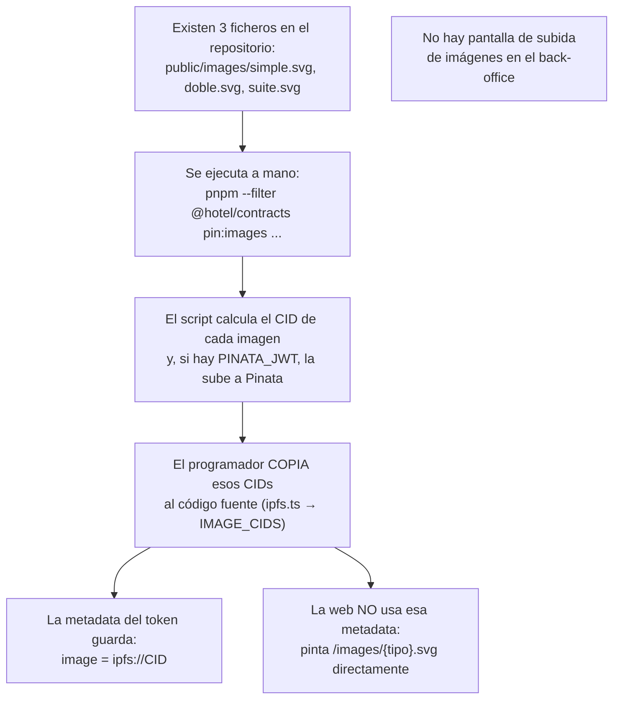
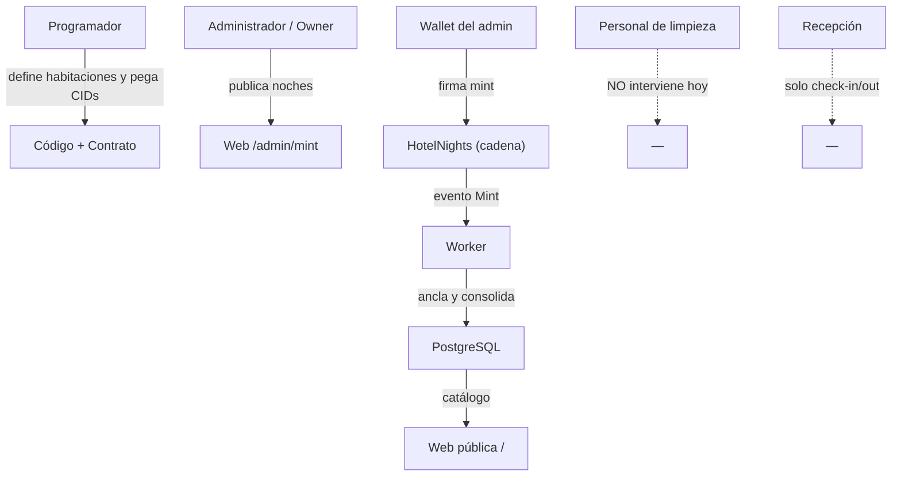

# Proceso actual: «crear» una habitación y publicarla

> **Documento explicativo (solo lectura).** No modifica nada del proyecto.
> **Fecha**: 2026-09-26 · **Autor**: @asistenteProyecto
> **Fuente**: código real (`apps/web`, `packages/shared`, `packages/contracts`, `apps/worker`).

---

## 0. La idea clave (en lenguaje común)

En el sistema actual **no existe una pantalla para crear una habitación**. La habitación no es algo que
se dé de alta desde la web: las **50 habitaciones del hotel ya vienen escritas a mano en el programa**
(el contrato y el paquete compartido). Tampoco se pueden subir fotos ni rellenar características
(capacidad, camas, metros, servicios...).

Lo que el administrador realmente hace en `/admin/mint` es **publicar una noche**: elige una habitación
que ya existe, una fecha y un precio, y eso crea un *token* vendible. Sus características no se escriben:
se **deducen del número de habitación**, y su imagen no se elige: **depende solo del tipo**.

Dicho de otro modo:

| Lo que pide `reestructuraHotel.md` | Lo que hace el sistema hoy |
|---|---|
| «Crear una habitación con sus características e imágenes» | No existe. Habitaciones fijas en código; características por rango numérico; 3 imágenes fijas por tipo |
| «Publicar una habitación» | Publicar una **noche** (habitación + fecha), que aparece en el catálogo |

---

## 1. Diagrama general del proceso actual

---

## 2. De dónde sale cada característica (y de dónde NO)

**Las únicas características que existen** son: número, tipo (deducido), fecha y precio. Todo lo demás
(galería, comodidades, aforo, descripción propia) **no está modelado**.

---

## 3. El proceso de «imágenes», en detalle (es manual y está fuera de la web)

En resumen: **cambiar una foto exige tocar el repositorio, ejecutar un script y editar código**. Un
administrador del hotel no puede hacerlo solo.

---

## 4. Vista de actores y responsabilidades (quién hace qué)

**Nadie del hotel (limpieza, mantenimiento, recepción) participa en la creación o publicación**; es un
proceso técnico de programador + admin con wallet.

---

## 5. Paso a paso narrado (versión corta)

**Antes (solo una vez, por un programador):**
1. Se escriben las 50 habitaciones y sus rangos de tipo en `RoomMaster.sol` y `room-master.ts`.
2. Se eligen 3 fotos (una por tipo), se calculan sus CIDs con un script y se pegan en `ipfs.ts`.

**Cada vez que se publica una noche (el admin, en `/admin/mint`):**
3. Entra con usuario + contraseña + TOTP.
4. Elige nº de habitación, fecha y precio (o un lote de fechas seguidas, hasta 50).
5. El sistema comprueba que la habitación esté en el maestro y que la fecha sea real; el tipo lo deduce solo.
6. Reconfirma el TOTP en un modal.
7. La web **pre-registra** la noche en PostgreSQL (estado «disponible», pero **sin anclar**).
8. La wallet del admin firma y envía la transacción `mint(...)` al contrato.
9. La cadena confirma y emite el evento `Mint`.
10. El **worker** ve el evento, escribe el *hash real* y marca la fila como **anclada**.
11. Como el catálogo solo enseña filas ancladas, **la noche aparece publicada** en `/` con la foto de su tipo.

**Publicación secundaria (reventa):** el dueño de una noche la pone en venta desde `/mis-noches`
(`list`), y aparece en `/reventa`. Es un flujo distinto del de alta.

---

## 6. Diferencias con lo que pide la reestructuración (lo que habría que construir)

| Necesidad del nuevo modelo | Situación actual | Qué falta |
|---|---|---|
| Ente «Habitación» con ficha | Deducida de un número | Tabla `rooms`, formulario y ficha |
| Características propias (capacidad, camas, servicios...) | No existen | Modelo de atributos |
| Galería de imágenes por habitación | 1 imagen por tipo | Subida, almacenamiento y galería |
| Estado operativo (Limpia/Sucia/Mantenimiento/Ocupada) | No existe | Entidad de estado + housekeeping |
| Publicar/despublicar una habitación | Se publica por noche | Concepto de oferta/publicación |
| Que el personal gestione habitaciones | Solo programador + admin con wallet | Pantallas sin wallet |

> Nota de fricción detectada: la pantalla `/admin/mint` exige rol **MINTER** para mostrarse, pero la API
> `POST /api/admin/mint` exige **DEFAULT_ADMIN**. Un operador con solo MINTER vería el formulario y
> recibiría un 403 al enviarlo.

---

*Documento explicativo v1 · @asistenteProyecto.*
