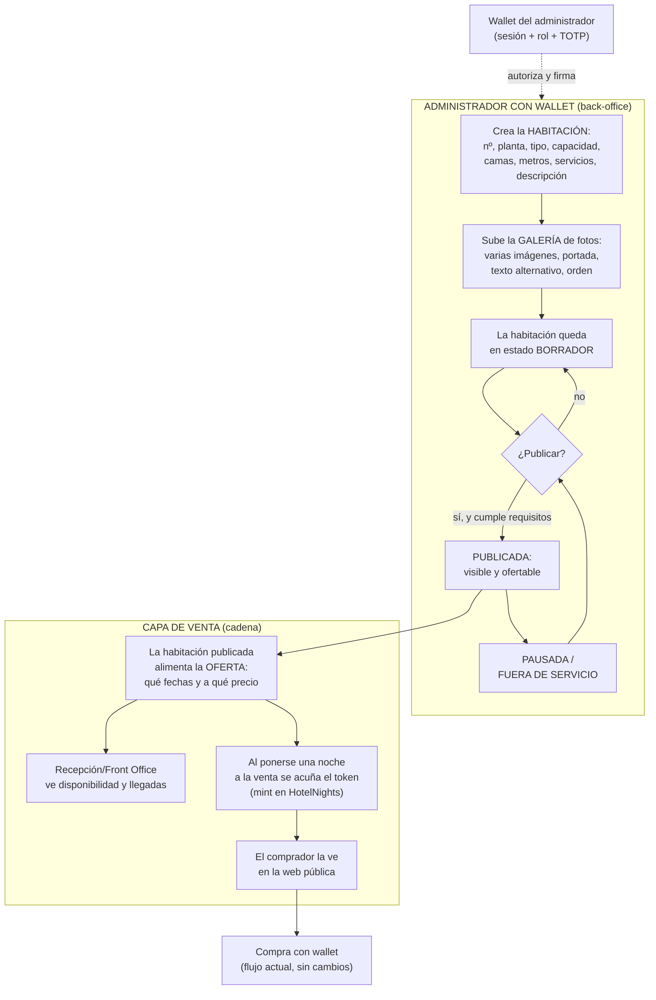
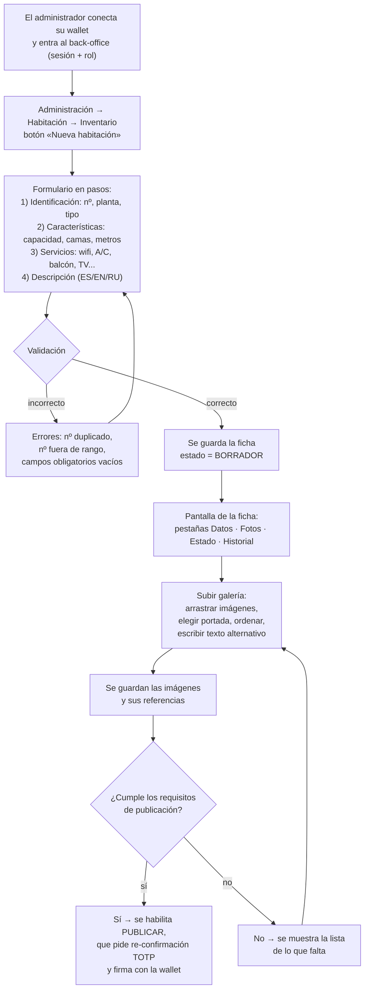
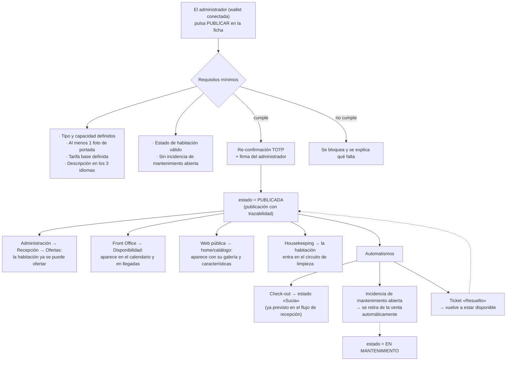
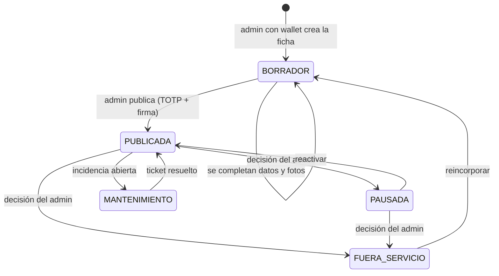
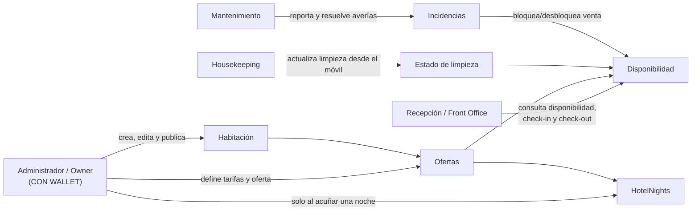

# Proceso propuesto: crear y publicar una habitación

> **Documento de propuesta (NO ejecutada).** No modifica nada del proyecto.
> **Fecha**: 2026-09-26 · **Autor**: @asistenteProyecto
> **Complementa a**: [`proceso_actual_habitacion.md`](proceso_actual_habitacion.md) y
> [`propuesta_reestructura.md`](propuesta_reestructura.md)
> **Sección destino**: Suite Administración → **1. Habitación**
>
> **D-1 (decisión del cliente, aplicada).** Las funciones de **Habitación las gestiona el
> administrador con wallet**. La sección vive en el back-office y opera con la **wallet del
> administrador conectada**, reutilizando el patrón actual de `/admin/mint` (sesión + rol on-chain +
> wallet + re-confirmación TOTP en operaciones de alto impacto). No es una sección para personal sin
> wallet.
>
> **D-2 (decisión del cliente, aplicada).** La **ficha de la habitación vive en PostgreSQL**; la
> wallet **ancla on-chain solo la publicación** (hash de la ficha). Las ediciones de datos y fotos no
> son transacciones: se guardan off-chain y solo el acto de publicar deja rastro firmado on-chain.
>
> **D-3 (decisión del cliente, aplicada).** La **base de datos es la fuente única** del maestro de
> habitaciones; el **maestro on-chain se alimenta desde ella** (sincronización validada BD → cadena).
> Consecuencia: el rango fijo actual de `RoomMaster.sol` (101-130 / 201-220) deja de ser la autoridad y
> se sustituye por un **registro de habitaciones dinámico** que el administrador con wallet mantiene.
>
> **D-4 (decisión del cliente, aplicada).** Acuñado **híbrido**: al publicar la habitación se acuñan
> **automáticamente** las noches de una **ventana configurable** (p. ej. 90 días), y el administrador
> puede **acuñar fechas sueltas** de refuerzo manualmente (patrón actual de `/admin/mint`).
>
> **D-5 (decisión del cliente, aplicada).** Las imágenes se guardan **en el servidor**, en la carpeta
> **`./docs/imagenes`**, con nomenclatura
> **`<nº habitación>-<tipo Simple|Doble|Suite>-<fecha>-<nº de imagen>`**.
> *Nota técnica:* `docs/` no lo sirve Next.js por defecto (sirve `public/`), así que habrá que exponer
> esa carpeta mediante una ruta de imagen/estático; se resuelve en la fase de construcción.
>
> **D-6 (decisión del cliente, aplicada).** Idiomas de la ficha: **español obligatorio**; **EN/RU
> opcionales con respaldo automático al español** si faltan. La interfaz sigue trilingüe (RNF-13); la
> ficha de habitación puede estar incompleta en EN/RU y se muestra el texto español.
>
> **D-7 (decisión del cliente, aplicada).** El administrador **puede crear habitaciones con números
> fuera de los rangos actuales** (101-130 / 201-220), con la única regla de que el número **no esté
> repetido**. El inventario deja de estar cerrado en 50.
>
> **D-8 (decisión del cliente, aplicada).** Una habitación **nunca se borra**: se **archiva** (sale de
> circulación conservando su historial de ventas y su rastro on-chain) y puede reincorporarse.
>
> **D-9 (decisión del cliente, aplicada).** **Varios administradores con rol**: la gestión de
> habitaciones no depende de una sola wallet. Si un administrador pierde acceso, otro puede seguir
> operando y se rota el rol.
>
> **D-10 (decisión del cliente, aplicada).** El **registro de habitaciones válidas vive dentro de
> `HotelNights`** (lista + rol de administrador que la mantiene), conservando el principio de
> **contrato único** (ADR-02). No se crea un contrato aparte.
>
> **D-11 (decisión del cliente, aplicada).** La **ventana de acuñado automático es global y
> configurable** por el administrador (un único valor, p. ej. 90 días) y aplica a todas las
> habitaciones publicadas.
>
> **D-12 (decisión del cliente, aplicada).** En la nomenclatura de la imagen, la **«fecha» es la de
> subida/captura de la foto**. Ej.: `101-Simple-2026-09-26-1.jpg`.
>
> **D-13 (decisión del cliente, aplicada).** El nuevo registro on-chain **arranca vacío**: las 50
> habitaciones actuales se **crean desde la web** (alta individual o importación masiva). Implica que,
> tras la migración, el inventario no está disponible hasta cargarlo.
>
> **D-14 (decisión del cliente, aplicada).** `RoomMaster.sol` y `room-master.ts` se **conservan como
> semilla de carga** (lista para importar las 50 habitaciones) y **referencia histórica**, pero **sin
> autoridad de validación**: la autoridad es el registro dinámico alimentado desde la BD.
>
> **D-15 (decisión del cliente, aplicada).** **Reset total**: se empieza de cero. Las noches ya
> acuñadas y su historial **se queman/ignoran**. *Implicación:* se pierden los tokens y las ventas
> registradas; es viable en la red local de laboratorio (piloto), pero exige **copia de seguridad y
> limpieza coordinada** de `nfts`, `sale_events`, `listings` y los agregados del worker.
>
> **D-16 (decisión del cliente, aplicada).** El acuñado automático es **idempotente**: antes de acuñar
> comprueba cada fecha y **omite las que ya existen** (acuñadas, vendidas o consumidas), informando de
> lo omitido. Nunca reescribe ni borra una noche existente.
>
> **D-17 (decisión del cliente, aplicada).** La ventana **se acuña al publicar** y **solo se extiende
> con un botón manual** del administrador (sin proceso diario automático). *Implicación:* hace falta un
> **aviso** cuando la ventana esté por agotarse, para no dejar de vender fechas por olvido.
>
> **D-18 (decisión del cliente, aplicada).** Al publicar se ancla on-chain una **huella (hash) del
> contenido de la ficha**, junto con el **nº de habitación** y la **fecha**. Si la ficha se edita y se
> republica, se ancla una huella nueva.
>
> **D-19 (decisión del cliente, aplicada).** La habitación tiene **dos estados independientes**: de
> **publicación** (Borrador · Publicada · Pausada · En mantenimiento · Fuera de servicio, lo decide el
> admin) y **operativo** (Limpia · Sucia · Ocupada, lo actualizan housekeeping/recepción). La ficha los
> muestra juntos, pero no se mezclan.
>
> **D-20 (decisión del cliente, aplicada).** Galería: **solo JPG**, **máx. 2 MB** por imagen y **máx.
> 5 fotos** por habitación. La primera foto es la **portada**; para publicar se exige al menos una.
>
> **D-21 (decisión del cliente, aplicada).** Campos **obligatorios** para publicar: **nº, tipo,
> capacidad, camas y descripción en español**. **Opcionales**: metros, servicios, notas internas y las
> versiones EN/RU.
>
> **D-22 (decisión del cliente, aplicada).** Los **tipos de habitación son fijos**: **Simple, Doble y
> Suite**, los que ya usa el contrato y de los que depende el **royalty inmutable** (5 % / 5 % / 10 %,
> ADR-18). El administrador elige el tipo, no lo crea.
>
> **D-23 (decisión del cliente, aplicada).** Al **archivar** una habitación, sus **noches futuras se
> retiran de la venta** (despublicadas) y las **ya vendidas siguen siendo válidas** para el huésped. No
> se queman noches vendidas.
>
> **D-24 (decisión del cliente, aplicada).** El **cambio de contrato** (registro dinámico, D-3/D-10) y el
> **reset** (D-15) se ejecutan **al final, como corte único**, cuando la nueva sección Habitación y su
> navegación estén construidas y probadas. El sistema actual sigue funcionando durante la construcción.
>
> **D-25 (decisión del cliente, aplicada).** El **primer ciclo** entrega la **shell de Administración +
> la sección Habitación completa**, 100% operativa y verificable, antes de seguir con lo demás.
>
> **D-26 (decisión del cliente, aplicada).** Orden de construcción **operación primero**: tras
> Habitación → **Front Office (Recepción + Reservas)** → Housekeeping → Mantenimiento → Actividades →
> Pública → Administración financiera → corte final (F8).
>
> **D-27 (decisión del cliente, aplicada).** La **home pública** incluye, además de lo descrito: hero de
> marca, servicios, estilos de habitación, planes especiales, actividades y servicios extra, catálogo de
> ofertas, acceso a reventa, galería y contacto con mapa, **reseñas/valoraciones de huéspedes**. Esto abre
> un dominio nuevo (reseñas) y obliga a resolver cómo se verifica la reseña sin romper el anonimato.
>
> **D-28 (decisión del cliente, aplicada).** Las reseñas son **anónimas y verificadas**: solo reseña quien
> tiene una **noche consumida y verificada on-chain**; no se publica nombre, correo ni el número exacto de
> habitación. El administrador **modera**. Se preserva el anonimato (ADR-20).
>
> **D-29 (decisión del cliente, aplicada).** El menú acordeón de Administración (barra derecha) es de
> **una sola sección abierta a la vez** (acordeón clásico); en móvil la barra se oculta tras un **botón
> hamburguesa** que la despliega.
>
> **D-30 (decisión del cliente, aplicada).** El tablero de Housekeeping «en tiempo real» usa **SSE**
> (el servidor empuja los cambios), con reconexión automática del navegador.
>
> **D-31 (decisión del cliente, aplicada).** La ruta raíz **`/` pasa a ser la home de marca**; el
> catálogo se mueve a **`/catalogo`**, con **redirecciones** desde los enlaces antiguos para no romper
> nada.
>
> **D-32 (decisión del cliente, aplicada).** La Suite Front Office conserva **`/recepcion`** como raíz y
> anida sus sub-rutas (`/recepcion/reservas`, `/recepcion/checkin`, `/recepcion/checkout`, tablero),
> reutilizando el guard y las pruebas existentes.
>
> **D-33 (decisión del cliente, aplicada).** La Suite **financiera** (1.5: facturación, métodos de pago,
> caja chica) se confirma como **tercera versión**: queda **fuera de esta entrega**, pero su diseño se
> reserva en el plan.

---

## 0. La idea clave (en lenguaje común)

La habitación pasa a ser un **ente propio que se crea y se edita desde el back-office** (sección
*Habitación*), pero **siempre operado por el administrador con su wallet**. Ya no exige tocar código ni
depender de un programador; sí exige ser administrador y tener la wallet conectada.

Para no romper lo que ya funciona, se mantienen **dos capas**:

1. **La habitación (ficha).** Es el *ente operativo*: número, tipo, capacidad, camas, metros, servicios,
   fotos, estado. Se gestiona desde el back-office con la wallet del administrador. La ficha se persiste
   y **la publicación se firma/ancla**, de modo que quede trazabilidad de quién la puso en venta.
2. **La noche tokenizada (on-chain).** Es el *producto vendible* de una fecha concreta. Se sigue
   acuñando (`mint`) contra `HotelNights` cuando esa noche se pone a la venta.

> Regla mental: **primero el administrador crea la habitación (con wallet), después la publica (con
> wallet), y la venta de cada noche se acuña como hasta ahora.**

---

## 1. Diagrama general del modelo propuesto

---

## 2. Diagrama: crear una habitación (paso a paso)

**Con wallet, con rol y con re-confirmación TOTP.** El alta y la edición usan la wallet del
administrador como identidad y autorización; la publicación deja rastro firmado. No es una sección
abierta al personal operativo.

---

## 3. Diagrama: publicar una habitación y qué desencadena

---

## 4. Ciclo de vida del estado de una habitación

Estados visibles: **Borrador · Publicada · Pausada · En mantenimiento · Fuera de servicio** (y, en el día
a día, el estado de limpieza **Limpia · Sucia · Ocupada**, que es otra dimensión).

> Distinción importante: **estado de publicación** (¿se puede vender?) y **estado de limpieza/ocupación**
> (¿está lista y hay alguien dentro?) son dos cosas distintas que no deben mezclarse en la misma casilla.

---

## 5. Quién hace qué (propuesto)

**Clave**: la wallet del administrador es la que **crea, publica y oferta** habitaciones. El resto del
personal (recepción, limpieza, mantenimiento) **no gestiona la ficha**: solo consulta disponibilidad,
actualiza limpieza y reporta/resuelve incidencias.

---

## 6. Comparación lado a lado

| Aspecto | Hoy | Propuesto (con D-1) |
|---|---|---|
| ¿Se puede crear una habitación? | **No** (escrita en código) | **Sí**, desde el back-office |
| Características | Nº y tipo deducido | Ficha completa: tipo, capacidad, camas, metros, servicios, descripción |
| Imágenes | 1 foto fija por tipo, CID pegado a mano | Galería por habitación, portada, orden, alt text |
| ¿Quién gestiona? | Programador + admin con wallet | **Administrador con wallet** (sin programador) |
| Publicación | Se publica **por noche** (mint) | Se publica **la habitación** (oferta, con TOTP + firma); el mint ocurre al vender |
| Estado operativo | No existe | Publicación + limpieza/ocupación separados |
| Mantenimiento | No existe | Incidencia bloquea la venta automáticamente |
| Trazabilidad | Token on-chain por noche | Ficha + publicación firmada por el admin + token on-chain al vender |
| Móvil / personal | Solo admin | Housekeeping y mantenimiento desde móvil (sin gestionar la ficha) |
| Multi-idioma | Heredado | Descripción y servicios en ES/EN/RU |

---

## 7. Qué se conserva y qué cambia

**Se conserva (no se toca):**
- El contrato `HotelNights` y el modelo de noches tokenizadas.
- El flujo de compra anónima con wallet, reventa y royalties.
- El patrón de seguridad del back-office: sesión + rol on-chain + **wallet del administrador** +
  re-confirmación TOTP en operaciones de alto impacto.
- El check-in on-chain, el worker, la cola de notificaciones.
- Las reglas de privacidad (sin PII de filiación) y los gates de accesibilidad y pruebas.

**Cambia:**
- Se añade la entidad `rooms` (y `room_types`, `room_amenities`, `room_images`).
- La publicación deja de ser «acuñar» y pasa a ser un estado firmado por el administrador.
- El maestro (`RoomMaster.sol` / `room-master.ts`) deja de ser la autoridad: la **BD es la fuente
  única** y el maestro on-chain se **alimenta desde ella** (D-3), con un registro dinámico y un proceso
  de sincronización BD → cadena.

---

## 8. Riesgos y decisiones abiertas

| # | Punto | Por qué importa |
|---|---|---|
| P-1 | **Alcance de «con wallet» en Habitación** — **RESUELTO (D-2)** | Ficha en PostgreSQL; se **ancla on-chain solo la publicación** (hash de la ficha). Las ediciones no son transacciones. |
| P-2 | **Doble fuente del maestro** — **RESUELTO (D-3)** | La **BD es la fuente única** y el maestro on-chain se alimenta desde ella. Requiere un registro de habitaciones dinámico en el contrato y un proceso de sincronización BD → cadena. |
| P-3 | **¿Mint manual o automático?** — **RESUELTO (D-4)** | **Híbrido**: ventana automática al publicar (configurable, p. ej. 90 días) + mint manual de fechas sueltas. |
| P-4 | **Dónde se guardan las fotos** — **RESUELTO (D-5)** | Carpeta local del servidor `./docs/imagenes`, con nomenclatura `<nº habitación>-<tipo>-<fecha>-<nº imagen>`. Exponer la carpeta a la web queda para construcción. |
| P-5 | **Idiomas de la descripción** — **RESUELTO (D-6)** | **ES obligatorio**; **EN/RU opcionales con fallback al español**. La interfaz sigue trilingüe. |
| P-6 | **Nº duplicado y habitaciones 131+** — **RESUELTO (D-7)** | Se permite crear habitaciones **fuera de rango**; el número **no puede repetirse**. Inventario abierto. |
| P-7 | **Borrado vs archivo** — **RESUELTO (D-8)** | **Archivar; nunca borrar.** Conserva historial y rastro on-chain; reincorporable. |
| P-8 | **Dependencia de la wallet** — **RESUELTO (D-9)** | **Varios administradores con rol**; si uno pierde la wallet, otro opera y se rota el rol. |
| P-9 | **Registro on-chain** — **RESUELTO (D-10)** | El registro de habitaciones válidas vive **dentro de `HotelNights`** (contrato único, ADR-02), con rol de administrador que lo mantiene. |
| P-10 | **Ventana de acuñado** — **RESUELTO (D-11)** | **Global y configurable** (un valor, p. ej. 90 días) para todas las habitaciones publicadas. |
| P-11 | **«Fecha» del nombre de la foto** — **RESUELTO (D-12)** | Es la fecha de **subida/captura** de la foto. Ej.: `101-Simple-2026-09-26-1.jpg`. |
| P-12 | **Migración del inventario** — **RESUELTO (D-13)** | El registro on-chain **arranca vacío**; las 50 habitaciones se crean **desde la web**. |
| P-13 | **Código del maestro antiguo** — **RESUELTO (D-14)** | Se **conserva como semilla de carga y respaldo**, sin autoridad de validación. |
| P-14 | **Noches ya acuñadas** — **RESUELTO (D-15)** | **Reset total**: se empieza de cero y se quema/ignora el historial. Requiere copia de seguridad y limpieza coordinada. |
| P-15 | **Repetición del acuñado** — **RESUELTO (D-16)** | Proceso **idempotente**: **omite** las noches ya existentes; nunca reescribe ni borra. |
| P-16 | **Cuándo se extiende la ventana** — **RESUELTO (D-17)** | Se acuña **al publicar** y **solo se extiende con botón manual**; requiere aviso de ventana por agotarse. |
| P-17 | **Qué se ancla al publicar** — **RESUELTO (D-18)** | **Huella (hash) de la ficha** + nº de habitación + fecha; al editar y republicar, huella nueva. |
| P-18 | **Estatus de habitación** — **RESUELTO (D-19)** | **Dos estados separados**: publicación (admin) y operativo (housekeeping/recepción). |
| P-19 | **Reglas de la galería** — **RESUELTO (D-20)** | **Solo JPG**, **≤2 MB**, **máx. 5 fotos**; la primera es portada y se exige una para publicar. |
| P-20 | **Campos de la ficha** — **RESUELTO (D-21)** | Obligatorios: **nº, tipo, capacidad, camas, descripción ES**. Opcionales: metros, servicios, notas, EN/RU. |
| P-21 | **Tipos de habitación** — **RESUELTO (D-22)** | **Fijos: Simple, Doble, Suite** (royalty inmutable 5 %/5 %/10 %, ADR-18). |
| P-22 | **Archivar una habitación** — **RESUELTO (D-23)** | Las noches futuras se **retiran de la venta**; las **vendidas siguen válidas**. No se queman vendidas. |

---

## 9. Criterios de aceptación propuestos (para cuando se construya)

1. El **administrador con wallet** crea una habitación con características y galería desde el back-office.
2. Sin wallet conectada o sin rol, la sección **Habitación no permite operar** (401/403).
3. Las operaciones de publicación exigen **re-confirmación TOTP** y dejan rastro firmado.
4. Una habitación en **Borrador** no aparece ni en la web pública ni en la oferta.
5. Al **Publicar**, la habitación aparece en las tres suites con la misma información.
6. Una **incidencia abierta** retira la habitación de la venta y un ticket **resuelto** la devuelve.
7. El **check-out** cambia el estado de limpieza a «Sucia» (no el de publicación).
8. Todo es **accesible (WCAG 2.1 AA)**, multi-idioma y verificable con prueba y artefacto.

---

*Propuesta v2 · @asistenteProyecto · D-1 aplicada (gestión de Habitación por el administrador con wallet).*
