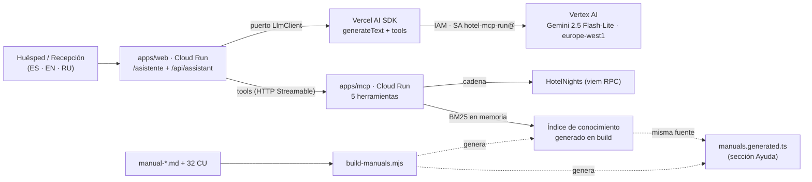

# Propuesta v3 — Asistente IA de bajo coste sobre la plataforma actual

| Campo | Valor |
|---|---|
| **Fecha** | 2026-10-07 |
| **Base de partida** | `main` @ `42255fd` — release **v39** desplegada en GCP |
| **Autor** | `@asistenteProyecto` (director de proyecto + ingeniero senior) |
| **Documento origen analizado** | `RepoTecnico/propuesta_asiatente_hotel.md` |
| **Estado** | 🟡 **PROPUESTA — pendiente de conformidad**. No se ha modificado ninguna línea de código. |
| **Alcance** | Incremento **v3** de la plataforma: asistente conversacional IA en producción de prueba, con coste mínimo. |
| **Decisiones confirmadas** (2026-10-07) | LLM **Gemini 2.5 Flash-Lite en Vertex AI**, endpoint regional **`europe-west1`**, con **Vercel AI SDK** detrás del puerto `LlmClient` · **sin secretos nuevos** (IAM con la SA ya desplegada `hotel-mcp-run@`) · RAG como **5ª herramienta del MCP** · `min-instances=0` + *keep-warm* solo en la demo · audiencia **cliente final / huésped** · **solo español** en la primera iteración · **sanitización de PII** como defensa en profundidad |
| **Verificación realizada** (2026-10-07) | **§5.4** contrasta la propuesta con la infraestructura desplegada: descartó Qwen 2.5 14B en proveedor externo (fuera de la UE, +1 secreto, latencia transatlántica) y Qwen3 MaaS en Vertex (endpoint global, modelo retirado). |

---

## 1. Resumen ejecutivo

La propuesta original plantea **reescribir** el asistente con un stack nuevo (Llama 3 8B en Vertex AI +
Vercel AI SDK + `pgvector` + tabla `hotel_knowledge_base` + ETL de embeddings) por **32–60 USD/mes**.

Tras verificar el repositorio, esa propuesta **ignora que el asistente ya existe y está probado**: hay
17 módulos en `apps/web/src/lib/assistant/` (orquestador con puerto `LlmClient`, pasarela MCP, prompt con
guardrails, filtro anti-fuga, rate-limit y validación de tx server-side) más `/api/assistant`,
`/asistente` y el handoff de compra. Su **único** bloqueo es que `ANTHROPIC_API_KEY` está vacía
([estado_proyecto.md](estado_proyecto.md) §M9: «dependencia de pago no presupuestada»).

**La v3 propuesta invierte el enfoque**: en lugar de construir un stack nuevo, **reutiliza el 95 % del
código existente** y añade lo mínimo imprescindible (**1 adaptador de LLM sobre el Vercel AI SDK contra
Gemini 2.5 Flash-Lite en Vertex AI** + 1 herramienta MCP + un índice de conocimiento generado en build).
Resultado:

| Métrica | Propuesta original | **Propuesta v3** |
|---|---|---|
| Coste incremental de IA | 32–60 USD/mes | **≈ 2,6 USD/mes** |
| Infraestructura nueva | Cloud SQL + `pgvector` + HNSW + ETL + índice vectorial | **ninguna** |
| Migraciones de BD | 1 tabla + 1 extensión + 1 índice | **ninguna** |
| Cambios en los 3 artefactos de datos | sí (`base_datos.sql`, `diccionario_datos.md`, `diagrama_er.md`) | **no** (siguen sincronizados) |
| Herramientas MCP | 4 → 7 (renombradas a `snake_case`) | **4 → 5** (misma convención `camelCase`) |
| Semanas | 4 | **3–5 días** de desarrollo efectivo |
| Riesgo de regresión | alto (reescritura del orquestador) | **bajo** (el contrato no cambia) |

---

## 2. Análisis del documento origen

Veredicto elemento por elemento de `propuesta_asiatente_hotel.md`:

| Elemento de la propuesta original | Veredicto | Motivo técnico |
|---|---|---|
| Objetivo: asistente conversacional MCP + RAG | ✅ **Se acepta** | Es exactamente el objetivo de la v3. |
| MCP para datos estructurados / transaccionales | ✅ **Se acepta** | Ya existe y funciona (ADR-11). 4 herramientas verificadas. |
| MCP estrictamente *read-only* + firma solo en cliente | ✅ **Se acepta y ya está implementado** | `orchestrator.ts` + `validate-tx.ts` lo garantizan. |
| GCP como infraestructura (Cloud Run, Cloud SQL, Secret Manager) | ✅ **Se acepta y ya está desplegado** | Proyecto `hotel-mcp`, región `europe-west1`. |
| CI/CD con WIF sin claves JSON | ✅ **Se acepta — ya está hecho** | `infra/gcp/20-iam-and-wif.sh` con pools `github-pool` y `gitlab-pool`. |
| RNF-03 (sin PII en logs ni en la base vectorial) | ✅ **Se acepta y se refuerza** | La v3 elimina la base vectorial: menos superficie de PII. |
| Modelo **Llama 3 8B** vía Vertex AI Model Garden | ❌ **Se sustituye por Gemini 2.5 Flash-Lite** (Vertex AI, `europe-west1`) | Model Garden exige GPU residente sin escalado a cero; Gemini Flash-Lite es *serverless*, regional en la UE y se autentica con la SA ya desplegada. Ver §5.4. |
| **Vercel AI SDK** como capa de orquestación | ✅ **Se adopta — como adaptador, no como orquestador** | Decisión del usuario. Se usa `generateText` + `tools` del SDK **detrás del puerto `LlmClient`**, de modo que el orquestador, los guardrails y los tests existentes no se tocan. |
| **`pgvector`** + tabla `hotel_knowledge_base` + índice HNSW | ❌ **Se descarta** | El corpus son **35 documentos**. Cabe en memoria; un índice en proceso es más rápido y no toca Cloud SQL (`db-f1-micro`, compartida con el worker). |
| **Embeddings** `text-embedding-3-small` (OpenAI, 1536 dim) | ❌ **Se descarta** | Incoherente con un stack GCP: segundo proveedor, segunda clave, salida de datos a un tercero y coste/latencia en runtime. |
| ETL `scripts/ingest-manuals.ts` que lee `docs/` | ⚠️ **Se sustituye** | Ya existe la tubería `apps/web/scripts/build-manuals.mjs` (35 documentos → `manuals.generated.ts`). Se **extiende** en vez de duplicarla. |
| 3 herramientas nuevas (`search_hotel_manuals`, `get_room_details`, `get_location_and_access`) | ⚠️ **Se reduce a 1** | Cada esquema de herramienta viaja en **cada** llamada al LLM: 3 herramientas extra ≈ +400 tokens/llamada facturados siempre. `get_room_details` y `get_location_and_access` se responden desde el manual. |
| Nombres `check_availability` / `build_purchase_tx` (`snake_case`) | ❌ **Se descarta** | El MCP real usa `checkAvailability` / `buildPurchaseTx`. Renombrar rompe el prompt, los tests y el contrato publicado. |
| RF-04 multilingüe ES/EN/RU | ⚠️ **Se acepta recortado** | La plataforma ya es trilingüe (`apps/web/messages/{es,en,ru}.json`), pero por decisión del usuario la v3 arranca **solo en ES**; EN y RU pasan a v3.1 reutilizando el mismo prompt. |
| RF-05 citación de la fuente | ✅ **Se acepta, a coste 0** | El índice devuelve `slug + sección`; citar es una instrucción del prompt, no una llamada extra. |
| RNF-01 latencia p95 < 2,5 s | ⚠️ **Se acepta con matiz** | Choca con el escalado a cero (doble *cold start* web→MCP). Ver §7. |
| RNF-02 «escalar a cero» y coste < 50 USD | ⚠️ **Se corrige** | Cloud SQL **no** escala a cero; su coste es hundido (el worker lo necesita 24/7). La v3 desglosa «coste incremental del asistente», que es lo controlable. |
| §8.1 «permisos `Editor`/`Owner` en GCP» | ❌ **Se descarta** | Viola mínimo privilegio y contradice el patrón ya establecido (`ci-deployer` + WIF + `hotel-mcp-run`). |

---

## 3. Punto de partida real (verificado en el repositorio)

### 3.1 Asistente (ya construido)

| Componente | Ruta | Estado |
|---|---|---|
| Puerto LLM (DIP) | `apps/web/src/lib/assistant/llm.ts` | ✅ Listo para nuevos adaptadores |
| Adaptador Anthropic | `apps/web/src/lib/assistant/anthropic-client.ts` | ✅ Funcional (requiere clave) |
| Orquestador + guardrails | `apps/web/src/lib/assistant/orchestrator.ts` (+ test) | ✅ Con tope de rondas, validación de tx y sin firma |
| Prompt de sistema | `apps/web/src/lib/assistant/prompt.ts` | ✅ Acotado al dominio, con fecha inyectada |
| Filtro anti-fuga | `prompt-leak-filter.ts` (+ test) | ✅ |
| Limitador + presupuesto | `rate-limit.ts` (+ test) | ✅ Por IP y por wallet |
| Pasarela MCP (HTTP) | `mcp-gateway.ts` | ✅ Transporte *Streamable*, secreto compartido opcional |
| Validación de tx on-chain | `chain-pricing.ts`, `validate-tx.ts` (+ tests) | ✅ |
| Endpoint | `apps/web/src/app/api/assistant/route.ts` | ✅ Devuelve 503 sin clave |
| UI | `apps/web/src/app/asistente/page.tsx`, `components/assistant/*` | ✅ Sin *streaming* (JSON) |

### 3.2 MCP (4 herramientas, sin cambios de convención)

`listAvailableNights` · `checkAvailability` · `getOwnedNights` · `buildPurchaseTx`
(`apps/mcp/src/server.ts`). Esquemas Zod en `apps/mcp/src/tools/schemas.ts`.

### 3.3 Despliegue GCP vigente

| Recurso | Configuración real |
|---|---|
| Proyecto / región | `hotel-mcp` / `europe-west1` |
| Cloud SQL | `hotel-mcp-pg`, PostgreSQL **18**, `db-f1-micro`, IP privada, base `hotel_nft` |
| Cloud Run `web` | min **0** / max 3, 1 vCPU, 1 GiB |
| Cloud Run `mcp` | min **0** / max 2 |
| Cloud Run `worker` | min 1 / max 1 (no escala a cero) |
| SA de ejecución | `hotel-mcp-run@hotel-mcp.iam.gserviceaccount.com` |
| SA de CI | `ci-deployer` vía WIF (`github-pool`, `gitlab-pool`) |
| Secretos | `hotel-database-url`, `hotel-mcp-shared-secret`, `hotel-session-secret`, `hotel-jwt-secret`, … |

### 3.4 Conocimiento (ya generado)

`apps/web/scripts/build-manuals.mjs` (1 151 líneas, sin dependencias nuevas) convierte
`docs/manual-{cliente,comprador,recepcion}.md` + 32 casos de uso en
`apps/web/src/lib/help/manuals.generated.ts` (**35 documentos** con `slug`, `title` y `sections[]`
con `id`, `title` y `html`). Exporta `MANUALS: readonly ManualDoc[]`.

> Este artefacto es la **fuente de conocimiento ideal**: ya está estructurado por secciones, versionado
> en el repositorio, regenerable de forma idempotente y cubierto por
> `apps/web/src/lib/help/manuals-sync.test.ts`.

---

## 4. Arquitectura v3

**Principio rector:** se conserva la separación de ADR-11 (la web orquesta, el MCP expone herramientas y
**nunca** firma) y se sustituye **solo el adaptador del modelo**. El contrato `LlmClient` no cambia, por
lo que el orquestador y sus tests permanecen intactos.

### Decisiones de diseño

| ID | Decisión | Justificación |
|---|---|---|
| **D1** | LLM: **Gemini 2.5 Flash-Lite en Vertex AI**, endpoint regional `europe-west1`, con el **Vercel AI SDK** (`generateText` + `tools`) detrás del puerto `LlmClient`. | Cero recursos GCP nuevos (IAM con la SA existente, sin secretos), dato en la UE y latencia en región. El SDK actúa de **adaptador**: los guardrails y sus tests permanecen intactos. |
| **D2** | **No** se introduce base de datos vectorial. El conocimiento vive en un **índice generado en build** y se consulta en memoria del MCP. | 35 documentos no justifican `pgvector`; evita migración, extensión, latencia de BD y competir por la RAM de `db-f1-micro`. |
| **D3** | Se añade **una sola** herramienta MCP: `searchHotelManuals` (camelCase). | Cada esquema viaja en cada llamada: menos herramientas = menos tokens facturados. |
| **D4** | El índice y el asistente operan en **español** en v3.0; el prompt se escribe preparado para detectar el idioma en v3.1. | 0 coste adicional, 0 infraestructura y sin embeddings multilingües. |
| **D5** | Multilingüismo **diferido a v3.1**, resuelto por prompt (sin modelos ni prompts separados). | Decisión del usuario: la v3 arranca solo en ES. |
| **D6** | Se mantiene `min-instances=0` en web y MCP; el calentamiento se hace con un *ping* programado **solo durante la ventana de la demo**. | Pagar instancias 24/7 costaría mucho más que unos segundos de latencia en la primera petición. |
| **D7** | Toda la configuración por variables de entorno (`ASSISTANT_PROVIDER`, `VERTEX_MODEL`, …). | Permite volver a Anthropic en un `gcloud run services update`, sin *rollback* de código. |

---

## 5. Estrategia de coste mínimo

### 5.1 Dinero — comparativa de modelos

> Supuestos: **1 000 conversaciones/mes**, ~3 turnos por conversación = 3 000 peticiones;
> ~2,5 llamadas al LLM por petición (bucle de herramientas); ≈ 2 400 tokens de entrada y ≈ 250 de salida
> por llamada ⇒ **≈ 18 M tokens de entrada y ≈ 1,9 M de salida al mes**.
> Precios de lista públicos aproximados; **verificar en la consola de facturación antes de decidir**.

| Opción de LLM | Precio (entrada/salida por 1 M) | Coste/mes estimado | Veredicto |
|---|---|---|---|
| **SiliconFlow / DeepInfra · Qwen2.5-14B-Instruct** | ~0,08–0,10 / 0,08–0,10 USD | ≈ 1,6–2,0 USD | ❌ **Descartada** en §5.4: fuera de la UE, +1 secreto y latencia transatlántica |
| Fireworks AI · Qwen2.5-14B-Instruct | ~0,20 / 0,20 USD | ≈ 4,0 USD | ❌ Descartada por los mismos motivos |
| Groq · Qwen (free tier) | 0 | **0 USD** | ⚠️ Solo desarrollo: límites de RPM/RPD y datos para mejora |
| Ollama local · Qwen 2.5 14B | 0 | **0 USD** | ✅ Reservado a demo presencial y desarrollo |
| Vertex AI · Qwen3 MaaS | ~0,22 / 0,88 USD | ≈ 5,6 USD | ❌ Descartada: endpoint **global** (no UE) y modelo retirado |
| **Vertex AI · Gemini 2.5 Flash-Lite** | ~0,10 / 0,40 USD | **≈ 2,6 USD** | ✅ **ELEGIDA** (ver §5.4) |
| Anthropic · Claude Sonnet (lo instalado hoy) | ~3 / 15 USD | **≈ 82 USD** | ❌ Supera el techo de 50 USD |

**Infraestructura incremental: 0 USD.** No se crea ningún recurso nuevo (ni Cloud SQL, ni vector DB, ni
GPU, ni servicio Cloud Run adicional). El asistente se sirve desde `web` y `mcp` ya existentes, ambos con
`min-instances=0`, y Cloud SQL es un coste ya incurrido por el worker.

**Palancas de dinero aplicadas:** modelo pequeño de pago por uso · cero infraestructura nueva · cero
embeddings en runtime · cero base vectorial · escalado a cero · *keep-warm* acotado a la demo.

### 5.2 Hospedaje del LLM (análisis que llevó a la decisión)

> **RESUELTO (2026-10-07):** se descarta Qwen 2.5 14B y se adopta **Gemini 2.5 Flash-Lite en Vertex AI con
> endpoint regional `europe-west1`**. El motivo está en §5.4: es la única opción con **cero recursos GCP
> nuevos** (IAM con la SA ya desplegada, sin secretos), dato en la UE y latencia sin salir de la región.
> El análisis siguiente se conserva como registro de por qué se descartaron las alternativas.

**Hallazgo verificado:** Qwen 2.5 14B **no se puede servir en Vertex AI sin GPU**. Model Garden despliega
los modelos abiertos en un *endpoint* con `min_replica_count=1` que **no escala a cero**, por lo que se
factura el nodo GPU 24/7 aunque no haya tráfico ([medición independiente](https://zenn.dev/acntechjp/articles/zenn-gcp-vertex-model-deploy)).
Y Cloud Run **sin GPU** no puede ejecutar un modelo de 14B. Por tanto, la elección del hospedaje decide el
coste:

| Opción de hospedaje | Coste/mes | Residencia del dato | Veredicto |
|---|---|---|---|
| **Vertex AI · Gemini 2.5 Flash-Lite** (`europe-west1`) | **2,6 USD** | **UE** | ✅ **ELEGIDA** |
| Proveedor *serverless* OpenAI-compatible (SiliconFlow, DeepInfra, Fireworks) | 1,6–4 USD | Fuera de la UE | ❌ Descartada (§5.4) |
| Ollama local (máquina de desarrollo o portátil del hotel) | **0 USD** | Local | ✅ Solo demo presencial y desarrollo |
| Cloud Run GPU + Ollama (L4, escala a cero) | Bajo por uso, *cold start* largo | `europe-west1` | ❌ Añade el servicio con GPU que se quiere evitar |
| Vertex AI Model Garden (GPU residente) | **400–700 USD** | GCP | ❌ Rompe el objetivo de coste |

**Decisión adoptada:** `Vercel AI SDK` + `@ai-sdk/google-vertex`, con `model` y `location` por variables de
entorno (`VERTEX_MODEL`, `VERTEX_LOCATION=europe-west1`, `GOOGLE_CLOUD_PROJECT`). El adaptador conserva un
`baseURL` opcional para poder apuntar a Ollama local en desarrollo **sin tocar una línea de código**, que es
precisamente la ventaja del SDK elegido.

> **GDPR (R10, degradado a riesgo bajo).** Al quedarse el dato en `europe-west1` dentro del propio proyecto,
> ninguna conversación sale de la UE. La sanitización de PII se mantiene como **defensa en profundidad**
> (RNF-27) —no como único control— porque el asistente es la única pieza del sistema que recibe texto libre
> de un huésped.

### 5.3 Tokens — palancas concretas

| # | Palanca | Ahorro |
|---|---|---|
| 1 | Modelo Flash-Lite en lugar de Sonnet | ~30× en el precio por token |
| 2 | **Una** herramienta nueva en vez de tres | ~400 tokens menos **en cada** llamada |
| 3 | Recuperación con índice en proceso y `top-3` acotado (~600 tokens) en vez de volcar manuales | evita decenas de miles de tokens de contexto |
| 4 | Reducir el presupuesto de conversación (`MAX_TOTAL_CHARS` 24 000 → 12 000) e historial por **ventana deslizante** de los últimos N turnos | ~40 % de la entrada |
| 5 | `max_tokens` de salida 1 024 → **512** + prompt que exige brevedad | ~50 % de la salida |
| 6 | Tope de rondas de herramientas 4 → **2** | corta bucles que multiplican la factura |
| 7 | **Caché de contexto** del *system prompt* + esquemas de herramientas | descuento sobre el bloque fijo, que es el mayoritario |
| 8 | Deduplicación de resultados de herramientas dentro de la misma conversación | evita repetir la misma búsqueda |
| 9 | Telemetría de tokens por petición (sin PII) + presupuesto duro por sesión | detección temprana de deriva de coste |
| 10 | *(Opcional)* Respuesta extractiva directa del manual si la similitud supera un umbral | 0 tokens en consultas frecuentes tipo FAQ |

### 5.4 Verificación de adecuación a la infraestructura GCP desplegada (2026-10-07)

Comprobado contra el despliegue real (§3.3) y contra fuentes oficiales de Google Cloud.

**Hallazgos de la verificación**

1. **En «mínimo de recursos GCP» hay empate técnico, con ventaja para Vertex.** Ninguna de las dos
   rutas añade cómputo: ni GPU, ni servicio Cloud Run, ni cambios en Cloud SQL. La única diferencia
   real es que el proveedor externo exige **1 secreto nuevo** en Secret Manager, mientras que Vertex AI
   se autentica con la cuenta de servicio **ya desplegada** `hotel-mcp-run@` → **cero recursos nuevos**.
2. **El tráfico de salida no pasa por Cloud NAT.** El despliegue usa
   `--vpc-egress=private-ranges-only`, así que las llamadas a APIs públicas salen **directas** de Cloud
   Run. El coste y la configuración de red no discriminan entre las dos opciones.
3. **Qwen 2.5 14B no está en el catálogo gestionado de Vertex.** Vertex solo ofrece la familia
   **Qwen3** como *Open Model API* (`qwen3-next-80b-a3b-instruct-maas`,
   `qwen3-235b-a22b-instruct-2507-maas`). Qwen 2.5 14B obligaría a Model Garden con GPU residente.
4. **Qwen en Vertex usa el endpoint *global*** (`https://aiplatform.googleapis.com/locations/global/`),
   **no** `europe-west1`. Por tanto, migrar a Qwen en Vertex **tampoco** garantiza residencia del dato
   en la UE.
5. **Cloud Run GPU sí soporta `europe-west1`** (regiones documentadas: `europe-west1`, `europe-west4`,
   `us-central1`, `asia-southeast1`…), pero autoalojar Qwen **añadiría un servicio Cloud Run con GPU**,
   que es exactamente el recurso que se quiere evitar.

**Tabla de verificación**

| Opción | ¿Recursos GCP nuevos? | Región del dato | Latencia desde `europe-west1` | Coste/mes | GDPR | Veredicto |
|---|---|---|---|---|---|---|
| **Vertex AI · Gemini 2.5 Flash-Lite** (endpoint regional EU) | **0** (IAM con la SA existente) | **UE** | **En región** | ~2,6 USD | ✅ | ✅ **La más adecuada** |
| Proveedor externo · Qwen 2.5 14B | 1 secreto | Asia / US | +100–250 ms por llamada | 1,6–4 USD | ❌ | ⚠️ Solo si prima el precio |
| Vertex AI · Qwen3 MaaS | 0 | **Global (no UE)** | Global | ~5,6 USD (235B) | ⚠️ | ⚠️ Ni barato ni UE |
| Cloud Run GPU + Ollama | **+1 servicio Cloud Run con GPU** | UE | Arranque en frío largo | Pago por uso | ✅ | ❌ Viola «mínimo de recursos» |
| Anthropic · Sonnet 4.6 (lo configurado hoy) | 1 secreto | US | +100 ms | ~82 USD | ❌ | ❌ Supera el techo |

**Veredicto (decisión adoptada el 2026-10-07).** Con la infraestructura desplegada, la opción que
**menos recursos GCP consume** es **Vertex AI con Gemini 2.5 Flash-Lite en el endpoint regional
`europe-west1`**: cero recursos nuevos (ni secreto, ni servicio, ni GPU), autenticación con la cuenta de
servicio que ya usan web, mcp y worker, el dato se queda en la misma región UE que el resto de la
plataforma y la latencia no cruza el Atlántico. Qwen 2.5 14B en un proveedor externo ahorra ~1 USD/mes,
pero **añade un secreto, exporta conversaciones de huéspedes fuera de la UE y mete latencia
transatlántica en el camino crítico de un p95 de 2,5 s**; además obliga a que el saneador de PII (RNF-27)
sea el **único** control compensatorio. **La decisión del usuario es cambiar a Gemini 2.5 Flash-Lite.**

Si el motivo para elegir Qwen es la **soberanía del modelo (pesos abiertos)**, la única vía coherente
con esta infraestructura es **Ollama local** para la demo (0 recursos GCP y el dato no sale del
edificio) — no Cloud Run GPU, que precisamente añade el recurso que se quiere evitar.

> **El Vercel AI SDK se mantiene**: `@ai-sdk/google-vertex` detrás del mismo puerto `LlmClient`. La
> verificación cambió **el proveedor del modelo**, no la decisión del SDK.

*Fuentes: [Cloud Run · regiones con GPU](https://docs.cloud.google.com/run/docs/configuring/services/gpu?hl=en#supported-regions) ·
[Qwen en Vertex AI (endpoint global, verificado en litellm)](https://raw.githubusercontent.com/BerriAI/litellm/e15b37a18eac240c690763c60ca409d13c7be2e4/tests/test_litellm/llms/vertex_ai/vertex_ai_partner_models/qwen/test_vertex_ai_qwen_global_endpoint.py) ·
[catálogo de ajustes y retirada de Qwen3 235B](https://coolhandlabs.com/inference-apis/vertex-qwen3-235b-a22b-instruct-2507-maas) ·
[precios de Qwen2.5-14B por proveedor](https://www.llmreference.com/model/qwen2.5-14b-instruct/providers).*
*Los precios de terceros son de agregadores: confirmar en la consola antes de contratar.*

### 5.5 Por qué **no** `pgvector` (y qué se gana)

| Criterio | `pgvector` (propuesta original) | Índice en build (**v3**) |
|---|---|---|
| Migración de BD | extensión + tabla + índice HNSW | **ninguna** |
| Artefactos de datos a sincronizar | 3 (`base_datos.sql`, `diccionario_datos.md`, `diagrama_er.md`) | **0** |
| Coste de embeddings | por documento y **en cada reingesta** | **0** (opcional, precalculado en build) |
| Latencia de recuperación | ida y vuelta a Cloud SQL | **microsegundos en proceso** |
| Carga sobre `db-f1-micro` | índice HNSW compitiendo con worker y web | **nula** |
| Dependencia externa | OpenAI (clave, proveedor, salida de datos) | **ninguna** |
| Reindexado | `VACUUM`/reindex + re-embedding | regenerar en el build |
| Escala | necesaria con > 10⁵ fragmentos | sobrada para 35 documentos |

**Plan B documentado:** si la recuperación léxica no alcanzara la calidad exigida, se añaden
**embeddings precalculados en build** (modelo local vía Ollama, o el del propio proveedor) con similitud
coseno en memoria. Coste único ≈ 0,01 USD; runtime 0 USD. **Sigue sin necesitar `pgvector`.**

---

## 6. Cambios concretos previstos (NO ejecutados)

| # | Archivo | Cambio | Tipo |
|---|---|---|---|
| 1 | `apps/web/src/lib/assistant/vercel-ai-client.ts` | **Nuevo** adaptador `LlmClient` con `generateText` + `tools` del **Vercel AI SDK** sobre proveedor *OpenAI-compatible*. Las herramientas se declaran **sin `execute`**, de modo que el SDK devuelve los `toolCalls` y **el orquestador existente sigue ejecutándolos y validándolos** | Nuevo |
| 2 | `apps/web/src/lib/assistant/prompt.ts` | Prompt v3: español (preparado para detectar idioma en v3.1), citación obligatoria de `fuente §sección`, brevedad | Edición |
| 3 | `apps/web/src/app/api/assistant/route.ts` | Selección de proveedor por `ASSISTANT_PROVIDER`; presupuestos reducidos; caché de *tools* | Edición |
| 4 | `apps/mcp/scripts/build-knowledge-index.mjs` | **Generador dedicado** del índice (`pnpm --filter @hotel/mcp run knowledge`). **No** se extiende `build-manuals.mjs`: su tubería está rota en HEAD por CU-38/CU-39 y no debe arrastrar ese fallo | Nuevo |
| 5 | `apps/mcp/src/knowledge/search.ts` | **Nuevo** motor BM25 en memoria (sin dependencias) | Nuevo |
| 6 | `apps/mcp/src/tools/schemas.ts` | **Nuevo** `searchHotelManualsShape` | Edición |
| 7 | `apps/mcp/src/tools/tools.ts` | **Nueva** función `searchHotelManuals` | Edición |
| 8 | `apps/mcp/src/server.ts` | Registra `searchHotelManuals` → **5 herramientas** | Edición |
| 9 | `apps/web/package.json` | Dependencias `ai` + `@ai-sdk/google-vertex` (versión **fijada**; en `ai` v5 el esquema de herramienta es `inputSchema` y los `toolCalls` traen `input`) | Edición |
| 10 | `infra/gcp/10-enable-apis.sh` | Añade `aiplatform.googleapis.com` | Edición |
| 11 | `infra/gcp/20-iam-and-wif.sh` | `roles/aiplatform.user` a `hotel-mcp-run@` (la SA ya desplegada) | Edición |
| 12 | `infra/gcp/70-deploy-apps.sh` | Variables `ASSISTANT_PROVIDER=vertex`, `VERTEX_MODEL`, `VERTEX_LOCATION=europe-west1`, `GOOGLE_CLOUD_PROJECT`. **Sin secretos nuevos** | Edición |
| 13 | `RepoTecnico/entornos_globales.md` | Documenta las variables nuevas | Edición |
| 14 | `RepoTecnico/requerimientos.md` | Añade RF-56… · RNF-22… · RT-13… (ver §7) | Edición |

**No se toca:** las 4 herramientas MCP existentes · el orquestador y sus tests · los guardrails
(`prompt-leak-filter`, `rate-limit`, `validate-tx`) · `PurchaseHandoff` · `base_datos.sql` ·
`diccionario_datos.md` · `diagrama_er.md` · Cloud SQL · la sección Ayuda existente.

> Al no haber cambios de modelo de datos, **los tres artefactos de datos permanecen sincronizados sin
> edición**, tal y como exige el proceso.

---

## 7. Requisitos de la v3

Continuando la numeración real del proyecto (máximo vigente: RF-55, RNF-21, RT-12).

### Funcionales

| ID | Descripción | Prioridad | Origen |
|---|---|---|---|
| **RF-56** | El asistente responde preguntas sobre protocolos, servicios, normas y ubicación del hotel usando la herramienta MCP `searchHotelManuals`. | Alta | RF-01 original |
| **RF-57** | El asistente mantiene el flujo conversacional de reserva sobre las herramientas MCP existentes, sin cambios de contrato. | Alta | RF-03 original |
| **RF-58** | El asistente responde en español y formula siempre en español la búsqueda contra el índice. *(EN/RU quedan para v3.1; el prompt se escribe ya preparado para detectar el idioma.)* | Alta | RF-04 (recortado) |
| **RF-59** | Cuando la respuesta provenga del índice, el asistente cita `manual §sección`. Si no hay coincidencia, lo declara y no inventa. | Media | RF-05 original |
| **RF-60** | El MCP expone `searchHotelManuals` con esquema estricto y operación *read-only*, sin acceso a BD. | Media | RT-02 original (reducido) |

### No funcionales

| ID | Descripción | Criterio de aceptación |
|---|---|---|
| **RNF-22** | **Coste incremental del asistente** ≤ 5 USD/mes con 1 000 conversaciones/mes. | Informe de facturación de GCP + contador de tokens del endpoint. |
| **RNF-23** | **Cero recursos nuevos** de infraestructura: sin Cloud SQL adicional, sin base vectorial, sin GPU. | Inventario de recursos GCP antes/después. |
| **RNF-24** | **Presupuesto de tokens por petición**: entrada ≤ 6 000 y salida ≤ 512 tokens. | Test unitario del presupuesto + telemetría. |
| **RNF-25** | **Latencia**: p95 ≤ 2,5 s con instancias calientes; se documenta explícitamente el efecto del *cold start*. | Medición en Cloud Run sobre 20 conversaciones. |
| **RNF-26** | Sin PII en logs ni en el índice de conocimiento; los prompts no se registran. | Auditoría de logs + revisión del generador de índice. |
| **RNF-27** | **Sanitización de PII** (defensa en profundidad): antes de enviar la conversación al LLM se enmascaran nombres, teléfonos, correos y documentos. | Test unitario del saneador + revisión de código del punto de salida. |

### Técnicos

| ID | Descripción |
|---|---|
| **RT-13** | Índice de conocimiento **generado en build** por `apps/mcp/scripts/build-knowledge-index.mjs` a partir de los **3 manuales dirigidos a personas**; sin ETL en runtime y sin acceso a BD. El contenido interno queda **excluido por diseño** (ver R12). |
| **RT-14** | Adaptador `LlmClient` sobre **Vercel AI SDK** (`generateText` + `tools` sin `execute`) contra **Vertex AI · Gemini 2.5 Flash-Lite** en `europe-west1`, autenticado con la cuenta de servicio `hotel-mcp-run@` (sin claves). Conmutable por `ASSISTANT_PROVIDER` (`vertex` \| `ollama` \| `anthropic`). |
| **RT-15** | Índice HNSW/`pgvector` **descartado**; plan B = embeddings precalculados en build con coseno en memoria. |

### Trazabilidad

`RF-56…RF-60` → **CU-47** (nuevo, «Consultar información del hotel») y ampliación de **CU-08** (asistente
de reservas, RF-12, `docs/SRS.md §9`). `RNF-22…RNF-26` → **CU-48** (nuevo, «Operar el asistente con
presupuesto controlado»).

---

## 8. Plan de desarrollo vertical

| Hito | Alcance | Entregable | Criterio de aceptación |
|---|---|---|---|
| **H0** *(opcional, 1 h)* | Activar el asistente **tal como está** rellenando `ANTHROPIC_API_KEY`. | Asistente vivo para la demo. | `/asistente` responde; coste ~82 USD/mes si se mantiene. |
| **H1** *(1 día)* | Adaptador **Vercel AI SDK** + **Vertex AI Gemini 2.5 Flash-Lite** + conmutador por entorno. | Asistente respondiendo con Vertex. | `pnpm --filter @hotel/web test` verde sin tocar los tests del orquestador; `/api/assistant` responde con `ASSISTANT_PROVIDER=vertex`. |
| **H2** *(1–2 días)* | Índice generado + `searchHotelManuals` en el MCP. | MCP con **5 herramientas** y búsqueda sin BD. | Test de recuperación: consultas del manual de recepción devuelven la sección correcta en el *top-3*. |
| **H3** *(1 día)* | Prompt v3: español, citas y brevedad + **saneador de PII**. | RF-58, RF-59 y RNF-27 operativos. | Las consultas en español citan fuente, el saneador enmascara PII en los tests y el test de no-fuga sigue verde. |
| **H4** *(1 día)* | Presupuestos, caché de contexto y telemetría de tokens. | RNF-22 y RNF-24 medidos. | 20 conversaciones de prueba: coste y p95 registrados; ninguna petición supera el presupuesto. |
| **H5** *(1 día)* | Despliegue a GCP con el procedimiento de canario de la v39. | v3 en producción de prueba. | `/asistente` responde en producción; el incremento de facturación de la ventana es < 1 USD. |

**Total: 3–5 días de desarrollo efectivo** (frente a las 4 semanas de la propuesta original), sin
reescritura del orquestador.

---

## 9. Coste total estimado de la prueba

| Concepto | Coste incremental |
|---|---|
| LLM (**Vertex AI · Gemini 2.5 Flash-Lite**, `europe-west1`) | **≈ 2,6 USD/mes** |
| Embeddings en runtime | 0 USD |
| Infraestructura nueva (Cloud Run, Cloud SQL, GPU, vector DB) | 0 USD |
| Secret Manager | ~0 USD |
| *Keep-warm* opcional durante la demo (Cloud Scheduler, 3 trabajos gratis) | 0 USD |
| **TOTAL incremental** | **≈ 2,6 USD/mes** |
| *(Alternativa)* `min-instances=1` en web 24/7 para forzar p95 | +15–25 USD/mes — **no recomendado** |

Frente a los **32–60 USD/mes** de la propuesta original y a los **~82 USD/mes** de mantener Sonnet.

---

## 10. Riesgos y mitigaciones

| ID | Riesgo | Severidad | Mitigación |
|---|---|---|---|
| R1 | Free tier de Google AI Studio: datos para mejora y límites de RPM/RPD | Baja | Se usa **Vertex AI** (facturación del proyecto, sin uso para mejora) desde el primer día. |
| R2 | Calidad de la recuperación léxica (BM25) ante preguntas coloquiales en español | Media | El índice se genera desde los manuales con sus encabezados; el prompt reformula la consulta a términos del dominio; plan B de embeddings precalculados. |
| R3 | Doble *cold start* (web + MCP) supera el p95 de 2,5 s | Media | `keep-warm` programado solo durante la demo; medición en H4; decisión RNF-25. |
| R4 | API `aiplatform.googleapis.com` o `roles/aiplatform.user` no habilitados | Alta | Verificar y aplicar en H1 (`10-enable-apis.sh` + `20-iam-and-wif.sh`), antes del despliegue. |
| R5 | `db-f1-micro` compartida con el worker | Baja | El índice en memoria **elimina** el acceso a BD en el camino del RAG. |
| R6 | Citas inventadas o alucinación | Media | La herramienta devuelve `slug + sección`; el prompt solo permite citar de ahí; test específico. |
| R7 | *Prompt injection* a través del contenido de los manuales | Media | Los manuales son internos; el prompt ya ordena ignorar instrucciones del contenido; test de regresión. |
| R8 | Deriva de coste por bucles de herramientas | Media | Tope de rondas = 2, presupuesto duro por sesión y telemetría de tokens (RNF-24). |
| R9 | Regresión en el flujo de compra | Baja | El orquestador y `validate-tx` no se modifican; los tests existentes actúan de guardián. |
| R10 | **GDPR / residencia del dato** | **Baja** (era Alta) | Resuelto por diseño: el dato se queda en `europe-west1`, dentro del proyecto. La sanitización de PII (RNF-27) se mantiene como defensa en profundidad. |
| R11 | **Fiabilidad del *tool calling*** de un modelo pequeño frente a Sonnet | Baja | Gemini 2.5 Flash-Lite tiene *function calling* nativo y es la misma familia que el resto del stack; el conmutador permite caer a Sonnet sin tocar código si H4 no pasa. |
| R12 | **Exfiltración por el parámetro de audiencia**: el MCP se despliega con `--allow-unauthenticated` y `audience` la elige quien llama, así que indexar contenido interno permitiría extraer runbooks, procedimientos y credenciales de ejemplo a cualquiera | **Alta** | **Mitigado por diseño**: el índice del servicio solo contiene los 3 manuales dirigidos a personas y un test impide reintroducir contenido interno. Una futura superficie interna exigiría autenticación propia, no esta. |
| R13 | El guardián de secretos del repositorio (D-04) prohíbe credenciales dentro de `apps/` y `packages/` | Media | El generador **falla el build** si un fragmento contiene patrones de credencial (`BEGIN … PRIVATE KEY`, `semilla/seed …`, `password:`…), además del guardián del repo. |

---

## 11. Alcance de la v3

**Incluye:** asistente conversacional con LLM de bajo coste, conocimiento de los manuales vía MCP,
multilingüe, citas, presupuesto controlado y despliegue en GCP.

**No incluye** (salvo indicación contraria): los idiomas **EN y RU** (previstos para v3.1), los temas del
`propuesta_vNext` (suite de Mantenimiento y Ama de llaves), migración a Polygon, *streaming* de la
respuesta del asistente, pases Apple/Google, Sentry y rotaciones de secretos pendientes.

---

## 12. Decisiones que requieren tu conformidad

### Bloque A — Modelo y dinero
- **A1.** ✅ **Confirmado (revisado el 2026-10-07):** Vercel AI SDK + **Vertex AI · Gemini 2.5 Flash-Lite en `europe-west1`**, tras la verificación de §5.4.
- **A2.** ✅ **Confirmado:** `min-instances=0` + *keep-warm* solo durante la demo.
- **A3.** ⏳ ¿Qué **presupuesto máximo mensual** autorizas? (fija el tope del contador de tokens)

### Bloque B — Conocimiento y producto
- **B1.** ⚠️ **Respondido y revisado.** Elegiste «los 35 documentos + `RepoTecnico/Manuales/**`»; la implementación de H2 demostró que **no es viable ni seguro** y se acotó a los **3 manuales dirigidos a personas**. Evidencia medida: (a) al materializar los manuales técnicos dentro de `apps/mcp/`, el índice arrastraba una **semilla TOTP de ejemplo** y hacía fallar el guardián de secretos D-04 —que escanea `apps/` y `packages/`—; (b) el MCP se despliega con `--allow-unauthenticated`, de modo que `audience: "interno"` permitiría a cualquiera extraer documentación interna. Índice resultante: 52 fragmentos (cliente 17 · recepción 17 · propietario 18) y bundle del MCP de **80 KB** frente a 1,15 MB con el corpus completo. **¿Confirmas el corpus acotado, o quieres una superficie interna aparte (autenticada) más adelante?**
- **B2.** ✅ **Confirmado:** cliente final / huésped.
- **B3.** ✅ **Confirmado:** solo **ES** en la primera iteración (EN/RU pasan a v3.1).

### Bloque C — Alcance y entrega
- **C1.** ⏳ ¿Activamos **H0** (asistente vivo con Anthropic, ~82 USD/mes) mientras desarrollo la v3, o esperamos a H1?
- **C2.** ⏳ ¿**Ventana** de la prueba con el cliente y **volumen** de conversaciones esperado?
- **C3.** ✅ **Confirmado:** el RAG vive en el **MCP**, como 5ª herramienta (coherente con ADR-11).

### Bloque D — Hospedaje y cumplimiento
- **D1.** ✅ **Confirmado (revisado):** **Vertex AI · Gemini 2.5 Flash-Lite en el endpoint regional `europe-west1`**, con **cero recursos GCP nuevos**. Queda por verificar en la consola el precio vigente y la cuota del modelo en el proyecto.
- **D2.** ✅ **Confirmado:** **sanitizar la entrada** (RNF-27), ahora como defensa en profundidad y no como único control.

---

**Siguiente paso:** el diseño está cerrado y **verificado contra la infraestructura desplegada** (LLM,
hospedaje, RAG, audiencia, idioma y sanitización de PII). Solo restan **A3** (presupuesto máximo), **B1**
(fuente de conocimiento), **C1** (activar o no H0 con Anthropic) y **C2** (ventana y volumen de la prueba).
Con tu **conformidad explícita** paso a la Fase 3: actualizo `requerimientos.md` y `entornos_globales.md`,
y desarrollo los hitos H1→H5 en orden, mostrando el resultado de cada uno antes de continuar. **Hasta
entonces no se modifica ningún archivo de código.**
