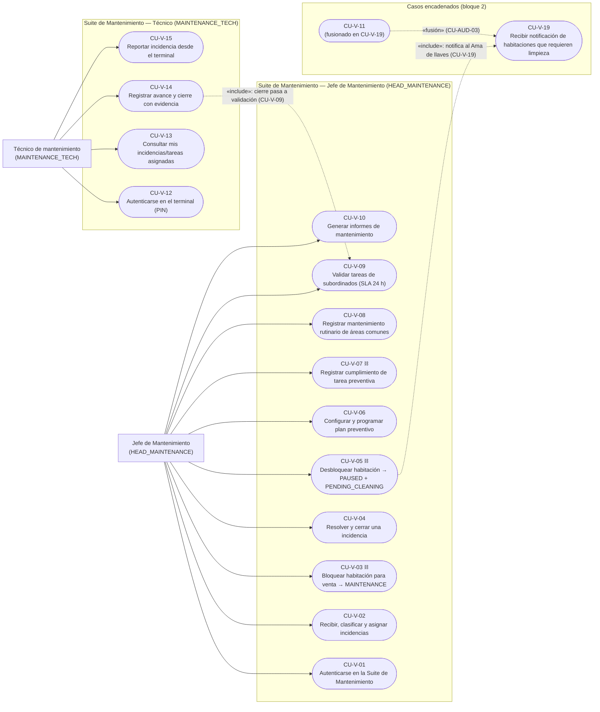
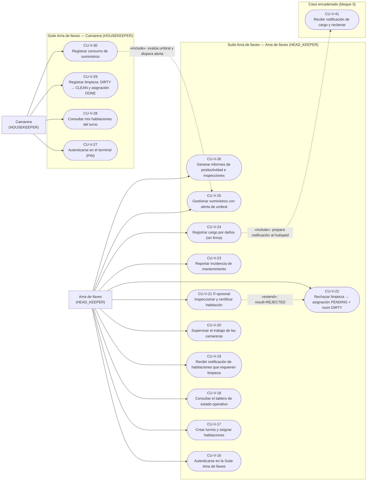
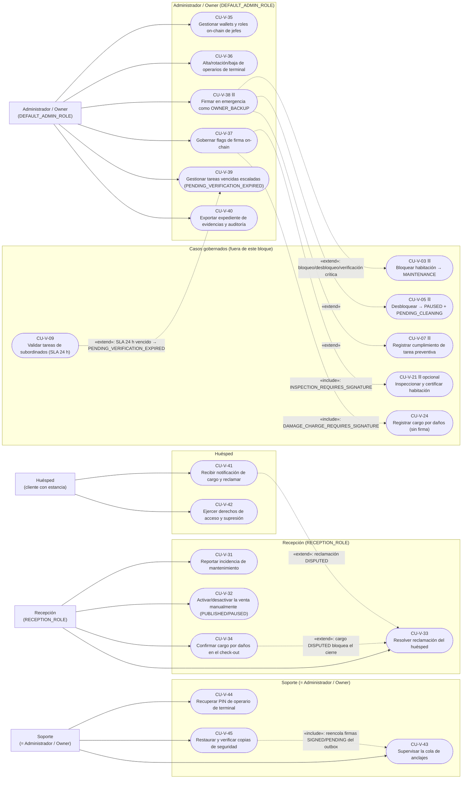

# Diagrama de casos de uso — Propuesta vNext

> **Tipo:** representación gráfica UML (Mermaid) del catálogo de casos de uso de Fase 2.
> **Fuente única:** `RepoTecnico/propuesta_vNext/casos_uso.md` (CU-V-01 … CU-V-45, actores y objetivos idénticos al §6 y al §18).
> **Diccionario de datos:** `RepoTecnico/propuesta_vNext/diccionario_datos.md` §3.14 y `RepoTecnico/propuesta_vNext/base_datos.sql` §12 (vocabulario canónico de estados).
> **Versión:** 1.1.0 · **Fecha:** 2026-10-06 (rev. vocabulario canónico, CU-AUD-01…CU-AUD-03).
>
> **Convenciones de lectura**
> - Nodo rectangular = **actor** (rol de plataforma entre paréntesis).
> - Nodo de esquinas redondeadas = **caso de uso**, rotulado `CU-V-XX` + objetivo literal del §18.
> - Flecha continua `-->` = **asociación** actor → caso de uso.
> - Flecha discontinua `-.->` = relación UML **«include»**, **«extend»** o **«fusión»**, rotulada.
> - La firma on-chain obligatoria (CU-V-03, CU-V-05, CU-V-07, CU-V-38) se marca con el icono ⛓ en la etiqueta; la inspección (CU-V-21) es opcional (D-C23) y el cargo por daños (CU-V-24) no se firma (D-C27).
> - **CU-V-11 está fusionado en CU-V-19** (CU-AUD-03): se conserva el número como nodo de referencia «fusionado», sin actor asociado.
>
> **Vocabulario canónico usado en las etiquetas** (diccionario §3.14): `rooms.publication_status` = `DRAFT`, `PUBLISHED`, `PAUSED`, `MAINTENANCE`, `OUT_OF_SERVICE`; `rooms.operational_status` = `CLEAN`, `DIRTY`, `OCCUPIED`, `PENDING_CLEANING`, `IN_INSPECTION`; `housekeeping_assignments.status` = `PENDING`, `IN_PROGRESS`, `DONE`; `preventive_tasks.validation_status` = `PENDING_VERIFICATION`, `VALIDATED`, `PENDING_VERIFICATION_EXPIRED`. No se usan `AVAILABLE`, `CLEANING`, `LIMPIA`, `SUCIA` ni `VERIFIED`.
>
> Por volumen (45 identificadores CU-V, 8 actores), el modelo se divide en **3 bloques coherentes**: Mantenimiento, Ama de llaves y Transversales/Seguridad.

---

## 1. Bloque Mantenimiento — Jefe de Mantenimiento y Técnico

**Nota.** Representa la **Suite de Mantenimiento** (CU-V-01 … CU-V-15). El Jefe de Mantenimiento concentra las acciones con firma on-chain obligatoria (`CU-V-03` bloqueo → `publication_status='MAINTENANCE'`; `CU-V-05` desbloqueo → `publication_status='PAUSED'` + `operational_status='PENDING_CLEANING'`, nunca `PUBLISHED`; `CU-V-07` tareas preventivas de áreas críticas → `validation_status='VALIDATED'`), mientras el Técnico opera en el terminal con PIN y sin wallet. Los `«include»` reflejan pasos del flujo principal documentados (CU-V-05 paso 7 → CU-V-19; CU-V-14 → validación CU-V-09). **CU-V-11 está fusionado en CU-V-19** (CU-AUD-03): no tiene actor propio y se muestra solo como referencia de fusión. El escalado por SLA vencido (CU-V-09 → CU-V-39) y la firma de emergencia (CU-V-38) cruzan a suites y se muestran en el bloque 3.

---

## 2. Bloque Ama de llaves — Ama de llaves y Camarera

**Nota.** Representa la **Suite Ama de llaves** (CU-V-16 … CU-V-30). El Ama de llaves gobierna turnos, supervisión, inspección y cargos; la Camarera opera en terminal fijo con PIN (sin wallet, asignación `PENDING → IN_PROGRESS → DONE` y habitación `DIRTY → CLEAN`). La inspección (`CU-V-21`) solo exige firma on-chain si `INSPECTION_REQUIRES_SIGNATURE = TRUE` (D-C23) y, en ningún caso, libera la venta (D-C9/D-C15): `publication_status` permanece `PAUSED`. El `«extend»` cubre el rechazo de limpieza (`result=REJECTED` → CU-V-22, asignación devuelta a `PENDING` y habitación a `DIRTY`) y el `«include»` el encadenado consumo → alerta de suministros (`supply_alerts.status='OPEN'`). La notificación al huésped por daños se completa con CU-V-41 (nodo externo del bloque 3). Las notificaciones de limpieza entrantes provienen de CU-V-19 (que absorbe CU-V-11) y del check-out (`OCCUPIED` → `PENDING_CLEANING`).

---

## 3. Bloque Transversal / Seguridad — Recepción, Administrador/Owner, Huésped y Soporte

**Nota.** Representa los actores transversales y de seguridad (CU-V-31 … CU-V-45). Recepción **no firma on-chain** (D-C37) y es quien activa manualmente la venta (`CU-V-32`, `publication_status='PUBLISHED'`; al desactivar `'PAUSED'`), rechazando con HTTP 409 `RoomBlockedByMaintenance` si la habitación está en `MAINTENANCE` (CU-AUD-10). El Administrador/Owner gobierna wallets, operarios, flags y el respaldo de emergencia `OWNER_BACKUP` (CU-V-38); el Huésped recibe el cargo y ejerce derechos (CU-V-41/CU-V-42), con resolución en Recepción vía `RESOLVED_ACCEPTED`/`RESOLVED_REJECTED` (CU-V-33); el Soporte vigila la cola de anclajes y la continuidad (CU-V-43/CU-V-44/CU-V-45). El subgrafo «Casos gobernados» reutiliza nodos externos para expresar, sin cruzar diagramas, las extensiones `«extend»`/`«include»` documentadas: emergencia sobre CU-V-03/05/07, escalado del SLA de CU-V-09 hacia CU-V-39 y gobierno de flags (CU-V-37) sobre CU-V-21 y CU-V-24.

---

## 4. Resumen de actores y cobertura

| Actor (rol de plataforma) | Wallet | Casos de uso | Bloque |
|---|---|---|---|
| Jefe de Mantenimiento (`HEAD_MAINTENANCE`) | Sí (`HEAD_MAINTENANCE_ROLE`) | CU-V-01 … CU-V-10 (CU-V-11 fusionado en CU-V-19) | 1 |
| Técnico de mantenimiento (`MAINTENANCE_TECH`) | No | CU-V-12 … CU-V-15 | 1 |
| Ama de llaves (`HEAD_KEEPER`) | Sí (`HEAD_KEEPER_ROLE`), solo inspección opcional | CU-V-16 … CU-V-26 | 2 |
| Camarera (`HOUSEKEEPER`) | No | CU-V-27 … CU-V-30 | 2 |
| Recepción (`RECEPTION_ROLE`) | No (D-C37) | CU-V-31 … CU-V-34 | 3 |
| Administrador / Owner (`DEFAULT_ADMIN_ROLE`) | Sí (`OWNER_BACKUP`) | CU-V-35 … CU-V-40 | 3 |
| Huésped | No | CU-V-41, CU-V-42 | 3 |
| Soporte (= Administrador) (`DEFAULT_ADMIN_ROLE`) | Sí | CU-V-43 … CU-V-45 | 3 |

**Cobertura:** 8 actores y **45 identificadores CU-V** (CU-V-01 … CU-V-45) representados; **CU-V-11 fusionado en CU-V-19** (CU-AUD-03), por lo que no tiene actor ni flujo propio. No se añade ningún caso que no figure en `casos_uso.md`.

*Diagrama de casos de uso vNext · Fase 2 · @asistenteProyecto · 2026-10-06 (rev. 1.1.0, vocabulario canónico).*
