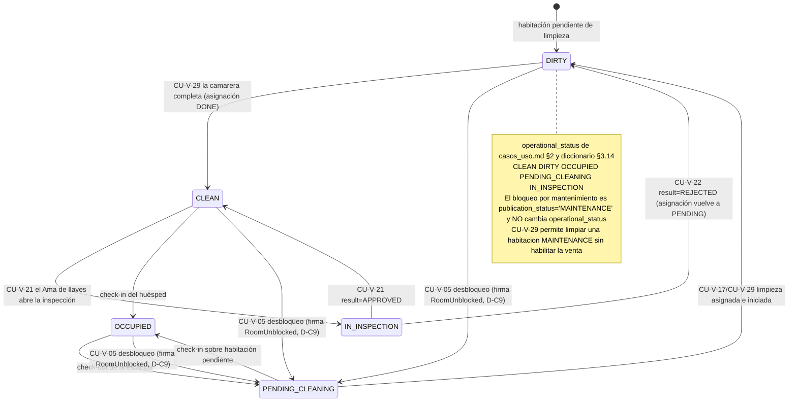
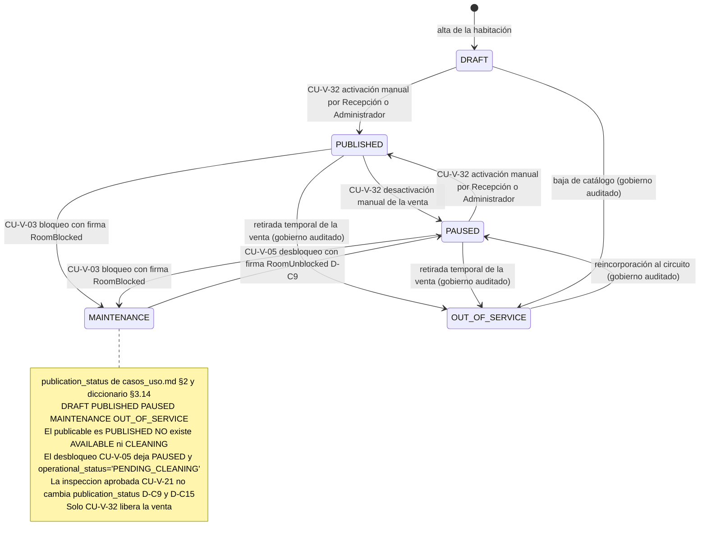
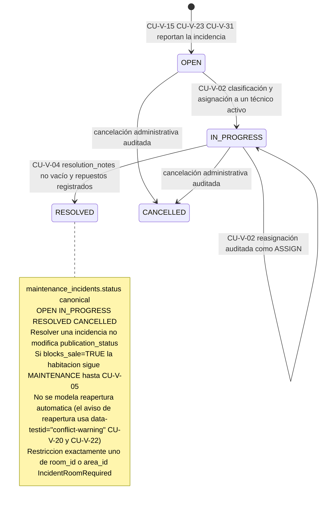
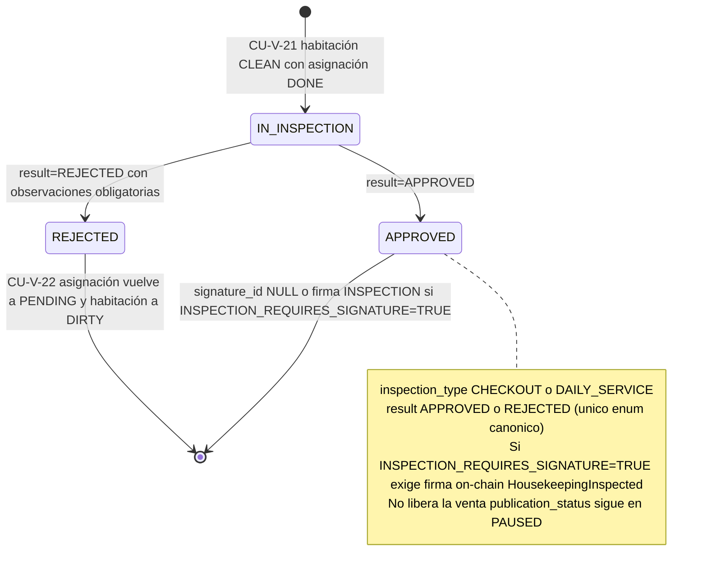
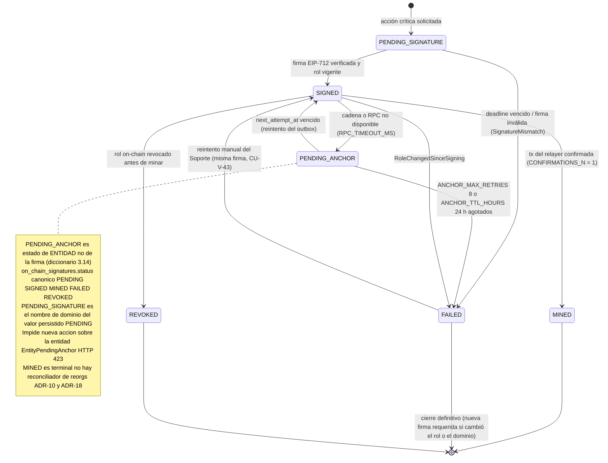
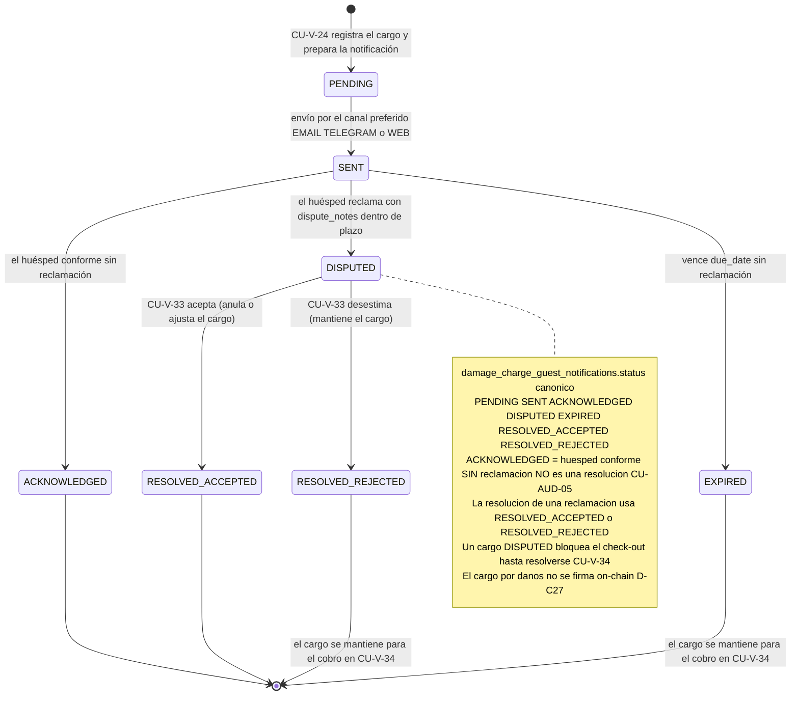

# Diagramas de estado — Propuesta vNext

> **Tipo:** máquinas de estados UML (Mermaid `stateDiagram-v2`) de las entidades con ciclo de vida relevante.
> **Fuente única:** `RepoTecnico/propuesta_vNext/casos_uso.md` (§2 constantes `ROOM_STATES`/`SIGN_STATUS`/`NOTIF_STATUS`; §4 estados canónicos; flujos de CU-V-03, CU-V-05, CU-V-07, CU-V-09, CU-V-21, CU-V-22, CU-V-29, CU-V-32, CU-V-41, CU-V-43).
> **Diccionario de datos:** `RepoTecnico/propuesta_vNext/diccionario_datos.md` §3.14 y `RepoTecnico/propuesta_vNext/base_datos.sql` §12 (restricciones `CHECK` = fuente de verdad).
> **Arquitectura:** `RepoTecnico/propuesta_vNext/documento_tecnico.md` Rev. 1.1.0 §2.5 (máquina de firma) y ADR-18 (sin reconciliador de reorgs).
> **Versión:** 1.1.0 · **Fecha:** 2026-10-06 (rev. vocabulario canónico).
>
> **Convenciones**
> - Los nombres de estado son **literales canónicos** de los enums del diccionario §3.14 y `base_datos.sql` §12: `DRAFT`, `PUBLISHED`, `PAUSED`, `MAINTENANCE`, `OUT_OF_SERVICE`; `CLEAN`, `DIRTY`, `OCCUPIED`, `PENDING_CLEANING`, `IN_INSPECTION`; `OPEN`, `IN_PROGRESS`, `RESOLVED`, `CANCELLED`; `PENDING`, `IN_PROGRESS`, `DONE`; `PENDING_VERIFICATION`, `VALIDATED`, `PENDING_VERIFICATION_EXPIRED`; `APPROVED`, `REJECTED`; `PENDING_SIGNATURE` (persistido `PENDING`), `SIGNED`, `MINED`, `FAILED`, `REVOKED`, marcador de entidad `PENDING_ANCHOR`; `PENDING`, `SENT`, `ACKNOWLEDGED`, `DISPUTED`, `EXPIRED`, `RESOLVED_ACCEPTED`, `RESOLVED_REJECTED`.
> - **No se usan** los valores obsoletos `AVAILABLE`, `CLEANING`, `LIMPIA`, `SUCIA`, `EN_LIMPIEZA`, `OCUPADA`, `BLOQUEADA_MANTENIMIENTO`, `VERIFIED` ni `COMPLETED` (CU-AUD-01/CU-AUD-02).
> - Cada transición cita el caso de uso y, cuando existe, el evento o error canónico que la dispara.

---

## 1. Habitación — estado operativo (`rooms.operational_status`)

**Nota.** Ciclo de vida operativo de la habitación con los **cinco** estados canónicos (`CLEAN`, `DIRTY`, `OCCUPIED`, `PENDING_CLEANING`, `IN_INSPECTION`): no existe `BLOQUEADA_MANTENIMIENTO` (el bloqueo vive en `publication_status`). La camarera registra `DIRTY → CLEAN` con asignación `PENDING → IN_PROGRESS → DONE` (CU-V-29); la inspección mueve entre `CLEAN`, `IN_INSPECTION` y `DIRTY` (CU-V-21/CU-V-22); el check-out lleva a `PENDING_CLEANING` y el desbloqueo de mantenimiento (CU-V-05) fija también `PENDING_CLEANING` sin modificar `publication_status`.

---

## 2. Habitación — estado de publicación (`rooms.publication_status`)

**Nota.** `publication_status` gobierna la visibilidad en el catálogo con los **cinco** estados canónicos (`DRAFT`, `PUBLISHED`, `PAUSED`, `MAINTENANCE`, `OUT_OF_SERVICE`); **no existe `AVAILABLE` ni `CLEANING`**. El bloqueo de mantenimiento (CU-V-03) lleva a `MAINTENANCE` y el desbloqueo (CU-V-05) deja `PAUSED` + `operational_status='PENDING_CLEANING'`, **nunca** `PUBLISHED` automáticamente (D-C9); la activación de la venta es una acción manual de Recepción/Administrador (CU-V-32) que fija `PUBLISHED`. Ni el desbloqueo ni la inspección aprobada habilitan la venta por sí mismos.

---

## 3. Incidencia de mantenimiento (`maintenance_incidents.status`)

**Nota.** Estados `OPEN`, `IN_PROGRESS`, `RESOLVED` y `CANCELLED` del diccionario §3.14. La clasificación/asignación (`CU-V-02`) pasa a `IN_PROGRESS` y audita `ASSIGN`; el cierre (`CU-V-04`) exige `resolution_notes`, mantiene `publication_status='MAINTENANCE'` cuando `blocks_sale = TRUE` y **no** libera la venta (eso es CU-V-05). No existe reapertura automática: el aviso de reapertura se marca con `data-testid="conflict-warning"` (CU-V-20/CU-V-22) y queda auditado.

---

## 4. Inspección de limpieza (`housekeeping_inspections.result`)

**Nota.** La inspección parte de una habitación `CLEAN` con asignación `DONE`. `result='APPROVED'` actualiza `rooms.last_inspection_result` y certifica la limpieza, con firma on-chain **solo** si `INSPECTION_REQUIRES_SIGNATURE = TRUE` (D-C23); `result='REJECTED'` exige observaciones y devuelve la asignación a `PENDING` (`housekeeping_assignments.status` ∈ {`PENDING`, `IN_PROGRESS`, `DONE`}, no existe `REJECTED`) dejando la habitación en `DIRTY` (CU-V-22). En ningún caso cambia `publication_status`, que permanece `PAUSED` (D-C9/D-C15).

---

## 5. Firma on-chain (`on_chain_signatures.status` y marcador de entidad `PENDING_ANCHOR`)

**Nota.** Máquina de la firma on-chain: `PENDING_SIGNATURE` (persistido `PENDING`) → `SIGNED` → `MINED`, con desvíos a `FAILED` (`SignatureMismatch`, `RoleChangedSinceSigning`, agotamiento de reintentos) y a `REVOKED` (rol revocado antes de minar). El marcador `PENDING_ANCHOR` es **estado de entidad**, no de la firma: refleja que la entidad tiene una firma `SIGNED` en cola de anclaje, impide una nueva acción sobre la misma entidad (`EntityPendingAnchor`, HTTP 423) y se resuelve en `MINED` o `FAILED` sin revertir nunca el estado off-chain (D-C18/D-C34). `MINED` es terminal (ADR-18, sin reconciliador de reorgs); el outbox transaccional reintenta con `ANCHOR_BACKOFF` y el Soporte admite reintento manual desde `FAILED` (CU-V-43).

---

## 6. Notificación de cargo por daños al huésped (`damage_charge_guest_notifications.status`)

**Nota.** Ciclo de la notificación al huésped por un cargo por daños (vocabulario canónico §3.14). El plazo lo fija `DAMAGE_CLAIM_WINDOW_H`; el huésped puede quedar conforme sin reclamación (`ACKNOWLEDGED`, **no** es una resolución) o reclamar dentro de plazo (`DISPUTED`). Recepción resuelve con `RESOLVED_ACCEPTED` (anula/ajusta el cargo) o `RESOLVED_REJECTED` (mantiene el cargo) y fija `resolved_by`/`resolved_at` (CU-V-33); el vencimiento sin reclamación marca `EXPIRED` y deja el cargo listo para el cobro en el check-out (CU-V-34). El cargo nunca se firma on-chain (D-C27).

---

*Diagramas de estado vNext · Fase 2 · @asistenteProyecto · 2026-10-06 (rev. 1.1.0, vocabulario canónico).*
