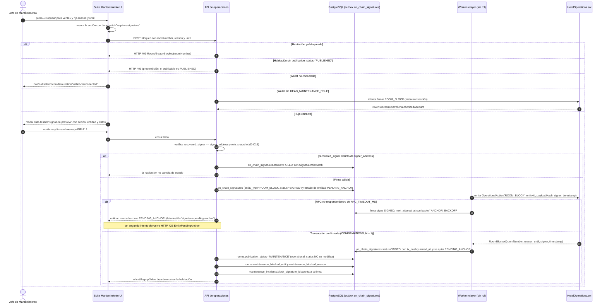
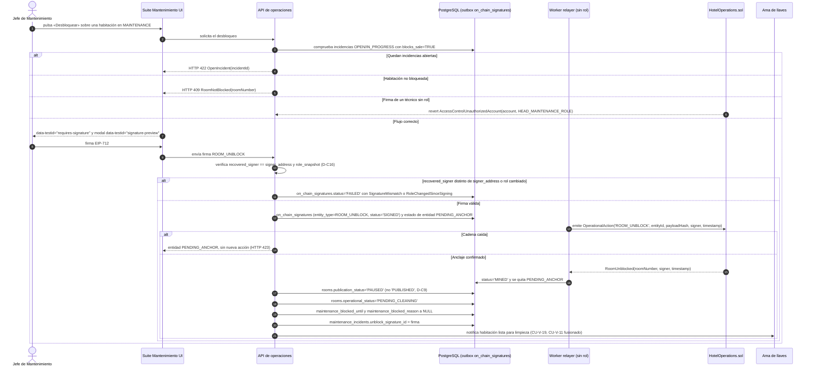
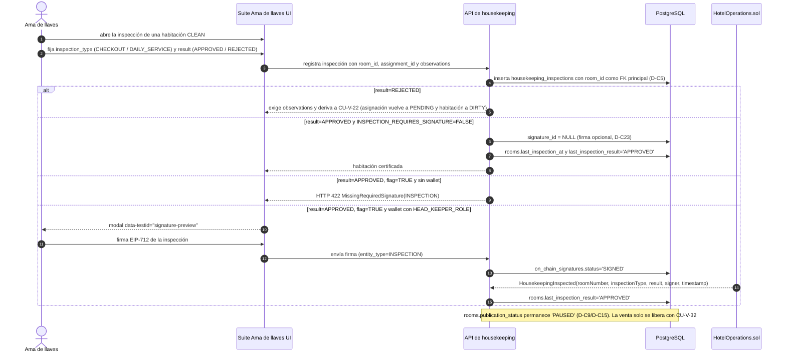
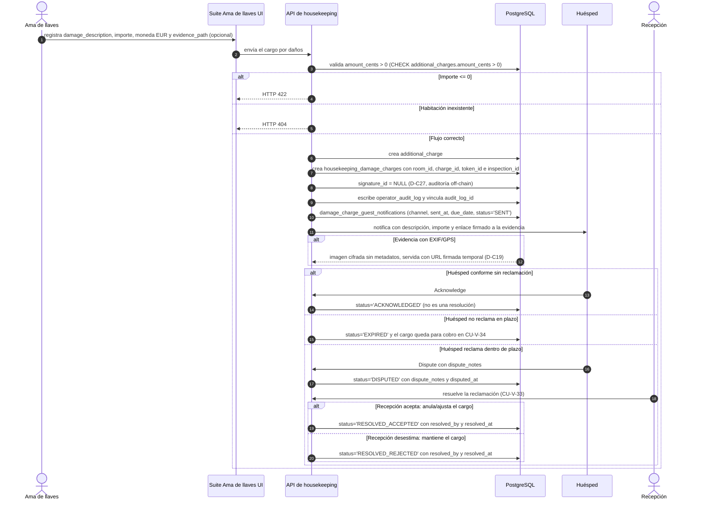
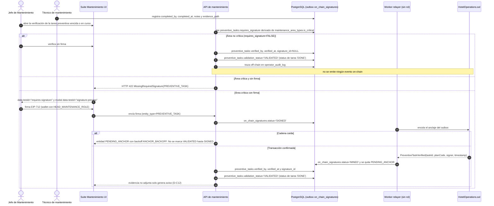
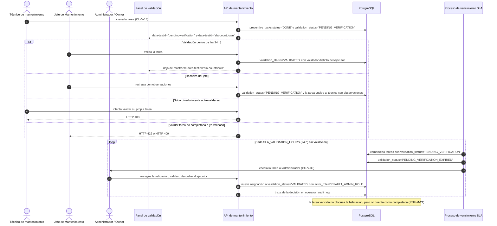
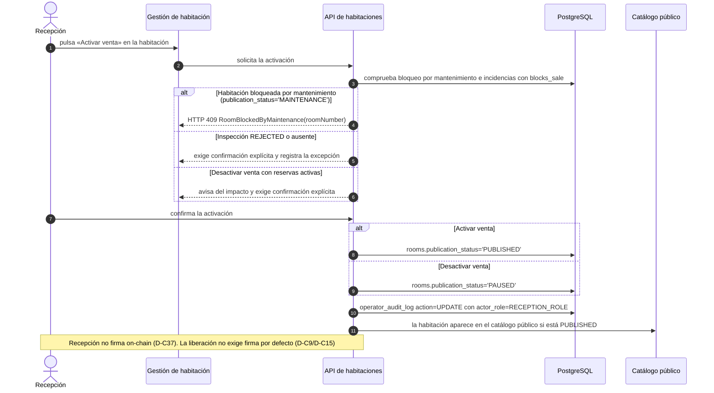
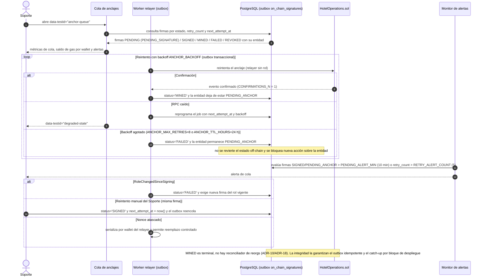

# Diagramas de secuencia — Propuesta vNext

> **Tipo:** diagramas de secuencia UML (Mermaid) de los flujos principales de los casos clave.
> **Fuente única:** `RepoTecnico/propuesta_vNext/casos_uso.md` (flujo principal, flujos alternativos y restricciones EARS de cada CU; vocabulario canónico §2/§4 y CU-AUD-01…CU-AUD-20).
> **Diccionario de datos:** `RepoTecnico/propuesta_vNext/diccionario_datos.md` §3.14 y `RepoTecnico/propuesta_vNext/base_datos.sql` §12 (vocabulario canónico de estados).
> **Arquitectura:** `RepoTecnico/propuesta_vNext/documento_tecnico.md` Rev. 1.1.0 (meta-transacción/relayer, `signer = recovered_signer`, **outbox transaccional PostgreSQL**, ADR-18 sin reconciliador de reorgs).
> **Versión:** 1.1.0 · **Fecha:** 2026-10-06 (rev. vocabulario canónico).
>
> **Convenciones**
> - Actores con los nombres literales del §6 de `casos_uso.md`.
> - Mensajes síncronos `->>`, respuestas `-->>`; `alt`/`else` para flujos alternativos y `opt`/`loop` para tramos opcionales o repetitivos.
> - **Vocabulario canónico** (diccionario §3.14): `rooms.publication_status` ∈ {`DRAFT`, `PUBLISHED`, `PAUSED`, `MAINTENANCE`, `OUT_OF_SERVICE`}; `rooms.operational_status` ∈ {`CLEAN`, `DIRTY`, `OCCUPIED`, `PENDING_CLEANING`, `IN_INSPECTION`}; `on_chain_signatures.status` ∈ {`PENDING`, `SIGNED`, `MINED`, `FAILED`, `REVOKED`}; `preventive_tasks.validation_status` ∈ {`PENDING_VERIFICATION`, `VALIDATED`, `PENDING_VERIFICATION_EXPIRED`}; `housekeeping_assignments.status` ∈ {`PENDING`, `IN_PROGRESS`, `DONE`}; `damage_charge_guest_notifications.status` ∈ {`PENDING`, `SENT`, `ACKNOWLEDGED`, `DISPUTED`, `EXPIRED`, `RESOLVED_ACCEPTED`, `RESOLVED_REJECTED`}.
> - **No se usan** los valores obsoletos `AVAILABLE`, `CLEANING`, `LIMPIA`, `SUCIA`, `BLOQUEADA_MANTENIMIENTO`, `VERIFIED` ni `COMPLETED`. El bloqueo por mantenimiento es `publication_status='MAINTENANCE'`; el desbloqueo deja `publication_status='PAUSED'` + `operational_status='PENDING_CLEANING'`; Recepción activa la venta con `publication_status='PUBLISHED'` (CU-V-32).

---

## 1. CU-V-03 — Bloqueo de habitación para venta con firma on-chain (obligatoria)

**Nota.** Bloqueo de habitación: la firma on-chain es **obligatoria** (`MAINTENANCE_BLOCK_REQUIRES_SIGNATURE = true`, D-C34) y se verifica criptográficamente EIP-712 antes de persistir (D-C16). La precondición es `publication_status='PUBLISHED'` (CU-AUD-01). El único cambio de estado es `rooms.publication_status='MAINTENANCE'`: el `operational_status` **no** se modifica por el bloqueo (no existe `BLOQUEADA_MANTENIMIENTO`). La firma recorre `PENDING_SIGNATURE` (persistido `PENDING`) → `SIGNED` → `MINED`/`FAILED`, y el marcador **de entidad** `PENDING_ANCHOR` impide una nueva acción (HTTP 423 `EntityPendingAnchor`); la evidencia no adjunta solo avisa (D-C12).

---

## 2. CU-V-05 — Desbloqueo de habitación tras verificación (obligatoria)

**Nota.** El desbloqueo exige firma on-chain con `HEAD_MAINTENANCE_ROLE`, verifica EIP-712 (CU-AUD-19) y deja la habitación en `publication_status='PAUSED'` + `operational_status='PENDING_CLEANING'`, **nunca** en `PUBLISHED` (D-C9): la venta la activa Recepción/Admin de forma manual (CU-V-32). Si quedan incidencias abiertas que bloquean venta, se rechaza con `OpenIncident`; la aprobación posterior de la inspección tampoco libera la venta (D-C15). La notificación al Ama de llaves corresponde a CU-V-19 (CU-V-11 queda fusionado, CU-AUD-03).

---

## 3. CU-V-21 — Inspección de limpieza y certificación (firma opcional)

**Nota.** La inspección parte de una habitación `CLEAN` con asignación `DONE` y es **opcional** en firma (`INSPECTION_REQUIRES_SIGNATURE`, D-C23). Un resultado `REJECTED` no certifica y encadena a CU-V-22 (asignación a `PENDING`, habitación a `DIRTY`); un `APPROVED` actualiza `last_inspection_result` pero **no** libera la venta: `publication_status` permanece en `PAUSED` hasta la activación manual de Recepción/Admin (`PUBLISHED`).

---

## 4. CU-V-24 + CU-V-41 — Registro del cargo por daños y notificación al huésped (sin firma on-chain)

**Nota.** El cargo por daños **no se firma on-chain** (`DAMAGE_CHARGE_REQUIRES_SIGNATURE = false`, D-C27): se audita off-chain en `operator_audit_log`. El cargo se vincula al `token_id` de la noche vendida cuando existe (D-C4) y siempre dispara la notificación al huésped (`damage_charge_guest_notifications`) con plazo de reclamación `DAMAGE_CLAIM_WINDOW_H`. `ACKNOWLEDGED` significa «huésped conforme sin reclamación» (CU-AUD-05); la resolución de una reclamación usa `RESOLVED_ACCEPTED`/`RESOLVED_REJECTED`, nunca `ACKNOWLEDGED`.

---

## 5. CU-V-07 — Tarea preventiva de área crítica (firma obligatoria)

**Nota.** En áreas críticas (`POOL_FILTER`, `WATER_PUMP`, `ELEVATOR`, `ELECTRIC_GENERATOR`; D-C20/D-C34) la verificación exige firma on-chain con `HEAD_MAINTENANCE_ROLE` y emite `PreventiveTaskVerified`. La validación del jefe se modela con `preventive_tasks.validation_status='VALIDATED'` (`PENDING_VERIFICATION` → `VALIDATED`/`PENDING_VERIFICATION_EXPIRED`), **no** con un `status='VERIFIED'` inexistente: `status` solo admite `PENDING`/`DONE`/`SKIPPED`. La firma se deriva de `maintenance_area_types.is_critical` como única fuente de verdad (CU-V-06).

---

## 6. CU-V-09 + CU-V-39 — Validación de tarea de subordinado con SLA de 24 h

**Nota.** El SLA de validación es de 24 h (`SLA_VALIDATION_HOURS`, D-C38/RNF-M-21). Vencido, la tarea pasa a `validation_status='PENDING_VERIFICATION_EXPIRED'` y se escala al Administrador (CU-V-39); la tarea vencida **no** bloquea la habitación, pero no computa como completada, y la validación siempre la realiza un jefe distinto del ejecutor. `preventive_tasks.status` se mantiene en `DONE` mientras `validation_status` recorre `PENDING_VERIFICATION` → `VALIDATED`/`PENDING_VERIFICATION_EXPIRED`.

---

## 7. CU-V-32 — Activación manual de la venta por Recepción (sin firma)

**Nota.** La venta **solo** se libera con una acción manual de Recepción o del Administrador (CU-V-32, D-C9): ni el desbloqueo de mantenimiento (CU-V-05) ni la inspección aprobada (CU-V-21) la activan. Al activar, `publication_status='PUBLISHED'` (el publicable es `PUBLISHED`, no `AVAILABLE`); al desactivar, `'PAUSED'`. Si la habitación está bloqueada por mantenimiento se rechaza con el error propio `RoomBlockedByMaintenance` (CU-AUD-10), distinto de `RoomAlreadyBlocked`. Recepción no dispone de capacidad de firma on-chain (D-C37) y toda activación/desactivación queda auditada.

---

## 8. CU-V-43 — Supervisión de la cola de anclajes y firmas pendientes

**Nota.** El Soporte (mismo rol que Administrador/Owner) vigila la cola de anclajes: `data-testid="anchor-queue"` con estados, reintentos y alertas. La cola es un **outbox transaccional PostgreSQL** (`on_chain_signatures` como fuente de verdad) y el relayer no tiene rol on-chain. El anclaje usa backoff `ANCHOR_BACKOFF` hasta `ANCHOR_MAX_RETRIES` (8) con TTL `ANCHOR_TTL_HOURS` (24 h); agotado, la firma pasa a `FAILED` y la entidad queda `PENDING_ANCHOR` sin revertir el estado off-chain. `PENDING_SIGNATURE` es el nombre de dominio del valor persistido `PENDING`; `MINED` es terminal y **no** hay transición por reorg (ADR-18), por lo que la integridad se apoya en el outbox idempotente y el catch-up por bloque.

---

*Diagramas de secuencia vNext · Fase 2 · @asistenteProyecto · 2026-10-06 (rev. 1.1.0, vocabulario canónico).*
