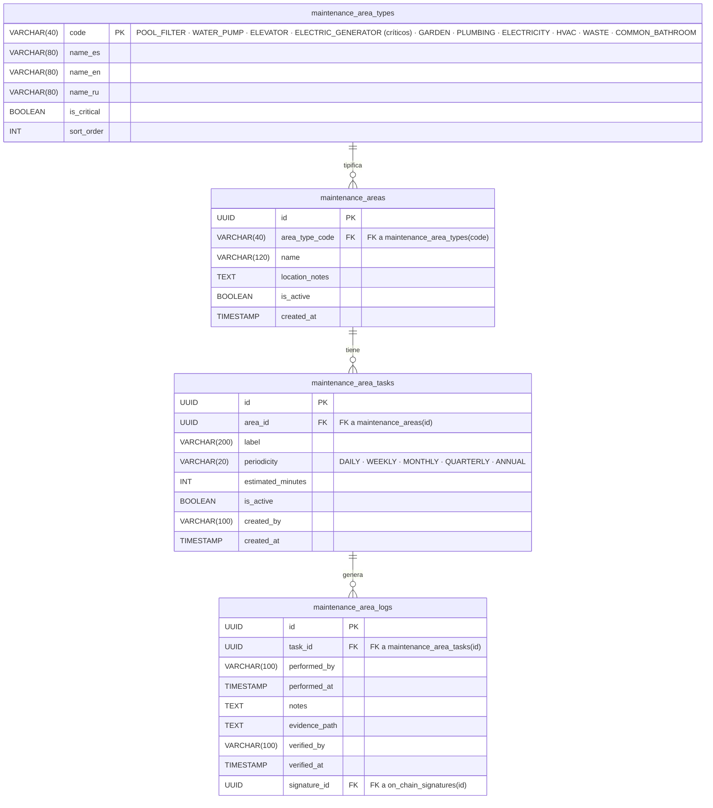
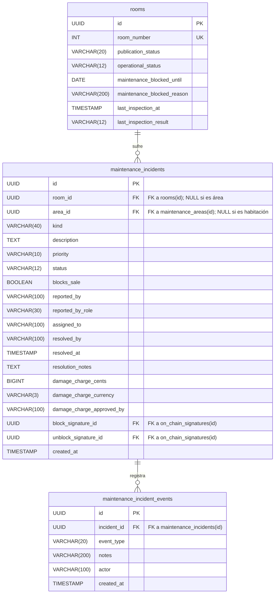
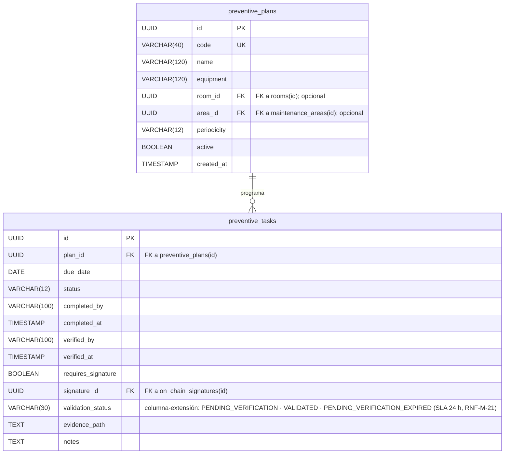
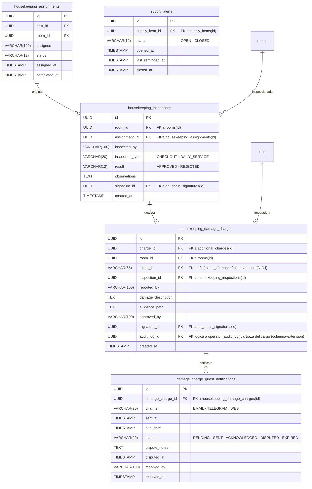

# Diagrama entidad-relación — Propuesta vNext (Mantenimiento + Ama de llaves)

> **Alcance:** modela solo las **extensiones y nuevas entidades** de la propuesta vNext.  
> **Base:** se integra con las tablas existentes del proyecto (`rooms`, `admin_users`, `additional_charges`, `housekeeping_assignments`, `maintenance_incidents`, `preventive_plans`, `preventive_tasks`).  
> **Sincronizado con:** `RepoTecnico/propuesta_vNext/diccionario_datos.md` y `RepoTecnico/propuesta_vNext/base_datos.sql`.  
> **Fecha:** 2026-10-06.

---

## 1. Roles, wallets y firmas on-chain

```mermaid
erDiagram
    admin_users {
        UUID id PK
        VARCHAR(100) username UK
        TEXT password_hash
        TEXT totp_secret_enc
        VARCHAR(30) role "DEFAULT_ADMIN_ROLE · RECEPTION_ROLE · HEAD_MAINTENANCE · HEAD_KEEPER · MAINTENANCE_TECH · HOUSEKEEPING"
        BOOLEAN active
        TIMESTAMP created_at
        TIMESTAMP updated_at
    }

    terminal_operators {
        UUID id PK
        VARCHAR(100) username UK "Identificador en terminal fijo"
        VARCHAR(100) full_name
        VARCHAR(30) role "MAINTENANCE_TECH · HOUSEKEEPER"
        TEXT pin_hash "bcrypt del PIN corto"
        TIMESTAMP pin_changed_at "Rotación cada 90 días"
        BOOLEAN must_change_pin "PIN de un solo uso inicial"
        INT failed_attempts "Bloqueo a los 5 fallos"
        TIMESTAMP locked_until "Bloqueo temporal"
        BOOLEAN active
        VARCHAR(100) created_by
        TIMESTAMP created_at
        TIMESTAMP updated_at
    }

    operator_wallets {
        UUID id PK
        UUID admin_user_id FK "FK a admin_users(id)"
        VARCHAR(100) username UK"
        VARCHAR(30) role "HEAD_MAINTENANCE · HEAD_KEEPER · OWNER_BACKUP"
        VARCHAR(42) wallet_address UK
        BOOLEAN is_active
        VARCHAR(100) assigned_by
        TIMESTAMP assigned_at
        TIMESTAMP revoked_at
        VARCHAR(30) backup_for_role "Si es OWNER_BACKUP"
    }

    on_chain_signatures {
        UUID id PK
        VARCHAR(40) entity_type "ROOM_BLOCK · ROOM_UNBLOCK · INSPECTION · DAMAGE_CHARGE · PREVENTIVE_TASK · AREA_LOG · CONFIG"
        UUID entity_id
        VARCHAR(60) event_name
        VARCHAR(66) content_hash
        TEXT signature
        VARCHAR(42) signer_address
        VARCHAR(66) tx_hash
        VARCHAR(20) status "PENDING · SIGNED · MINED · FAILED · REVOKED"
        TEXT error_message
        VARCHAR(66) nonce "Nonce EIP-712"
        VARCHAR(66) domain_hash "Hash del dominio EIP-712"
        VARCHAR(42) recovered_signer "Dirección recuperada de la firma"
        TIMESTAMP verified_at "Momento de verificación criptográfica"
        VARCHAR(30) role_snapshot "Rol del firmante en el momento de firmar"
        INT retry_count "Reintentos de anclaje (máx. 8)"
        TIMESTAMP next_attempt_at "Backoff exponencial"
        TIMESTAMP expires_at "TTL en cola (24 h)"
        TIMESTAMP deadline "Caducidad de la firma"
        TIMESTAMP consumed_at "Consumo del nonce"
        TIMESTAMP created_at
        TIMESTAMP mined_at
    }

    operator_audit_log {
        UUID id PK
        VARCHAR(100) actor_username
        VARCHAR(30) actor_role
        VARCHAR(40) entity_type
        UUID entity_id
        VARCHAR(40) action "CREATE · UPDATE · DELETE · ASSIGN · RESOLVE · LOGIN"
        JSONB old_value
        JSONB new_value
        VARCHAR(100) terminal_id
        VARCHAR(66) prev_hash "Hash del registro anterior"
        VARCHAR(66) integrity_hash "keccak256 del registro + prev_hash"
        TIMESTAMP created_at
    }

    admin_users ||--o| operator_wallets : "posee"
    admin_users ||--o{ terminal_operators : "da de alta"
    on_chain_signatures ||--o| maintenance_incidents : "bloquea/desbloquea"
    on_chain_signatures ||--o| housekeeping_inspections : "certifica"
    on_chain_signatures ||--o| housekeeping_damage_charges : "aprueba cargo"
    on_chain_signatures ||--o| preventive_tasks : "verifica"
    on_chain_signatures ||--o| maintenance_area_logs : "verifica"
```

---

## 2. Áreas comunes y mantenimiento rutinario



---

## 3. Incidencias de mantenimiento extendidas



---

## 4. Preventivo de infraestructura extendido



---

## 5. Housekeeping e inspecciones



---

## 6. Relaciones con tablas existentes (resumen)

| Tabla vNext | Tabla existente | Relación |
|---|---|---|
| `operator_wallets` | `admin_users` | Lógica por `username` |
| `maintenance_incidents` | `rooms` | FK opcional `room_id` |
| `maintenance_incidents` | `maintenance_areas` | FK opcional `area_id` |
| `preventive_plans` | `rooms` | FK opcional `room_id` |
| `preventive_plans` | `maintenance_areas` | FK opcional `area_id` |
| `housekeeping_inspections` | `rooms` | FK `room_id` |
| `housekeeping_inspections` | `housekeeping_assignments` | FK opcional `assignment_id` |
| `housekeeping_damage_charges` | `additional_charges` | FK `charge_id` |
| `housekeeping_damage_charges` | `rooms` | FK `room_id` |
| `housekeeping_damage_charges` | `housekeeping_inspections` | FK opcional `inspection_id` |

---

*Diagrama ER vNext · @asistenteProyecto.*
