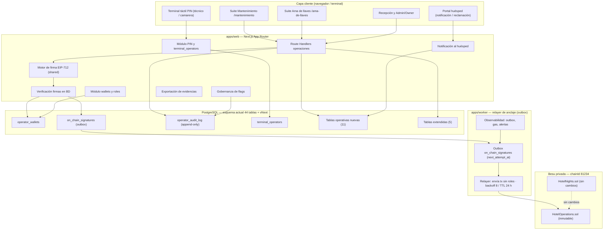
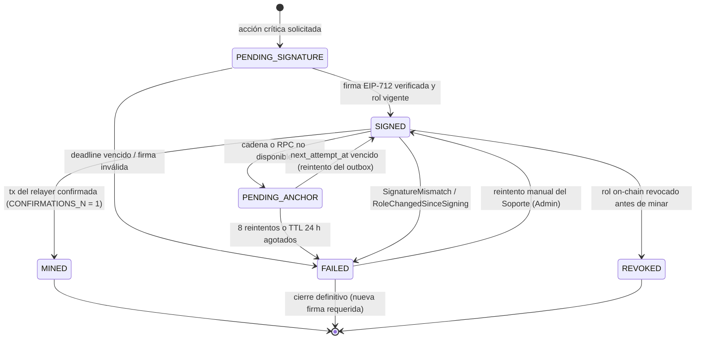
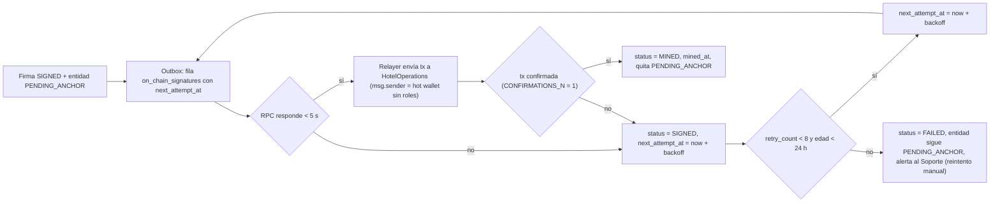
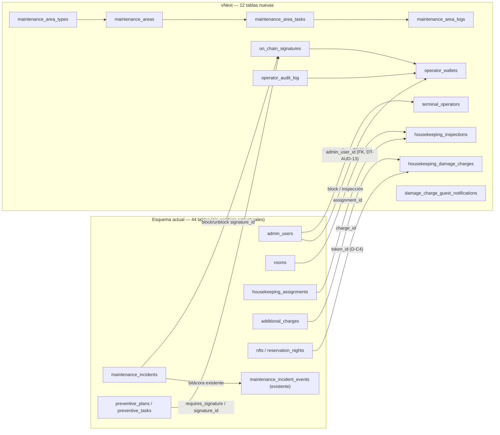
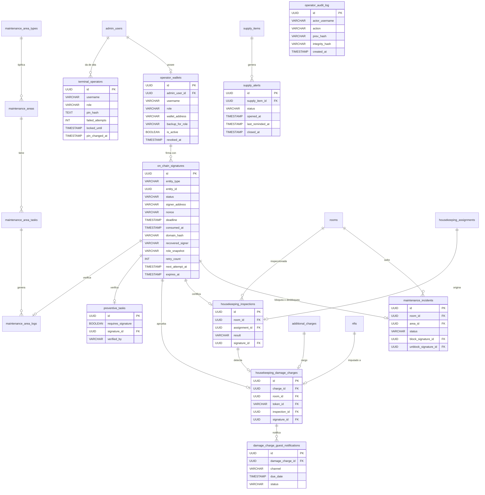

# Documento técnico — Propuesta vNext
## Suite de Mantenimiento + Suite Ama de llaves con firma on-chain selectiva

> **Tipo:** diseño técnico de Fase 2 sobre la propuesta vNext (no modifica el sistema actual).
> **Versión:** 1.1.0 · **Fecha:** 2026-10-07.
> **Revisión 1.1.0 (DT-AUD-01…DT-AUD-18):** resueltos 18 hallazgos de auditoría (2 críticos, 5 altos, 10 medios y 1 bajo). Cambios principales: modelo de **meta-transacción/relayer** con `signer = recovered_signer`, acción `CONFIG` y respaldo `OWNER_BACKUP` on-chain, `entityId` canónico con vector de prueba, cola como **outbox transaccional PostgreSQL**, eliminación del reconciliador de reorgs (coherencia con ADR-10) y runbook de migración/rollback. Detalle en [Registro de correcciones](#registro-de-correcciones).
> **Proyecto:** Hotel Marina del Sol — plataforma de noches NFT (Besu privada chainId 81234, Next.js, worker, MCP, PostgreSQL).
> **Estado:** listo para revisión del cliente y planificación de ciclos verticales.
>
> **Fuentes obligatorias (coherencia verificada):**
> - `RepoTecnico/propuesta_vNext/requerimientos.md` — RF-M-01…RF-M-12, RF-K-01…RF-K-10, RF-S-01…RF-S-08, RNF-M-01…RNF-M-21, D-C1…D-C42.
> - `RepoTecnico/propuesta_vNext/casos_uso.md` — 45 CU-V-01…CU-V-45, parámetros, eventos, errores y trazabilidad.
> - `RepoTecnico/propuesta_vNext/diccionario_datos.md` — 12 tablas nuevas y extensiones.
> - `RepoTecnico/propuesta_vNext/diagrama_er.md` — relaciones vNext.
> - `RepoTecnico/propuesta_vNext/entornos_globales.md` — variables, rutas y dependencias.
> - `RepoTecnico/propuesta_vNext/INFORME_AUDITORIA_VNEXT_V1.md` — 39 hallazgos resueltos (Anexo A).
> - `docs/DISENO-TECNICO.md` — arquitectura vigente, stack y ADR-01…ADR-17.
> - `RepoTecnico/estado_proyecto.md` §11 — decisiones del cliente (2026-10-06).

---

## Índice

1. [Visión general y alcance](#1-visión-general-y-alcance)
2. [Arquitectura propuesta](#2-arquitectura-propuesta)
3. [Contrato `HotelOperations.sol`](#3-contrato-hoteloperationssol)
4. [Flujo de firma EIP-712 y outbox de anclaje](#4-flujo-de-firma-eip-712-y-outbox-de-anclaje)
5. [Modelo de datos](#5-modelo-de-datos)
6. [Seguridad](#6-seguridad)
7. [Requisitos no funcionales](#7-requisitos-no-funcionales)
8. [Trazabilidad](#8-trazabilidad)
9. [Entornos, variables y despliegue previsto](#9-entornos-variables-y-despliegue-previsto)
10. [Riesgos técnicos y decisiones pendientes](#10-riesgos-técnicos-y-decisiones-pendientes)
11. [Plan de fases de implementación](#11-plan-de-fases-de-implementación)
- [Registro de correcciones](#registro-de-correcciones)
- [Anexo A — Glosario de decisiones D-C](#anexo-a--glosario-de-decisiones-d-c)
- [Anexo B — Coherencia con los artefactos fuente](#anexo-b--coherencia-con-los-artefactos-fuente)

---

## 1. Visión general y alcance

### 1.1 Objetivo

La vNext incorpora a la plataforma actual dos **suites operativas** dirigidas por **operadores de confianza con wallet** y una **firma on-chain selectiva**: solo los movimientos que afectan a disponibilidad comercial o a infraestructura crítica se anclan en la cadena; el resto permanece **off-chain auditado** (D-C21).

| Suite | Rol responsable | Wallet | Casos de uso |
|---|---|---|---|
| **Mantenimiento** | `HEAD_MAINTENANCE` (jefe) + `MAINTENANCE_TECH` (técnico, sin wallet) | `HEAD_MAINTENANCE_ROLE` | CU-V-01 … CU-V-15 |
| **Ama de llaves** | `HEAD_KEEPER` (ama) + `HOUSEKEEPER` (camarera, sin wallet) | `HEAD_KEEPER_ROLE` (solo inspección opcional) | CU-V-16 … CU-V-30 |

### 1.2 Alcance funcional (derivado de `requerimientos.md`)

**Suite de Mantenimiento (`HEAD_MAINTENANCE`):** recibir/clasificar incidencias (RF-M-01), asignarlas a técnicos (RF-M-02), **bloquear** (RF-M-03, firma obligatoria) y **desbloquear** habitaciones (RF-M-05, firma obligatoria), resolver incidencias con repuestos (RF-M-04, RF-M-10), gestionar planes preventivos de infraestructura (RF-M-06, RF-M-07), registrar cumplimiento de tareas con firma obligatoria en áreas críticas (RF-M-08, RF-S-05), mantenimiento rutinario de áreas comunes (RF-M-09) e informes (RF-M-11, RF-M-12, prioridad baja por D-C41).

**Suite Ama de llaves (`HEAD_KEEPER`):** turnos y asignaciones (RF-K-01), tablero de estados operativos (RF-K-02), notificaciones de limpieza (RF-K-03), supervisión de camareras (RF-K-04), **inspección post-limpieza** con firma on-chain **opcional** (RF-K-05, D-C23), rechazo de limpieza (RF-K-06), reporte de incidencias (RF-K-07), **cargo por daños** con auditoría off-chain y notificación al huésped (RF-K-08, RF-S-04, D-C27, D-C14), suministros con umbral (RF-K-09) e informes de productividad (RF-K-10, baja por D-C41).

**Transversal:** firma EIP-712 off-chain verificada criptográficamente (RF-S-01, D-C16, D-C42), trazabilidad de acciones off-chain (RF-S-06, RF-S-08), UX observable de firma (RF-S-07, D-C32) e integración con Recepción (D-C37) y Administrador/Owner (D-C24).

### 1.3 Regla de oro de la firma on-chain (D-C34, ajustada por D-C27 y DT-AUD-02)

> **Es obligatoria** en: (1) **bloqueo/desbloqueo de habitación** por mantenimiento (RF-M-03, RF-M-05, RF-S-02), (2) **verificación de tareas preventivas de áreas críticas** —`POOL_FILTER`, `WATER_PUMP`, `ELEVATOR`, `ELECTRIC_GENERATOR`— (D-C20, RF-S-05), (3) **firma de emergencia `OWNER_BACKUP`** (D-C6, D-C13) y (4) **cambio de configuración obligatoria** —flags que gobiernan firma obligatoria— mediante la acción `CONFIG` restringida a `DEFAULT_ADMIN_ROLE` (RNF-M-11, D-C22).
> **Es opcional** (flag) en la **inspección de limpieza** (D-C23) y en el registro rutinario de áreas comunes (`AREA_LOG`), que **no la exige** por D-C34.
> **No se firma on-chain** en cargos por daños (D-C27, auditoría off-chain), tickets, asignaciones, estados intermedios ni mantenimiento rutinario de áreas comunes.

> **Corrección (DT-AUD-02):** la versión 1.0.0 de este documento afirmaba «no se firma … configuración». Es **incorrecto**: la activación/desactivación de un flag obligatorio se firma on-chain como acción `CONFIG` y la operación de emergencia del Owner se firma con el rol de respaldo `OWNER_BACKUP` (ver §3.2, §3.4, §6.3, §8.1).

### 1.4 Fuera de alcance de esta fase

- No se modifica `HotelNights.sol` (D-V1, D-C23) ni el esquema de 44 tablas vigente.
- No se implementa código, migraciones ni despliegues en esta fase; el documento describe el diseño y el plan (D-C7).
- No se implementa el registro de viajeros (RNF-M-19 lo declara no aplicable en la vNext).
- No se exige WCAG formal (D-C28, riesgo aceptado).

---

## 2. Arquitectura propuesta

### 2.1 Principios de diseño

| Principio | Decisión | Consecuencia técnica |
|---|---|---|
| Los **jefes firman**, los subordinados **ejecutan** | D-C1, D-C2, D-V3 | Dos roles on-chain separados; técnicos/camareras con PIN, sin wallet |
| La **firma es off-chain EIP-712 verificada en BD** antes de anclar | D-C16 | Se recupera `recovered_signer`, se valida `domain_hash` y `role_snapshot` antes de `SIGNED` |
| El **estado crítico en BD solo cambia con firma `SIGNED`** | RNF-M-14, D-V4, D-V7 | La cadena es la prueba; la BD la referencia |
| **Meta-transacción/relayer:** el worker envía la tx, pero firma y rol son del jefe | DT-AUD-01, D-C16 | El contrato verifica EIP-712 y emite `signer = recovered_signer`; la hot wallet del worker **no** tiene roles |
| La **cola desacopla** UI y cadena | D-V8, D-C18 | **Outbox transaccional** en `on_chain_signatures` (`next_attempt_at`); backoff exponencial, 8 reintentos, TTL 24 h, entidad `PENDING_ANCHOR` |
| El **contrato es inmutable** y genérico | D-C39 | Evento `OperationalAction`; nuevos tipos sin redeploy |
| La **auditoría off-chain es completa** | D-C21, D-C31 | `operator_audit_log` append-only con hash encadenado |

### 2.2 Componentes nuevos y modificados

| # | Componente | Tipo | Descripción | Reutiliza |
|---|---|---|---|---|
| C1 | Suite web `/mantenimiento` | Nuevo | Dashboard, incidencias, preventivo, áreas comunes, informes | App Router, `ModalShell`, `useModalDialog` |
| C2 | Suite web `/ama-de-llaves` | Nuevo | Tablero, turnos, asignaciones, inspecciones, daños, suministros | App Router, `ModalShell` |
| C3 | Redirección `/housekeeping` → `/ama-de-llaves` | Modificado | Preserva marcadores y enlaces (D-C40) | middleware/route |
| C4 | Terminal táctil de personal (PIN) | Nuevo | Flujo de ≤ 3 toques, ≤ 30 s/tarea, ES/EN/RU | sesión + `terminal_operators` |
| C5 | Rutas Recepción (`/recepcion`, `/mantenimiento/incidencias`, `/admin/habitacion`) | Modificado | Reportar incidencias, publicar/despublicar venta, resolver reclamaciones | rutas existentes |
| C6 | Rutas Admin/Owner y Soporte | Modificado | Wallets, operarios de terminal, flags, emergencia, exportación, cola, PIN, backups | panel admin existente |
| C7 | Contrato `HotelOperations.sol` | Nuevo | Roles `HEAD_MAINTENANCE_ROLE`/`HEAD_KEEPER_ROLE`, evento genérico, verificación EIP-712 (`recovered_signer`), acción `CONFIG` y respaldo `OWNER_BACKUP` | Foundry + OZ v5 |
| C8 | Motor EIP-712 (`@hotel/shared/src/operations`) | Nuevo | Domain, tipos, `nonce`, `deadline`, `contentHash`, `entityId` canónico y recuperación de firmante | `viem`, `packages/shared` |
| C9 | Worker de anclaje (relayer) | Modificado | Consume el **outbox** `on_chain_signatures` (`next_attempt_at`), envía la tx como **relayer sin roles** y aplica backoff | worker `viem` existente |
| C10 | Módulo de auditoría append-only | Nuevo | `operator_audit_log` + trigger `trg_operator_audit_append_only` + `integrity_hash` | PostgreSQL |
| C11 | Módulo de terminales/PIN | Nuevo | Alta, rotación, bloqueo, recuperación de PIN | `terminal_operators` |
| C12 | Módulo de wallets/roles | Nuevo | Alta, respaldo `OWNER_BACKUP`, revocación on-chain atómica, histórico | `operator_wallets` |
| C13 | Gobernanza de flags | Nuevo | Solo Owner con TOTP; desactivar obligatorios exige firma on-chain | `operator_audit_log` |
| C14 | Notificación al huésped | Nuevo | Email/Telegram/web, plazo de reclamación, derechos GDPR | `damage_charge_guest_notifications` |
| C15 | Motor de suministros | Nuevo | Umbral configurable (20 % por defecto), recordatorio diario, cierre automático | tablas de suministros |
| C16 | Motor de SLA de validación | Nuevo | 24 h, `PENDING_VERIFICATION_EXPIRED`, escalado a Owner (D-C38) | `preventive_tasks`, incidencias |
| C17 | Observabilidad y backups | Modificado | Métricas de cola, gas, alertas, RPO/RTO, PITR | worker + `/health` |

### 2.3 Diagrama de componentes



### 2.4 Flujo de firma extremo a extremo (resumen visual)

```mermaid
sequenceDiagram
    autonumber
    actor Jefe as Jefe (HEAD_MAINTENANCE / HEAD_KEEPER / OWNER_BACKUP)
    participant UI as Suite web
    participant SRV as Route Handler / API
    participant DB as PostgreSQL (outbox on_chain_signatures)
    participant WK as Worker relayer (hot wallet sin roles)
    participant CH as HotelOperations (Besu)

    Jefe->>UI: Pulsa acción crítica (bloquear / desbloquear / verificar / config)
    UI->>UI: Muestra ⛓ "Requiere firma" y valida wallet conectada
    UI->>SRV: Solicita payload EIP-712 (actionType, entityId, payloadHash, nonce, deadline)
    SRV->>DB: Emite nonce de un solo uso (consumed_at NULL) y persiste domain_hash
    SRV-->>UI: TypedData EIP-712
    UI->>Jefe: Modal de previsualización (acción, entidad, datos)
    Jefe->>UI: Firma con wallet (EIP-712)
    UI->>SRV: Envía firma
    SRV->>SRV: Recupera recovered_signer y valida contra signer_address
    SRV->>DB: Comprueba rol vigente (operator_wallets, role_snapshot, backup_for_role)
    alt Firma válida y rol vigente
        SRV->>DB: status = SIGNED, consumed_at = now(); entidad = PENDING_ANCHOR
        SRV->>DB: Cambia estado crítico off-chain (bloqueo / verificación)
        Note over DB,WK: Outbox transaccional: la firma ya es una fila con next_attempt_at
        WK->>DB: Toma firmas SIGNED con next_attempt_at <= now() (idempotente)
        WK->>CH: relay(actionType, entityId, payloadHash, nonce, deadline, signature)
        CH->>CH: Verifica EIP-712, consume el nonce y exige el rol de recovered_signer
        CH-->>WK: OperationalAction(signer = recovered_signer) y tx_hash
        WK->>DB: status = MINED, mined_at; quita PENDING_ANCHOR
    else Firma inválida, caducada o rol cambiado
        SRV->>DB: status = FAILED (SignatureMismatch / RoleChangedSinceSigning / DeadlineExpired)
        SRV-->>UI: Error y sin cambio de estado
    else Cadena o RPC no disponible
        WK->>DB: status = SIGNED, entidad = PENDING_ANCHOR, next_attempt_at = now + backoff
        WK->>WK: Reintenta leyendo el outbox con backoff exponencial
    end
```

### 2.5 Máquina de estados de una firma



> **Máquina de estados unificada (DT-AUD-14).** `PENDING_SIGNATURE` es el nombre de dominio del valor persistido `PENDING` en `on_chain_signatures.status` (compatibilidad con `base_datos.sql` §3.1); `PENDING_ANCHOR` es **estado de entidad**, no de la firma (diccionario_datos §3.14). El estado de firma `FAILED` **no se reintenta automáticamente**, pero **sí admite reintento manual del Soporte (M7)**: mientras no haya cambiado el rol ni el dominio, reencola la misma firma (`status → SIGNED`, `next_attempt_at = now()`); si el fallo fue `SignatureMismatch`, `RoleChangedSinceSigning` o `DeadlineExpired`, exige **nueva firma** del rol vigente (nueva fila, `retry_count = 0`).
>
> **Sin reconciliador de reorgs (DT-AUD-05).** Coherente con **ADR-10** (QBFT, finalidad inmediata, `CONFIRMATIONS_N = 1`), **no existe transición por reorg**: una firma `MINED` es terminal. La garantía se apoya en el outbox idempotente y en el *catch-up* por bloque de despliegue, no en reanclaje reactivo (ver ADR-18 en §10.2).

> **Entidad en `PENDING_ANCHOR`:** mientras una firma está `SIGNED`/`PENDING_ANCHOR` (o `FAILED` con backoff agotado) sobre una entidad, se impide una nueva acción sobre la misma entidad (`EntityPendingAnchor`, HTTP 423) y no se revierte el estado off-chain (RNF-M-03, RNF-M-14, D-C18).

---

## 3. Contrato `HotelOperations.sol`

### 3.1 Rol y ubicación

Contrato **auxiliar** en `packages/contracts`, distinto de `HotelNights.sol`. Se despliega con Foundry (`forge script`) y su dirección/bloque se publican en `packages/shared/deployments/<chainId>.json`, coherente con `docs/DISENO-TECNICO.md` §14.

- **No modifica `HotelNights.sol`** (D-V1, D-C23): cero cambios de ABI, storage o gobernanza del contrato de noc NFT.
- Reutiliza el stack vigente: **Solidity 0.8.24 + Foundry**, `evmVersion = cancun`, **OpenZeppelin v5** (`AccessControl`, `Ownable2Step`) — ADR-02, ADR-06.

### 3.2 Roles on-chain (D-C1, DT-AUD-01, DT-AUD-02)

| Rol | Titular (wallet que firma) | Uso |
|---|---|---|
| `HEAD_MAINTENANCE_ROLE` | Wallet del Jefe de Mantenimiento | `ROOM_BLOCK`, `ROOM_UNBLOCK`, `PREVENTIVE_TASK` (áreas críticas) |
| `HEAD_KEEPER_ROLE` | Wallet del Ama de llaves | `INSPECTION` (opcional por flag) |
| `DEFAULT_ADMIN_ROLE` | Owner/Administrador (Safe multisig recomendado, ADR-06) | Acción `CONFIG` (flags/configuración obligatoria), concesión/revocación de roles y registro de respaldos |
| Respaldo `OWNER_BACKUP` | Wallet del Owner registrada con `backup_for_role` | Firma de emergencia por el rol respaldado (`HEAD_MAINTENANCE_ROLE` / `HEAD_KEEPER_ROLE`), verificada **on-chain** |
| Relayer (hot wallet del worker) | `apps/worker` | **Sin ningún rol**: solo `msg.sender` que envía la tx y paga el gas |

> **Modelo de firma (DT-AUD-01).** Los roles on-chain pertenecen **exclusivamente a la wallet del jefe** (o al respaldo del Owner). El contrato **verifica la firma EIP-712** y emite `signer = recovered_signer`; **nunca** `msg.sender`. La hot wallet del worker **no ostenta roles de jefe** ni de administración: si un relayer intentara firmar en nombre propio, la verificación EIP-712 fallaría.
>
> **Respaldo verificado on-chain (DT-AUD-02).** `OWNER_BACKUP` no es un rol de `AccessControl`, sino el mapeo `backupForRole[rol] = wallet` (solo escribible por `DEFAULT_ADMIN_ROLE`); el contrato acepta al firmante recuperado si `hasRole(rol, signer)` **o** `backupForRole[rol] == signer`.

Los roles se asignan/revocan desde la aplicación **contra `operator_wallets`** (RNF-M-15): se revoca el rol on-chain **antes** de marcar `revoked_at`.

### 3.3 Evento genérico e inmutabilidad (D-C39, RNF-M-08)

> El contrato es **inmutable**: no usa proxy ni `delegatecall`. Añadir un nuevo tipo de acción **no requiere redeploy**; solo se introduce un nuevo `actionType` en la capa de dominio y en `packages/shared`.

**Evento canónico:**

```solidity
event OperationalAction(
    bytes32 indexed actionType,
    bytes32 indexed entityId,
    bytes32 payloadHash,
    address indexed signer,   // recovered_signer EIP-712, nunca msg.sender
    uint256 timestamp
);
```

> `signer` es **siempre** la dirección recuperada de la firma EIP-712 (`recovered_signer`), es decir la wallet del jefe o del respaldo `OWNER_BACKUP`; **nunca** la hot wallet del worker que envía la transacción (DT-AUD-01). El contrato consume el `nonce` y comprueba el rol del firmante recuperado antes de emitir.

**Eventos tipados (azúcar semántica sobre el mismo `actionType`)** — espejo exacto de `casos_uso.md` §3:

| Evento tipado | Parámetros | `actionType` | Obligatoriedad |
|---|---|---|---|
| `RoomBlocked` | `roomNumber, reason, until, signer, timestamp` | `ROOM_BLOCK` | **Obligatoria** (RF-M-03, RF-S-02) |
| `RoomUnblocked` | `roomNumber, signer, timestamp` | `ROOM_UNBLOCK` | **Obligatoria** (RF-M-05, RF-S-02) |
| `PreventiveTaskVerified` | `taskId, planCode, signer, timestamp` | `PREVENTIVE_TASK` | **Obligatoria si área crítica** (RF-S-05, D-C20) |
| `HousekeepingInspected` | `roomNumber, inspectionType, result, signer, timestamp` | `INSPECTION` | **Opcional** por flag (D-C23) |
| `DamageChargeRecorded` | `chargeId, roomNumber, amountCents, currency, signer, timestamp` | `DAMAGE_CHARGE` | **No se emite** en producción (D-C27) |

> **Corrección (DT-AUD-16):** se **elimina** el evento tipado `AreaLogRecorded` (no declarado en `casos_uso.md` §3). El `actionType = AREA_LOG` sigue existiendo como valor **reservado** del vocabulario, pero su emisión —cuando la firma opcional se active— usa únicamente el evento genérico `OperationalAction("AREA_LOG", …)`. Del mismo modo, `CONFIG` **no** introduce un evento tipado: se emite como `OperationalAction("CONFIG", …)`.
>
> El `entityId` on-chain es un identificador derivado (`keccak256` del tipo de entidad y el UUID off-chain), no el UUID en claro, para preservar RNF-M-07 (**sin PII on-chain**). Su definición canónica y su vector de prueba están en §4.2.1 (DT-AUD-03).

### 3.4 Interfaz propuesta (borrador de diseño)

> **Meta-transacción/relayer (DT-AUD-01).** El worker es `msg.sender` (paga gas) pero **no firma ni necesita rol**: cada función recibe la firma EIP-712 del jefe/respaldo, el contrato recupera el firmante y exige el rol correspondiente a **`recovered_signer`**. La acción `CONFIG` (DT-AUD-02) solo la puede firmar `DEFAULT_ADMIN_ROLE`; `OWNER_BACKUP` se resuelve con `backupForRole`.

```solidity
// SPDX-License-Identifier: MIT
pragma solidity 0.8.24;

import {AccessControl} from "@openzeppelin/contracts/access/AccessControl.sol";
import {EIP712} from "@openzeppelin/contracts/utils/cryptography/EIP712.sol";
import {ECDSA} from "@openzeppelin/contracts/utils/cryptography/ECDSA.sol";

/// @notice Contrato auxiliar inmutable de operaciones hoteleras (D-C39).
/// @dev No usa proxy. El worker actúa de relayer (msg.sender) pero el contrato
///      verifica EIP-712 y emite SIEMPRE recovered_signer como `signer`.
contract HotelOperations is AccessControl, EIP712 {
    bytes32 public constant HEAD_MAINTENANCE_ROLE = keccak256("HEAD_MAINTENANCE_ROLE");
    bytes32 public constant HEAD_KEEPER_ROLE      = keccak256("HEAD_KEEPER_ROLE");

    bytes32 public constant ACTION_ROOM_BLOCK      = keccak256("ROOM_BLOCK");
    bytes32 public constant ACTION_ROOM_UNBLOCK    = keccak256("ROOM_UNBLOCK");
    bytes32 public constant ACTION_PREVENTIVE_TASK = keccak256("PREVENTIVE_TASK");
    bytes32 public constant ACTION_INSPECTION      = keccak256("INSPECTION");
    bytes32 public constant ACTION_AREA_LOG        = keccak256("AREA_LOG"); // reservado
    bytes32 public constant ACTION_CONFIG          = keccak256("CONFIG");

    bytes32 private constant ACTION_TYPEHASH = keccak256(
        "OperationalAction(bytes32 actionType,bytes32 entityId,bytes32 payloadHash,bytes32 nonce,uint256 deadline)"
    );

    /// @dev Respaldo de emergencia verificado on-chain (DT-AUD-02).
    mapping(bytes32 => address) public backupForRole;
    /// @dev Anti-replay (DT-AUD-04): nonce de un solo uso por firmante.
    mapping(address => mapping(bytes32 => bool)) public consumedNonce;

    event OperationalAction(
        bytes32 indexed actionType,
        bytes32 indexed entityId,
        bytes32 payloadHash,
        address indexed signer, // recovered_signer, nunca msg.sender
        uint256 timestamp
    );
    event BackupForRoleUpdated(bytes32 indexed role, address indexed backup);

    constructor(address admin) EIP712("HotelOperations", "1") {
        _grantRole(DEFAULT_ADMIN_ROLE, admin);
    }

    /// @notice Registra el respaldo de emergencia de un rol (solo Owner).
    function setBackupForRole(bytes32 role, address backup)
        external onlyRole(DEFAULT_ADMIN_ROLE)
    {
        backupForRole[role] = backup;
        emit BackupForRoleUpdated(role, backup);
    }

    function roomBlocked(bytes32 entityId, bytes32 payloadHash, bytes32 nonce, uint256 deadline, bytes calldata signature)
        external
    {
        _relay(ACTION_ROOM_BLOCK, HEAD_MAINTENANCE_ROLE, entityId, payloadHash, nonce, deadline, signature);
    }

    function roomUnblocked(bytes32 entityId, bytes32 payloadHash, bytes32 nonce, uint256 deadline, bytes calldata signature)
        external
    {
        _relay(ACTION_ROOM_UNBLOCK, HEAD_MAINTENANCE_ROLE, entityId, payloadHash, nonce, deadline, signature);
    }

    function preventiveTaskVerified(bytes32 entityId, bytes32 payloadHash, bytes32 nonce, uint256 deadline, bytes calldata signature)
        external
    {
        _relay(ACTION_PREVENTIVE_TASK, HEAD_MAINTENANCE_ROLE, entityId, payloadHash, nonce, deadline, signature);
    }

    function inspectionCertified(bytes32 entityId, bytes32 payloadHash, bytes32 nonce, uint256 deadline, bytes calldata signature)
        external
    {
        _relay(ACTION_INSPECTION, HEAD_KEEPER_ROLE, entityId, payloadHash, nonce, deadline, signature);
    }

    /// @notice Cambio de configuración obligatoria (RNF-M-11, DT-AUD-02).
    function configChanged(bytes32 entityId, bytes32 payloadHash, bytes32 nonce, uint256 deadline, bytes calldata signature)
        external
    {
        _relay(ACTION_CONFIG, DEFAULT_ADMIN_ROLE, entityId, payloadHash, nonce, deadline, signature);
    }

    function _relay(
        bytes32 actionType,
        bytes32 requiredRole,
        bytes32 entityId,
        bytes32 payloadHash,
        bytes32 nonce,
        uint256 deadline,
        bytes calldata signature
    ) internal {
        require(block.timestamp <= deadline, "DeadlineExpired");
        bytes32 structHash = keccak256(
            abi.encode(ACTION_TYPEHASH, actionType, entityId, payloadHash, nonce, deadline)
        );
        address signer = ECDSA.recover(_hashTypedDataV4(structHash), signature);
        require(!consumedNonce[signer][nonce], "NonceAlreadyConsumed");
        if (!(hasRole(requiredRole, signer) || backupForRole[requiredRole] == signer)) {
            revert AccessControlUnauthorizedAccount(signer, requiredRole);
        }
        consumedNonce[signer][nonce] = true; // anti-replay dentro del contrato
        emit OperationalAction(actionType, entityId, payloadHash, signer, block.timestamp);
    }
}
```

> **Notas de diseño:** (1) `nonce` es `bytes32` (se persiste como `VARCHAR(66)`, `0x` + 64 hex, coherente con `on_chain_signatures.nonce`); (2) `ECDSA.recover` revierte `ECDSAInvalidSignature` ante una firma mal formada; (3) el `deadline` firmado acota la ventana anti-replay; (4) al ser inmutable y sin proxy, el **rol del firmante** vive en el contrato y la **hot wallet del worker no recibe ningún rol**; (5) `BackupForRoleUpdated` es un evento **administrativo** (gobierno de respaldos), no un evento operativo del vocabulario de `casos_uso.md` §3; (6) cualquier decisión de gobernanza (Safe multisig como `DEFAULT_ADMIN_ROLE`) sigue ADR-06 de `docs/DISENO-TECNICO.md`.

### 3.5 Garantías de seguridad del contrato

- `AccessControl` de OZ v5: un **firmante recuperado** sin rol (y sin respaldo) revierte con `AccessControlUnauthorizedAccount(signer, role)` (oráculo de `casos_uso.md` §4). Revertir por `msg.sender` es imposible por diseño: el rol se evalúa sobre `recovered_signer`.
- **Relayer sin privilegios:** la hot wallet del worker no tiene roles; un relayer comprometido no puede emitir acciones sin una firma EIP-712 válida de un jefe o del respaldo (DT-AUD-01).
- **Anti-replay on-chain:** `consumedNonce[signer][nonce]` + `deadline` + verificación EIP-712 del `domainSeparator` (nombre, versión, `chainId`, `verifyingContract`) impiden reutilizar una firma (DT-AUD-04).
- **Sin estado mutable de negocio** (salvo roles, `backupForRole` y `consumedNonce`): el contrato solo emite; el estado operativo reside en PostgreSQL (fuente de verdad) y la cadena aporta la prueba de no repudio.
- **Sin PII**: solo `bytes32`, direcciones y timestamps (RNF-M-07).
- Pruebas: `forge test` con unit + fuzz + invariant (incluyendo relayer distinto del firmante, reuso de nonce, `deadline` vencido, respaldo `OWNER_BACKUP` y `CONFIG` sin `DEFAULT_ADMIN_ROLE`), y `pnpm --filter @hotel/contracts test:operations` (comando previsto en `entornos_globales.md` §3).

---

## 4. Flujo de firma EIP-712 y outbox de anclaje

### 4.1 Autenticación y desacoplamiento de la wallet (D-C42, RF-S-01)

- Los jefes inician sesión con **contraseña + TOTP**, igual que el back-office (`admin_users`, `totp_secret_enc`).
- La **wallet solo se conecta para firmar** (viem + wagmi, ADR-04); no es el mecanismo de sesión (descarta SIWE/EIP-4361 por D-C42).
- La UI ofrece onboarding de wallet: `data-testid="no-wallet"` / `data-testid="wrong-network"` (CU-V-01, CU-V-16).

### 4.2 Domain EIP-712

El dominio se fija en `packages/shared/src/operations` y se persiste por firma en `on_chain_signatures.domain_hash`:

| Campo | Valor |
|---|---|
| `name` | `HotelOperations` |
| `version` | `1` |
| `chainId` | **81234** (Besu privada; Anvil en dev) |
| `verifyingContract` | `HOTEL_OPERATIONS_CONTRACT_ADDRESS` |

El **mensaje tipado** contiene, como mínimo:

| Campo | Tipo EIP-712 | Descripción |
|---|---|---|
| `actionType` | `bytes32` | `keccak256` del literal: `ROOM_BLOCK` · `ROOM_UNBLOCK` · `PREVENTIVE_TASK` · `INSPECTION` · `AREA_LOG` · `CONFIG` |
| `entityId` | `bytes32` | Identificador **derivado y canónico** de la entidad (ver §4.2.1) |
| `payloadHash` | `bytes32` | `keccak256` de la codificación canónica de los datos de la acción (motivo, hasta, resultado…) |
| `nonce` | `bytes32` | Nonce EIP-712 de un solo uso, acuñado por la aplicación |
| `deadline` | `uint256` | Caducidad de la firma (segundos UNIX) |

El `primaryType` es `OperationalAction` con la firma de tipo:

```
OperationalAction(bytes32 actionType,bytes32 entityId,bytes32 payloadHash,bytes32 nonce,uint256 deadline)
```

### 4.2.1 Definición canónica de `entityId` y `payloadHash` (DT-AUD-03)

**Qué bytes exactos se firman.** El `entityId` es determinista y **no contiene el UUID en claro** (RNF-M-07):

```text
uuidToBytes16(uuid)  = los 16 bytes crudos del UUID, sin guiones (hex → bytes)
entityId             = keccak256( abi.encodePacked( actionType, uuidToBytes16(entity_id) ) )
payloadHash          = keccak256( abi.encodePacked( actionType, "|", canonicalPayloadJson ) )
```

- `actionType` es el **literal ASCII** de la acción (`"ROOM_BLOCK"`, `"INSPECTION"`, `"CONFIG"`…), el mismo que la constante on-chain `keccak256("ROOM_BLOCK")`.
- `uuidToBytes16` usa el UUID tal cual llega de PostgreSQL (`entity_id UUID`), **no** su representación textual: los guiones se eliminan y los 16 bytes se concatenan tras el literal.
- `canonicalPayloadJson` es la serialización canónica de los campos de la acción (claves ordenadas, sin espacios, UTF-8), acotada documentalmente y **nunca** con PII.
- El **worker deriva `entityId`** desde `on_chain_signatures.entity_type` + `entity_id` con el mismo helper `@hotel/shared/src/operations` que usa la aplicación al construir el TypedData; no se recalcula de forma independiente en el worker.

**Vector de prueba (determinista, viem/`ethers`):**

| Caso | `actionType` | `entity_id` (UUID off-chain) | `entityId` (bytes32) |
|---|---|---|---|
| Bloqueo de habitación | `ROOM_BLOCK` | `3f2504e0-4f89-11d3-9a0c-0305e82c3301` | `0x5c41210b06cc3b609178b5590a2e82a14824789eedc3e40e39de005661e08d0e` |
| Log de área | `AREA_LOG` | `b1e6c0de-2b2a-4b1e-8f1a-77c9a1d2e345` | `0x09f1dea7a637aea2c77c43b701af27dd15b522cbed34215ae13d0033aad21800` |

Con `payloadHash = 0x5031c2aa46e9edd122f1853ee43724012c7e9956883c1f0c32a71c0abd9f9a39`, `actionType = keccak256("ROOM_BLOCK") = 0xa92014e0e46ca6c4c19e780926f57945e3ba96e6cb8044cad4f41ee52ceab705`, `nonce = keccak256("nonce-1") = 0x9c6230254ac733f54ec47298f0a5ddaf93dc9efe6e05fb726dcb6faf10ddece2` y `deadline = 1793000000`, el dominio de prueba (`name = HotelOperations`, `version = 1`, `chainId = 81234`, `verifyingContract = 0x0000000000000000000000000000000000000a11`) produce:

| Salida | Valor |
|---|---|
| `domainSeparator` | `0x38a2ca7288022e3bd179e42ff548bdb9d5f78fca2661f228d7b7543f2f8314cc` |
| `digest` EIP-712 (lo que firma la wallet) | `0x1c5f82f7a032d92187886907597d66a56d47fac05bde6573f97037cced95dac1` |

> Este vector se convierte en **test de regresión** en `@hotel/shared/src/operations` y en `forge test`: una divergencia en el encoding de `entityId`/`payloadHash` cambia el `digest` y la firma deja de verificar on-chain.

### 4.3 Nonce y anti-replay (H-09 y DT-AUD-04 resueltos)

Hay **dos nonces distintos** que no deben confundirse:

| Nonce | Ámbito | Persistencia / control |
|---|---|---|
| Nonce **EIP-712** | Un solo uso por **firmante** (wallet del jefe/respaldo) | `on_chain_signatures.nonce` (`VARCHAR(66)`); se marca `consumed_at` en la app y `consumedNonce[signer][nonce]` on-chain |
| Nonce **de transacción** | Un solo uso por **hot wallet del relayer** | Gestionado por `viem`/el nodo; el outbox serializa el envío por wallet |

- `nonce` EIP-712 se acuña en la aplicación al construir el TypedData y se consume **una sola vez**: índice único `uq_on_chain_signatures_nonce (signer_address, nonce) WHERE nonce IS NOT NULL` (base_datos.sql §4) + `consumed_at` + `deadline` + `domain_hash` persistido + `consumedNonce` on-chain.
- La cola **serializa el envío por hot wallet del relayer** para evitar colisiones del nonce de transacción; el Soporte puede aplicar reemplazo controlado si una tx queda atascada (CU-V-43, flujo 43c).
- El `deadline` firmado (campo del TypedData) acota la ventana temporal: pasado el plazo, el contrato revierte `DeadlineExpired` y la app marca `FAILED`, exigiendo nueva firma.
- El `domain_hash` liga la firma a `chainId` + `verifyingContract`, de modo que un cambio de contrato invalida firmas antiguas (ver runbook §9.5).

### 4.4 Verificación criptográfica en BD y on-chain (D-C16, H-10 y DT-AUD-01 resueltos)

La firma se verifica **dos veces** con la misma lógica EIP-712: una off-chain (antes de aceptar `SIGNED`, ágil y con mensajes de error ricos) y otra on-chain (en la meta-transacción, como prueba de no repudio). **Antes de aceptar `status = SIGNED`, la aplicación:**

1. Reconstruye el `TypedData` (incluido el `deadline` vigente) y recupera `recovered_signer`.
2. Exige `recovered_signer == signer_address`; si no, `status = FAILED` + error `SignatureMismatch(expected, recovered)`.
3. Verifica que `signer_address` corresponde a una fila **activa** de `operator_wallets` (`is_active = TRUE`) con rol compatible con el `entity_type` firmado, o a un `OWNER_BACKUP` cuyo `backup_for_role` cubra ese rol.
4. Marca el nonce como consumido (`consumed_at = now()`), guarda `verified_at` y `domain_hash`.

**En el anclaje (on-chain),** el worker actúa como **relayer**: envía `relay(actionType, …, signature)` con su hot wallet como `msg.sender`, y el contrato `HotelOperations`:

- recalcula el `digest` EIP-712 (dominio `HotelOperations`/`1`/`chainId`/`verifyingContract`), recupera el firmante y **exige el rol del `recovered_signer`** (o su respaldo `backupForRole`);
- consume el nonce on-chain y comprueba el `deadline`;
- emite `OperationalAction(..., signer = recovered_signer, ...)`, de forma que el evento acredita al jefe (no al worker) como autor de la acción.

> **Consecuencia de seguridad:** el rol on-chain lo ostenta la **wallet del jefe**; la hot wallet del worker no tiene roles y solo paga gas. Un worker comprometido no puede fabricar acciones sin una firma válida (§3.5, §6.1).

### 4.5 Snapshot de roles (H-10)

- En el momento de firmar se persiste `role_snapshot` (rol del firmante verificado contra `operator_wallets`).
- En la verificación/anclaje, si el rol cambió ⇒ `status = FAILED` + `RoleChangedSinceSigning(roleSnapshot)`; se exige nueva firma del rol vigente (CU-V-43, 43d).
- Esto ancla el **no repudio** a un rol vigente, no solo a una dirección.

### 4.6 Cambio de estado y regla de compensación (RNF-M-14, H-08 resuelto)

- Un cambio de estado crítico (`rooms.publication_status`/`operational_status`, verificación de tarea crítica) **solo** se persiste con firma `SIGNED`.
- Si el anclaje falla **después** del cambio en BD, la entidad queda `PENDING_ANCHOR`: **no se revierte** el estado off-chain, se **bloquea nueva acción** sobre la entidad y el **outbox** reintenta el envío (no hay reversión del estado off-chain).
- El worker **no reconcilia reorgs** (ADR-10: QBFT con finalidad inmediata). La integridad se garantiza con el **outbox idempotente** y el *catch-up* por `HOTEL_OPERATIONS_DEPLOYMENT_BLOCK`; una firma `MINED` es terminal (ver ADR-18, §10.2).

### 4.7 Outbox transaccional de anclaje (D-C18, H-07 y DT-AUD-06 resueltos)

La cola de anclaje es un **outbox transaccional en PostgreSQL**: la tabla `on_chain_signatures` es la **fuente de verdad** y la cola `operational-signatures` (BullMQ/Redis) es solo un **acelerador de despertar**. La firma y su fila de outbox se escriben en la **misma transacción** que el cambio de estado crítico, de modo que no puede existir un cambio de estado sin su trabajo de anclaje (ni al revés).

| Parámetro | Valor | Variable |
|---|---|---|
| Outbox | `on_chain_signatures` (fila por firma) | — |
| Cola (acelerador) | `operational-signatures` | `OPERATIONAL_SIGNATURE_QUEUE` |
| Reintento base | 30 000 ms | `OPERATIONAL_SIGNATURE_RETRY_MS` |
| Backoff | 30 s → 1 → 2 → 5 → 10 min | `ANCHOR_BACKOFF` |
| Máximo de reintentos | **8** | `OPERATIONAL_SIGNATURE_MAX_RETRIES` |
| TTL en cola | **24 h** | `OPERATIONAL_SIGNATURE_TTL_HOURS` |
| Timeout RPC | 5 000 ms | `RPC_TIMEOUT_MS` |
| Alerta por firma sin anclar | > 10 min | `PENDING_ALERT_MIN` (RNF-M-13) |
| Alerta por reintentos | `retry_count > 5` | `RETRY_ALERT_COUNT` |

Estados persistidos en `on_chain_signatures.status`: `PENDING` (≈ `PENDING_SIGNATURE`) · `SIGNED` · `MINED` · `FAILED` · `REVOKED`; el estado de la **entidad** es `PENDING_ANCHOR` (visible en UI con `data-testid="signature-pending-anchor"`).

- **Idempotencia:** clave idempotente `idempotency_key = keccak256(chainId, actionType, entity_type, entity_id, nonce)` (única por firma); el worker comprueba el recibo de `tx_hash` antes de reenviar y el contrato rechaza un `nonce` ya consumido (`NonceAlreadyConsumed`).
- **Selección de trabajo:** `SELECT … WHERE status = 'SIGNED' AND (next_attempt_at IS NULL OR next_attempt_at <= now()) ORDER BY next_attempt_at FOR UPDATE SKIP LOCKED`, con serialización por hot wallet del relayer.
- **Recuperación tras restore (PITR/CU-V-45):** al arrancar, el worker **reconstruye el outbox desde la tabla** (no confía en Redis): reencola toda firma `SIGNED` (y `PENDING` no caducada) y, para cada `tx_hash` ya presente, confirma el recibo on-chain antes de reenviar. Las firmas con `signature` caducada (`deadline`) se marcan `FAILED` y exigen nueva firma.
- **Sin reconciliador de reorgs:** coherente con ADR-10 (QBFT, finalidad inmediata), `MINED` es terminal (ADR-18, §10.2).

**Flujo del outbox:**



---

## 5. Modelo de datos

### 5.1 Relación con el esquema actual (44 tablas)

El esquema vigente tiene **44 tablas** (`RepoTecnico/diccionario_datos.md` §2–§3.11). La vNext **no las reemplaza**: añade **12 tablas nuevas** y **extiende 5 tablas existentes** (`admin_users`, `maintenance_incidents`, `preventive_tasks`, `preventive_plans` y `rooms`), manteniendo convenciones de identificadores (`UUID`), direcciones (`VARCHAR(42)`), hashes (`VARCHAR(66)`), importes en céntimos (`BIGINT`) y timestamps UTC.

**Inventario de tablas existentes referenciadas (DT-AUD-10):** además de las extendidas, la vNext **referencia sin modificar** `maintenance_incident_events` (bitácora de la incidencia, ya existente en el esquema vigente: `RepoTecnico/base_datos.sql` línea 792 y `RepoTecnico/diccionario_datos.md` línea 569), `housekeeping_assignments`, `additional_charges`, `nfts`, `supply_items` y `supply_stock_movements`. `maintenance_incident_events` **no es una tabla nueva**: se usa como historial de eventos de la incidencia (`REPORTED`, `ASSIGNED`, `RESOLVED`…) y **no requiere extensión** en la vNext.



### 5.2 Las 12 tablas nuevas (resumen)

| # | Tabla | Propósito | Claves / relaciones | CU-V |
|---|---|---|---|---|
| 1 | `terminal_operators` | Usuarios de terminal fijo con PIN (técnicos/camareras) | `username` único; FK lógica por `created_by` validado (RNF-M-16) | CU-V-12, 27, 36, 44 |
| 2 | `operator_wallets` | Wallets de jefes y respaldo `OWNER_BACKUP` | **FK `admin_user_id` → `admin_users(id)`** (RNF-M-15, DT-AUD-13); `role`; `wallet_address`; `revoked_at`; `backup_for_role` | CU-V-35, 38 |
| 3 | `on_chain_signatures` | Registro unificado de firmas (verificación + anclaje) y **outbox transaccional** | `entity_type`/`entity_id`; `nonce`, `deadline`, `consumed_at`, `domain_hash`, `recovered_signer`, `role_snapshot`, `retry_count`, `next_attempt_at`, `expires_at`; índice único `(signer_address, nonce)` (DT-AUD-04, DT-AUD-06) | CU-V-03, 05, 07, 21, 43 |
| 4 | `maintenance_area_types` | Catálogo de áreas comunes con `is_critical` | PK `code`; semilla de 10 tipos (4 críticos) | CU-V-06, 07, 08 |
| 5 | `maintenance_areas` | Instancias de áreas del hotel | FK `area_type_code` → `maintenance_area_types` | CU-V-06, 08 |
| 6 | `maintenance_area_tasks` | Tareas rutinarias programadas por área | FK `area_id`; `periodicity` DAILY…ANNUAL | CU-V-06, 08 |
| 7 | `maintenance_area_logs` | Ejecución/verificación de tareas rutinarias | FK `task_id`; `signature_id` opcional (`AREA_LOG`) | CU-V-08, 14 |
| 8 | `housekeeping_inspections` | Inspección post-limpieza por habitación | FK `room_id` (principal, D-C5); `signature_id` opcional (D-C23) | CU-V-21, 22 |
| 9 | `housekeeping_damage_charges` | Cargo por daños imputado a la noche/token | FK `charge_id`, `room_id`, `token_id` (D-C4), `inspection_id`; `signature_id` opcional (D-C27) | CU-V-24, 33, 34, 41 |
| 10 | `damage_charge_guest_notifications` | Notificación al huésped y reclamación | FK `damage_charge_id`; `channel`, `due_date`, `status` | CU-V-24, 33, 41, 42 |
| 11 | `operator_audit_log` | Auditoría off-chain append-only con hash encadenado | `prev_hash` + `integrity_hash`; trigger `trg_operator_audit_append_only` | CU-V-40, 42 |
| 12 | `supply_alerts` | Alerta de stock bajo umbral, con estado y recordatorio | FK `supply_item_id` → `supply_items(id)`; `status` OPEN/CLOSED; `last_reminded_at`; `closed_at` (D-C33) | CU-V-25, 30 |

> **Semilla de áreas críticas (D-C20):** `POOL_FILTER`, `WATER_PUMP`, `ELEVATOR`, `ELECTRIC_GENERATOR` con `is_critical = TRUE`. El catálogo completo son 10 tipos; la **fuente de verdad** es `maintenance_area_types.is_critical`, no una lista embebida en configuración (H-02 resuelto).

### 5.3 Las 5 tablas extendidas

| Tabla | Extensión | Origen |
|---|---|---|
| `admin_users` | Nuevos valores de `role`: `HEAD_MAINTENANCE`, `HEAD_KEEPER`, `MAINTENANCE_TECH`, `HOUSEKEEPER` (los actuales se conservan) | `diccionario_datos.md` §2 |
| `maintenance_incidents` | `area_id`, `reported_by_role` (con `CHECK`, D-C36), `resolution_notes`, `damage_charge_*`, `block_signature_id`, `unblock_signature_id` | `diccionario_datos.md` §3.7 |
| `preventive_tasks` | `validation_status`, `verified_by`, `verified_at`, `requires_signature`, `signature_id`, `evidence_path` | `diccionario_datos.md` §3.8 |
| `preventive_plans` | `area_id` (FK opcional a `maintenance_areas`) para vincular planes preventivos a áreas comunes | `base_datos.sql` §8, `diagrama_er.md` §4 |
| `rooms` | `maintenance_blocked_until`, `maintenance_blocked_reason`, `last_inspection_at`, `last_inspection_result` | `diccionario_datos.md` §3.11 |

> **Corrección (DT-AUD-11):** `preventive_plans` es la **5.ª tabla extendida** de la vNext (no un mero complemento). Los recuentos de §5.1, del diagrama de componentes (§2.3) y del ciclo **F1** (§11) se ajustan a **5 extensiones**.

### 5.4 Diagrama ER de las tablas vNext (compacto y válido)



> **FK canónica (DT-AUD-13):** `operator_wallets.admin_user_id` es una **FK real a `admin_users(id)`** (con `ON DELETE CASCADE`), coherente con `diccionario_datos.md` §3.1 y `base_datos.sql` §3, que materializa RNF-M-15 y sustituye la antigua referencia lógica por `username`.
>
> **Nota (DT-AUD-09):** el bloque Mermaid de `RepoTecnico/propuesta_vNext/diagrama_er.md` ya está saneado (vallas balanceadas); se elimina el riesgo R-06 y esta nota de corrección pendiente.

---

## 6. Seguridad

### 6.1 Separación de privilegios (RNF-M-01)

| Control | Regla | Oráculo |
|---|---|---|
| Técnico no firma por el jefe | La firma exige rol on-chain `HEAD_MAINTENANCE_ROLE` evaluado sobre `recovered_signer` (no sobre el relayer) | Revert `AccessControlUnauthorizedAccount(recovered_signer, role)` |
| Worker no suplanta al jefe | El contrato verifica EIP-712 y emite `signer = recovered_signer`; la hot wallet del worker **no tiene roles** | Evento con `signer` = dirección del jefe; `msg.sender` distinto |
| Ama de llaves no desbloquea mantenimiento | El desbloqueo exige `HEAD_MAINTENANCE_ROLE`; el `HEAD_KEEPER_ROLE` solo firma `INSPECTION` | Revert + `role_snapshot` no compatible |
| Técnico con acceso mínimo | Ve solo sus incidencias/tareas y áreas; **sin** importes, huéspedes, cargos, configuración ni firma (D-C35, RNF-M-20) | Matriz de permisos por ruta + tests |
| Recepción sin firma | Reporta incidencias, publica/despublica venta y resuelve reclamaciones (D-C37) | Matriz de permisos |

### 6.2 Política de PIN (D-C17, RNF-M-09)

| Regla | Valor |
|---|---|
| Longitud | 4–6 dígitos |
| Almacenamiento | `bcrypt` (coste ≥ 12) en `terminal_operators.pin_hash` |
| Bloqueo | Tras 5 intentos fallidos (`failed_attempts`, `locked_until`); solo jefe/Admin rehabilita |
| Rotación | Obligatoria cada 90 días (`pin_changed_at`) |
| Primer acceso | PIN de un solo uso (`must_change_pin = TRUE`) |
| Sesión | Cierre por inactividad a los 5 min (`TERMINAL_SESSION_TIMEOUT_MS`) |

### 6.3 Ciclo de vida de wallets y revocación (RNF-M-15, H-13/H-14, DT-AUD-01/02)

1. **Alta:** el Owner asigna wallet en `operator_wallets` (`admin_user_id` FK a `admin_users(id)`, `assigned_by`, `assigned_at`) y concede el rol on-chain correspondiente **a la wallet del jefe** (`HEAD_MAINTENANCE_ROLE`/`HEAD_KEEPER_ROLE`).
2. **Respaldo de emergencia:** el Owner registra su wallet como `OWNER_BACKUP` con `backup_for_role` para `HEAD_MAINTENANCE`/`HEAD_KEEPER` (D-C6, D-C13, CU-V-38) y la publica on-chain con `setBackupForRole` (solo `DEFAULT_ADMIN_ROLE`).
3. **Relayer sin roles:** la hot wallet del worker **no recibe ningún rol** en `HotelOperations`; solo se le dota de gas. La autorización se resuelve siempre sobre `recovered_signer`.
4. **Revocación atómica:** revocar el rol en `HotelOperations` **antes** de marcar `revoked_at`; verificar la transacción.
5. **Histórico:** se preserva el histórico de wallets por usuario (no se reutiliza `wallet_address`); la FK se establece contra `admin_users.id` (no por username).
6. **Regla de alta de operarios:** `terminal_operators.created_by` debe corresponder a un usuario activo con rol `HEAD_MAINTENANCE`, `HEAD_KEEPER` o `DEFAULT_ADMIN_ROLE` (RNF-M-16).

### 6.4 Gobernanza de flags (D-C22, RNF-M-11)

- Solo el **Owner** cambia flags, con **TOTP** y registro en `operator_audit_log`.
- `ENABLE_OPERATIONAL_SIGNATURES`, `MAINTENANCE_BLOCK_REQUIRES_SIGNATURE`, `DAMAGE_CHARGE_REQUIRES_SIGNATURE` son **solo dev/test**: en producción son fijos (bloqueo **siempre** firmado, cargo **nunca** firmado).
- `INSPECTION_REQUIRES_SIGNATURE` es opcional por política del hotel (D-C23).
- Desactivar un flag obligatorio exige **firma on-chain del propio cambio de configuración**: acción `CONFIG` (`OperationalAction("CONFIG", …)`) firmada por la wallet con `DEFAULT_ADMIN_ROLE` y enviada por el relayer (DT-AUD-02). La app registra además el cambio en `operator_audit_log`.

### 6.5 Auditoría append-only con hash encadenado (RNF-M-19, D-C31)

- `operator_audit_log` registra actor, rol, entidad, acción, valores (JSONB), terminal y timestamp.
- Trigger `trg_operator_audit_append_only` bloquea `UPDATE`/`DELETE` (`AuditMutationForbidden()`).
- `integrity_hash = keccak256(registro + prev_hash)` encadena los registros; retención **5 años**.
- **Exportación** del expediente de evidencias (PDF/CSV firmado) desde `data-testid="audit-export"` (CU-V-40).

### 6.6 Privacidad y PII (RNF-M-07, RNF-M-10, D-C19)

- **Nada de PII on-chain:** solo hashes, `entityId` derivado, direcciones, estados y timestamps.
- Evidencias fotográficas: **cifradas**, EXIF recortado, acceso por URL firmada con expiración y retención de **90 días** tras el check-out (`DAMAGE_EVIDENCE_RETENTION_DAYS`).
- Notificación al huésped con datos mínimos (reserva, descripción, importe, enlace) y base legal contractual (D-C14).
- **Conflicto GDPR vs retención inmutable (DT-AUD-07):** la cadena y `operator_audit_log` son inmutables y no se pueden borrar. El derecho de supresión (CU-V-42) se satisface **anonimizando la PII off-chain** (nombre, contacto, notas identificativas) y conservando únicamente **hashes y referencias** (`entityId`, `content_hash`, `integrity_hash`), de modo que la prueba sigue siendo verificable sin identificar al huésped. Todo borrado de PII off-chain queda auditado (append-only) con el hash de la evidencia eliminada.

---

## 7. Requisitos no funcionales

### 7.1 Rendimiento (RNF-M-05, D-C26)

| Métrica | Objetivo | Escenario |
|---|---|---|
| Tablero de habitaciones | `p95 < 500 ms` | 20 usuarios concurrentes, 50 habitaciones, ventana 90 días |
| Listados operativos | `p95 < 800 ms` | Página máx. 50 |
| Firma registrada | `p95 < 5 s` hasta `SIGNED` (sin minado) | — |
| Lectura on-chain | `RPC_TIMEOUT_MS = 5 000 ms` | Degradación graceful si se supera |

**Estrategia:** caché de lectura existente (TanStack Query + Route Handler + agregados del worker, ADR-09), índices por entidad/estado en `on_chain_signatures` y filtrado por `publication_status` en el catálogo.

### 7.2 Backup y recuperación (RNF-M-12, D-C25)

| Parámetro | Valor |
|---|---|
| RPO (BD operativa) | **1 h** |
| RTO | **4 h** |
| Mecanismo | Dump diario + **WAL/PITR** |
| Evidencias | Replicadas |
| Retención | 30 días diarios + 12 meses mensuales |
| Outbox de anclaje | El **outbox transaccional** (`on_chain_signatures`) se reconstruye desde la tabla tras restaurar; las firmas `SIGNED` no minadas se reintentan y las caducadas exigen nueva firma (DT-AUD-06, §4.7) |
| Verificación | CU-V-45 restaura y verifica copias |

### 7.3 Observabilidad (RNF-M-13, D-C24)

- **IDs de correlación** en cada firma y logs estructurados por acción (`pino`, coherente con `docs/DISENO-TECNICO.md` §12).
- **Métricas del outbox:** filas `SIGNED` pendientes, retraso (`now - next_attempt_at`), reintentos, fallos.
- **Saldo de gas** por wallet de jefe.
- **Alertas:** firma `PENDING` > 10 min o `retry_count > 5`.
- Panel del Soporte: `data-testid="anchor-queue"`, `data-testid="degraded-state"`.

### 7.4 Privacidad/GDPR (RNF-M-10, D-C19)

- Notificación al huésped con datos mínimos y canal según preferencia.
- Derecho de acceso/supresión tras resolver la reclamación (CU-V-42).
- Fotos cifradas y eliminadas 90 días tras el check-out.
- **Supresión vs inmutabilidad (DT-AUD-07):** ante una solicitud de supresión se **anonimiza la PII off-chain** (se sustituyen datos identificativos por tokens) manteniendo los **hashes** (`entityId`, `content_hash`, `integrity_hash`) y la traza append-only del borrado; la cadena nunca contiene PII, por lo que la supresión no exige tocar el ledger.

### 7.5 Accesibilidad y usabilidad (RNF-M-04, RNF-M-17, RNF-M-18, D-C28, D-C29, D-C30)

- **Usable desde móvil**; **sin nivel formal WCAG** (riesgo aceptado): contraste legible, botones táctiles amplios, mensajes claros.
- Terminal: **≤ 30 s por tarea**, **≤ 3 toques**, idioma del operario (ES/EN/RU), error con acción sugerida, confirmación visual + sonora.
- **Sin modo offline**: el terminal exige conexión y avisa si se pierde; concurrencia con **bloqueo optimista** (`updated_at`, `OptimisticLockConflict`); degradación graceful si cae Redis (sin caché) o PostgreSQL (escritura bloqueada, lectura cacheada).

### 7.6 Cumplimiento (RNF-M-19)

Retención 5 años de `operator_audit_log` y `on_chain_signatures`; auditoría append-only; exportación de expediente; registro de viajeros no aplicable en la vNext.

---

## 8. Trazabilidad

### 8.1 Trazabilidad componente/módulo → CU-V → RF/RNF

| Componente / módulo | CU-V | RF / RNF que implementa | Decisiones |
|---|---|---|---|
| **M1** Suite Mantenimiento (`/mantenimiento/*`) | CU-V-01 … CU-V-11 | RF-M-01…RF-M-12; RF-S-02, RF-S-05, RF-S-07; RNF-M-02, RNF-M-05 | D-C1, D-C18, D-C34, D-C41 |
| **M2** Suite Ama de llaves (`/ama-de-llaves/*`) | CU-V-16 … CU-V-26 | RF-K-01…RF-K-10; RF-S-03, RF-S-04; RNF-M-04, RNF-M-05 | D-C5, D-C15, D-C23, D-C27, D-C33, D-C41 |
| **M3** Terminal táctil con PIN | CU-V-08 (ejecución), CU-V-12 … CU-V-15; CU-V-27 … CU-V-30 | RF-M-08, RF-M-09, RF-S-06; RF-K-01, RF-K-08, RF-K-09; RNF-M-09, RNF-M-17, RNF-M-18, RNF-M-20 | D-C2, D-C10, D-C17, D-C29, D-C30, D-C35, D-C36 |
| **M4** Recepción (`/recepcion`, `/admin/habitacion`) | CU-V-31 … CU-V-34 | RF-M-01, RF-K-08; RNF-M-10 | D-C9, D-C11, D-C14, D-C37 |
| **M5** Admin/Owner | CU-V-35 … CU-V-40 | RF-S-05, RF-S-08; RNF-M-01, RNF-M-11, RNF-M-15, RNF-M-19, RNF-M-21 | D-C6, D-C13, D-C22, D-C31, D-C38 |
| **M6** Portal huésped | CU-V-41, CU-V-42 | RF-K-08; RNF-M-10 | D-C14, D-C19 |
| **M7** Soporte (= Admin) | CU-V-43, CU-V-44, CU-V-45 | RNF-M-03, RNF-M-12, RNF-M-13, RNF-M-14, RNF-M-16 | D-C18, D-C24, D-C25 |
| **M8** Contrato `HotelOperations.sol` | CU-V-03, CU-V-05, CU-V-07, CU-V-21, CU-V-35, CU-V-37 (acción `CONFIG`), CU-V-38 (respaldo `OWNER_BACKUP`) | RF-S-02, RF-S-03, RF-S-05; RNF-M-07, RNF-M-08, RNF-M-11 | D-C1, D-C6, D-C13, D-C20, D-C22, D-C39 |
| **M9** Motor EIP-712 (`@hotel/shared`) | CU-V-01, CU-V-03, CU-V-05, CU-V-07, CU-V-16, CU-V-21, CU-V-37, CU-V-38 | RF-S-01, RF-S-02, RF-S-03, RF-S-07; RNF-M-02, RNF-M-07 | D-C16, D-C32, D-C42 |
| **M10** Worker de anclaje (relayer) | CU-V-03, CU-V-05, CU-V-07, CU-V-21, CU-V-43, CU-V-45 | RF-S-02, RF-S-03, RF-S-05; RNF-M-03, RNF-M-12, RNF-M-13, RNF-M-14 | D-C18, D-C25 |
| **M11** Auditoría append-only | CU-V-02, CU-V-06, CU-V-17, CU-V-24, CU-V-35, CU-V-37, CU-V-40, CU-V-42 | RF-S-08; RNF-M-06, RNF-M-19 | D-C21, D-C31 |
| **M12** Terminales/PIN (`terminal_operators`) | CU-V-12, CU-V-27, CU-V-36, CU-V-44 | RNF-M-09, RNF-M-16, RNF-M-17, RNF-M-18 | D-C10, D-C17, D-C29, D-C30 |
| **M13** Gobernanza de flags | CU-V-37 | RNF-M-11 | D-C22, D-C34 |
| **M14** Wallets y roles | CU-V-35, CU-V-38 | RF-S-02, RF-S-05; RNF-M-01, RNF-M-15 | D-C1, D-C6, D-C13 |
| **M15** Notificación al huésped | CU-V-24, CU-V-33, CU-V-34, CU-V-41, CU-V-42 | RF-K-08; RNF-M-10 | D-C4, D-C11, D-C14, D-C19 |
| **M16** Motor de suministros | CU-V-25, CU-V-30 | RF-K-09 | D-C33 |
| **M17** Motor SLA de validación | CU-V-09, CU-V-14, CU-V-39 | RF-S-06; RNF-M-21 | D-C38 |
| **M18** Observabilidad y backups | CU-V-43, CU-V-45 | RNF-M-12, RNF-M-13, RNF-M-14 | D-C24, D-C25 |

### 8.2 Matriz caso de uso → módulo → firma on-chain

| CU-V | Módulo(s) | Firma on-chain |
|---|---|---|
| CU-V-01 | M1, M9 | — |
| CU-V-02 | M1, M11 | No |
| CU-V-03 | M1, M8, M9, M10 | **Obligatoria** |
| CU-V-04 | M1, M11 | No |
| CU-V-05 | M1, M8, M9, M10 | **Obligatoria** |
| CU-V-06 | M1, M11 | No |
| CU-V-07 | M1, M8, M9, M10 | **Obligatoria (áreas críticas)** |
| CU-V-08 | M1, M3 (DT-AUD-08) | Opcional (no exigida) |
| CU-V-09 | M1, M17 | No |
| CU-V-10 | M1 | No |
| CU-V-11 | M1, M2 | No |
| CU-V-12 | M3, M12 | — |
| CU-V-13 | M3 | No |
| CU-V-14 | M3, M17 | No (valida el jefe) |
| CU-V-15 | M3 | No |
| CU-V-16 | M2, M9 | — |
| CU-V-17 | M2, M11 | No |
| CU-V-18 | M2 | No |
| CU-V-19 | M2 | No |
| CU-V-20 | M2 | No |
| CU-V-21 | M2, M8, M9, M10 | Opcional (D-C23) |
| CU-V-22 | M2 | No |
| CU-V-23 | M2 | No |
| CU-V-24 | M2, M11, M15 | **No (D-C27)** |
| CU-V-25 | M2, M16 | No |
| CU-V-26 | M2 | No |
| CU-V-27 | M3, M12 | — |
| CU-V-28 | M3 | No |
| CU-V-29 | M3 | No |
| CU-V-30 | M3, M16 | No |
| CU-V-31 | M4 | No |
| CU-V-32 | M4 | No (D-C9/D-C37) |
| CU-V-33 | M4, M15 | No |
| CU-V-34 | M4, M15 | No |
| CU-V-35 | M5, M8, M14 | On-chain (roles) |
| CU-V-36 | M5, M12 | No |
| CU-V-37 | M5, M13, M11 (DT-AUD-18) | On-chain (flags obligatorios, acción `CONFIG`) |
| CU-V-38 | M5, M8, M9, M14 | **Obligatoria (emergencia)** |
| CU-V-39 | M5, M17 | No |
| CU-V-40 | M5, M11 | No |
| CU-V-41 | M6, M15 | No |
| CU-V-42 | M6, M15 | No |
| CU-V-43 | M7, M10, M18 | No (gestiona firmas) |
| CU-V-44 | M7, M12 | No |
| CU-V-45 | M7, M18 | No |

### 8.3 Cobertura de requisitos

- **30 requisitos funcionales** (12 RF-M + 10 RF-K + 8 RF-S) y **21 RNF-M** = **51 requisitos cubiertos**; ningún requisito huérfano (`casos_uso.md` §16–§17).
- **45 casos de uso CU-V-01…CU-V-45**, repartidos en 8 actores.
- **39 hallazgos** (3 críticos, 19 altos, 13 medios, 4 bajos) resueltos vía D-C13…D-C42 (`INFORME_AUDITORIA_VNEXT_V1.md`, Anexo A).

### 8.4 Tabla de trazabilidad de decisiones críticas

| Decisión | Hallazgo | Implementación en esta propuesta |
|---|---|---|
| D-C16 | H-10 | Verificación EIP-712 (off-chain y on-chain) + `nonce`, `deadline`, `consumed_at`, `domain_hash`, `recovered_signer`, `verified_at`, `role_snapshot` (§4.4–4.5) |
| D-C13 | H-13 | `OWNER_BACKUP` como respaldo de emergencia, verificado on-chain con `backup_for_role` (§3.2, §6.3) |
| D-C14 | H-36 | `damage_charge_guest_notifications`, notificación y plazo (§5.2, §7.4) |
| D-C18 | H-07 | Outbox transaccional con backoff, 8 reintentos, TTL 24 h, `PENDING_ANCHOR` (§4.7) |
| D-C22 | H-26 | Acción `CONFIG` firmada por `DEFAULT_ADMIN_ROLE` para flags obligatorios (§6.4) |
| D-C27 | H-04 | Cargo por daños sin firma; auditoría off-chain (§1.3, §5.2) |
| D-C39 | H-28 | Contrato inmutable + `OperationalAction`; `signer = recovered_signer` (§3.3) |
| D-C34 | H-26 | Firmas por tipo sin “recomendada”; flags solo dev/test (§6.4) |
| D-C42 | H-35 | Contraseña + TOTP; wallet desacoplada (§4.1) |
| ADR-10/ADR-18 | DT-AUD-05 | Sin reconciliador de reorgs (QBFT, finalidad inmediata) (§10.2) |

---

## 9. Entornos, variables y despliegue previsto

### 9.1 Entornos

| Entorno | Red | Contrato | Firmas | Uso |
|---|---|---|---|---|
| Local | Anvil | `HotelOperations` + `HotelNights` | Flags libres | Desarrollo |
| CI | Anvil efímero | Ambos | Flags libres | Tests deterministas |
| Staging | Besu real (81234) | Ambos | Fijos de producción | Aceptación |
| Producción (piloto) | Besu | Ambos | **Bloqueo/crítico siempre; cargo nunca** | Operación |

### 9.2 Variables de entorno nuevas (`entornos_globales.md` §1)

| Variable | Componente | Valor / ejemplo |
|---|---|---|
| `HOTEL_OPERATIONS_CONTRACT_ADDRESS` | web / worker / **mcp (solo lectura)** | `0x…` |
| `HOTEL_OPERATIONS_DEPLOYMENT_BLOCK` | worker | `123456` |
| `ENABLE_OPERATIONAL_SIGNATURES` | web | Solo dev/test |
| `OPERATIONAL_SIGNATURE_QUEUE` | worker | `operational-signatures` (acelerador del outbox) |
| `OPERATIONAL_SIGNATURE_RETRY_MS` | worker | `30000` |
| `OPERATIONAL_SIGNATURE_MAX_RETRIES` | worker | `8` |
| `OPERATIONAL_SIGNATURE_TTL_HOURS` | worker | `24` |
| `ANCHOR_BACKOFF` | worker | `30,60,120,300,600` (minutos; DT-AUD-12) |
| `RPC_TIMEOUT_MS` | worker | `5000` (DT-AUD-12) |
| `PENDING_ALERT_MIN` | worker | `10` (DT-AUD-12) |
| `RETRY_ALERT_COUNT` | worker | `5` (DT-AUD-12) |
| `TERMINAL_PIN_MAX_ATTEMPTS` | web | `5` |
| `TERMINAL_PIN_ROTATION_DAYS` | web | `90` |
| `TERMINAL_SESSION_TIMEOUT_MS` | web | `300000` |
| `DAMAGE_EVIDENCE_RETENTION_DAYS` | worker | `90` |
| `DAMAGE_CHARGE_CURRENCY` | web/worker | `EUR` |
| `DAMAGE_CHARGE_TARGETS_TOKEN` | web/worker | `true` |
| `MAINTENANCE_BLOCK_REQUIRES_SIGNATURE` | web | Solo dev/test; en producción fijo `true` |
| `INSPECTION_REQUIRES_SIGNATURE` | web | `false` por defecto |
| `DAMAGE_CHARGE_REQUIRES_SIGNATURE` | web | Solo dev/test; en producción fijo `false` |
| `CRITICAL_AREA_CODES` | web/worker | `POOL_FILTER,WATER_PUMP,ELEVATOR,ELECTRIC_GENERATOR` |

> La lista de áreas críticas se lee de `maintenance_area_types.is_critical` como **fuente única** (H-02); `CRITICAL_AREA_CODES` queda como valor de siembra/validación alineado con la semilla.
>
> **Rol del MCP (DT-AUD-15):** el MCP consume `HOTEL_OPERATIONS_CONTRACT_ADDRESS` **solo en modo lectura** (consulta de firmas/eventos `OperationalAction` vía RPC de solo lectura, coherente con ADR-11 «MCP read-only»). El MCP **no custodia claves, no firma, no envía transacciones y no ostenta roles**; se retira del inventario cualquier atribución de escritura.
>
> **Variables de anclaje (DT-AUD-12):** `ANCHOR_BACKOFF`, `RPC_TIMEOUT_MS`, `PENDING_ALERT_MIN` y `RETRY_ALERT_COUNT` se declaran aquí y en `entornos_globales.md` §1 como **parámetros de dominio del worker** (no secretos), con los valores por defecto del §4.7.

### 9.3 Rutas nuevas y modificadas

**Suite Mantenimiento (`/mantenimiento`):** `/mantenimiento`, `/mantenimiento/incidencias`, `/mantenimiento/incidencias/[id]`, `/mantenimiento/preventivo`, `/mantenimiento/areas-comunes`, `/mantenimiento/informes`.

**Suite Ama de llaves (`/ama-de-llaves`):** `/ama-de-llaves`, `/ama-de-llaves/turnos`, `/ama-de-llaves/asignaciones`, `/ama-de-llaves/inspecciones`, `/ama-de-llaves/danos`, `/ama-de-llaves/suministros`.

**Recepción (existente + vNext):** `/recepcion`, `/mantenimiento/incidencias` (lectura/creación, `RECEPTION_ROLE`), `/admin/habitacion` (activar/desactivar venta tras inspección/mantenimiento).

**Redirección D-C40:** `/housekeeping` → `/ama-de-llaves` (no rompe enlaces ni marcadores).

### 9.4 Contrato y outbox

- Despliegue de `HotelOperations` con `forge script`; address + `deploymentBlock` + `abiHash` a `packages/shared/deployments/<chainId>.json`.
- Comandos previstos: `pnpm --filter @hotel/contracts test:operations`, `pnpm --filter @hotel/contracts deploy:operations --network anvil`.
- **Outbox** `on_chain_signatures` consumido por el **worker relayer** (runtime persistente, singleton, ADR-10); la cola `operational-signatures` solo despierta al worker (DT-AUD-06).
- Dependencias futuras: `@hotel/contracts/HotelOperations.sol` y `@hotel/shared/src/operations`.

### 9.5 Runbook de migración y rollback (DT-AUD-17)

**A. Esquema F1 (`base_datos.sql`, forward-only e idempotente).**

1. *Pre:* backup verificado (`pg_dump` + PITR) y ventana de mantenimiento; `psql -f RepoTecnico/propuesta_vNext/base_datos.sql` sobre una copia y validación con `\d+`.
2. *Migración:* aplicar el script (usa `IF NOT EXISTS` / `ON CONFLICT DO NOTHING`); sembrar `maintenance_area_types`; verificar `12 tablas nuevas + 5 extensiones` y el índice único `uq_on_chain_signatures_nonce`.
3. *Rollback:* `DROP TABLE` de las 12 tablas nuevas en orden inverso de FK y `ALTER TABLE … DROP COLUMN` de las extensiones (`admin_users` solo rol lógico), desde el backup previo. El rollback **nunca** toca `maintenance_incident_events` (tabla existente) ni las tablas base.
4. *Post:* repetir migración en staging (Besu real) y ejecutar la verificación CU-V-45.

**B. Contrato inmutable (sin proxy ni `delegatecall`).**

1. *Pre:* congelar altas de firmas (`ENABLE_OPERATIONAL_SIGNATURES` fuera de producción), desplegar nueva versión en Anvil/CI y pasar `forge test`.
2. *Migración:* `forge script` → actualizar `packages/shared/deployments/<chainId>.json` (`address`, `deploymentBlock`, `abiHash`); reasignar roles a las **wallets de jefe** en el contrato nuevo; registrar `backupForRole`; revocar roles en el contrato antiguo.
3. *Rollback:* republicar la entrada anterior de `deployments/<chainId>.json` y reasignar roles en el contrato anterior; como el contrato es inmutable, el rollback es **re-apuntar la dirección**, no reescribir estado.
4. *Re-anclaje:* las firmas `MINED` quedan como prueba histórica en el contrato antiguo. Las firmas `SIGNED`/`PENDING_ANCHOR` deben **re-firmarse** si cambió `verifyingContract` (el `domain_hash` deja de verificar): se marcan `FAILED`, se solicita nueva firma y se anclan al contrato nuevo.

**C. Verificación de rollback.**

- `HOTEL_OPERATIONS_DEPLOYMENT_BLOCK` coherente con la dirección publicada; prueba de humo: emitir `OperationalAction` en Anvil y comprobar `signer = recovered_signer`.
- El outbox no pierde filas entre restore y operación: prueba de reinicio del worker a mitad de outbox (§4.7).

---

## 10. Riesgos técnicos y decisiones pendientes

| # | Riesgo / decisión pendiente | Impacto | Mitigación propuesta | Estado |
|---|---|---|---|---|
| R-01 | **Indisponibilidad de la wallet del jefe** | Parada de bloqueos/desbloqueos y verificaciones críticas | `OWNER_BACKUP` (D-C6, D-C13); procedimiento de emergencia CU-V-38 | Mitigado |
| R-02 | **Coste/latencia de gas en Besu** | Firmas lentas o fallidas | `CONFIRMATIONS_N = 1`, fees explícitos (ADR-17), backoff, alertas de gas | Vigilar |
| R-04 | **PII en evidencias fotográficas** | Riesgo GDPR | Cifrado, EXIF fuera, URL firmada, retención 90 días | Diseñado |
| R-05 | **Migración de roles existentes** (`HOUSEKEEPING`→`HEAD_KEEPER`, `MAINTENANCE`→`HEAD_MAINTENANCE`) | Duplicidad de roles en `admin_users` | Migración controlada solo donde el usuario tuviera wallet; los actuales se conservan | Pendiente del hotel |
| R-07 | **Validación del canal de notificación al huésped** | Reclamaciones mal gestionadas | Definir canal por reserva (email/Telegram/web) y plazo por defecto 24 h | Pendiente del hotel |
| R-08 | **Umbral de suministros por defecto (20 %)** | Alertas ruidosas o tardías | Umbral configurable por el Ama de llaves (D-C33) | Configurable |
| R-09 | **Modo offline descartado** | Terminales inoperantes sin red | Aviso de pérdida de conexión; sin modo offline (D-C30) | Riesgo aceptado |
| R-10 | **Sin WCAG formal** | Exclusión de usuarios con discapacidad | Buenas prácticas básicas (D-C28) | Riesgo aceptado |
| R-11 | **Firma de inspección opcional** | Trazabilidad de inspecciones desigual | Flag `INSPECTION_REQUIRES_SIGNATURE` por política del hotel (D-C23) | Configurable |
| R-12 | **`MAX_PRICE_NIGHT` / política tarifaria** | No bloquea la vNext, pero condiciona cargos | Confirmar con el hotel | Pendiente |
| R-13 | **SPOF del worker de anclaje** (instancia única, ADR-10) | Si el worker cae, ninguna firma se ancla (bloqueos/desbloqueos y verificaciones críticas quedan en `PENDING_ANCHOR`) | Outbox persistente en PostgreSQL que **sobrevive al reinicio**; reintento/catch-up al arrancar; *runbook* de failover manual (segunda instancia fría con el mismo volumen y lock); alerta por `PENDING_ALERT_MIN` (DT-AUD-07) |
| R-14 | **Compromiso o custodia de claves** (wallet del jefe, `DEFAULT_ADMIN_ROLE` y hot wallet del relayer) | Suplantación de firma o robo de fondos de gas | Claves de jefe en **HSM/almacén custodiado** (nunca en la BD); `DEFAULT_ADMIN_ROLE` como **Safe multisig** (ADR-06); hot wallet del relayer **sin roles** y con saldo mínimo; rotación y revocación on-chain; alertas de gas y de firmas anómalas (DT-AUD-07) |
| R-15 | **Conflicto GDPR: supresión vs retención inmutable** | Imposibilidad de borrar PII exigida por ley | **Ninguna PII on-chain**; supresión por **anonimización off-chain** dejando hashes (`entityId`, `content_hash`, `integrity_hash`) y traza append-only del borrado; revisión legal del plazo de retención (DT-AUD-07) |

### 10.1 Decisiones que requieren confirmación del cliente antes de producción

1. Canal de notificación por defecto para cargos por daños (R-07).
2. Activación de `INSPECTION_REQUIRES_SIGNATURE` (firma de inspección) (R-11).
3. Migración de roles heredados `HOUSEKEEPING`/`MAINTENANCE` (R-05).
4. Política de custodia y generación segura de claves de las wallets de jefes (R-01).
5. Elección de HSM/custodia y del Safe multisig como `DEFAULT_ADMIN_ROLE` (R-14).

> **Riesgos retirados (DT-AUD-05, DT-AUD-09):** **R-03** (reorgs en QBFT) y **R-06** (`diagrama_er.md` malformado) se eliminan: el primero por coherencia con ADR-10 (QBFT con finalidad inmediata, sin reconciliador), el segundo porque `diagrama_er.md` ya tiene las vallas Mermaid balanceadas. La numeración se conserva con hueco para preservar la trazabilidad de la auditoría.

### 10.2 ADR-18 — Sin reconciliador de reorgs en la cola de anclaje (DT-AUD-05)

**Contexto.** La v1.0.0 del documento describía un «Reconciliador de reorgs» que reanclaba firmas `MINED` al detectar que su `tx_hash` desaparecía de la cadena, en tensión con ADR-10 (`docs/DISENO-TECNICO.md`), que fija QBFT con **finalidad inmediata** y `CONFIRMATIONS_N = 1` y declara que no hay reorgs que manejar.

**Decisión.** Se **elimina el reconciliador de reorgs** y el riesgo R-03. La cadena de anclaje es **append-only**: una firma `MINED` es terminal. La garantía se apoya en (a) la finalidad inmediata de QBFT, (b) el **outbox transaccional** idempotente en PostgreSQL (§4.7) y (c) el *catch-up* por `HOTEL_OPERATIONS_DEPLOYMENT_BLOCK` ante reinicios.

**Consecuencias.** Menos complejidad y menos estados; el worker es un **relayer** sin lógica de reorg. Si en el futuro se cambiara el consenso a uno con finalidad probabilística, esta ADR debería revisarse y reintroducirse un mecanismo de confirmaciones (p. ej. `CONFIRMATIONS_N > 1`).

---

## 11. Plan de fases de implementación

Cada ciclo es **vertical** y entregable de extremo a extremo (BD → API → UI → pruebas), coherente con el enfoque de hitos verticales del proyecto.

| Fase | Ciclo vertical | Entregable verificable | CU-V | RF/RNF |
|---|---|---|---|---|
| **F1** | Fundaciones: esquema vNext + auditoría append-only | `base_datos.sql` aplicado; 12 tablas + 5 extensiones; trigger append-only; roles en `admin_users` | CU-V-40 | RNF-M-19, D-C21, D-C31 |
| **F2** | Contrato `HotelOperations.sol` + motor EIP-712 | Contrato desplegado en Anvil; `OperationalAction` emitido con `signer = recovered_signer`; acción `CONFIG` y respaldo `OWNER_BACKUP`; verificación `role_snapshot` | CU-V-03, 05, 07, 21, 35, 37, 38 | RF-S-01/02/03/05, RNF-M-08, D-C16, D-C39, D-C42 |
| **F3** | Outbox de anclaje y worker relayer | Fila-outbox `on_chain_signatures` con `next_attempt_at`; backoff 8/TTL 24 h; estados `PENDING_SIGNATURE`→`SIGNED`→`MINED`; `PENDING_ANCHOR`; recuperación idempotente tras restore | CU-V-03, 05, 07, 43, 45 | RNF-M-03, RNF-M-13, RNF-M-14, D-C18 |
| **F4** | Suite Mantenimiento | `/mantenimiento/*` con bloqueo/desbloqueo firmado, preventivo crítico firmado, áreas comunes, informes | CU-V-01 … CU-V-11 | RF-M-01…RF-M-12, RF-S-02/05/07 |
| **F5** | Terminal de mantenimiento (PIN) | Login PIN, mis tareas, avance/cierre con evidencia, reportar incidencia | CU-V-12 … CU-V-15 | RNF-M-09, RNF-M-17, RNF-M-18, D-C17, D-C35 |
| **F6** | Suite Ama de llaves | Tablero, turnos, asignaciones, inspección (firma opcional), rechazo, reporte | CU-V-16 … CU-V-23 | RF-K-01…RF-K-07, RF-S-03 |
| **F7** | Cargos por daños y notificación al huésped | `housekeeping_damage_charges` + `damage_charge_guest_notifications`; reclamación y confirmación en check-out; derechos GDPR | CU-V-24, 33, 34, 41, 42 | RF-K-08, RNF-M-10, D-C4, D-C11, D-C14, D-C19 |
| **F8** | Suministros y SLA de validación | Alerta por umbral con recordatorio diario y cierre; `PENDING_VERIFICATION_EXPIRED` a 24 h con escalado | CU-V-25, 30, 09, 39 | RF-K-09, RNF-M-21, D-C33, D-C38 |
| **F9** | Administración, gobernanza y soporte | Wallets/roles, alta/rotación/baja de operarios, flags, emergencia `OWNER_BACKUP`, **runbook de migración/rollback**, exportación de expediente, cola, recuperación de PIN, backups | CU-V-35 … CU-V-40, 43, 44, 45 | RNF-M-01, RNF-M-11, RNF-M-12, RNF-M-15, RNF-M-16, D-C22, D-C24, D-C25 |
| **F10** | Recepción vNext y cierre | Reportar incidencias, publicar/despublicar venta, resolver reclamaciones; `/housekeeping` → `/ama-de-llaves`; E2E y observabilidad final | CU-V-31, 32, 03, 05 | RF-M-01, RNF-M-05, D-C37, D-C40 |

### 11.1 Gates de calidad por fase

- **Contrato:** `forge test` (unit + fuzz + invariant) sobre `HotelOperations`.
- **Worker:** idempotencia del outbox, backoff, TTL, recuperación tras restore y serialización de nonces (Vitest).
- **UI:** Playwright sobre los `data-testid` de `casos_uso.md` §5 (`requires-signature`, `signature-preview`, `signature-pending-anchor`, `anchor-queue`, `room-state-board`…).
- **Seguridad:** matriz de permisos por rol y pruebas negativas (`AccessControlUnauthorizedAccount`, `EntityPendingAnchor`, `MissingRequiredSignature`).
- **Rendimiento:** verificación de `p95` con el escenario 20 usuarios / 50 habitaciones / 90 días.
- **Backup:** simulación de restauración con reintento de trabajos `PENDING_ANCHOR` (CU-V-45).

---

## Registro de correcciones

Cambios aplicados en la revisión **1.1.0** (2026-10-07) para resolver los 18 hallazgos DT-AUD-01…DT-AUD-18.

| Hallazgo | Severidad | Cambio aplicado | Sección(es) |
|---|---|---|---|
| **DT-AUD-01** | Crítica | Modelo **meta-transacción/relayer**: el contrato verifica EIP-712 y emite `signer = recovered_signer` (nunca `msg.sender`); la hot wallet del worker no tiene roles; el rol on-chain es de la wallet del jefe | §2.1, §2.4, §2.5, §3.2, §3.3, §3.4, §3.5, §4.4, §4.7, §6.1, §6.3, §8.1 |
| **DT-AUD-02** | Crítica | §1.3 corregido: **sí** se firman configuración obligatoria y emergencia. Añadida acción `CONFIG` (solo `DEFAULT_ADMIN_ROLE`) y mecanismo `OWNER_BACKUP` con `backup_for_role` verificado on-chain | §1.3, §3.2, §3.3, §3.4, §6.3, §6.4, §8.1, §8.4 |
| **DT-AUD-03** | Alta | Definición canónica de `entityId = keccak256(actionType ‖ uuid16)` y `payloadHash`; derivación en el worker y **vector de prueba** con `domainSeparator` y `digest` | §4.2, §4.2.1, §3.3 |
| **DT-AUD-04** | Alta | Reflejados `deadline`, `consumed_at` y el índice único `(signer_address, nonce)`; distinción nonce EIP-712 vs nonce de tx | §4.3, §5.2, §5.4, §3.4, §3.5 |
| **DT-AUD-05** | Alta | Eliminado el **Reconciliador de reorgs** y R-03; registrada **ADR-18** de coherencia con ADR-10 (QBFT, finalidad inmediata) | §2.2, §2.3, §2.5, §4.6, §4.7, §8.4, §10, §10.2, §11 |
| **DT-AUD-06** | Alta | Cola de anclaje rediseñada como **outbox transaccional PostgreSQL** (`on_chain_signatures.next_attempt_at`), idempotente, con recuperación tras restore | §2.1, §2.2, §2.3, §4.7, §7.2, §9.2, §9.4 |
| **DT-AUD-07** | Alta | Nuevos riesgos: **R-13** SPOF del worker, **R-14** custodia/HSM/multisig, **R-15** conflicto GDPR (anonimizar PII off-chain dejando hashes) | §6.6, §7.2, §7.4, §10, §10.1 |
| **DT-AUD-08** | Media | Mapeo CU-V-08 corregido a **M1 y M3** (no M7) | §8.1, §8.2 |
| **DT-AUD-09** | Media | Eliminados **R-06** y la nota sobre `diagrama_er.md` (vallas ya balanceadas) | §5.4, §10 |
| **DT-AUD-10** | Media | `maintenance_incident_events` documentada como tabla **existente** y añadida al inventario de tablas referenciadas | §5.1 |
| **DT-AUD-11** | Media | `preventive_plans` reconocida como **5.ª tabla extendida**; recuentos «4»→«5» | §2.3, §5.1, §5.3, §11 (F1) |
| **DT-AUD-12** | Media | Declaradas `ANCHOR_BACKOFF`, `RPC_TIMEOUT_MS`, `PENDING_ALERT_MIN`, `RETRY_ALERT_COUNT` como parámetros de dominio en §9.2 (ya presentes en `entornos_globales.md` §1) | §4.7, §9.2 |
| **DT-AUD-13** | Media | Fijada la FK `operator_wallets.admin_user_id → admin_users(id)` (RNF-M-15) en el ER y en la tabla de §5.2 | §5.1, §5.2, §5.4, §6.3 |
| **DT-AUD-14** | Media | Máquina de estados unificada con `PENDING_SIGNATURE` (≡ `PENDING`) y `PENDING_ANCHOR`; aclarado el reintento manual de `FAILED` | §2.5, §4.7 |
| **DT-AUD-15** | Media | Definido el rol del **MCP como solo lectura** de firmas/eventos (sin custodia ni firma) | §9.2 |
| **DT-AUD-16** | Media | Eliminado el evento no canónico `AreaLogRecorded`; `AREA_LOG` y `CONFIG` se emiten solo con `OperationalAction` | §3.3 |
| **DT-AUD-17** | Media | Añadido **runbook de migración/rollback** (F1 esquema, contrato inmutable, re-anclaje, `deployments/<chainId>.json`) | §9.5, §11 (F9, §11.1) |
| **DT-AUD-18** | Baja | Añadido **M11** a la fila CU-V-37 de §8.2 | §8.2 |

> **Integridad documental:** los **6 bloques Mermaid** del documento (§2.3, §2.4, §2.5, §4.7, §5.1, §5.4) se mantienen balanceados y válidos; se verificó el cierre de cada valla.

---

## Anexo A — Glosario de decisiones D-C

| Decisión | Regla |
|---|---|
| D-C1 | Jefe de Mantenimiento y Ama de llaves: roles separados con wallets diferentes |
| D-C2 | Técnicos/camareras usan terminales fijos sin wallet |
| D-C3/D-C20 | Áreas críticas con firma obligatoria: `POOL_FILTER`, `WATER_PUMP`, `ELEVATOR`, `ELECTRIC_GENERATOR` |
| D-C4 | Cargos por daños imputados a la noche/token vendido (`nfts.token_id`) |
| D-C5 | Inspección registrada por habitación (`room_id`), no por estancia |
| D-C6/D-C13 | Respaldo de emergencia = wallet del Owner (`OWNER_BACKUP`) con `backup_for_role` verificado on-chain |
| D-C7 | Prioridad: definir bien el alcance antes de fechas/presupuesto |
| D-C8 | El Ama de llaves no bloquea habitaciones; abre ticket al jefe |
| D-C9 | La inspección aprobada no libera la venta automáticamente |
| D-C10 | PIN corto en terminal fijo (`terminal_operators`) |
| D-C11 | Cargo por daños: nota interna cobrada en el check-out |
| D-C12 | Foto/evidencia opcional pero recomendada (no bloquea) |
| D-C14 | Notificación al huésped con evidencia e importe; plazo para reclamar |
| D-C15 | La inspección mantiene firma (opcional por D-C23) aunque no libere venta |
| D-C16 | Firmas EIP-712 verificadas off-chain en BD y on-chain por el contrato (`signer = recovered_signer`) + snapshot de roles |
| D-C17 | Política de PIN: 4-6 dígitos, bcrypt, 5 fallos, 90 días, un solo uso, 5 min |
| D-C18 | Anclaje: outbox transaccional en PostgreSQL, backoff, 8 reintentos, TTL 24 h, `PENDING_ANCHOR` |
| D-C19 | Privacidad/GDPR: datos mínimos, fotos cifradas, retención 90 días |
| D-C21 | Auditoría off-chain completa (`operator_audit_log`) |
| D-C22 | Gobernanza de flags: solo Owner con TOTP; los obligatorios exigen firma on-chain (acción `CONFIG`) |
| D-C23 | Alcance on-chain: bloqueo obligatorio, inspección opcional; `HotelOperations.sol`; `HotelNights.sol` intacto |
| D-C24 | Soporte = Administrador; cola, terminales, recuperación de PIN, escalado |
| D-C25 | Backup: RPO 1 h, RTO 4 h, PITR, retención 30 d + 12 m |
| D-C26 | Rendimiento medible: p95 y escenario de carga |
| D-C27 | Cargo por daños sin firma on-chain (solo auditoría off-chain) |
| D-C28 | Accesibilidad: solo usabilidad móvil, sin WCAG formal |
| D-C29 | Usabilidad de terminales: ≤ 30 s, ≤ 3 toques, ES/EN/RU |
| D-C30 | Terminales sin modo offline; bloqueo optimista; degradación graceful |
| D-C31 | Cumplimiento: retención 5 años, append-only, exportación |
| D-C32 | Criterios observables de firma: ⛓, etiqueta, `data-testid`, botón disabled, modal |
| D-C33 | Suministros: umbral configurable (20 %), recordatorio diario, cierre automático |
| D-C34 | Firmas por tipo sin “recomendada”; flags solo dev/test |
| D-C35 | Permisos del técnico: solo sus incidencias/tareas, sin importes ni firma |
| D-C36 | El técnico puede reportar incidencias; vocabulario con `CHECK` |
| D-C37 | Recepción: reporta, publica/despublica venta, resuelve reclamaciones; sin firma |
| D-C38 | Validación de subordinados: SLA 24 h, `PENDING_VERIFICATION_EXPIRED`, escalado |
| D-C39 | Contrato inmutable con `OperationalAction`; sin proxy ni redeploy |
| D-C40 | Ruta `/ama-de-llaves` con redirección desde `/housekeeping` |
| D-C41 | Informes/notificaciones = propuesta del equipo, prioridad baja |
| D-C42 | Autenticación de jefes: contraseña + TOTP; wallet desacoplada para EIP-712 |

---

## Anexo B — Coherencia con los artefactos fuente

| Artefacto | Elementos reutilizados sin renombrar |
|---|---|
| `requerimientos.md` | RF-M-01…12, RF-K-01…10, RF-S-01…08, RNF-M-01…21, D-V1…D-V8, D-C1…D-C42 |
| `casos_uso.md` | CU-V-01…CU-V-45, parámetros (`PIN_LENGTH`, `ANCHOR_BACKOFF`, `P95_*`, `SLA_VALIDATION_HOURS`…), eventos, errores, `data-testid` |
| `diccionario_datos.md` | Nombres de las 12 tablas nuevas, campos y enums; extensiones de `admin_users`, `maintenance_incidents`, `preventive_tasks`, `preventive_plans`, `rooms`; `maintenance_incident_events` referenciada como existente |
| `diagrama_er.md` | Relaciones y FKs vNext, incluida `operator_wallets.admin_user_id` → `admin_users(id)` |
| `entornos_globales.md` | Variables, rutas, comandos y dependencias |
| `INFORME_AUDITORIA_VNEXT_V1.md` | H-01…H-39 y Anexo A (resoluciones D-C13…D-C42) |
| `docs/DISENO-TECNICO.md` | Stack (Next.js, viem/wagmi, Foundry, worker, MCP), ADR-01…ADR-17, red Besu 81234, `CONFIRMATIONS_N = 1` |
| `estado_proyecto.md` §11 | Decisiones confirmadas por el cliente y estado de auditoría |

**Convenciones respetadas:** nombres de tabla, rol, estado y decisión idénticos a las fuentes; sin componentes ni requisitos nuevos fuera de los artefactos citados.

---

*Documento técnico vNext · Fase 2 · @asistenteProyecto · 2026-10-07.*
