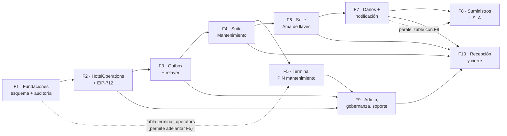

# Plan de desarrollo vertical — Propuesta vNext
## Suite de Mantenimiento + Suite Ama de llaves con firma on-chain selectiva

> **Fase:** 3 (Desarrollo) · **Versión:** 1.0.0 · **Fecha:** 2026-10-07
> **Autor:** @asistenteProyecto (Director de proyecto + Ingeniero de software senior)
> **Estado:** plan listo para aprobación antes de arrancar el ciclo F1.
>
> **Fuentes obligatorias (coherencia verificada):**
> - `RepoTecnico/propuesta_vNext/requerimientos.md` — RF-M-01…RF-M-12, RF-K-01…RF-K-10, RF-S-01…RF-S-08, RNF-M-01…RNF-M-21, D-V1…D-V8, D-C1…D-C42.
> - `RepoTecnico/propuesta_vNext/casos_uso.md` — 45 CU-V-01…CU-V-45, parámetros (§2), eventos (§3), errores (§4) y `data-testid` (§5).
> - `RepoTecnico/propuesta_vNext/documento_tecnico.md` — Rev. 1.1.0: componentes C1–C17, módulos M1–M18, 12 tablas nuevas + 5 extensiones, contrato `HotelOperations`, outbox, runbook §9.5 y plan F1–F10 (§11).
> - `RepoTecnico/propuesta_vNext/diccionario_datos.md`, `base_datos.sql`, `diagrama_er.md`, `entornos_globales.md`.
> - `RepoTecnico/estado_proyecto.md` §11–§12 (decisiones del cliente y del proceso).
> - `docs/DISENO-TECNICO.md` — stack y ADR-01…ADR-17; **ADR-18** en `documento_tecnico.md` §10.2.
>
> **Alcance de este documento:** solo planificación. No modifica código, contratos, esquema ni los artefactos fuente. El presente encargo **solo crea** `RepoTecnico/propuesta_vNext/plan_desarrollo.md`.

---

## 0. Resumen ejecutivo

- **10 ciclos verticales** (F1…F10) heredados del plan del documento técnico §11, aquí detallados con tareas, archivos reales del monorepo, pruebas y *gates*.
- **77 días-persona** en secuencia; **~15–16 semanas** de calendario con un equipo de 3–4 personas y **~13 semanas** con los solapes indicados (§9).
- **Primer ciclo: F1 — Fundaciones (esquema vNext + auditoría append-only)**, prerequisito de todo lo demás.
- **Ruta crítica:** `F1 → F2 → F3 → F4 → F6 → F10`. F5, F7, F8 y F9 admiten solape controlado sin alterar los IDs del documento técnico.
- **Regla de oro respetada en todo el plan:** firma on-chain **obligatoria** en bloqueo/desbloqueo de habitación y verificación preventiva de área crítica; **opcional** en inspección (D-C23); **nunca** en cargos por daños (D-C27), tickets, asignaciones ni configuración interna; sí en acción `CONFIG` de flags obligatorios (D-C22) y en la firma de emergencia `OWNER_BACKUP` (D-C6/D-C13).

---

## 1. Principios del plan

| # | Principio | Consecuencia en la ejecución |
|---|---|---|
| P1 | **Ciclos verticales, no horizontales** | Cada Fn entrega de extremo a extremo: modelo de datos → dominio → API → UI → pruebas. No hay ciclos «solo backend» ni «solo UI». |
| P2 | **Un ciclo es 100 % operativo y demostrable** | Al cerrar cada ciclo existe un guion de demostración reproducible (comando + pantalla + evidencia). Si algo no se puede demostrar, el ciclo no cierra. |
| P3 | **El SQL es la fuente de verdad del vocabulario** | Estados, roles y enums se toman literalmente de `base_datos.sql` / `diccionario_datos.md`; no se introducen sinónimos (p. ej. no existe `REJECTED` en `housekeeping_assignments.status`). |
| P4 | **El contrato es inmutable y genérico** (D-C39) | `HotelOperations.sol` no usa proxy; añadir `actionType` no exige redeploy. `HotelNights.sol` no se toca (D-V1, D-C23). |
| P5 | **La cadena es prueba, PostgreSQL es verdad operativa** | El estado crítico cambia en BD solo con firma `SIGNED`; si el anclaje falla, la entidad queda `PENDING_ANCHOR` y no se revierte (RNF-M-14). |
| P6 | **Meta-transacción/relayer** (DT-AUD-01) | El worker paga gas con una hot wallet **sin roles**; el contrato emite `signer = recovered_signer`. Ningún ciclo puede introducir un camino donde firme `msg.sender`. |
| P7 | **Sin PII on-chain** (RNF-M-07) | Solo `bytes32`, direcciones y timestamps; `entityId` derivado por `keccak256`. |
| P8 | **Los tres artefactos de datos van juntos** | Todo ciclo que toque el modelo actualiza en el mismo cambio `diccionario_datos.md`, `diagrama_er.md` y `base_datos.sql`, y sincroniza `packages/shared/src/db/migrator.ts`. |
| P9 | **Gate de salida bloqueante** | Ningún ciclo empieza sin que el anterior tenga sus pruebas en verde y su evidencia registrada en `estado_proyecto.md`. |
| P10 | **Trazabilidad de doble sentido** | Toda tarea declara RF/RNF y CU-V; todo RF/RNF y CU-V del alcance tiene al menos un ciclo asignado (§8). |

---

## 2. Convenciones y notación

- **Duración:** S = ≤ 5 días · M = 6–8 días · L = ≥ 9 días. Se expresa en **días-persona** de un equipo mixto (1 full-stack, 1 contrato/worker, 1 QA/E2E).
- **Comandos de gate** (nombres reales del monorepo):
  - `pnpm typecheck` · `pnpm lint` · `pnpm build`
  - `pnpm --filter @hotel/shared test` · `pnpm --filter @hotel/worker test` · `pnpm --filter @hotel/web test` · `pnpm --filter @hotel/mcp test`
  - `pnpm --filter @hotel/contracts test` (Forge: `forge test -vvv`)
  - `pnpm --filter @hotel/web exec playwright test` (E2E, `apps/web/playwright.config.ts`)
  - `scripts/load-tests/run-load-test.ts` (p95, RNF-M-05) · `scripts/backup/restore-verify.ts` (RPO/RTO, RNF-M-12)
- **Archivos nuevos:** marcados `(nuevo)`. Los existentes se **extienden**, nunca se renombran.
- **Nivel de firma por ciclo:** `—` (no aplica) · `off-chain` · `EIP-712 obligatoria` · `EIP-712 opcional (flag)`.

---

## 3. Mapa de ciclos (resumen)

| Ciclo | Nombre | Duración | Entregable verificable (demo) | CU-V | RF / RNF | Depende de |
|---|---|---|---|---|---|---|
| **F1** | Fundaciones: esquema vNext + auditoría append-only | S · 4 d | `base_datos.sql` aplicado y `runMigrations()` idempotente; 12 tablas nuevas + 5 tablas extendidas (4 con DDL —19 columnas y 3 CHECK sobre `maintenance_incidents`, `preventive_tasks`, `rooms` y `preventive_plans`— y `admin_users`, cuya extensión de roles es lógica, sin DDL); trigger append-only; semilla de 10 áreas (4 críticas) | CU-V-40 | RNF-M-19; D-C21, D-C31 | — |
| **F2** | Contrato `HotelOperations.sol` + motor EIP-712 | L · 9 d | Contrato en Anvil; `OperationalAction` con `signer = recovered_signer`; acción `CONFIG` y respaldo `OWNER_BACKUP`; vector EIP-712 §4.2.1 reproducible | CU-V-03, 05, 07, 21, 35, 37, 38 | RF-S-01/02/03/05; RNF-M-07/08; D-C16, D-C39, D-C42 | F1 |
| **F3** | Outbox de anclaje y worker relayer | L · 9 d | Fila-outbox `on_chain_signatures` con `next_attempt_at`; backoff 8/TTL 24 h; `PENDING`→`SIGNED`→`MINED`; recuperación idempotente tras reinicio | CU-V-03, 05, 07, 43, 45 | RNF-M-03, M-13, M-14; D-C18 | F2 |
| **F4** | Suite Mantenimiento | L · 12 d | `/mantenimiento/*` con bloqueo/desbloqueo firmado, preventivo crítico firmado, áreas comunes e informes | CU-V-01…11 | RF-M-01…12; RF-S-02/05/07 | F3 |
| **F5** | Terminal de mantenimiento (PIN) | M · 6 d | Login PIN, mis tareas, avance/cierre con evidencia y reporte de incidencia en ≤ 3 toques | CU-V-12…15 | RNF-M-09/17/18/20; D-C17, D-C30, D-C35, D-C36 | F1, F4 |
| **F6** | Suite Ama de llaves | L · 11 d | `/ama-de-llaves/*`: tablero, turnos, asignaciones, inspección (firma opcional), rechazo y reporte | CU-V-16…23 | RF-K-01…07; RF-S-03 | F4 |
| **F7** | Cargos por daños y notificación al huésped | M · 6 d | `housekeeping_damage_charges` + `damage_charge_guest_notifications`; reclamación y confirmación en check-out; derechos GDPR | CU-V-24, 33, 34, 41, 42 | RF-K-08; RNF-M-10; D-C4, D-C11, D-C14, D-C19, D-C27 | F6 |
| **F8** | Suministros y SLA de validación | M · 5 d | Alerta por umbral con recordatorio diario y cierre; `PENDING_VERIFICATION_EXPIRED` a 24 h con escalado | CU-V-25, 30, 09, 39 | RF-K-09; RNF-M-21; D-C33, D-C38 | F4, F6 |
| **F9** | Administración, gobernanza y soporte | L · 10 d | Wallets/roles, alta/rotación/baja de operarios, flags, emergencia `OWNER_BACKUP`, exportación, cola, PIN y backups + runbook §9.5 | CU-V-35…40, 43, 44, 45 | RNF-M-01/11/12/15/16; D-C22, D-C24, D-C25 | F2, F3, F5 |
| **F10** | Recepción vNext y cierre | M · 5 d | Reportar incidencias, publicar/despublicar venta, reclamaciones; redirección D-C40; E2E, p95 y observabilidad final | CU-V-31, 32, 03, 05 | RF-M-01; RNF-M-05; D-C37, D-C40 | F4, F6, F7, F9 |

### 3.1 Orden de ciclos (Mermaid)

> **Ruta crítica:** F1 → F2 → F3 → F4 → F6 → F7 → F10 (con F9 alimentando F10). F5 admite solape con F2/F3 si se congela antes la API de incidencias existente (`/api/mantenimiento/*`); F7 y F8 pueden ejecutarse en paralelo tras F6.

---

## 4. Ciclos detallados

### 4.1 F1 — Fundaciones: esquema vNext + auditoría append-only

- **Duración:** S · **4 días-persona**.
- **Objetivo:** dejar la base de datos y el vocabulario canónico listos para todo lo demás, con auditoría append-only operativa.

**Entregable funcional verificable (demo):**
1. `psql -f RepoTecnico/propuesta_vNext/base_datos.sql` sobre una copia restaurada, dos veces, sin errores (idempotente).
2. `runMigrations()` crea el esquema vNext desde cero y `resetDatabase()` lo desmonta en orden inverso de FK.
3. `UPDATE`/`DELETE` sobre `operator_audit_log` **revertido por trigger** con el mensaje `operator_audit_log es append-only`.
4. Semilla `maintenance_area_types`: 10 tipos, 4 con `is_critical = TRUE` (`POOL_FILTER`, `WATER_PUMP`, `ELEVATOR`, `ELECTRIC_GENERATOR`).

**Tareas**

| # | Tarea | Archivos afectados | Verificación |
|---|---|---|---|
| T1.1 | Trasladar el DDL vNext al esquema inicial del migrador (12 `CREATE TABLE` + 19 columnas y 3 CHECK sobre 4 tablas + semilla + trigger; `admin_users` con extensión lógica de roles) | `packages/shared/src/db/migrator.ts` | `migrator.test.ts` |
| T1.2 | ~~**Corregir orden de creación:** `operator_audit_log` debe crearse **antes** de `housekeeping_damage_charges`~~ ✅ **CORREGIDO (2026-10-06)**: el bloque `operator_audit_log` ya se crea antes que `housekeeping_damage_charges` en `base_datos.sql` | `RepoTecnico/propuesta_vNext/base_datos.sql`; `packages/shared/src/db/migrator.ts` | Migración en base vacía sin error de FK |
| T1.3 | Sincronizar el SQL suelto del paquete | `packages/shared/src/db/schema.sql` | Diff vacío frente a la sección vNext del migrador |
| T1.4 | Ampliar el orden de borrado de tests/staging a las 12 tablas nuevas y a las extensiones | `packages/shared/src/db/reset-plan.ts`, `packages/shared/src/db/migrator.ts` (`resetDatabase`) | `reset-plan.test.ts` |
| T1.5 | Extender el vocabulario de roles de back-office con `HEAD_MAINTENANCE`, `HEAD_KEEPER`, `MAINTENANCE_TECH`, `HOUSEKEEPER` (los actuales se conservan) | `packages/shared/src/domain/roles.ts` | `roles.ts` tipado + guardián |
| T1.6 | Declarar el vocabulario canónico de estados y tipos de entidad (firma, habitación, validación, alertas) | `packages/shared/src/domain/operations-state.ts` (nuevo) | Test de exhaustividad frente a `base_datos.sql` |
| T1.7 | Repositorios: auditoría append-only con hash encadenado `prev_hash`/`integrity_hash` | `packages/shared/src/db/repositories/audit.repository.ts` (nuevo) + `.test.ts` | Test de cadena de hashes y de inmutabilidad |
| T1.8 | Repositorio de operaciones: `operator_wallets` + `on_chain_signatures` (emisión de nonce, `consumed_at`, `next_attempt_at`) | `packages/shared/src/db/repositories/operations.repository.ts` (nuevo) + `.test.ts` | Índice único `(signer_address, nonce)` |
| T1.9 | Extender repositorio de mantenimiento con `maintenance_areas`/`_tasks`/`_logs` y áreas críticas | `packages/shared/src/db/repositories/maintenance.repository.ts` | `maintenance.repository.test.ts` |
| T1.10 | Repositorio de operarios de terminal (`terminal_operators`) | `packages/shared/src/db/repositories/terminal-operators.repository.ts` (nuevo) + `.test.ts` | Alta/rotación/bloqueo |
| T1.11 | Extender repositorio de housekeeping con `housekeeping_inspections` y `supply_alerts` | `packages/shared/src/db/repositories/housekeeping.repository.ts` | `housekeeping.repository.test.ts` |
| T1.12 | Registrar las variables nuevas del ciclo en el ejemplo de entorno | `.env.example` | `pnpm --filter @hotel/shared test` (validación de env) |
| T1.13 | Actualizar los tres artefactos de datos y el registro de estado | `RepoTecnico/propuesta_vNext/{base_datos.sql,diccionario_datos.md,diagrama_er.md}`, `RepoTecnico/estado_proyecto.md` | Coherencia 12+5 |

**Requisitos y casos de uso cubiertos:** RNF-M-19 (retención 5 años, append-only, exportación); RNF-M-06; D-C21, D-C31. CU-V-40 (base de la exportación).

**Migración de datos:** es el ciclo de migración por excelencia. `base_datos.sql` es *forward-only* e idempotente (`CREATE TABLE IF NOT EXISTS`, `ALTER TABLE … ADD COLUMN IF NOT EXISTS`, `ON CONFLICT DO NOTHING`). Sembrar `maintenance_area_types`; verificar `12 tablas nuevas + 5 tablas extendidas` (19 columnas con DDL) y `uq_on_chain_signatures_nonce`. Rollback descrito en `documento_tecnico.md` §9.5.A (DROP en orden inverso de FK + `DROP COLUMN` de extensiones; nunca tocar `maintenance_incident_events`).

**Pruebas del ciclo**

| Tipo | Prueba | Ubicación |
|---|---|---|
| Unit | Exhaustividad enums ↔ SQL; hashes encadenados; política de estados | `packages/shared/src/domain/operations-state.test.ts`, `.../db/repositories/audit.repository.test.ts` |
| Integración | Migración idempotente (2 pasadas), `resetDatabase`, trigger append-only | `packages/shared/src/db/migrator.test.ts`, `reset-plan.test.ts` |
| Contrato | No aplica en F1 | — |
| E2E | No aplica (sin UI nueva) | — |

**Criterios de salida (gates):** `pnpm typecheck` y `pnpm --filter @hotel/shared test` verdes; `psql` en CI con PostgreSQL 18 aplica el script dos veces sin error; `UPDATE`/`DELETE` sobre `operator_audit_log` revierten; `\d+` confirma 12 tablas + las 19 columnas-extensión (la 5.ª tabla extendida, `admin_users`, es lógica); `base_datos.sql`, `diccionario_datos.md` y `diagrama_er.md` coherentes.

**Riesgos del ciclo:** orden de FK `housekeeping_damage_charges → operator_audit_log` (mitigado en T1.2); desincronización `migrator.ts` ↔ `schema.sql` ↔ `base_datos.sql` (mitigado en T1.3 y con diff en CI); ausencia de `psql` en el entorno local (se valida en CI/PostgreSQL 18, B-1).

**Dependencias:** ninguna. Es la raíz del plan.

---

### 4.2 F2 — Contrato `HotelOperations.sol` + motor EIP-712

- **Duración:** L · **9 días-persona**.
- **Objetivo:** disponer del contrato auxiliar inmutable y del motor de firma EIP-712 compartido, con verificación criptográfica off-chain y on-chain idénticas.

**Entregable funcional verificable (demo):**
1. `forge test` verde sobre `HotelOperations` (unit + fuzz + invariantes).
2. Despliegue en Anvil: `roomBlocked(...)` enviada por una **hot wallet distinta** del firmante emite `OperationalAction` con `signer = recovered_signer`.
3. `configChanged(...)` firmada sin `DEFAULT_ADMIN_ROLE` revierte `AccessControlUnauthorizedAccount`; firmada por el respaldo `OWNER_BACKUP` con `backupForRole` se acepta.
4. El vector de `documento_tecnico.md` §4.2.1 reproduce `domainSeparator` y `digest` exactos en `@hotel/shared`.

**Tareas**

| # | Tarea | Archivos afectados | Verificación |
|---|---|---|---|
| T2.1 | Implementar el contrato inmutable (roles, `ACTION_*`, `ACTION_TYPEHASH`, `backupForRole`, `consumedNonce`, eventos tipados y `OperationalAction`, `_relay`) | `packages/contracts/src/HotelOperations.sol` (nuevo) | `forge build` |
| T2.2 | Suites de contrato: unit, fuzz (firma/nonce/deadline), invariantes de no-replay | `packages/contracts/test/HotelOperations.t.sol` (nuevo), `packages/contracts/test/HotelOperations.invariants.t.sol` (nuevo) | `forge test` |
| T2.3 | Script de despliegue y bootstrap de roles (Safe multisig como `DEFAULT_ADMIN_ROLE`, ADR-06) | `packages/contracts/script/DeployOperations.s.sol` (nuevo), `packages/contracts/script/Deploy.s.sol` | `forge script` en Anvil |
| T2.4 | Scripts npm del paquete | `packages/contracts/package.json` (`test:operations`, `deploy:operations`) | Ejecución local |
| T2.5 | Registro de despliegue por cadena con entrada de operaciones | `packages/contracts/scripts/sync-deployment.ts`, `packages/shared/src/deployments/schema.ts`, `packages/shared/src/deployments/81234.json`, `packages/shared/src/deployments/test/31337.json` | Validación Zod del registro |
| T2.6 | Motor EIP-712: domain, tipos, `entityId`, `payloadHash`, `nonce`, `deadline`, recuperación de firmante | `packages/shared/src/operations/{types,domain,entity-id,payload,typed-data,verify,index}.ts` (nuevos) | `pnpm --filter @hotel/shared test` |
| T2.7 | ABI tipado del contrato nuevo | `packages/shared/src/abi/hotel-operations.ts` (nuevo), `packages/shared/src/abi/index.ts` | Guardián de ABI |
| T2.8 | Constantes de red y del contrato (`chainId`, `HOTEL_OPERATIONS_*`, `CONFIRMATIONS_N = 1`) | `packages/shared/src/constants.ts` | `constants.test.ts` |
| T2.9 | Vector de prueba canónico de `entityId`/`payloadHash`/`digest` | `packages/shared/src/operations/typed-data.test.ts` | Digest §4.2.1 exacto |
| T2.10 | Actualizar guardián de arquitectura (ABI nuevo registrado, sin ABIs legacy) | `packages/shared/src/architecture-guardian.test.ts` | Test verde |

**Requisitos y casos de uso cubiertos:** RF-S-01 (wallet desacoplada de la sesión, D-C42), RF-S-02, RF-S-03, RF-S-05; RNF-M-07 (sin PII), RNF-M-08 (inmutabilidad); D-C1, D-C6, D-C13, D-C16, D-C22, D-C39. CU-V-03, 05, 07, 21, 35, 37, 38.

**Migración de datos:** no hay migración de BD. Sí hay **migración de despliegue**: address + `deploymentBlock` + `abiHash` a `packages/shared/deployments/<chainId>.json` (runbook §9.5.B). El contrato es inmutable: el rollback es re-apuntar la dirección, no reescribir estado.

**Pruebas del ciclo**

| Tipo | Prueba | Ubicación |
|---|---|---|
| Contrato (Forge) | Relayer ≠ firmante; `NonceAlreadyConsumed`; `DeadlineExpired`; `CONFIG` sin admin; `OWNER_BACKUP` aceptado; firma mal formada (`ECDSAInvalidSignature`); fuzz de `msg.sender` | `packages/contracts/test/HotelOperations*.t.sol` |
| Unit (Vitest) | Derivación `entityId`/`payloadHash`; `domainSeparator`; recuperación de firmante; vector §4.2.1 | `packages/shared/src/operations/*.test.ts` |
| Integración | `sync-deployment.ts` + esquema de registro; humo de despliegue en Anvil | `packages/contracts/scripts/smoke-deploy.sh` |
| E2E | No aplica (aún sin UI de firma) | — |

**Criterios de salida (gates):** `forge test` (unit + fuzz + invariant) verde; el vector EIP-712 coincide byte a byte; `signer` del evento **nunca** es el relayer; `pnpm --filter @hotel/contracts test:operations` y `pnpm --filter @hotel/shared test` verdes; registro de despliegue válido contra `deployments/schema.ts`.

**Riesgos del ciclo:** divergencia de encoding entre app, worker y contrato (mitigado con el vector de prueba); custodia de claves y gobernanza Safe (R-01, R-14; decisión de cliente pendiente); dependencia de OZ v5 + `EIP712` (stack ya usado en `HotelNights`).

**Dependencias:** F1 (vocabulario de roles/estados y registro de despliegue en `packages/shared`).

---

### 4.3 F3 — Outbox de anclaje y worker relayer

- **Duración:** L · **9 días-persona**.
- **Objetivo:** convertir `on_chain_signatures` en un **outbox transaccional** idempotente y dotar al worker del bucle relayer que ancla sin roles y reintenta con backoff.

**Entregable funcional verificable (demo):**
1. Bloqueo de habitación simulado: se persiste firma + fila-outbox y el worker la ancla en Anvil; `status` pasa `SIGNED → MINED` y desaparece `PENDING_ANCHOR`.
2. Con el RPC caído (`RPC_URL=http://127.0.0.1:1`), la firma queda `SIGNED` con `next_attempt_at` creciente (30 s → 1 → 2 → 5 → 10 min) y la entidad `PENDING_ANCHOR`.
3. Reinicio del worker a mitad de outbox: no se pierde ninguna fila y no se duplica ninguna tx (`idempotency_key` + recibo por `tx_hash`).
4. El relayer **no tiene roles**: si se le intenta hacer firmar en nombre propio, la verificación EIP-712 falla.

**Tareas**

| # | Tarea | Archivos afectados | Verificación |
|---|---|---|---|
| T3.1 | Repositorio outbox: selección `FOR UPDATE SKIP LOCKED`, `next_attempt_at`, `retry_count`, `expires_at`, `idempotency_key`, transición de estados | `packages/shared/src/db/repositories/signatures.repository.ts` (nuevo) + `.test.ts` | Vitest de concurrencia |
| T3.2 | Motor del outbox (lectura, backoff, TTL, recuperación tras restore) | `apps/worker/src/anchor-outbox.ts` (nuevo) + `.test.ts` | `apps/worker` tests |
| T3.3 | Relayer: construye la tx `roomBlocked`/`roomUnblocked`/`preventiveTaskVerified`/`inspectionCertified`/`configChanged` y espera recibo (`CONFIRMATIONS_N = 1`) | `apps/worker/src/anchor-relayer.ts` (nuevo) + `.test.ts` | Integración Anvil |
| T3.4 | Variables del ciclo y validación fail-fast | `apps/worker/src/config.ts` (`OPERATIONAL_SIGNATURE_*`, `ANCHOR_BACKOFF`, `RPC_TIMEOUT_MS`, `HOTEL_OPERATIONS_*`, `HOTEL_OPERATIONS_DEPLOYMENT_BLOCK`) | `config.test.ts` |
| T3.5 | Arranque del bucle de anclaje y *catch-up* desde `HOTEL_OPERATIONS_DEPLOYMENT_BLOCK` | `apps/worker/src/run-worker.ts`, `apps/worker/src/main.ts` | `run-worker.test.ts` |
| T3.6 | Cola aceleradora (solo despierta al worker; el outbox es la verdad) | `packages/shared/src/queue/operational-signatures.ts` (nuevo + test) | Test de despertar idempotente |
| T3.7 | Métricas de outbox y gas en salud y HTTP | `apps/worker/src/http-server.ts`, `apps/worker/src/health.ts` | `http-server.test.ts` |
| T3.8 | Alertas de firma `PENDING` > `PENDING_ALERT_MIN` y `retry_count > RETRY_ALERT_COUNT` | `apps/monitor/src/chain-monitor.ts`, `apps/monitor/src/probe.ts`, `apps/monitor/src/alerter.ts` | `chain-monitor.test.ts`, `alerter.test.ts` |

**Requisitos y casos de uso cubiertos:** RNF-M-03 (resiliencia), RNF-M-13 (observabilidad), RNF-M-14 (compensación), RNF-M-12 (reintento tras restaurar); D-C18. CU-V-03, 05, 07, 43, 45.

**Migración de datos:** no crea tablas (las de F1). Sí define la **recuperación** del outbox tras restore/PITR y la coherencia de `HOTEL_OPERATIONS_DEPLOYMENT_BLOCK` al re-apuntar el contrato.

**Pruebas del ciclo**

| Tipo | Prueba | Ubicación |
|---|---|---|
| Unit | Backoff 30 s→10 min, máx. 8, TTL 24 h; `FAILED` terminal para automáticos, reintento manual; `EntityPendingAnchor` | `apps/worker/src/anchor-outbox.test.ts` |
| Integración | Anclaje real en Anvil; relayer ≠ firmante; reuso de nonce; reinicio a mitad; RPC caído | `apps/worker/src/anchor-relayer.test.ts` |
| Contrato (Forge) | Reutiliza F2 para el camino feliz y de fallo | `packages/contracts/test/HotelOperations.t.sol` |
| E2E | No aplica (sin UI aún) | — |

**Criterios de salida (gates):** idempotencia demostrada (una tx por firma); backoff y TTL verificados con reloj inyectado; recuperación tras reinicio sin pérdida ni duplicado; serialización del nonce de transacción por hot wallet; `pnpm --filter @hotel/worker test` y `pnpm --filter @hotel/monitor test` verdes; alertas emitidas en el umbral.

**Riesgos del ciclo:** **R-13** SPOF del worker (mitigación: outbox persistente, *catch-up* al arrancar, *runbook* de failover manual, alerta `PENDING_ALERT_MIN`); **R-14** custodia/claves (hot wallet sin roles y con saldo mínimo); **R-02** gas/latencia en Besu.

**Dependencias:** F2 (contrato + ABI + motor EIP-712) y F1 (tabla `on_chain_signatures`).

---

### 4.4 F4 — Suite Mantenimiento

- **Duración:** L · **12 días-persona**.
- **Objetivo:** entregar la suite operativa del Jefe de Mantenimiento con el flujo de firma EIP-712 visible y bloqueante donde corresponde.

**Entregable funcional verificable (demo):**
1. `/mantenimiento` con dashboard, incidencias, preventivo, áreas comunes e informes (rutas de `entornos_globales.md` §2).
2. **Bloquear** una habitación exige wallet conectada, muestra ⛓ «Requiere firma» (`data-testid="requires-signature"`), modal de previsualización (`data-testid="signature-preview"`) y deja la habitación `publication_status = 'MAINTENANCE'` fuera del catálogo.
3. **Desbloquear** tras verificar la resolución, también firmado; notifica a Ama de llaves (CU-V-19; CU-V-11 fusionado).
4. Verificar tarea preventiva de área crítica (`POOL_FILTER`, `WATER_PUMP`, `ELEVATOR`, `ELECTRIC_GENERATOR`) exige firma; las no críticas no.
5. Informes por habitación/área/técnico/periodo.

**Tareas**

| # | Tarea | Archivos afectados | Verificación |
|---|---|---|---|
| T4.1 | Rutas de la suite | `apps/web/src/app/mantenimiento/{page,layout}.tsx`, `.../mantenimiento/incidencias/page.tsx`, `.../incidencias/[id]/page.tsx`, `.../preventivo/page.tsx`, `.../areas-comunes/page.tsx`, `.../informes/page.tsx` (nuevos) | Playwright navega |
| T4.2 | Componentes de operación | `apps/web/src/components/maintenance/IncidentList.tsx`, `IncidentDetail.tsx`, `PreventiveBoard.tsx`, `CommonAreasBoard.tsx`, `MaintenanceReports.tsx` (nuevos); extender `MaintenanceBoard.tsx`, `ReportIncidentPanel.tsx` | Pruebas de componente |
| T4.3 | Componentes transversales de firma: badge ⛓, botón `disabled` sin wallet, modal de previsualización, aviso `PENDING_ANCHOR` y de «evidencia no adjunta» | `apps/web/src/components/maintenance/SignatureGate.tsx`, `SignaturePreviewModal.tsx`, `SignaturePendingBanner.tsx`, `EvidenceMissingNotice.tsx` (nuevos); reutiliza `apps/web/src/components/ui/ModalShell.tsx` y `useModalDialog.ts` | `data-testid` de `casos_uso.md` §5 |
| T4.4 | Endpoints de operación con guard de rol | `apps/web/src/app/api/mantenimiento/incidents/route.ts`, `incidents/[id]/route.ts`, `tasks/route.ts`, `tasks/[id]/route.ts`, `board/route.ts` (existente, extender); `.../api/mantenimiento/preventivo/route.ts`, `areas-comunes/route.ts`, `informes/route.ts` (nuevos) | Tests de API |
| T4.5 | Endpoint de firma: emisión de TypedData + verificación `recovered_signer`/`role_snapshot` + consumo de nonce en la **misma transacción** que el cambio de estado | `apps/web/src/app/api/mantenimiento/signatures/route.ts` (nuevo) | Integración con F3 |
| T4.6 | Dominio y repositorio: `requires_signature` por `is_critical`; transiciones `CLEAN/DIRTY/OCCUPIED/PENDING_CLEANING/IN_INSPECTION` | `packages/shared/src/domain/maintenance.ts`, `packages/shared/src/db/repositories/maintenance.repository.ts` | Vitest |
| T4.7 | Filtrado del catálogo por `publication_status = 'MAINTENANCE'` (D-V7) | `packages/shared/src/db/repositories/rooms.repository.ts`, `apps/web/src/app/api/rooms/route.ts` | Test de catálogo |
| T4.8 | Textos de la suite (ES/EN/RU) | `apps/web/messages/{es,en,ru}.json` | Guardián de i18n |

**Requisitos y casos de uso cubiertos:** RF-M-01…RF-M-12; RF-S-02, RF-S-05, RF-S-07; RNF-M-02, RNF-M-05, RNF-M-06; D-C1, D-C18, D-C34, D-C41. CU-V-01…CU-V-11.

**Migración de datos:** usa las extensiones de F1 (`maintenance_incidents.area_id`, `reported_by_role`, `block_signature_id`, `unblock_signature_id`, `resolution_notes`, `damage_charge_*`; `preventive_tasks.requires_signature`, `signature_id`, `evidence_path`; `preventive_plans.area_id`; `rooms.maintenance_blocked_*`). Sin datos heredados que migrar salvo el mapeo de áreas comunes, que se siembra en F1.

**Pruebas del ciclo**

| Tipo | Prueba | Ubicación |
|---|---|---|
| Unit / integración (Vitest) | Reglas de bloqueo, exigencia de firma por criticidad, transiciones de estado, guard de rol | `packages/shared/src/domain/maintenance.test.ts`, `.../db/repositories/maintenance.repository.test.ts`, `apps/web/src/app/api/mantenimiento/**` |
| Contrato (Forge) | Camino `ROOM_BLOCK`/`ROOM_UNBLOCK`/`PREVENTIVE_TASK` de extremo a extremo (firma → outbox → evento) | Reutiliza `HotelOperations.t.sol` |
| E2E (Playwright) | Bloqueo/desbloqueo firmado con wallet MCP; preventivo crítico; áreas comunes; informes | `apps/web/e2e/mantenimiento.spec.ts` (nuevo) |
| Seguridad | Negativas: sin wallet → botón `disabled`; rol incorrecto → 403; `EntityPendingAnchor` → 423 | `apps/web/e2e/mantenimiento.spec.ts` |

**Criterios de salida (gates):** habitación bloqueada desaparece del catálogo y vuelve solo tras desbloqueo firmado; firma obligatoria observable (`requires-signature`, `signature-preview`); preventivo crítico firmado y no crítico sin firma; informes correctos; `pnpm --filter @hotel/web test`, `typecheck` y `lint` verdes; E2E de la suite en verde.

**Riesgos del ciclo:** coordinación del filtro de catálogo con F10 (D-V7); UX de firma en móvil (RNF-M-04, D-C28); dependencia de la wallet del jefe y de `OWNER_BACKUP` para continuidad (R-01, la UI de emergencia se entrega en F9).

**Dependencias:** F3 (outbox/relayer) y, a través de él, F2 y F1.

---

### 4.5 F5 — Terminal de mantenimiento (PIN)

- **Duración:** M · **6 días-persona**.
- **Objetivo:** que el técnico (`MAINTENANCE_TECH`), sin wallet, opere desde un terminal fijo con PIN en ≤ 3 toques y ≤ 30 s por tarea.

**Entregable funcional verificable (demo):**
1. Login por PIN (`data-testid="terminal-pin"`); a los 5 fallos la cuenta queda bloqueada (`locked_until`) y solo Jefe/Admin la rehabilita.
2. «Mis incidencias/tareas» muestra solo lo asignado al técnico, sin importes, huéspedes, cargos, configuración ni firma (D-C35, RNF-M-20).
3. Registrar avance + cierre con evidencia (foto/nota) → `PENDING_VERIFICATION` (CU-V-14).
4. Reportar incidencia desde el terminal → `OPEN` para clasificación del jefe (CU-V-15, D-C36).
5. Inactividad 5 min cierra sesión; sin conexión, el terminal avisa y **no** permite escritura (RNF-M-18, D-C30).

**Tareas**

| # | Tarea | Archivos afectados | Verificación |
|---|---|---|---|
| T5.1 | Rutas del terminal (landing por rol + tareas + reporte) | `apps/web/src/app/terminal/page.tsx`, `.../terminal/tareas/page.tsx`, `.../terminal/reportar/page.tsx` (nuevos) | Playwright móvil |
| T5.2 | Componentes táctiles | `apps/web/src/components/terminal/PinPad.tsx`, `TaskList.tsx`, `TaskProgressForm.tsx`, `OfflineNotice.tsx` (nuevos) | `data-testid` + a11y básica |
| T5.3 | Política de PIN (4–6 dígitos, bcrypt coste ≥ 12, 5 intentos, 90 días, un solo uso inicial, timeout 5 min) | `packages/shared/src/auth/terminal-pin.ts` (nuevo) + `.test.ts` | Vitest de política |
| T5.4 | Endpoints de terminal con sesión de operario (no wallet) | `apps/web/src/app/api/terminal/auth/route.ts`, `.../terminal/tasks/route.ts`, `.../terminal/incidents/route.ts` (nuevos) | Tests de API |
| T5.5 | Permisos del técnico (solo lo asignado) y bloqueo optimista `updated_at` | `packages/shared/src/db/repositories/maintenance.repository.ts`, `apps/web/src/app/api/terminal/tasks/route.ts` | Test de `OptimisticLockConflict` |
| T5.6 | Textos ES/EN/RU sin jerga técnica | `apps/web/messages/{es,en,ru}.json` | Guardián de i18n |

**Requisitos y casos de uso cubiertos:** RF-M-08 (ejecución), RF-M-09, RF-S-06; RNF-M-09, RNF-M-17, RNF-M-18, RNF-M-20; D-C2, D-C10, D-C17, D-C29, D-C30, D-C35, D-C36. CU-V-08 (ejecución), CU-V-12…CU-V-15.

**Migración de datos:** usa `terminal_operators` (F1) y `preventive_tasks.validation_status` (F1). Alta inicial de operarios vía F9 o *seed* de desarrollo.

**Pruebas del ciclo**

| Tipo | Prueba | Ubicación |
|---|---|---|
| Unit (Vitest) | Política de PIN completa; permisos del técnico; bloqueo optimista | `packages/shared/src/auth/terminal-pin.test.ts`, repositorios |
| Integración | Login + avance + cierre con evidencia; reporte de incidencia | API del terminal |
| Contrato (Forge) | No aplica (el técnico no firma) | — |
| E2E (Playwright) | Terminal en viewport «Pixel 5»: ≤ 3 toques, ≤ 30 s, mensajes ES/EN/RU, sin offline | `apps/web/e2e/terminal.spec.ts` (nuevo) |

**Criterios de salida (gates):** bloqueo a los 5 fallos y rehabilitación solo por Jefe/Admin; el técnico no ve importes ni cargos; escritura rechazada sin conexión con mensaje claro; `pnpm --filter @hotel/web test` verde; E2E del terminal en verde en escritorio y móvil.

**Riesgos del ciclo:** **R-09** modo offline descartado (riesgo aceptado, con aviso de pérdida de conexión); concurrencia de terminales (RNF-M-18); usabilidad real de ≤ 30 s (medición en E2E).

**Dependencias:** F1 (`terminal_operators`) y F4 (endpoints de incidencias/tareas). Solapable con F2/F3 si se congela la API de incidencias.

---

### 4.6 F6 — Suite Ama de llaves

- **Duración:** L · **11 días-persona**.
- **Objetivo:** entregar la suite de la Ama de llaves (`HEAD_KEEPER`) con tablero en tiempo real, turnos, asignaciones, inspección con firma **opcional** y reporte de incidencias.

**Entregable funcional verificable (demo):**
1. `/ama-de-llaves` con tablero de estado operativo (`data-testid="room-state-board"`, 5 estados canónicos + marca de bloqueo) y estado de publicación.
2. Crear turnos y asignar habitaciones a las 2 camareras (CU-V-17).
3. Notificación automática de habitaciones que requieren limpieza (CU-V-19; CU-V-11 fusionado).
4. Inspeccionar y certificar: con `INSPECTION_REQUIRES_SIGNATURE=false` (por defecto, D-C23) la certificación se registra sin firma; activado el flag, exige firma (`data-testid="signature-preview"`). **La venta no se libera** (D-C9, D-C15).
5. Rechazar limpieza → vuelve a la camarera; reportar avería → ticket al Jefe de Mantenimiento.

**Tareas**

| # | Tarea | Archivos afectados | Verificación |
|---|---|---|---|
| T6.1 | Rutas de la suite | `apps/web/src/app/ama-de-llaves/{page,layout}.tsx`, `.../turnos/page.tsx`, `.../asignaciones/page.tsx`, `.../inspecciones/page.tsx`, `.../danos/page.tsx`, `.../suministros/page.tsx` (nuevos) | Playwright navega |
| T6.2 | Componentes | `apps/web/src/components/housekeeping/RoomStateBoard.tsx`, `ShiftPlanner.tsx`, `AssignmentBoard.tsx`, `InspectionPanel.tsx`, `InspectionRejectForm.tsx`, `ReportIncidentFromHousekeeping.tsx` (nuevos); extender `HousekeepingBoard.tsx` | `data-testid` de `casos_uso.md` §5 |
| T6.3 | Endpoints de suite | `apps/web/src/app/api/housekeeping/{rooms,assignments,shifts,stream}/route.ts` (extender); `.../api/housekeeping/inspections/route.ts` (nuevo) | Tests de API |
| T6.4 | Inspección: FK principal `room_id` (D-C5), `inspection_type` (`CHECKOUT`/`DAILY_SERVICE`), resultado `APPROVED`/`REJECTED`, firma opcional por flag | `packages/shared/src/db/repositories/housekeeping.repository.ts`, `packages/shared/src/domain/housekeeping.ts` (nuevo) | Vitest |
| T6.5 | Tablero en tiempo real y p95 < 500 ms (RNF-M-05) | `apps/web/src/app/api/housekeeping/stream/route.ts`, `apps/web/src/components/housekeeping/RoomStateBoard.tsx` | Prueba de rendimiento del tablero |
| T6.6 | Rechazo de limpieza: asignación vuelve a `PENDING` (no existe `REJECTED`) y habitación a `DIRTY` | `housekeeping.repository.ts`, `inspection` API | Vitest + E2E |
| T6.7 | Reportería de incidencias desde housekeeping con `reported_by_role` (`HEAD_KEEPER`/`HOUSEKEEPER`) hacia F4 | API housekeeping + `maintenance.repository.ts` | Test de integración |
| T6.8 | Textos ES/EN/RU | `apps/web/messages/{es,en,ru}.json` | Guardián de i18n |

**Requisitos y casos de uso cubiertos:** RF-K-01…RF-K-07; RF-S-03; RNF-M-04, RNF-M-05; D-C5, D-C8, D-C9, D-C15, D-C23, D-C40. CU-V-16…CU-V-23.

**Migración de datos:** `housekeeping_inspections` y `rooms.last_inspection_at`/`last_inspection_result` (F1). Los turnos/asignaciones existentes (`housekeeping_shifts`, `housekeeping_assignments`) se conservan: no se renombran columnas ni estados.

**Pruebas del ciclo**

| Tipo | Prueba | Ubicación |
|---|---|---|
| Unit / integración (Vitest) | Transiciones de estado, inspección aprobada/rechazada, no liberación de venta, firma opcional | `housekeeping.repository.test.ts`, tests de API |
| Contrato (Forge) | `inspectionCertified` cuando el flag está activo (evento `INSPECTION`) | `HotelOperations.t.sol` + `@hotel/shared` |
| E2E (Playwright) | Tablero, turnos, asignaciones, inspección con y sin firma, rechazo, reporte | `apps/web/e2e/ama-de-llaves.spec.ts` (nuevo) |
| Rendimiento | Tablero p95 < 500 ms (20 usuarios, 50 habitaciones, 90 días) | `scripts/load-tests/run-load-test.ts` |

**Criterios de salida (gates):** tablero con los 5 estados canónicos y marca de bloqueo; inspección aprobada **no** cambia `publication_status` (D-C9); con `INSPECTION_REQUIRES_SIGNATURE=true` se exige firma y con `false` no; asignación rechazada vuelve a `PENDING`; p95 del tablero dentro de umbral; E2E en verde.

**Riesgos del ciclo:** **R-11** trazabilidad desigual de inspecciones si el flag queda apagado (configurable por hotel); rendimiento del tablero (D-C26); acoplamiento de estados compartidos con F4/F10.

**Dependencias:** F4 (incidencias y dominio de mantenimiento para el reporte) y, a través de F4, F3/F2/F1.

---

### 4.7 F7 — Cargos por daños y notificación al huésped

- **Duración:** M · **6 días-persona**.
- **Objetivo:** registrar cargos por daños **sin firma on-chain** (D-C27), notificar al huésped con evidencia e importe (D-C14) y resolver/confirmar en el check-out (D-C11).

**Entregable funcional verificable (demo):**
1. El Ama de llaves registra un cargo: `additional_charges` (`amount_cents > 0`) + `housekeeping_damage_charges` con `signature_id = NULL` y traza en `operator_audit_log`; **ninguna** fila ni evento on-chain.
2. Se genera `damage_charge_guest_notifications` con `channel` (EMAIL/TELEGRAM/WEB) y `due_date` (24 h antes del check-out por defecto, `DAMAGE_CLAIM_WINDOW_H`).
3. El huésped abre la notificación y **reclama** (estado `DISPUTED`) o queda conforme sin reclamación (`ACKNOWLEDGED`); al vencer sin reclamar, `EXPIRED`.
4. Recepción resuelve la reclamación (`RESOLVED_ACCEPTED`/`RESOLVED_REJECTED`); si procede, el cargo se confirma y se suma al folio en el check-out.
5. Ejercicio de acceso/supresión: anonimización off-chain dejando `entityId`/`content_hash`/`integrity_hash` (R-15, D-C19).

**Tareas**

| # | Tarea | Archivos afectados | Verificación |
|---|---|---|---|
| T7.1 | Dominio y repositorio de cargos por daños y notificaciones | `packages/shared/src/domain/damage-charges.ts` (nuevo), `packages/shared/src/db/repositories/damage-charges.repository.ts` (nuevo) + tests | Vitest |
| T7.2 | Alta de cargo y vínculo con la noche/token vendido (D-C4) | `apps/web/src/app/api/housekeeping/damage-charges/route.ts` (nuevo); `housekeeping_damage_charges.token_id → nfts(token_id)` | Test de vínculo |
| T7.3 | Notificación al huésped por canal de la reserva | `apps/worker/src/mailer.ts`, `apps/worker/src/queued-mailer.ts`, `apps/worker/src/email-consumer.ts`, `packages/shared/src/push/service.ts` (extender); `packages/shared/src/queue/notifications.ts` | Tests del worker |
| T7.4 | Portal del huésped: ver notificación, reclamar y ejercer derechos | `apps/web/src/app/mis-noches/cargos/page.tsx`, `.../mis-noches/cargos/[id]/page.tsx` (nuevos); `apps/web/src/app/api/public/damage-charges/[id]/route.ts` (nuevo) | E2E |
| T7.5 | Resolución en recepción y confirmación en check-out | `apps/web/src/app/api/reception/damage-charges/route.ts` (nuevo), `apps/web/src/app/api/reception/checkout/route.ts` (extender), `apps/web/src/app/recepcion/page.tsx` | Tests + E2E |
| T7.6 | GDPR: base contractual, datos mínimos, fotos cifradas sin EXIF, URL firmada, retención 90 días tras check-out | `packages/shared/src/repositories` (evidencias), `apps/worker/src/retention-scheduler.ts`, `DAMAGE_EVIDENCE_RETENTION_DAYS` | Test de retención |
| T7.7 | Supervisor de la alerta de evidencia faltante (no bloquea, D-C12) | `apps/web/src/components/housekeeping/DamageChargeForm.tsx` | `data-testid="evidence-missing"` |

**Requisitos y casos de uso cubiertos:** RF-K-08; RF-S-04; RNF-M-10, RNF-M-19; D-C4, D-C11, D-C12, D-C14, D-C19, D-C27. CU-V-24, CU-V-33, CU-V-34, CU-V-41, CU-V-42.

**Migración de datos:** `housekeeping_damage_charges` y `damage_charge_guest_notifications` (F1). No hay datos históricos que migrar; los cargos existentes en `additional_charges` se conservan y no se reinterpretan.

**Pruebas del ciclo**

| Tipo | Prueba | Ubicación |
|---|---|---|
| Unit / integración (Vitest) | Alta de cargo, estados de notificación (`PENDING`→`SENT`→`ACKNOWLEDGED`/`DISPUTED`/`EXPIRED`→`RESOLVED_*`), anonimización | `damage-charges.repository.test.ts` |
| Contrato (Forge) | **No** se emite `DamageChargeRecorded` en producción: prueba negativa de que el flujo no crea firma | `packages/shared/src/operations/*` + API |
| E2E (Playwright) | Alta de cargo → notificación → reclamación → resolución → check-out | `apps/web/e2e/danos.spec.ts` (nuevo) |
| GDPR | Retención 90 días y supresión con hashes | `apps/worker` + `scripts/backup/restore-verify.ts` |

**Criterios de salida (gates):** cargo creado sin ninguna firma ni evento on-chain (D-C27); notificación con evidencia, importe y plazo; reclamación dentro de plazo y confirmación en check-out; `data-testid` de daños presentes; retención de evidencias aplicada; E2E en verde.

**Riesgos del ciclo:** **R-07** canal de notificación por defecto (decisión del hotel); **R-15** conflicto GDPR supresión vs retención (anonimización con hashes); **R-04** PII en fotografías (cifrado, EXIF fuera, URL firmada).

**Dependencias:** F6 (inspecciones y suite) y F1 (tablas).

---

### 4.8 F8 — Suministros y SLA de validación

- **Duración:** M · **5 días-persona**.
- **Objetivo:** automatizar la alerta de suministros y el vencimiento de validaciones de subordinados.

**Entregable funcional verificable (demo):**
1. Al bajar de umbral (`stock_qty < threshold_qty`, por defecto 20 % del estándar, configurable por el Ama de llaves), se abre `supply_alerts.status = 'OPEN'` (`data-testid="supply-alert"`), se notifica y hay **recordatorio diario** hasta reponer; al superar el umbral se cierra automáticamente (`CLOSED`).
2. Registrar consumo desde el terminal descuenta stock y puede disparar la alerta (CU-V-30).
3. Una tarea cerrada por un técnico/camarera queda `PENDING_VERIFICATION` y el jefe la valida en ≤ 24 h; al vencer pasa a `PENDING_VERIFICATION_EXPIRED` y escala al Administrador (`data-testid="sla-countdown"`, `"pending-verification"`).
4. El panel del jefe muestra tiempo restante; el Administrador ve las vencidas.

**Tareas**

| # | Tarea | Archivos afectados | Verificación |
|---|---|---|---|
| T8.1 | Motor de suministros y alertas | `packages/shared/src/db/repositories/supply-alerts.repository.ts` (nuevo) + `.test.ts`; extender `packages/shared/src/db/repositories/housekeeping.repository.ts` | Vitest |
| T8.2 | Planificador de recordatorio diario y cierre automático | `apps/worker/src/supply-reminder-scheduler.ts` (nuevo) + `.test.ts`; `apps/worker/src/run-worker.ts` | Test con reloj inyectado |
| T8.3 | Motor de SLA de validación (24 h, expiración y escalado) | `apps/worker/src/sla-scheduler.ts` (nuevo) + `.test.ts`; `packages/shared/src/domain/validation-sla.ts` (nuevo) | Vitest |
| T8.4 | UI de suministros y alertas | `apps/web/src/app/ama-de-llaves/suministros/page.tsx`, `apps/web/src/app/api/housekeeping/supplies/route.ts` (extender) | E2E |
| T8.5 | UI de validación y de tareas vencidas escaladas | `apps/web/src/app/mantenimiento/incidencias/page.tsx`, `apps/web/src/app/api/mantenimiento/validaciones/route.ts` (nuevo), `apps/web/src/app/admin/...` (vista de vencidas) | E2E |
| T8.6 | Umbral configurable y textos | `packages/shared/src/domain/supplies.ts`, `apps/web/messages/{es,en,ru}.json` | Vitest + i18n |

**Requisitos y casos de uso cubiertos:** RF-K-09; RF-S-06; RNF-M-21; D-C33, D-C38. CU-V-25, CU-V-30, CU-V-09, CU-V-39.

**Migración de datos:** `supply_alerts` (F1) y `preventive_tasks.validation_status` (F1). Los umbrales existentes de `supply_items` se conservan; el valor por defecto (20 %) se aplica solo donde no haya umbral definido.

**Pruebas del ciclo**

| Tipo | Prueba | Ubicación |
|---|---|---|
| Unit (Vitest) | Umbral y cierre automático; recordatorio diario idempotente; SLA 24 h y `PENDING_VERIFICATION_EXPIRED` | `supply-alerts.repository.test.ts`, `sla-scheduler.test.ts` |
| Integración | Consumo desde terminal → descuento → alerta; validación del jefe | `apps/web` API + worker |
| Contrato (Forge) | No aplica (sin firma) | — |
| E2E (Playwright) | Alerta de suministros y escalado de tareas vencidas | `apps/web/e2e/suministros-sla.spec.ts` (nuevo) |

**Criterios de salida (gates):** alerta abre/cierra por umbral con recordatorio diario; una tarea vencida **no bloquea** la habitación pero **no cuenta como completada** hasta validarse (RNF-M-21); escalado visible al Administrador; E2E en verde.

**Riesgos del ciclo:** **R-08** umbral por defecto ruidoso o tardío (configurable); exactitud del recordatorio diario ante reinicios (se apoya en `last_reminded_at` persistido).

**Dependencias:** F4 (preventivo y validación de tareas) y F6 (suministros y terminal).

---

### 4.9 F9 — Administración, gobernanza y soporte

- **Duración:** L · **10 días-persona**.
- **Objetivo:** cerrar el gobierno del sistema: wallets y roles on-chain, operarios de terminal, flags, emergencia `OWNER_BACKUP`, exportación de expediente, cola de anclajes, recuperación de PIN y backups.

**Entregable funcional verificable (demo):**
1. Alta de wallet de jefe y asignación de rol: primero se revoca/asigna **on-chain** y solo después se marca `revoked_at` en `operator_wallets` (RNF-M-15).
2. Alta/rotación/baja de operarios de terminal y recuperación de PIN por el Soporte (`data-testid` de CU-V-36/44).
3. Gobernanza de flags: solo el Owner con TOTP; desactivar un flag obligatorio exige firma on-chain de la acción `CONFIG` (D-C22, RNF-M-11).
4. Firma de emergencia `OWNER_BACKUP` con `backup_for_role` verificado on-chain (CU-V-38).
5. Exportación del expediente de evidencias (PDF/CSV firmado) y cola de anclajes visible (`data-testid="anchor-queue"`).
6. Restauración verificada (RPO 1 h/RTO 4 h) y reintento de trabajos `PENDING_ANCHOR` (CU-V-45); runbook §9.5 ejecutado y documentado.

**Tareas**

| # | Tarea | Archivos afectados | Verificación |
|---|---|---|---|
| T9.1 | Alta/baja de wallets y roles on-chain con revocación atómica e histórico | `apps/web/src/app/admin/roles/page.tsx` (extender), `apps/web/src/app/api/admin/system/users/route.ts`, `apps/worker/src/rebind.ts` (referencia), `packages/shared/src/db/repositories/operations.repository.ts` | E2E + test de orden de revocación |
| T9.2 | Respaldo `OWNER_BACKUP`: registro de `backupForRole` y UI de emergencia | `apps/web/src/app/admin/sistemas/operaciones/page.tsx` (extender), `apps/web/src/app/api/admin/system/operations/route.ts` (extender) | E2E |
| T9.3 | Gobernanza de flags con TOTP y firma `CONFIG` | `apps/web/src/app/admin/sistemas/ajustes/page.tsx`, `apps/web/src/app/api/admin/settings/route.ts` (extender), `packages/shared/src/domain/flags.ts` (nuevo) | Test negativo de flag obligatorio |
| T9.4 | Operarios de terminal: alta, rotación, baja y recuperación de PIN | `apps/web/src/app/admin/sistemas/usuarios/page.tsx` (extender), `packages/shared/src/db/repositories/terminal-operators.repository.ts`, `apps/web/src/app/api/admin/system/users/route.ts` | E2E |
| T9.5 | Cola de anclajes y firmas pendientes (Soporte) | `apps/web/src/app/admin/sistemas/operaciones/page.tsx`, `apps/web/src/app/api/admin/system/operations/route.ts`, `apps/worker/src/http-server.ts` | E2E + `data-testid="anchor-queue"` |
| T9.6 | Exportación del expediente de evidencias y auditoría | `apps/web/src/app/api/admin/system/export/route.ts` (nuevo), `packages/shared/src/db/repositories/audit.repository.ts` | Test de export firmado |
| T9.7 | Backups: dump diario + WAL/PITR, retención 30 d + 12 m, reintento de `PENDING_ANCHOR` tras restaurar | `apps/worker/src/retention-scheduler.ts`, `scripts/backup/restore-verify.ts`, `RepoTecnico/evidencias/` | `restore-verify` en verde |
| T9.8 | Ejecutar y documentar el runbook §9.5 (esquema, contrato inmutable, verificación de rollback) | `RepoTecnico/propuesta_vNext/documento_tecnico.md` §9.5 (referencia), `RepoTecnico/evidencias/` | Evidencia de migración y rollback |
| T9.9 | Permisos por rol y pruebas negativas transversales | `packages/shared/src/domain/roles.ts`, guardas de API | Matriz de permisos 8 roles |

**Requisitos y casos de uso cubiertos:** RF-S-05, RF-S-08; RNF-M-01, RNF-M-11, RNF-M-12, RNF-M-15, RNF-M-16; D-C6, D-C13, D-C22, D-C24, D-C25, D-C31. CU-V-35…CU-V-40, CU-V-43, CU-V-44, CU-V-45.

**Migración de datos:** roles heredados `HOUSEKEEPING`/`MAINTENANCE` → `HEAD_KEEPER`/`HEAD_MAINTENANCE` **solo** donde el usuario tenga wallet (R-05, decisión pendiente del hotel); los valores actuales se conservan. `admin_users`, `operator_wallets`, `terminal_operators`.

**Pruebas del ciclo**

| Tipo | Prueba | Ubicación |
|---|---|---|
| Unit / integración (Vitest) | Revocación on-chain antes de `revoked_at`; reglas de flags; política de PIN; permisos | `packages/shared/**` |
| Contrato (Forge) | `setBackupForRole`, `CONFIG` restringido a `DEFAULT_ADMIN_ROLE`, respaldo aceptado | `HotelOperations.t.sol` |
| E2E (Playwright) | Wallets/roles, operarios, flags, emergencia, exportación, cola | `apps/web/e2e/admin-vnext.spec.ts` (nuevo) |
| DR / cumplimiento | Restauración con reintento de outbox; exportación append-only | `scripts/backup/restore-verify.ts`, `RepoTecnico/evidencias/dr-verify.json` |

**Criterios de salida (gates):** ninguna baja de wallet deja rol on-chain activo; desactivar un flag obligatorio sin firma `CONFIG` se rechaza; exportación firmada reproducible; restauración verificada con outbox reintentado; matriz de permisos por los 8 roles en verde; runbook §9.5 ejecutado con evidencia.

**Riesgos del ciclo:** **R-01** indisponibilidad de la wallet del jefe (procedimiento `OWNER_BACKUP`); **R-14** custodia/HSM/multisig (decisión de cliente); **R-13** SPOF del worker (runbook de failover); complejidad de la migración de roles heredados (R-05).

**Dependencias:** F2 (contrato/roles on-chain), F3 (outbox/cola) y F5 (operarios de terminal).

---

### 4.10 F10 — Recepción vNext y cierre

- **Duración:** M · **5 días-persona**.
- **Objetivo:** cerrar el circuito con Recepción, aplicar la redirección D-C40 y ejecutar la verificación global de la Fase 3.

**Entregable funcional verificable (demo):**
1. Recepción reporta incidencias (`/mantenimiento/incidencias` en modo creación, `RECEPTION_ROLE`), sin firma on-chain (D-C37).
2. Recepción/Admin activa o desactiva manualmente la venta tras inspección o mantenimiento (`/admin/habitacion`), sin firma.
3. `/housekeeping` redirige de forma permanente a `/ama-de-llaves` sin romper enlaces ni marcadores (D-C40).
4. El MCP consulta firmas/eventos `OperationalAction` **solo en modo lectura** (sin claves, sin firma, sin tx, sin roles; DT-AUD-15).
5. Suite E2E completa, p95 de rendimiento y observabilidad final en verde.

**Tareas**

| # | Tarea | Archivos afectados | Verificación |
|---|---|---|---|
| T10.1 | Recepción: creación/lectura de tickets con guard `RECEPTION_ROLE` | `apps/web/src/app/recepcion/page.tsx`, `apps/web/src/app/mantenimiento/incidencias/page.tsx`, `apps/web/src/app/api/reception/*` | E2E |
| T10.2 | Publicar/despublicar la venta tras inspección o mantenimiento | `apps/web/src/app/admin/habitacion/page.tsx`, `.../admin/habitacion/publicar/page.tsx`, `apps/web/src/app/api/admin/rooms/route.ts` | E2E |
| T10.3 | Redirección D-C40 `/housekeeping` → `/ama-de-llaves` | `apps/web/src/app/housekeeping/page.tsx`, `apps/web/src/app/housekeeping/layout.tsx` (o `apps/web/next.config.mjs`) | E2E de redirección (308) |
| T10.4 | MCP solo lectura de firmas/eventos `OperationalAction` | `apps/mcp/src/chain/chain-reader.ts`, `apps/mcp/src/chain/viem-chain-reader.ts`, `apps/mcp/src/tools/tools.ts`, `apps/mcp/src/tools/schemas.ts` | `apps/mcp/src/tools/tools.test.ts` |
| T10.5 | E2E de extremo a extremo (bloqueo→limpieza→inspección→venta; daño→cobro) | `apps/web/e2e/mantenimiento.spec.ts`, `.../ama-de-llaves.spec.ts`, `.../danos.spec.ts` | `playwright test` |
| T10.6 | Rendimiento global (RNF-M-05) y observabilidad (RNF-M-13) | `scripts/load-tests/run-load-test.ts`, `apps/worker/src/http-server.ts`, `apps/monitor/src/*` | `RepoTecnico/evidencias/load-test.json` |
| T10.7 | Cierre documental y trazabilidad | `RepoTecnico/estado_proyecto.md`, `RepoTecnico/propuesta_vNext/*` | Matriz RF/RNF ↔ CU-V ↔ ciclo sin huérfanos |

**Requisitos y casos de uso cubiertos:** RF-M-01 (recepción), RF-K-08 (reclamaciones); RNF-M-05, RNF-M-13; D-C9, D-C37, D-C40. CU-V-31, CU-V-32, CU-V-03, CU-V-05.

**Migración de datos:** ninguna nueva. Verificación de que la venta no se libera automáticamente y que el catálogo respeta `publication_status`.

**Pruebas del ciclo**

| Tipo | Prueba | Ubicación |
|---|---|---|
| Unit / integración (Vitest) | Guardas `RECEPTION_ROLE`; publicación manual; lectura MCP | `apps/web`, `apps/mcp` |
| Contrato (Forge) | Regresión completa de `HotelNights` **sin cambios** + `HotelOperations` | `packages/contracts/test` |
| E2E (Playwright) | Flujo completo con wallet MCP; redirección D-C40; estados degradados | `apps/web/e2e/*.spec.ts` |
| Rendimiento / DR | p95 del escenario 20/50/90; restauración verificada | `scripts/load-tests`, `scripts/backup` |

**Criterios de salida (gates):** E2E completo en verde (escritorio y móvil); p95 del tablero < 500 ms y de listados < 800 ms; redirección D-C40 comprobada; MCP sin ninguna capacidad de escritura; ningún requisito ni CU-V huérfano; `pnpm typecheck`, `pnpm lint`, `pnpm build` y todas las suites verdes.

**Riesgos del ciclo:** regresión del catálogo por el filtro de mantenimiento (D-V7); coordinación de la redirección con la suite F6; acoplamiento con la configuración real del hotel (RS-05, canal de notificación).

**Dependencias:** F4, F6, F7 y F9. Es el cierre de la Fase 3.

---

## 5. Orden de dependencias

### 5.1 Lista ordenada (ejecución recomendada)

1. **F1** — Fundaciones (raíz; sin dependencias).
2. **F2** — Contrato `HotelOperations` + EIP-712 (requiere F1 para vocabulario y registro).
3. **F3** — Outbox + relayer (requiere F2 y la tabla de F1).
4. **F4** — Suite Mantenimiento (requiere F3).
5. **F5** — Terminal de mantenimiento (requiere F1 y la API de F4; solapable con F2/F3).
6. **F6** — Suite Ama de llaves (requiere F4).
7. **F7** — Cargos por daños y notificación (requiere F6).
8. **F8** — Suministros y SLA (requiere F4 y F6; paralelizable con F7).
9. **F9** — Admin, gobernanza y soporte (requiere F2, F3 y F5).
10. **F10** — Recepción y cierre (requiere F4, F6, F7 y F9).

**Bloqueos duros:** F2 no puede cerrar sin el vector EIP-712; F3 no puede cerrar sin F2 desplegado en Anvil; F4/F6 no pueden cerrar sin F3 operativo (la firma debe anclarse); F10 no puede cerrar sin F9 (roles y cola visibles al Soporte).

**Puntos sin bloqueo mutuo (solape permitido):** F5 respecto de F2/F3; F7 y F8 entre sí; F9 puede iniciarse en cuanto F2 y F3 cierran, solapándose con F6/F7.

---

## 6. Estrategia de pruebas por ciclo

### 6.1 Capas y herramientas

| Capa | Herramienta | Qué cubre | Ciclos |
|---|---|---|---|
| Contrato | **Foundry** (`forge test -vvv`, unit + fuzz + invariant) | `HotelOperations.sol`: roles sobre `recovered_signer`, nonce, deadline, `OWNER_BACKUP`, `CONFIG`, que `HotelNights` no cambia | F2, F4, F6, F9, F10 |
| Dominio | **Vitest** (`packages/shared`) | Derivación `entityId`/`payloadHash`, digest EIP-712, enums canónicos, reglas de mantenimiento/housekeeping/damage-charges/SLA | F1, F2, F4, F5, F6, F7, F8 |
| Servicios | **Vitest** (`apps/worker`, `apps/mcp`, `apps/monitor`) | Idempotencia del outbox, backoff, TTL, recuperación tras restore, catch-up por bloque, alertas | F3, F7, F8, F9, F10 |
| Integración web | **Vitest** (`apps/web`) | Route handlers, guardas de rol, transacciones firma+estado, publicación de venta | F4, F5, F6, F7, F9, F10 |
| E2E | **Playwright + wallet MCP** (`apps/web/playwright.config.ts`) | Flujos con `data-testid` de `casos_uso.md` §5: `requires-signature`, `signature-preview`, `signature-pending-anchor`, `room-state-board`, `terminal-pin`, `damage-charge-form`, `anchor-queue`, `sla-countdown`… | F4, F5, F6, F7, F8, F9, F10 |
| Rendimiento | **load-test real** (`scripts/load-tests/run-load-test.ts`) | p95 tablero < 500 ms; listados < 800 ms; firma < 5 s; escenario 20 usuarios / 50 habitaciones / 90 días | F6, F10 |
| Backup/DR | **restore-verify real** (`scripts/backup/restore-verify.ts`) | RPO 1 h / RTO 4 h; reintento de `PENDING_ANCHOR` | F9, F10 |
| Seguridad | Matriz de permisos + pruebas negativas | `AccessControlUnauthorizedAccount`, `EntityPendingAnchor` (423), `MissingRequiredSignature`, `OptimisticLockConflict` | F4, F5, F6, F9 |

### 6.2 Matriz ciclo × prueba

| Ciclo | Forge | Vitest dominio | Vitest servicios | E2E Playwright | Rendimiento | DR |
|---|---|---|---|---|---|---|
| F1 | — | ● | ● (migrador) | — | — | — |
| F2 | ●● | ●● | — | — | — | — |
| F3 | ● (regresión) | — | ●● | — | — | ○ |
| F4 | ● | ●● | ● | ●● | — | — |
| F5 | — | ●● | — | ●● | ○ | — |
| F6 | ● | ●● | ● | ●● | ● | — |
| F7 | ● (negativa) | ●● | ●● | ●● | — | ○ |
| F8 | — | ●● | ●● | ● | — | — |
| F9 | ● | ●● | ● | ●● | — | ●● |
| F10 | ● (regresión) | ● | ● | ●●● | ●● | ● |

`●●` = foco principal · `●` = cobertura requerida · `○` = opcional/recomendada.

### 6.3 Reglas de prueba

- **Toda firma tiene prueba negativa:** rol incorrecto, nonce reusado, `deadline` vencido, firma manipulada y `signer` del evento distinto del relayer.
- **Toda firma tiene prueba de compensación:** RPC caído → `PENDING_ANCHOR` sin revertir el estado off-chain; `EntityPendingAnchor` (HTTP 423) en la siguiente acción sobre la misma entidad.
- **Todo `data-testid` de `casos_uso.md` §5 se usa en al menos un E2E** del ciclo que lo introduce.
- **Toda migración se prueba dos veces** (idempotencia) y se verifica contra `diccionario_datos.md` y `diagrama_er.md`.
- **Ninguna prueba verde «por omisión»**: los E2E usan wallet MCP y Anvil, no mocks del contrato; los mocks solo se admiten para RPC/LLM/email.
- **Artefactos de evidencia** por ciclo en `RepoTecnico/evidencias/` (JSON de carga, DR, capturas E2E, salida de `forge test`).

---

## 7. Estrategia de despliegue

### 7.1 Entornos

| Entorno | Red | Contrato | Flags de firma | Uso |
|---|---|---|---|---|
| Local | Anvil | `HotelNights` + `HotelOperations` | Libres (`ENABLE_OPERATIONAL_SIGNATURES=true`) | Desarrollo y demos de ciclo |
| CI | Anvil efímero | Ambos | Libres | Tests deterministas (Forge + E2E) |
| Staging / aceptación | **Besu privada (chainId 81234)** | Ambos | Fijos de producción (bloqueo/crítico obligatorio, inspección según política, daños nunca) | Aceptación del hotel (CU-V-43, CU-V-45) |
| Producción (piloto) | Besu | Ambos | `MAINTENANCE_BLOCK_REQUIRES_SIGNATURE=true` fijo y `DAMAGE_CHARGE_REQUIRES_SIGNATURE=false` fijo | Operación real |

### 7.2 Flujo de despliegue

1. **Migración de esquema (F1 y posteriores):** `psql -f RepoTecnico/propuesta_vNext/base_datos.sql` sobre copia + PITR verificado; `runMigrations()` en frío; verificación `12 tablas + 5 extensiones` y `uq_on_chain_signatures_nonce`.
2. **Contrato:** `forge script` (F2) → `sync-deployment.ts` escribe `packages/shared/deployments/<chainId>.json` con `{ address, deploymentBlock, abiHash }`; reasignar roles a las wallets de jefe en el contrato nuevo, registrar `backupForRole` y revocar roles en el anterior (runbook §9.5.B).
3. **Aplicaciones:** `web`, `worker` y `mcp` se despliegan por separado (el worker exige runtime persistente, ADR-10). El **MCP se despliega en solo lectura** (`HOTEL_OPERATIONS_CONTRACT_ADDRESS` sin claves; DT-AUD-15).
4. **Worker de anclaje:** varía por entorno (`OPERATIONAL_SIGNATURE_*`, `ANCHOR_BACKOFF`, `RPC_TIMEOUT_MS`, `HOTEL_OPERATIONS_DEPLOYMENT_BLOCK`, `PENDING_ALERT_MIN`, `RETRY_ALERT_COUNT`); *catch-up* desde el bloque de despliegue al arrancar.
5. **Verificación de humo:** emitir un `OperationalAction` en el entorno y comprobar `signer = recovered_signer`; comprobar que la cola no pierde filas con un reinicio a mitad de outbox.
6. **Rollback:** esquema = DROP en orden inverso de FK + `DROP COLUMN` de extensiones desde backup previo; contrato inmutable = republicar la entrada anterior de `deployments/<chainId>.json` y **re-apuntar** la dirección (las firmas `SIGNED`/`PENDING_ANCHOR` deben re-firmarse si cambió `verifyingContract`; las `MINED` quedan como prueba histórica).

### 7.3 Configuración por entorno

Todas las variables del ciclo están en `RepoTecnico/propuesta_vNext/entornos_globales.md` §1 y se reflejan en `.env.example`: `HOTEL_OPERATIONS_CONTRACT_ADDRESS`, `HOTEL_OPERATIONS_DEPLOYMENT_BLOCK`, `ENABLE_OPERATIONAL_SIGNATURES`, `OPERATIONAL_SIGNATURE_QUEUE`, `OPERATIONAL_SIGNATURE_RETRY_MS`, `OPERATIONAL_SIGNATURE_MAX_RETRIES`, `OPERATIONAL_SIGNATURE_TTL_HOURS`, `TERMINAL_PIN_MAX_ATTEMPTS`, `TERMINAL_PIN_ROTATION_DAYS`, `TERMINAL_SESSION_TIMEOUT_MS`, `DAMAGE_EVIDENCE_RETENTION_DAYS`, `ANCHOR_BACKOFF`, `RPC_TIMEOUT_MS`, `PENDING_ALERT_MIN`, `RETRY_ALERT_COUNT`, `DAMAGE_CHARGE_CURRENCY`, `DAMAGE_CHARGE_TARGETS_TOKEN`, `MAINTENANCE_BLOCK_REQUIRES_SIGNATURE`, `INSPECTION_REQUIRES_SIGNATURE`, `DAMAGE_CHARGE_REQUIRES_SIGNATURE`, `CRITICAL_AREA_CODES`. La fuente de verdad de criticidad es `maintenance_area_types.is_critical`, no la lista de configuración (H-02).

---

## 8. Criterios de aceptación globales de la Fase 3

La Fase 3 se da por cerrada cuando **todo** lo siguiente es verdad y está evidenciado:

| # | Criterio | Verificación |
|---|---|---|
| A1 | Los **10 ciclos** están cerrados con su gate en verde y registrados en `RepoTecnico/estado_proyecto.md` | Registro de avance |
| A2 | **51 requisitos cubiertos** (30 RF + 21 RNF) sin huérfanos y **45 CU-V** con al menos un ciclo asignado | Matriz RF/RNF ↔ CU-V ↔ ciclo (§8 de `documento_tecnico.md` + este plan) |
| A3 | `forge test` completo verde, incluido `HotelOperations` (unit + fuzz + invariant) y la **no regresión de `HotelNights`** | Salida de `forge test` |
| A4 | Todo el workspace verde: `typecheck`, `lint`, `build` y las suites de `shared`, `web`, `worker`, `mcp` y `monitor` | CI |
| A5 | **E2E** con wallet MCP en verde para ambos flujos completos (mantenimiento y ama de llaves) en escritorio y móvil | `apps/web/e2e` |
| A6 | **Firma on-chain selectiva correcta:** bloqueo/desbloqueo y preventivo crítico obligatorios; inspección opcional por flag; daños sin firma; `CONFIG` restringida a `DEFAULT_ADMIN_ROLE`; `OWNER_BACKUP` operativo | Pruebas negativas + E2E |
| A7 | **Sin PII on-chain** (solo hashes, direcciones y timestamps) y evidencias con retención de 90 días | Revisión + test |
| A8 | **Rendimiento:** tablero p95 < 500 ms; listados p95 < 800 ms con página ≤ 50; firma p95 < 5 s; escenario 20 usuarios / 50 habitaciones / 90 días | `RepoTecnico/evidencias/load-test.json` |
| A9 | **DR:** RPO 1 h / RTO 4 h verificados; el outbox reintenta trabajos `PENDING_ANCHOR` tras restaurar | `RepoTecnico/evidencias/dr-verify.json` |
| A10 | **Auditoría append-only** con hash encadenado, retención 5 años y exportación de expediente firmada | Prueba + export |
| A11 | **Runbook §9.5** ejecutado (migración de esquema, contrato inmutable y verificación de rollback) con evidencia | `RepoTecnico/evidencias/` |
| A12 | **Datos sincronizados:** `base_datos.sql` ↔ `diccionario_datos.md` ↔ `diagrama_er.md` ↔ `packages/shared/src/db/migrator.ts` en el mismo estado | Diff en CI |
| A13 | **Sin secretos** en el repositorio y `fail-fast` de entorno validado por componente | Guardianes de secretos/arquitectura |
| A14 | **MCP solo lectura** de firmas/eventos, sin claves, sin firma, sin tx y sin roles | Test del MCP |

---

## 9. Estimación global

### 9.1 Esfuerzo por ciclo

| Ciclo | Tamaño | Días-persona | Acumulado | Firma on-chain del ciclo |
|---|---|---|---|---|
| F1 | S | 4 | 4 | — |
| F2 | L | 9 | 13 | EIP-712 obligatoria (contrato) |
| F3 | L | 9 | 22 | EIP-712 (anclaje) |
| F4 | L | 12 | 34 | EIP-712 obligatoria (bloqueo/desbloqueo/crítico) |
| F5 | M | 6 | 40 | off-chain (PIN, sin wallet) |
| F6 | L | 11 | 51 | EIP-712 opcional (inspección) |
| F7 | M | 6 | 57 | off-chain auditada (sin firma, D-C27) |
| F8 | M | 5 | 62 | off-chain |
| F9 | L | 10 | 72 | EIP-712 (roles/`CONFIG`/emergencia) |
| F10 | M | 5 | 77 | EIP-712 (verificación final) |
| **Total** | — | **77 días-persona** | — | — |

### 9.2 Lectura del calendario

- **Secuencial puro:** ~15–16 semanas con un equipo de 3–4 personas.
- **Con solapes controlados** (F5 con F2/F3; F7 ∥ F8; F9 solapando con F6/F7): **~13 semanas**, siempre que:
  1. no se relaje ningún gate de ciclo (§6.3),
  2. la API de incidencias de F4 se congele antes de adelantar F5, y
  3. el contrato y el outbox (F2/F3) estén cerrados antes de que F4/F6 toquen firmas reales.
- **Mayor coste por ciclo:** F4 (12 d) y F6 (11 d) por volumen de UI + E2E. **Mayor riesgo:** F2/F3 (criptografía, outbox, relayer) y F9 (gobernanza, custodia, DR).

### 9.3 Estimación de pruebas por capa (incluida en las cifras)

| Capa | Días-persona | Nota |
|---|---|---|
| Forge (`HotelOperations` + regresión) | 6 | F2, F4, F6, F9, F10 |
| Vitest (dominio + servicios + API) | 18 | Transversal; mayor carga en F4/F6/F7 |
| Playwright E2E (wallet MCP) | 12 | F4, F5, F6, F7, F8, F9, F10 |
| Rendimiento + DR + auditoría | 5 | F6, F9, F10 |
| **Total pruebas** | **41** | ~53 % del esfuerzo (vertical, con E2E y gates) |

---

## 10. Decisiones pendientes antes de arrancar

### 10.1 Decisiones del cliente (bloquean cierre de ciclo, no arranque de F1)

| # | Decisión | Afecta a | Referencia |
|---|---|---|---|
| D1 | ✅ **RESUELTO (2026-10-06): canal por defecto = email** (web del huésped como respaldo; Telegram solo si se registró en la reserva). Plazo por defecto = **24 h antes del check-out** (configurable) | F7 | R-07, D-C14 |
| D2 | ✅ **RESUELTO (2026-10-06): `INSPECTION_REQUIRES_SIGNATURE = false`** — la inspección no se firma on-chain (auditoría off-chain) | F6 | R-11, D-C23 |
| D3 | ✅ **RESUELTO (2026-10-06): opción C** — se **retiran** los roles heredados `HOUSEKEEPING`/`MAINTENANCE`; los usuarios que los tengan se **desactivan** y deben re-crearse con `HEAD_KEEPER`/`HEAD_MAINTENANCE`, `MAINTENANCE_TECH` o `HOUSEKEEPER`. La migración incluye una consulta de inventario de afectados en la BD de producción | F9 | R-05 |
| D4 | ✅ **RESUELTO (2026-10-06): opción A** — wallet **autocustodiada por el jefe** (MetaMask/hardware); el sistema nunca ve la clave privada; la dirección se registra en `operator_wallets`. Procedimiento documentado de alta, rotación y revocación | F2, F9 | R-01, R-14 |
| D5 | ✅ **RESUELTO (2026-10-06): opción A** — **Safe multisig 2-de-3** como `DEFAULT_ADMIN_ROLE` (ADR-06) | F2, F9 | R-14, ADR-06 |
| D6 | ✅ **RESUELTO (2026-10-06): opción A** — tope configurable = **3× la tarifa de la noche** (por defecto); por encima, el cargo exige **aprobación del Administrador** además del Ama de llaves | F7 | R-12 |

### 10.2 Decisiones técnicas de arranque (bloquean F1/F2)

| # | Decisión | Afecta a | Referencia |
|---|---|---|---|
| D7 | ~~**Orden de creación en `base_datos.sql`**: mover `operator_audit_log` antes de `housekeeping_damage_charges`~~ ✅ **RESUELTO (2026-10-06)** | F1 | `base_datos.sql` |
| D8 | ✅ **RESUELTO (2026-10-06): opción B** — sincronización **manual validada por el guardián de arquitectura** (`architecture-guardian.test.ts`), ampliado para comparar también `base_datos.sql` (tablas, columnas, CHECK) | F1 y todos | P8 |
| D9 | ✅ **RESUELTO (2026-10-06): opción B** — redirección: `/admin/mantenimiento` → `/mantenimiento` y `/admin/housekeeping` → `/ama-de-llaves` (una sola ubicación, coherente con D-C40); el Owner accede con permisos elevados | F4, F6, F10 | D-C40 (precedente), C1/C2 |
| D10 | ✅ **RESUELTO (2026-10-06): opción C** — aceptación **solo en Anvil 81234** en esta entrega; la validación en Besu privada se pospone a una fase posterior (alineado con `D10` vigente) | F9, F10 | ADR-01, ADR-10 |
| D11 | ✅ **RESUELTO (2026-10-06): opción B** — se usa la **versión de PostgreSQL que ya emplea el CI**, con `psql`, aplicando `base_datos.sql` sobre base limpia + esquema vigente; el job falla ante cualquier error SQL | F1 | D-10, B-1 |
| D12 | ✅ **RESUELTO (2026-10-06): opción A** — B-4/B-5/B-6 **desacoplados** (no bloquean la vNext: sin WalletConnect, sin PMS, fotos fuera de alcance); B-7 pendiente de designar los dos firmantes de la Safe; B-8 cerrado (**sin SIWE**, contraseña+TOTP+wallet por D-C42; **PostgreSQL 16** por CI) | F4, F7, F9 | `estado_proyecto.md` §5 |

> **Recomendación del director de proyecto:** D7, D8 y D11 se resuelven en el primer día de F1 (son técnicos y no dependen del hotel). D1, D2 y D3 deben quedar cerradas **antes de F6/F7**; D4 y D5, **antes de F2 en aceptación** (no antes del desarrollo en Anvil). D9 y D12 pueden resolverse durante F1–F4 sin bloquear el arranque.

---

### 10.3 Resolución de decisiones (2026-10-06)

Las **12 decisiones D1–D12** quedaron resueltas con el cliente:

| # | Resolución |
|---|---|
| D1 | Canal de notificación al huésped = **email** (web como respaldo); plazo 24 h antes del check-out |
| D2 | `INSPECTION_REQUIRES_SIGNATURE = false` (inspección sin firma on-chain) |
| D3 | **Retirar** roles heredados `HOUSEKEEPING`/`MAINTENANCE`; re-crear usuarios con los nuevos roles |
| D4 | Wallet **autocustodiada por el jefe**; el sistema nunca ve la clave privada |
| D5 | **Safe multisig 2-de-3** como `DEFAULT_ADMIN_ROLE` |
| D6 | Tope de cargo por daños = **3× tarifa de la noche**; por encima, aprueba el Administrador |
| D7 | ✅ Orden FK `operator_audit_log` corregido en `base_datos.sql` |
| D8 | Sincronización **manual validada por el guardián** de arquitectura (ampliado a `base_datos.sql`) |
| D9 | **Redirección** `/admin/mantenimiento` → `/mantenimiento` y `/admin/housekeeping` → `/ama-de-llaves` |
| D10 | Aceptación **solo en Anvil**; Besu se valida en fase posterior |
| D11 | Validación SQL en **CI con `psql`** (PostgreSQL de CI = **16**) |
| D12 | B-4/B-5/B-6 desacoplados; **MetaMask** sin WalletConnect; sin PMS; sin SIWE; PostgreSQL 16 |

## 11. Registro de cambios

| Versión | Fecha | Cambio |
|---|---|---|
| 1.0.1 | 2026-10-10 | Reconciliación de cifras con el artefacto SQL (análisis de arranque §8 · B1/B2, **rectificado**): «5 extensiones» = **5 tablas extendidas** (4 con DDL: 19 columnas + 3 CHECK; `admin_users` lógica, sin DDL) —el documento técnico ya lo decía (DT-AUD-11)—; el total real de `ALTER TABLE` es **25**, no 26. Añadidas a `diagrama_er.md` las dos columnas que faltaban (`housekeeping_damage_charges.audit_log_id`, `preventive_tasks.validation_status`). |
| 1.0.0 | 2026-10-07 | Creación del plan de desarrollo vertical: 10 ciclos F1–F10 detallados, grafo de dependencias, estrategia de pruebas y despliegue, criterios globales de Fase 3, estimación de 77 días-persona y decisiones pendientes. |

---

*Plan de desarrollo vertical vNext · Fase 3 · @asistenteProyecto · 2026-10-07.*
