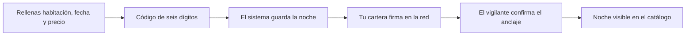

# CU-02 · Poner una noche a la venta (crear la ficha digital)

> En una frase: eliges una habitación y una fecha, le pones precio y el sistema crea su ficha digital para que se pueda vender.

## 1. Para qué sirve

Una noche de hotel se vende como una ficha digital única. Esa ficha junta dos datos: la habitación y la fecha. No hay dos fichas iguales.

Crear la ficha se llama *mintear*. Piensa en ello como dar de alta un producto en el almacén. Hasta que no existe la ficha, esa noche no se puede comprar.

El sistema hace el trabajo en dos partes. Primero guarda los datos de la noche en su base de datos. Después, tu cartera firma la creación de verdad en la red.

La red es de pruebas. Aquí el dinero no vale nada real. Sirve para practicar sin riesgo.

Cuando termina todo, tendrás una noche nueva en el catálogo, lista para que la compre un cliente.

## 2. Quién puede hacerlo

Lo hace un operador del hotel con el rol de emisor. En el sistema ese rol se llama **MINTER**. Sin él, la pantalla no te deja actuar.

Hay tres puertas que deben abrirse a la vez:

- Tu sesión del panel debe tener permiso para ver la pantalla de emisión.
- Tu cartera debe llevar el rol de emisor en la red. Ella es la que firma.
- La ruta interna del panel pide además el rol de super-admin de plataforma.

En la práctica, usa la cuenta y la cartera que el responsable te haya preparado. Si te falta una de las tres, verás un aviso y no podrás seguir.

## 3. Antes de empezar

- Ten tu sesión abierta en el panel del hotel.
- Conecta tu cartera y comprueba que estás en la red correcta.
- Ten a mano la aplicación del móvil con el código de seis dígitos.
- Comprueba que la habitación existe en el catálogo del hotel. Son las 101 a 130 y las 201 a 220.
- Recuerda el tipo de cada habitación: de la 101 a la 115 es simple, de la 116 a la 130 es doble y de la 201 a la 220 es suite. El sistema lo deduce solo.
- Elige una fecha de hoy en adelante. Las fechas pasadas no se admiten.
- Decide un precio mayor que cero. Un precio a cero se rechaza.
- Mira que el contrato no esté en pausa. Si lo está, el botón sale desactivado.

## 4. Paso a paso

1. Abre la pantalla de emisión en `/admin/mint`.
2. Rellena el campo **Habitación** con el número, por ejemplo `118`.
3. Elige la **Fecha** en el calendario. El sistema comprueba que ese día existe de verdad.
4. Escribe el **Precio** de venta en ETH. Es el precio para la primera venta.
5. Si quieres crear varias noches, activa el modo de lote. Puedes preparar hasta 50 de una vez.
6. Pulsa el botón de crear. El sistema revisa la habitación, la fecha y el tipo.
7. Se abre una ventana de confirmación. Escribe tu **código de seis dígitos** y confirma.
8. El sistema comprueba tu rol, el código, el tamaño del lote y el tipo de habitación.
9. También descarta las noches que estén retenidas por una reserva activa.
10. Guarda cada noche como disponible y le pone su secreto de check-in cifrado.
11. Ahora tu cartera te pide firmar la transacción real. Léela y confirma.
12. Espera unos segundos. El vigilante del sistema lee el aviso de la red y marca la noche como anclada.

Así se encadenan los dos mundos:

## 5. Qué ves cuando sale bien

- Un aviso de que la noche se ha guardado, sin errores en rojo.
- Cada noche recibe un identificador formado por el número de habitación y la fecha. Se escribe todo seguido: `AAAAMMDD`.
- Por ejemplo, la habitación 102 del 15 de junio de 2026 se identifica como `10220260615`.
- Tu cartera muestra la transacción firmada y confirmada en la red.
- El vigilante marca la noche como anclada en unos segundos.
- Solo entonces la noche aparece en el catálogo como disponible.
- El precio que pusiste queda guardado y no se toca en la primera venta.
- Si hiciste un lote, ves la lista con todas las noches creadas.

## 6. Si algo va mal

| Lo que ves | Qué significa | Qué hacer |
|-----------|---------------|-----------|
| Aviso de que falta el rol de emisor | Tu sesión o tu cartera no tienen el rol MINTER | Pide el rol al responsable del hotel |
| El botón de crear está desactivado | El contrato está en pausa | Avisa al responsable y espera a que lo reactive |
| «Esa habitación no está registrada» | El número no existe en el catálogo del hotel | Usa una habitación entre la 101 y la 130 o la 201 y la 220 |
| Error en la fecha del formulario | Ese día no existe, como el 30 de febrero | Elige una fecha real del calendario |
| Error de fecha pasada | La fecha es anterior a hoy en hora UTC | Elige una fecha de hoy en adelante |
| «Esa noche ya existe» | Esa habitación y esa fecha ya están a la venta | Cambia la fecha o la habitación |
| Error de precio no válido | El precio está a cero | Escribe un precio mayor que cero |
| Te pide el código otra vez | Falta el código de seis dígitos | Abre la aplicación del móvil y cópialo |
| «Código MFA incorrecto» | El código no cuadra o ya ha caducado | Espera al siguiente código y repite |
| Aviso de lote demasiado grande | Has pasado de 50 noches de golpe | Divide el trabajo en tandas más pequeñas |
| Aviso de noches reservadas | Esas noches están retenidas por una reserva | Quita esas noches y repite con el resto |
| «Se necesita el anclaje en la red» | La noche se guardó sin firmar la transacción | Firma la transacción o avisa al equipo técnico |
| Rechazas la firma en la cartera | No se ha creado nada en la red | Repite el paso y firma esta vez |
| Error del servidor al crear | Algo interno ha fallado | Apunta la hora y avisa al equipo técnico |

## 7. Un ejemplo de verdad

Marta trabaja en la recepción del Hotel Marina del Sol. Por la mañana le toca preparar el inventario de junio.

Abre la pantalla de emisión y elige la habitación 118, que es doble, para el 15 de junio de 2026. Le pone un precio de 0,04 ETH.

Pulsa el botón, escribe el código de seis dígitos de su móvil y confirma. El sistema guarda la noche con el identificador `11820260615`. Después, su cartera le pide la firma y ella acepta.

En unos segundos, la noche aparece en el catálogo como disponible. Queda lista para que la compre un cliente.

Marta intenta crear la misma noche otra vez para probar. El sistema le avisa: esa noche ya existe. No se puede poner dos veces.

Entonces decide ir más rápido. Activa el lote y prepara cinco noches seguidas de la habitación 118. Confirma el código, firma una sola vez y ve las cinco en la lista.

## 8. Preguntas frecuentes

### ¿Qué es exactamente lo que se crea?

Una ficha digital única de una noche. Guarda la habitación, la fecha y el precio. Esa ficha es la que después se vende y se puede revender.

### ¿Por qué me pide el código de seis dígitos si ya estoy dentro?

Es un doble control. Crear noches es una acción importante. El código confirma que eres tú quien la lanza y no alguien que ha cogido tu sesión abierta.

### ¿Qué pasa si cierro la ventana antes de firmar?

La noche puede quedar guardada como pendiente de anclaje. En ese estado no aparece en el catálogo. Vuelve a intentarlo o avisa al equipo técnico para que lo revise.

### ¿La fecha se mira con la hora de España?

No. El sistema usa la hora UTC, que es la del meridiano de Greenwich. En verano va dos horas por detrás de la hora española. Por eso una noche muy justa de hoy puede contar como pasada.
