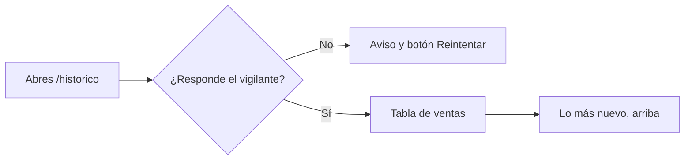

# CU-09 · Mirar el histórico público de ventas

> En una frase: una lista abierta con todas las ventas de noches que han ocurrido, para que cualquiera pueda comprobarlas.

## 1. Para qué sirve

El histórico es el libro público de ventas del hotel. Apunta cada venta de una noche: cuándo, por cuánto y entre qué carteras.

Cualquiera puede mirarlo. No hay nada privado: ni nombres, ni correos, ni documentos. Solo direcciones de cartera, que son seudónimos.

Sirve para dos cosas. Primero, para que un comprador vea que el sistema se usa de verdad. Segundo, para poder comprobar una venta concreta si algo no cuadra.

La información sale de la red, no de una hoja de cálculo. Un programa del sistema lee los avisos de venta y los guarda ordenados.

El orden es siempre el mismo: lo más reciente arriba. Si dos ventas caen en el mismo bloque, se desempata por su posición dentro del bloque. Así la lista nunca baila.

Las ventas no se borran. Aunque una noche se queme después, su venta sigue en el histórico.

## 2. Quién puede hacerlo

Cualquier visitante. La página es pública y no pide sesión ni cartera.

Solo hay una condición para que tenga contenido: el vigilante del sistema tiene que estar funcionando y haber leído al menos una venta.

## 3. Antes de empezar

- No necesitas nada especial. Solo un navegador.
- Si quieres el fichero completo, prepara sitio para descargar un CSV.
- Ten claro que las carteras son seudónimos. Verás direcciones, no personas.
- Si el sistema está en pruebas, habrá pocas ventas. Es normal.

## 4. Paso a paso

1. Abre `/historico`.
2. Espera a que cargue la tabla. La página se lee en cada visita, sin copia guardada.
3. Mira la primera fila: es la venta más reciente.
4. Lee cada fila: identificador, habitación, fecha de la noche, tipo y precio.
5. Fíjate en el tipo de venta: primera venta o reventa.
6. Mira las dos carteras: quién vendió y quién compró.
7. Pasa el cursor por el identificador de la transacción. Si la red tiene explorador, es un enlace.
8. En el móvil verás tarjetas apiladas; en pantalla grande, la tabla completa.
9. Pulsa el botón de **Exportar CSV** si quieres el histórico entero.
10. Abre el fichero con una hoja de cálculo. Trae todas las ventas, sin recortes.

El recorrido, de un vistazo:

## 5. Qué ves cuando sale bien

- Una tabla con una fila por venta.
- La venta más reciente en la primera fila.
- El precio en ETH, además del valor técnico.
- La fecha de la noche y el momento en que se vendió.
- El enlace al explorador de la red, si esa red tiene uno.
- El fichero CSV con 12 columnas: identificador, habitación, fecha, tipo, precio en ETH, precio en wei, tipo de venta, vendedor, comprador, bloque, marca temporal y transacción.
- Si no hay ventas todavía, un aviso claro en vez de una tabla vacía.

## 6. Si algo va mal

| Lo que ves | Qué significa | Qué hacer |
|-----------|---------------|-----------|
| La página dice que no está disponible | El vigilante del sistema no responde | Pulsa **Reintentar**; si sigue igual, avisa al equipo |
| «Todavía no hay ventas» | Nadie ha comprado aún, o el vigilante acaba de arrancar | Vuelve más tarde |
| Una fila no tiene fecha | No se pudo leer la fecha de ese bloque | No pasa nada; el resto de datos sigue bien |
| La celda de fecha sale vacía en el CSV | Misma causa que arriba | Ignora esa celda o avisa al equipo |
| El identificador no es un enlace | Esa red no tiene explorador público | Copia el texto si lo necesitas |
| La descarga no empieza | El navegador bloqueó la descarga | Permite descargas de esta web y reintenta |
| Los precios te parecen raros | Es una red de pruebas, sin valor real | Compáralos con el precio en ETH |
| La tabla tarda | El vigilante está leyendo muchos bloques | Espera y recarga la página |

## 7. Un ejemplo de verdad

El padre de Nuria quiere comprobar que el hotel vende de verdad. Nuria abre el histórico delante de él.

La primera fila es de esa misma tarde: habitación 118, noche del 15 de junio, 0,04 ETH, primera venta. El comprador es `0x7d41…a2b8`, la misma cartera de su amiga Lucía.

Su padre desconfía. Nuria recarga la página y el orden no cambia: siempre lo más nuevo arriba. La misma venta sigue en el mismo sitio.

Luego pulsa **Exportar CSV** y le enseña el fichero. Ahí están todas las ventas, con su bloque y su marca temporal. No aparece ningún nombre, ni correo, ni teléfono.

Su padre se queda tranquilo: el libro está a la vista de todos y nadie lo puede retocar a escondidas.

## 8. Preguntas frecuentes

### ¿Aparecen mis datos personales?

No. La tabla solo muestra direcciones de cartera, precios y fechas. No hay nombres ni correos.

### ¿Por qué se ven las carteras de otros?

Porque la red es pública. Las direcciones son seudónimos: no dicen quién es quién.

### ¿Puedo fiarme de las cifras?

Sí. Salen de los avisos de la red, que no se pueden cambiar a posteriori. El sistema solo los ordena y los enseña.

### ¿Se borran las ventas antiguas?

No. El histórico crece y nunca quita filas. Si una noche se quema, su venta sigue ahí.
