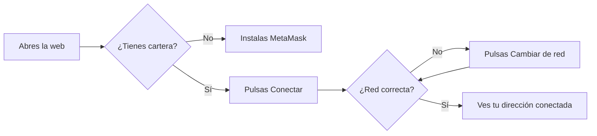

# CU-17 · Conectar la cartera y ponerse en la red correcta

> En una frase: enganchas tu cartera digital al navegador y te pones en la red del hotel para poder comprar, revender y firmar.

## 1. Para qué sirve

Para comprar una noche hace falta una cartera digital. Esa cartera vive en el navegador o en el móvil. No es una cuenta del hotel.

La cartera (en inglés, *wallet*) guarda tus llaves y firma por ti. Con ella demuestras que una compra es tuya. Sin ella, el sistema no puede pedirte ninguna firma.

Este manual trata del primer paso: conectar la cartera y comprobar que estás en la red buena. La red es el grupo de ordenadores donde vive el hotel. Si estás en otra red, no ves lo mismo ni puedes comprar.

Conectar la cartera no cuesta dinero y no compra nada. Solo abre la puerta. La compra de verdad llega después.

El sistema te va guiando. Primero mira si tienes cartera. Luego te deja conectarla. Si estás en la red equivocada, te ofrece cambiarte.

## 2. Quién puede hacerlo

Cualquier visitante. No hace falta cuenta, ni correo, ni contraseña del hotel. Tampoco hace falta ser cliente.

Eso sí, necesitas dos cosas:

- Un navegador con una cartera instalada. Lo normal es la extensión de MetaMask.
- Una cartera que ya exista. Si no la tienes, el propio sistema te da el enlace para instalarla.

La misma barra de conexión se usa en el panel del hotel. Allí sirve para entrar como operador con tu cartera.

## 3. Antes de empezar

- Instala la cartera en el navegador si aún no la tienes. El sistema te muestra un enlace de descarga.
- Crea una cartera nueva o abre una que ya uses.
- Guarda bien la frase de recuperación. Es la llave maestra de tu cartera. No la compartas con nadie.
- Ten a mano la red del hotel. Si no la tienes añadida, el sistema intentará añadirla al cambiarte.
- Comprueba que la cartera no está bloqueada. Algunas piden una contraseña al abrir el navegador.
- No necesitas dinero real. La red del proyecto es de pruebas.

## 4. Paso a paso

1. Abre una página pública del hotel. Por ejemplo, el catálogo de noches.
2. Mira la barra de la cartera. Si no hay cartera instalada, verás un aviso y un enlace para descargar MetaMask.
3. Instala la cartera, créala y vuelve a cargar la página.
4. Pulsa el botón de **Conectar cartera** en esa barra.
5. La cartera se abre con una ventana. Pulsa **Conectar** o **Aceptar**.
6. Si ya estás en la red del hotel, la barra te muestra tu dirección. Has terminado.
7. Si estás en otra red, la barra te avisa y te ofrece un botón para cambiar.
8. Pulsa ese botón. La cartera te pedirá permiso para cambiar de red. Acepta.
9. Si la red no está añadida, la cartera te pedirá añadirla. Acepta también.
10. Repite hasta que la barra muestre tu dirección sin avisos.

Si prefieres verlo como un dibujo, este es el recorrido:

## 5. Qué ves cuando sale bien

- La barra de la cartera deja de pedirte conectar.
- Aparece tu dirección, acortada. Se ve algo parecido a `0x12ab…9f3c`.
- No hay ningún aviso rojo de red.
- El botón **Reservar** de las noches deja de estar apagado.
- Si el entorno tiene dinero de prueba, aparece además el botón para pedirlo.
- Puedes abrir el asistente y preguntar por tus noches.
- Si recargas la página, la cartera recuerda la conexión y vuelve a aparecer conectada.

## 6. Si algo va mal

| Lo que ves | Qué significa | Qué hacer |
|-----------|---------------|-----------|
| «No tienes cartera» con un enlace | El navegador no tiene ninguna cartera instalada | Instala MetaMask desde el enlace y recarga la página |
| Pulsas conectar y no pasa nada | Cerraste la ventana de la cartera o la tienes bloqueada | Abre la cartera, desbloquéala y vuelve a pulsar |
| Sigues desconectado y sin aviso | Rechazaste la conexión en la cartera | Pulsa conectar otra vez y acepta esta vez |
| Aviso de red incorrecta | Tu cartera está en otra red distinta a la del hotel | Pulsa el botón de cambiar de red y acepta |
| «La red no está añadida» | Tu cartera no conoce la red del hotel | Acepta el aviso para añadirla y cambia después |
| «No se pudo cambiar de red» | El cambio falló por un motivo distinto | Cierra y abre la cartera y repite el cambio |
| Rechazas el cambio de red | La cartera se queda en la red antigua | Repite el paso y acepta el cambio |
| El botón de reservar está apagado | No hay cartera conectada en este navegador | Conecta la cartera primero |
| La página parece desconectada un instante | La web aún está leyendo tu cartera al cargar | Espera un segundo; se corrige solo |
| Cambias de red en la cartera a mano | Puede que la web tarde en enterarse | Recarga la página si no se actualiza |

## 7. Un ejemplo de verdad

Lucía entra por primera vez en la web del Hotel Marina del Sol. Quiere ver las noches de junio.

Abre el catálogo y ve un aviso: no tiene cartera. Pulsa el enlace, instala MetaMask en su navegador y crea una cartera nueva. Anota la frase de recuperación en un papel y la guarda.

Vuelve a la web y pulsa **Conectar cartera**. MetaMask le pregunta si quiere conectarse. Acepta. En la barra aparece su dirección, `0x7d41…a2b8`.

Entonces la web le avisa: estás en la red equivocada. Lucía no entiende nada, pero pulsa el botón de cambiar de red. MetaMask le pide añadir la red del hotel y ella acepta. La barra vuelve a mostrarla conectada, sin avisos.

Ahora sí. El botón **Reservar** de la habitación 102 ya se puede pulsar. Lucía respira. Todavía no ha pagado nada.

## 8. Preguntas frecuentes

### ¿Conectar la cartera cuesta dinero?

No. Conectar es gratis. Solo das permiso a la web para ver tu dirección y pedirte firmas. No se mueve ni un céntimo.

### ¿Qué es la red y por qué importa?

La red es el conjunto de ordenadores donde vive el hotel digital. Cada red tiene sus propias noches y su propio dinero de prueba. Si estás en otra, no ves el catálogo correcto.

### ¿Puedo desconectar la cartera?

Sí. La web tiene una opción para desconectarla, normalmente en el menú de tu cartera o de usuario. Al recargar, la cartera puede reconectarse sola si sigue autorizada.

### ¿Tengo que firmar algo solo por conectarme?

No. Conectar no firma ninguna compra. Solo cuando compres o revendas te pedirá firmar una transacción de verdad.
