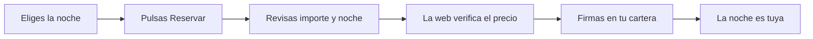

# CU-05 · Comprar una noche al hotel

> En una frase: eliges una noche libre en el catálogo, la pagas con tu cartera y desde ese momento es tuya.

## 1. Para qué sirve

Esta es la compra directa al hotel: la venta principal. Tú pagas y la noche pasa a ser tuya. No hay nadie en medio.

La noche es una ficha digital (un *token*, la ficha que representa esa habitación y esa fecha). El hotel pone cada noche a la venta una sola vez.

Cuando terminas, la ficha lleva tu dirección de cartera. Es tuya de verdad. Puedes enseñarla en recepción o ponerla en reventa más adelante (CU-06).

El precio lo fija el hotel y se paga en ETH (*ether*, la moneda de esta red). El importe va entero al hotel: en la compra directa no hay comisión.

Lo mejor: lo que revisas es lo que firmas. Antes de confirmar, la web vuelve a leer el precio en la red. Si cambió, no te deja firmar a ciegas.

## 2. Quién puede hacerlo

Cualquier persona con una cartera (la cartera digital del móvil) conectada a la red del hotel.

Necesitas saldo suficiente para el precio de esa noche. En la red de pruebas puedes pedir dinero de prueba (eso es el CU-PR-01).

No hace falta registro, ni correo, ni contraseña. Tu cartera es tu identidad.

## 3. Antes de empezar

- Instala y conecta la cartera. Si no sabes cómo, mira el CU-17.
- Comprueba que estás en la red correcta. La web te avisa si no lo estás.
- Ten saldo para el precio de la noche y algo más para la comisión de la red.
- Mira bien la fecha. La noche que compras es una fecha concreta, no un rango.
- Fíjate en si la noche es del hotel o de otro cliente. Las de otro cliente van marcadas como **Reventa**.
- Decide tu presupuesto. El precio se muestra en ETH.

## 4. Paso a paso

1. Abre `/catalogo` en el navegador.
2. Filtra si quieres: tipo de habitación, mes, precio máximo o número de habitación.
3. Busca la noche que te encaje y mira su precio en ETH.
4. Pulsa **Reservar** en la tarjeta de esa noche.
5. Si no tienes la cartera conectada, la web te la pide. Conéctala.
6. Si estás en otra red, la web te ofrece cambiarla. Acepta en tu cartera.
7. Si te falta saldo, verás cuánto te falta. Consigue fondos y vuelve a empezar.
8. Se abre la ventana **Revisar tu reserva**. Léela con calma.
9. Comprueba los cinco datos: **Habitación**, **Noche**, **Importe**, **Token** y **Contrato**.
10. La web consulta el precio en la red otra vez. Espera a que la verificación termine.
11. Pulsa **Confirmar y firmar**.
12. Tu cartera se abre. Revisa la operación y fírmala.
13. Espera unos segundos a que la red la confirme.

Si prefieres verlo como un dibujo, este es el recorrido:

Hasta que no firmas, no se cobra nada. Si te arrepientes antes de firmar, cierra la ventana y ya está.

## 5. Qué ves cuando sale bien

- El mensaje **¡Noche reservada!** en la ventana.
- Un recibo con el enlace para ver la transacción en el explorador.
- El botón **Ver en Mis noches**.
- Si cierras la ventana antes de tiempo, la reserva sigue igual. Aparecerá en **Mis noches**.
- En `/mis-noches` ves la noche con la etiqueta **Tuya**.
- En el catálogo, esa noche ya no se ofrece a nadie más.
- La dirección de tu cartera aparece como dueña de la ficha.

## 6. Si algo va mal

| Lo que ves | Qué significa | Qué hacer |
|-----------|---------------|-----------|
| «Saldo insuficiente para reservar esta noche» | No te llega el saldo para el precio | Añade fondos o pide dinero de prueba; la web te dice cuánto falta |
| «El precio de esta noche acaba de cambiar» | El precio de la red ya no es el que viste | Cierra la reserva y vuelve a abrirla con el precio nuevo |
| «No pudimos verificar el precio on-chain» | La web no pudo leer el precio en la red | Revisa tu conexión y pulsa **Reintentar verificación** |
| «No se completó la reserva» | La transacción falló o se quedó sin gas | Mira el motivo en tu cartera e inténtalo otra vez |
| «Has cancelado la firma» | Cerraste la ventana de la cartera | No pasa nada; vuelve a pulsar **Reservar** |
| La tarjeta no tiene botón **Reservar** | El hotel ha puesto las ventas en pausa | Espera a que se reactive |
| Un aviso de que la noche ya no está | Alguien la compró un segundo antes | Elige otra noche del catálogo |
| Un aviso de que la noche ha expirado | La fecha de esa noche ya pasó | Elige una noche futura |
| Tu cartera avisa de la red equivocada | Estás conectado a otra red | Pulsa el botón para cambiar de red |
| Se abre la cartera y no entiendes el aviso | La red ha rechazado la operación | Cancela, lee el aviso y prueba de nuevo |

## 7. Un ejemplo de verdad

Marta quiere una noche en el hotel para el 15 de junio. Entra en el catálogo y ve 30 noches.

Le gusta la habitación 102, doble, a 0,04 ETH. Pulsa **Reservar**.

No tiene la cartera conectada. La conecta y acepta cambiar de red. Después ve la ventana de revisión.

En la ventana comprueba la habitación 102, la noche del 15 de junio, el importe de 0,04 ETH y el contrato. Todo cuadra.

La web verifica el precio en la red y le deja firmar. Marta firma en su cartera y espera unos segundos.

Aparece **¡Noche reservada!**. Pulsa **Ver en Mis noches** y allí ve la habitación 102 con la etiqueta **Tuya**.

## 8. Preguntas frecuentes

### ¿Puedo revender la noche que acabo de comprar?

Sí. Cuando la tengas en **Mis noches**, podrás ponerle un precio y sacarla al mercado. Eso se cuenta en el CU-06.

### ¿El hotel se queda una comisión de esta compra?

No. En la compra directa el hotel recibe el importe entero. El hotel solo se queda una parte en las reventas.

### ¿Qué pasa si me arrepiento después de firmar?

La firma en la red no se deshace. Lo que sí puedes hacer es poner la noche en reventa y recuperar parte del dinero.

### ¿Puedo comprar dos veces la misma noche?

No. Cada noche se vende una sola vez al hotel. En cuanto la compras, desaparece del catálogo y no vuelve.
