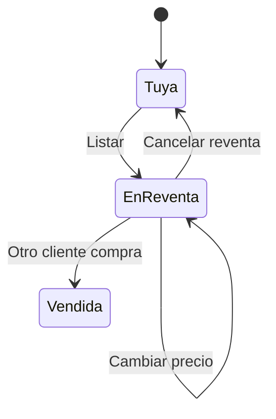

# CU-06 · Poner mi noche en reventa (y quitarla)

> En una frase: le pones precio a una noche que ya es tuya y la dejas en el mercado para que otro cliente la compre.

## 1. Para qué sirve

Si al final no puedes usar tu noche, no la pierdes. La pones en reventa y otro cliente la compra.

Tú decides el precio. El hotel se queda su parte (el *royalty*, la comisión del hotel) solo cuando la reventa se cierra.

Listar es solo apuntar un precio. No se mueve la ficha de noche ni se mueve dinero. La noche sigue en tu cartera.

Puedes cambiar el precio cuando quieras. Y puedes quitarla del mercado cuando quieras, sin dar explicaciones.

Hay unas pocas reglas. La noche tiene que ser tuya de verdad. Tiene que haberse vendido antes por el hotel. No puede estar ya usada en recepción. Y no puede haber caducado.

El hotel fija un precio mínimo de reventa (ahora mismo, 0,01 ETH). Es para que nadie tire los precios y se salte la comisión del hotel.

## 2. Quién puede hacerlo

Quien tiene la noche en su cartera. Es decir, el dueño o la dueña de esa ficha digital.

Da igual si la compraste al hotel o a otro cliente. Si es tuya y no la has usado, puedes revenderla.

Necesitas la cartera conectada y estar en la red correcta. La web te lo pide sola en **Mis noches**.

Una noche que ya se usó en recepción no se puede revender. Tampoco una noche que ya pasó de fecha.

## 3. Antes de empezar

- Conecta tu cartera en `/mis-noches`. Si no sabes, mira el CU-17.
- Comprueba que estás en la red correcta.
- Mira qué noches tienes. Las que no están en venta llevan la etiqueta **Tuya**.
- Piensa un precio en ETH. Tiene que superar el mínimo del hotel.
- Ten en cuenta la comisión del hotel. Se descuenta del precio cuando alguien compra.
- Elige una noche que no hayas usado ni caducado.

## 4. Paso a paso

1. Abre `/mis-noches` en el navegador.
2. Conecta la cartera si te lo pide. Si estás en otra red, cámbiala.
3. Busca la noche que quieres revender. Mira su etiqueta.
4. Si pone **Tuya**, esa noche no está en venta. Si pone **En reventa**, ya está publicada.
5. En una noche con etiqueta **Tuya**, escribe el precio en el campo **Precio de reventa (ETH)**.
6. Pulsa **Listar**.
7. Firma la operación en tu cartera.
8. Espera unos segundos a que la red la confirme.
9. Si quieres otro precio, pulsa **Cambiar precio**, escribe el nuevo y pulsa **Guardar nuevo precio**. Firma otra vez.
10. Si quieres retirarla, pulsa **Cancelar reventa** y firma.

El ir y venir de una noche, en dibujo:

Aviso: el precio mínimo no se ve en la pantalla. Si pones uno más bajo, el sistema lo rechaza al firmar.

## 5. Qué ves cuando sale bien

- La etiqueta de la noche cambia a **En reventa**.
- Debajo aparece el texto **Precio de reventa** con tu cifra.
- La noche sale en la página `/reventa`, a la vista de los compradores.
- Si cambias el precio, se ve el nuevo en cuanto la red confirma.
- Si cancelas la reventa, la etiqueta vuelve a **Tuya**.
- En todo el proceso, la noche sigue en tu cartera. Nadie te la quita.
- Tu saldo en ETH no cambia por listar ni por cancelar.

## 6. Si algo va mal

| Lo que ves | Qué significa | Qué hacer |
|-----------|---------------|-----------|
| «Introduce un precio mayor que 0.» | Dejaste el precio vacío o en cero | Escribe un precio en ETH y vuelve a pulsar **Listar** |
| «El precio está por debajo del mínimo de reventa que fija el hotel.» | Tu precio no llega al mínimo | Sube el precio por encima del mínimo del hotel |
| «No eres la propietaria de esta noche.» | Esa noche no está en tu cartera | Revisa con qué cartera estás conectado |
| «La noche ha expirado y no puede listarse.» | La fecha de la noche ya pasó | No se puede revender; retírala de tu lista |
| «Esta noche ya se consumió en recepción y no puede revenderse.» | Ya se usó el check-in | No se puede revender esa noche |
| «Esta noche no está en reventa.» | Intentas cancelar algo que no está listado | Actualiza la página: quizá ya la quitaste |
| «Has cancelado la firma. Puedes intentarlo de nuevo cuando quieras.» | Cerraste la ventana de la cartera | Vuelve a intentarlo cuando quieras |
| «No se pudo completar la operación. Revisa la red y vuelve a intentarlo.» | La transacción falló | Revisa tu conexión y la red, y prueba otra vez |
| No ves ninguna noche en **Mis noches** | La cartera no está conectada o es otra | Conecta la cartera correcta y espera a que cargue |

## 7. Un ejemplo de verdad

Marta compró la habitación 102 para el 15 de junio a 0,04 ETH. Al final le sale un viaje de trabajo y no puede ir.

Entra en **Mis noches** y ve la noche con la etiqueta **Tuya**. Escribe 0,05 ETH y pulsa **Listar**. Firma en su cartera.

La etiqueta cambia a **En reventa** y la noche aparece en el mercado. Al día siguiente piensa que 0,05 ETH es mucho y pulsa **Cambiar precio**. Pone 0,045 ETH y guarda.

Esa tarde una amiga le dice que se queda con la noche. Marta pulsa **Cancelar reventa**, firma y la noche vuelve a la etiqueta **Tuya**. La habitación 102 sigue siendo suya en todo momento.

## 8. Preguntas frecuentes

### ¿Cobro algo solo por listar la noche?

No. Listar solo apunta un precio. El dinero llega cuando otro cliente compra la noche y tú lo cobras después.

### ¿Cuánto se queda el hotel de mi reventa?

Una comisión fija por tipo de habitación: un 5 % en simple y doble, y un 10 % en suite. El resto es para ti.

### ¿Puedo revender una noche que compré en reventa?

Sí. Si la compraste a otro cliente, la noche es tuya igual y puedes volver a ponerla en venta.

### ¿La noche desaparece de mi cartera mientras está en reventa?

No. La ficha sigue en tu cartera. Solo cambia cuando alguien la compra de verdad. Hasta entonces, puedes retirarla cuando quieras.
