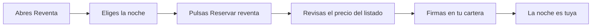

# CU-07 · Comprar una noche que otro cliente revende

> En una frase: le compras a otro cliente una noche que ya no va a usar, con la misma revisión y la misma firma que en la compra al hotel.

## 1. Para qué sirve

El mercado de reventa es la otra cara del catálogo. Aquí no vende el hotel, venden otros clientes.

Puede que esa noche ya no esté en el catálogo, o que el precio te interese más. En la página `/reventa` ves todas las noches que otros han puesto a la venta.

El precio lo pone quien vende, no el hotel. Y el dinero se reparte en el mismo momento de la compra.

El hotel se queda su parte: un 5 % en habitaciones simples y dobles, y un 10 % en suites. Eso es el *royalty* (la comisión del hotel).

El resto va para el vendedor. Ojo: no lo recibe al instante. El sistema se lo deja apuntado y él lo cobra después desde su cuenta.

Tú recibes la ficha de la noche en la misma operación. Desde ese momento es tuya, igual que si la hubieras comprado al hotel.

## 2. Quién puede hacerlo

Cualquier persona con una cartera (la cartera digital del móvil) conectada a la red del hotel.

Necesitas saldo suficiente para el precio del listado. En la red de pruebas puedes pedir dinero de prueba (eso es el CU-PR-01).

No necesitas permiso de nadie. Si el listado está activo y tienes saldo, puedes comprar.

## 3. Antes de empezar

- Conecta tu cartera. Si no sabes, mira el CU-17.
- Comprueba que estás en la red correcta.
- Ten saldo para el precio y algo más para la comisión de la red.
- Mira la habitación y la fecha. Es una noche concreta, no un rango.
- Compara con el catálogo. A veces el hotel tiene esa misma noche más barata.
- Recuerda que el precio lo fija otro cliente y puede cambiarlo o retirarlo.

## 4. Paso a paso

1. Abre `/reventa` en el navegador.
2. Mira el contador de arriba: te dice cuántas noches hay en venta.
3. Repasa las tarjetas. Las de reventa llevan la etiqueta **Reventa**.
4. Lee habitación, fecha y precio. El precio lo puso el cliente que vende.
5. Pulsa **Reservar reventa** en la que te guste.
6. Si no tienes la cartera conectada, conéctala. Si estás en otra red, cámbiala.
7. Se abre la ventana **Revisar tu reserva**. Léela con calma.
8. Comprueba los cinco datos: **Habitación**, **Noche**, **Importe**, **Token** y **Contrato**.
9. La web vuelve a leer el precio del listado en la red. Espera a la verificación.
10. Pulsa **Confirmar y firmar**.
11. Firma en tu cartera y espera unos segundos a que la red confirme.

El recorrido, en dibujo:

Si el vendedor retira el listado o cambia el precio mientras revisas, la web no te deja firmar. Vuelves al mercado y eliges otra.

## 5. Qué ves cuando sale bien

- El mensaje **¡Noche reservada!** en la ventana.
- Un recibo con el enlace para ver la transacción en el explorador.
- El botón **Ver en Mis noches**.
- En `/mis-noches` ves la noche con la etiqueta **Tuya**.
- La noche desaparece de `/reventa`. Ya no la puede comprar nadie más.
- El vendedor y el hotel quedan con su parte apuntada; cada uno la cobra cuando quiere.

## 6. Si algo va mal

| Lo que ves | Qué significa | Qué hacer |
|-----------|---------------|-----------|
| «El precio de esta noche acaba de cambiar» | El vendedor cambió el precio o retiró el listado | Cierra la reserva y elige otra noche en `/reventa` |
| «No pudimos verificar el precio on-chain» | La web no pudo leer el listado en la red | Revisa tu conexión y pulsa **Reintentar verificación** |
| «Saldo insuficiente para reservar esta noche» | No te llega el saldo para el precio | Añade fondos o pide dinero de prueba |
| «No se completó la reserva» | La transacción falló o se quedó sin gas | Mira el motivo en tu cartera e inténtalo otra vez |
| «Has cancelado la firma» | Cerraste la ventana de la cartera | No pasa nada; vuelve a intentarlo |
| «Ahora mismo no hay noches en reventa» | Nadie tiene una noche publicada | Mira el catálogo del hotel o vuelve más tarde |
| «No se pudo cargar el mercado de reventa» | La lectura de la red ha fallado | Revisa tu conexión y recarga la página |
| Un aviso de pausa en la parte de arriba | El hotel ha parado las compras | Espera a que se reactive |
| Un aviso de que la noche ya no vale | El vendedor la usó en recepción o caducó | Elige otra noche del mercado |
| La tarjeta no responde al pulsar | La cartera está bloqueada o en otra red | Abre tu cartera, desbloquéala y revisa la red |

## 7. Un ejemplo de verdad

Andrés quiere una noche para el 20 de junio, pero en el catálogo ya no queda ninguna. Un amigo le dice que mire en reventa.

Abre `/reventa` y ve 4 noches. Una es la habitación 205, suite, para el 20 de junio, a 0,05 ETH. La vende Marta.

Andrés compara: en el catálogo no hay nada para ese día. Pulsa **Reservar reventa**.

Revisa la habitación 205, la fecha y el importe. Todo cuadra. La web verifica el precio del listado y le deja firmar.

Andrés firma y a los pocos segundos ve **¡Noche reservada!**. El hotel apunta 0,005 ETH de comisión (el 10 % de una suite) y Marta se queda con el resto para cobrarlo cuando quiera.

La noche aparece en **Mis noches** con la etiqueta **Tuya**. Andrés ya puede pedir su resguardo para recepción.

## 8. Preguntas frecuentes

### ¿Quién me vende la noche en la reventa?

Otro cliente que ya la compró y no la va a usar. No es el hotel.

### ¿Cuánto se lleva el hotel de esta compra?

Depende del tipo de habitación: un 5 % en simple y doble, y un 10 % en suite. El resto es para quien vende.

### ¿El vendedor cobra en el momento?

No. Su parte queda apuntada en el sistema y él la cobra después desde su cuenta, cuando quiera.

### ¿Puedo revender yo la noche que acabo de comprar?

Sí. En cuanto sea tuya, puedes ponerle precio en **Mis noches** y volver a sacarla al mercado.
