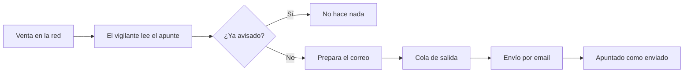

# CU-10 · Avisar al hotel por email cada vez que hay una venta

> En una frase: cada vez que alguien compra una noche, al hotel le llega un correo solito, sin que nadie tenga que mirar el panel.

## 1. Para qué sirve

Cuando se vende una noche, el hotel tiene que enterarse. Antes había que abrir el panel y mirar. Eso funciona, pero se te escapa la venta si no estás delante.

Este caso de uso resuelve eso. Un programa del sistema vigila la red. En cuanto ve una venta, manda un correo a la dirección del hotel.

No hay que pulsar nada. Es un proceso de fondo, como un vigilante nocturno que no duerme. Tú solo abres el correo.

El aviso cubre los dos tipos de venta. La **venta primaria** es la que hace el propio hotel. La **reventa** es la que hace un cliente que ya tenía la noche.

El correo llega aunque el vigilante se haya reiniciado. El sistema guarda por dónde iba y sigue desde ahí. Así no pierde ventas por el camino.

## 2. Quién puede hacerlo

Aquí nadie «hace» nada a mano. Lo hace el sistema, concretamente un proceso llamado *mini-worker* (un programa que trabaja en segundo plano).

El que recibe el correo es el administrador del hotel, en la dirección configurada en `ADMIN_EMAIL`.

Existe además un segundo canal de aviso, en una dirección distinta y fija del hotel. Lo trata como canal secundario, por si acaso. Conviene confirmar con el equipo técnico si debe seguir activo.

No hace falta sesión, ni cartera, ni rol. El aviso no depende de que estés conectado.

## 3. Antes de empezar

- Que el responsable técnico haya puesto la dirección de correo del hotel en `ADMIN_EMAIL`.
- Que el servidor de correo saliente esté configurado. Si falta, el vigilante ni arranca.
- Que el vigilante esté en marcha. Si está parado, no hay avisos.
- Que la base de datos esté levantada. El vigilante la necesita para no repetir correos.
- Mira la carpeta de spam la primera vez. El correo sale de una dirección automática.
- Ten claro que esto es la red de pruebas. Los importes que verás no son dinero real.

## 4. Paso a paso

Este recorrido lo hace el sistema solo. Te lo cuento para que sepas por dónde va tu correo.

1. Alguien compra una noche. El contrato de la red deja un apunte público de esa venta.
2. El vigilante despierta cada pocos segundos y lee los apuntes nuevos.
3. Por cada apunte, calcula una huella única: la transacción y su posición.
4. Consulta su lista. Si esa huella ya está apuntada, no manda nada. Es un candado contra repetidos.
5. Descifra la ficha de la noche: qué habitación es, de qué fecha y de qué tipo.
6. Monta el correo y lo deja en una cola de salida. La cola es una lista de trabajos pendientes.
7. El que envía de verdad coge el trabajo y habla con el servidor de correo.
8. Solo si el envío sale bien, marca la huella como enviada y avanza su marcador de bloque.
9. Si el envío falla, reintenta cinco veces con esperas cada vez más largas.
10. Tú abres el correo y te enteras de la venta sin tocar el panel.

El recorrido, de un vistazo:

## 5. Qué ves cuando sale bien

- Un correo nuevo en la bandeja del hotel.
- El asunto dice el tipo de venta, la habitación y la fecha. Por ejemplo: **Venta primaria: habitación 214 · 2026-06-15**.
- El cuerpo repite estos datos: habitación, tipo de habitación, tipo de venta, precio, comprador y transacción.
- Un correo por cada venta. Si se venden diez noches, llegan diez correos.
- El correo no lleva datos personales. Ni nombres, ni correos de clientes, ni documentos.
- El precio aparece en **wei**. El *wei* es la unidad más pequeña del ether, como los céntimos del euro. Es un número muy largo.
- El comprador sale como una dirección de cartera, del estilo `0x7d41…a2b8`. Es un seudónimo, no un nombre.
- Si abres el estado del vigilante, verás que el aviso de correo no está degradado.

## 6. Si algo va mal

| Lo que ves | Qué significa | Qué hacer |
|-----------|---------------|-----------|
| No llega ningún correo y sí hubo ventas | El vigilante está parado o la dirección está mal | Avisa al equipo técnico y revisa `ADMIN_EMAIL` |
| El correo está en spam | La dirección de salida no es conocida | Márcalo como «no es spam» |
| Llega un correo repetido de la misma venta | El sistema garantiza «al menos una vez», no «una sola» | Ignora el duplicado; es la excepción, no la norma |
| «Aviso de correo degradado» en el estado | El envío lleva fallando un rato | Mira el servidor de correo con el equipo técnico |
| El correo llega sin precio | No se pudo leer ese dato del apunte | Fíjate en la transacción y consúltala al equipo |
| El precio te parece altísimo | Está en wei, no en ETH | Divide entre un uno seguido de 18 ceros |
| Llegan dos correos a dos direcciones distintas | Hay un canal secundario activo | Confírmalo con el equipo técnico |
| El correo llega tarde | El vigilante estaba leyendo muchos bloques | Espera; acaba llegando |

## 7. Un ejemplo de verdad

El Hotel Marina del Sol vende la habitación 214 para la noche del 15 de junio. El dueño, Andrés, está en una comida y no mira el panel.

A los pocos segundos le suena el móvil. Es un correo con el asunto **Venta primaria: habitación 214 · 2026-06-15**.

Lo abre. Dentro ve el precio, la dirección de cartera del comprador y el identificador de la transacción. No aparece ningún nombre de cliente, y así debe ser.

Andrés reenvía el correo a recepción para que preparen la habitación. Se entera de la venta sin haber abierto el ordenador.

Esa misma tarde, otro cliente revende su noche. Le llega un segundo correo, este con el asunto **Venta secundaria**. El sistema lo distingue solo, sin que Andrés haga nada.

## 8. Preguntas frecuentes

### ¿Tengo que activar algo para recibir los avisos?

No. El aviso es automático. Lo único que hace falta es que la dirección del hotel esté bien puesta y que el vigilante esté en marcha.

### ¿Qué diferencia hay entre venta primaria y reventa?

La primaria la hace el hotel: vende una noche que él creó. La reventa la hace un cliente que ya tenía esa noche y la pone a la venta otra vez.

### ¿Puede llegarme dos veces el mismo aviso?

En raras ocasiones, sí. El sistema promete avisar al menos una vez, no exactamente una. Si el envío se corta a medias, puede repetirlo. Es preferible un duplicado a perder una venta.

### ¿El correo lleva datos personales del cliente?

No. Solo lleva la habitación, la fecha, el precio, la dirección de cartera del comprador y la transacción. Nada de nombres, correos ni documentos.

### ¿Por qué el precio sale en un número tan largo?

Porque va en wei, la unidad mínima del ether. Es como enseñar los céntimos en lugar de los euros. El equipo técnico puede cambiarlo si prefieres verlo en ETH.
