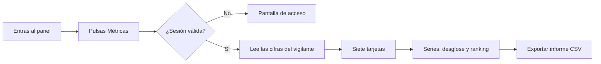

# CU-11 · Ver las métricas del negocio en el panel

> En una frase: abres una pantalla del panel y ves de un vistazo cuánto has vendido, cuánto se ha revendido y cómo va la ocupación.

## 1. Para qué sirve

El panel del hotel tiene una pantalla de métricas. Es el cuadro de mando del negocio. Reúne en un solo sitio lo que ha pasado con las noches.

Sin ella tendrías que sumar ventas a mano o rebuscar en el histórico. Aquí está todo ya contado y ordenado.

Las cifras no salen de una hoja de cálculo. Salen de los apuntes públicos de la red. Un programa del hotel los va sumando por detrás.

La pantalla te enseña siete tarjetas. Cada una con su número grande y su fórmula al pie, para que sepas de dónde sale.

Debajo hay tres bloques más: las ventas por mes, el desglose por tipo de habitación y el ranking de noches más revendidas.

También puedes descargar el informe en CSV. Un CSV es un fichero de texto que se abre con cualquier hoja de cálculo.

## 2. Quién puede hacerlo

Cualquier persona con una sesión de back-office válida y un rol de gestión. En la práctica, el dueño y el personal de recepción.

Si no tienes sesión, la pantalla no se abre. Verás la pantalla de acceso y nada más. Las cifras ni siquiera viajan a tu navegador.

Recuerda que hay dos permisos distintos. La sesión te deja ver el panel. La cartera te deja firmar acciones. Para mirar métricas solo hace falta la sesión.

## 3. Antes de empezar

- Ten tu usuario, tu contraseña y el código de seis dígitos del móvil a mano.
- Comprueba que tienes un rol de gestión. Sin él, la pantalla no te deja entrar.
- Que el vigilante del sistema esté en marcha. Él es quien va sumando las cifras.
- Que la base de datos esté levantada. El panel lee de ahí, no de la red.
- Ten claro que estás en la red de pruebas. Los importes son en ETH y no valen dinero real.
- Si vas a descargar el informe, prepara una carpeta para el fichero.

## 4. Paso a paso

1. Entra al panel del hotel con tu usuario, tu contraseña y el código de seis dígitos.
2. En el menú lateral, pulsa **Métricas**. También puedes abrir la dirección `/admin/dashboard`.
3. Si no hay sesión válida, verás la pantalla de acceso en lugar del panel. Entra primero.
4. Arriba del todo verás el periodo: **Periodo: hasta el bloque N**. Y debajo, el corte aproximado.
5. Justo después, la zona horaria con la que se agrupan los meses. La del hotel es `Europe/Madrid`.
6. Lee las tarjetas. La primera es **Vendido (primaria)**: el total que ha ingresado el hotel.
7. Sigue con **Royalties acumulados** y **Volumen de reventa**. Son dos cosas distintas, no las mezcles.
8. Mira los conteos: **Noches vendidas**, **Noches minteadas** y **Noches quemadas**.
9. La última tarjeta es **Ocupación comercial**. Es el porcentaje de noches minteadas que se han vendido.
10. Baja a **Ventas por mes**. Cada barra es un mes natural, con la hora del hotel.
11. Mira **Desglose por tipo de habitación**: simple, doble y suite, separando hotel y reventa.
12. Termina en **Noches más revendidas**, el ranking de las que cambian de manos más veces.
13. Si quieres el detalle, pulsa **Exportar informe CSV** y abre el fichero con tu hoja de cálculo.

El recorrido, de un vistazo:

## 5. Qué ves cuando sale bien

- Las siete tarjetas con su número grande y su fórmula explicada al pie.
- El periodo, con el último bloque contado y una hora de corte aproximada.
- La zona horaria declarada: los meses se agrupan con la hora del hotel.
- Los importes en ETH, que es la moneda de la red de pruebas.
- La gráfica de ventas por mes, con una barra por mes natural.
- El desglose por tipo de habitación, con el hotel y la reventa separados.
- El ranking de noches más revendidas, con puesto, habitación, fecha y número de reventas.
- El botón **Exportar informe CSV** para bajarte el informe completo.
- Si exportas, el fichero trae las mismas cifras que ves en pantalla. No hay sorpresas.

## 6. Si algo va mal

| Lo que ves | Qué significa | Qué hacer |
|-----------|---------------|-----------|
| Solo ves la pantalla de acceso | No hay sesión válida | Entra con usuario, contraseña y código |
| «No se pudieron cargar las métricas» | El vigilante o la base de datos no responden | Pulsa **Reintentar**; si sigue igual, avisa al equipo |
| Falta el rol necesario para este panel | Tu sesión no tiene rol de gestión | Entra con un operador que sí lo tenga |
| Las cifras llevan rato sin moverse | La red no responde, pero el panel no avisa | Confirma el estado con el equipo técnico |
| **Ocupación comercial** marca 0 % | Todavía no hay noches minteadas | Es normal al principio; espera a crear noches |
| «N ventas sin fecha de bloque» | Esas ventas cuentan en los totales, pero no en la serie mensual | No pasa nada; el aviso es informativo |
| Las gráficas salen vacías | No hay ventas o el histórico acaba de arrancar | Vuelve más tarde |
| «Error del servidor» al cargar | Falta configuración interna | Avisa al responsable técnico |
| La descarga del CSV no empieza | El navegador bloqueó la descarga | Permite descargas de esta web y reintenta |
| Los importes te parecen raros | Es una red de pruebas, sin valor real | Fíjate en la fórmula de cada tarjeta |

## 7. Un ejemplo de verdad

Andrés es el dueño del Hotel Marina del Sol. Cada mañana abre el panel con su usuario y su código de seis dígitos.

Pulsa **Métricas** y mira la primera tarjeta: **Vendido (primaria)**. Esta semana marca 2,4 ETH. La semana pasada marcaba 2,1.

Baja a **Ventas por mes** y ve la barra de junio más alta que la de mayo. No hace falta calcular nada: ya está contado.

Luego mira **Noches más revendidas**. La habitación 214 del 15 de junio aparece la primera, con cuatro reventas. Esa noche se mueve mucho.

Antes de la reunión de equipo, pulsa **Exportar informe CSV**. Abre el fichero y enseña las cifras en la pantalla grande.

Nadie ha tocado una calculadora. Y las cifras son las mismas que están a la vista en el panel, sin retoques.

## 8. Preguntas frecuentes

### ¿De dónde salen estas cifras?

De los apuntes públicos de la red. El vigilante del hotel los lee, los suma y los guarda en la base de datos. El panel solo los enseña.

### ¿Puedo crearme yo las cifras o cambiarlas?

No. La pantalla es solo de lectura. No firma nada ni modifica la red. Solo lee lo que ya ha pasado.

### ¿Qué significa «Ocupación comercial»?

Es el porcentaje de noches creadas que se han vendido por el hotel. Se calcula así: noches vendidas dividido entre noches minteadas. Si aún no hay noches creadas, muestra 0 %.

### ¿Las reventas cuentan como noches vendidas?

No en ese contador. **Noches vendidas** cuenta solo las ventas del hotel. Las reventas aparecen en su propia tarjeta y en el ranking.

### ¿Por qué el panel no avisa si la red se cae?

Porque lee las últimas cifras guardadas y no consulta la red en ese momento. Si la red falla, las cifras se quedan quietas pero no dan error. Avísalo al equipo técnico si lo notas.

### ¿Cada cuánto se actualizan las cifras?

Cada pocos segundos, cuando el vigilante lee apuntes nuevos. Si acabas de vender, recarga la página y deberían aparecer.
