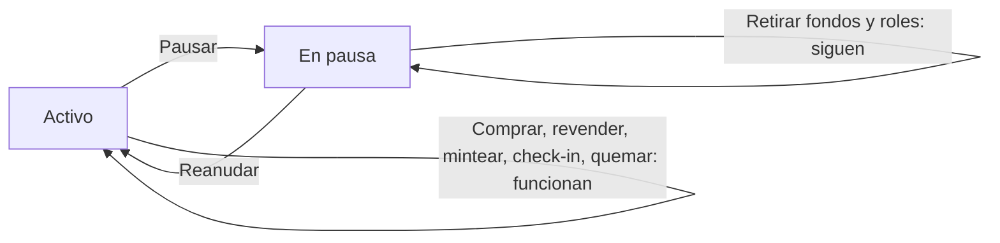

# CU-14 · Parar el sistema en una emergencia y volver a arrancarlo

> En una frase: aprietas el botón rojo para congelar las operaciones cuando algo va mal y lo sueltas cuando ya está arreglado.

## 1. Para qué sirve

A veces hay que parar. Un fallo raro, un precio mal puesto, una cuenta tocada o una revisión del sistema. En ese momento lo último que quieres es que siga entrando gente a comprar.

Este caso de uso es el freno de mano. Con el sistema **en pausa**, las operaciones de riesgo se cancelan solas y la web avisa.

No es un botón de apagar y encender. El sistema sigue vivo: se puede consultar el catálogo, el histórico y el panel. Lo que se bloquea son los movimientos que cambian cosas.

La pausa no es total. Algunas cosas siguen funcionando a propósito, para poder arreglar el problema sin quedarse atrapado. Por ejemplo, retirar fondos o gestionar permisos.

Cuando el problema está resuelto, reanudas y todo vuelve a funcionar como antes.

## 2. Quién puede hacerlo

Solo la cuenta que tiene la llave de **pausador** (`PAUSER_ROLE`, el permiso del contrato para parar y arrancar el sistema).

Es una llave como las demás: se concede desde la sección de roles y el contrato la comprueba al firmar. Si no la tienes, la operación se rechaza.

El panel de pausa te deja entrar si tu cuenta trae la llave. Aun así, quien manda de verdad es el contrato, no la pantalla.

Antes de usarla, asegúrate de que quien la tiene sabe cuándo hay que parar. Parar de más también cuesta dinero.

## 3. Antes de empezar

- Ten abierta una sesión en el panel con una cuenta que tenga la llave de pausador.
- Mira el estado actual en la tarjeta grande: **ACTIVO** o **EN PAUSA**.
- Si ya está en pausa, el botón **Pausar** sale apagado. No tiene sentido parar dos veces.
- Si está activo, el botón **Reanudar** sale apagado. No se puede arrancar lo que ya está en marcha.
- Ten claro qué vas a parar y por qué. Si es por un incidente, avisa al equipo antes de tocar.
- Que la cartera que firma tenga saldo para pagar la comisión de red.

## 4. Paso a paso

1. Abre el panel del hotel y entra en la sección **Pausa** (la dirección es `/admin/pausa`).
2. Lee el estado. Si pone **ACTIVO**, el sistema está funcionando con normalidad.
3. Pulsa **Pausar**. Aparece una ventana con el aviso de lo que va a pasar.
4. Lee el aviso y confirma. Tu cartera te pide la firma.
5. Firma y espera a que la red confirme. El panel te va contando el estado.
6. Cuando termine, la tarjeta cambia a **EN PAUSA**. A partir de ahí, las compras, las reventas, el alta de noches, el check-in y la quema se rechazan.
7. Arregla el problema. Mientras tanto, el catálogo y el histórico se pueden seguir mirando.
8. Para volver a la normalidad, pulsa **Reanudar** y confirma igual que antes.
9. Cuando la tarjeta vuelva a **ACTIVO**, prueba una operación pequeña para comprobar que todo responde.

## 5. Qué ves cuando sale bien

- La tarjeta del panel cambia de **ACTIVO** a **EN PAUSA**, o al revés.
- El contrato deja apuntado un evento `Paused` al parar y un `Unpaused` al arrancar.
- Con la pausa puesta, quien intente comprar recibe un aviso claro: el sistema está parado.
- El botón de quemar de la sección **Caducadas** avisa y se deshabilita mientras dure la pausa.
- Las lecturas no se rompen: catálogo, histórico y panel siguen enseñando datos.
- Retirar fondos y gestionar roles siguen funcionando durante la pausa. Es lo previsto.
- Al reanudar, las compras vuelven a pasar sin tocar nada más.

## 6. Si algo va mal

| Lo que ves | Qué significa | Qué hacer |
|-----------|---------------|-----------|
| «No tienes permiso para esta acción» | Tu cuenta no tiene la llave de pausador | Entra con la cuenta que sí la tiene |
| El botón Pausar sale apagado | El sistema ya está en pausa | Mira la tarjeta: quizá solo tengas que reanudar |
| El botón Reanudar sale apagado | El sistema ya está activo | No hay nada que arrancar |
| Un cliente no puede comprar | La pausa está puesta | Dile que el sistema está parado y avisa al equipo |
| Un cliente puede revender durante la pausa | Publicar o quitar un anuncio sí está permitido | Solo se bloquea **comprar** esa reventa |
| En recepción sale «contrato en pausa» | El check-in choca con la pausa | Reanuda el sistema antes de dar entrada |
| La pausa no se quita | La firma no llegó o la red falló | Repite la reanudación y revisa el estado |
| Nadie sabe quién paró el sistema | Solo queda la cuenta en el evento `Paused` | Apunta en el registro del hotel quién fue |

## 7. Un ejemplo de verdad

Un martes, el encargado detecta un precio mal puesto en una noche. Está a la venta por mucho menos de lo que vale.

Marta entra en **Pausa** y pulsa **Pausar**. Firma con la cartera y espera. La tarjeta cambia a **EN PAUSA**.

Durante media hora nadie puede comprar ni revender. El catálogo se sigue viendo, así que los clientes no se asustan.

El equipo corrige el precio de la noche. Marta vuelve a la sección y pulsa **Reanudar**. La tarjeta vuelve a **ACTIVO**.

Prueban una compra de prueba y funciona. Total: media hora parados y ningún susto.

## 8. Preguntas frecuentes

### ¿La pausa cancela las compras que ya estaban en marcha?

No hay ninguna comprobación que lo impida. Si una operación ya salió, se resuelve sola. La pausa frena lo que llega después.

### ¿Qué se bloquea exactamente con la pausa?

Comprar una noche, comprar una reventa, dar de alta noches, dar entrada al cliente y quemar caducadas.

### ¿Y qué sigue funcionando?

Consultar el catálogo, el histórico y el panel. También publicar o quitar un anuncio de reventa, retirar fondos, cobrar lo pendiente y gestionar roles.

### ¿Cambia algo en los datos de los clientes?

No. Pausar solo levanta una bandera. No cambia dueños, ni precios, ni fichas. Al reanudar todo queda como estaba.
