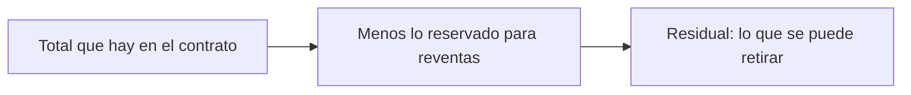

# CU-15 · Pasar el dinero recaudado a la cuenta del hotel

> En una frase: mandas a la cuenta del hotel el dinero de las ventas que ya es vuestro, sin tocar el que está guardado para pagar a otros.

## 1. Para qué sirve

Cuando alguien compra una noche, el dinero entra en el contrato (el programa que guarda las reglas y el dinero en la red). Allí se queda hasta que alguien lo mueve.

Dentro de ese dinero hay dos montones. Uno es de los vendedores de reventa: personas que revendieron su noche y aún no han cobrado. Ese dinero está **reservado** y es suyo.

El otro montón es el del hotel: lo que sobra después de apartar lo reservado. A ese sobrante lo llamamos **residual**.

Este caso de uso sirve para mandar ese residual a la cuenta de tesorería del hotel. La cuenta se fija cuando se despliega el sistema.

La gracia está en que la operación **nunca toca el dinero reservado**. Solo sale lo que de verdad es del hotel. Así nadie se queda sin cobrar.

## 2. Quién puede hacerlo

Solo la cuenta que tiene la llave de **tesorero** (`TREASURER_ROLE`, el permiso del contrato para mover el dinero del hotel).

Es una llave distinta de la del super-admin. Esa separación es a propósito: quien manda en el sistema no tiene por qué ser quien mueve el dinero.

La retirada la firma una persona desde su cartera. Pero el destino no lo eliges tú al pulsar el botón: es la cuenta de tesorería que ya está puesta en el contrato.

En un hotel de verdad, lo suyo es que esa llave la tenga un *multisig* (una cartera que necesita varias firmas para moverse). Hoy el contrato solo ve una dirección; el multisig es cosa de cómo se despliega.

## 3. Antes de empezar

- Ten abierta una sesión en el panel con una cuenta que tenga la llave de tesorero.
- Comprueba en el panel la dirección de tesorería. Es ahí donde llegará el dinero.
- Ten algo de saldo en la cartera que firma, para pagar la comisión de red.
- Mira cuánto hay reservado. Si todo el dinero está reservado, no hay nada que retirar y el botón saldrá apagado.
- No hace falta que el sistema esté activo. La retirada funciona también con el sistema en pausa, y eso es a propósito.
- No hace falta mover a mano el dinero de los vendedores: ellos lo cobran por su cuenta cuando quieren.

## 4. Paso a paso

1. Abre el panel del hotel y entra en la sección **Fondos** (la dirección es `/admin/fondos`).
2. Lee la tarjeta del saldo. Verás tres cifras: el total que hay en el contrato, lo reservado para reventas y lo que se puede retirar.
3. Comprueba la cifra **retirable**. El sistema la calcula restando lo reservado al total.
4. Si la cifra retirable es cero, el botón **Retirar** aparece apagado. No insistas: no hay nada que sacar.
5. Pulsa **Retirar a tesorería**. Se abre una ventana con el importe que va a salir.
6. Lee el importe con calma y confirma. Tu cartera te pide la firma.
7. Firma y espera a que la red confirme. El panel te va contando el estado.
8. Al terminar, el panel vuelve a leer el saldo y el reservado. Verás que el total bajó y el reservado sigue igual.
9. Si además tienes que pagar a un vendedor de reventa, eso es otra operación: él cobra con su propio botón.

## 5. Qué ves cuando sale bien

- El panel marca la operación como completada y avisa de que se confirmó en la red.
- El importe retirado aparece en la cuenta de tesorería.
- El contrato deja apuntado un evento `Withdrawn` con la cuenta destino y la cantidad.
- La cifra de reservado para reventas **no cambia**. Sigue ahí, esperando a sus dueños.
- La cifra retirable baja y puede quedar en cero hasta la siguiente venta.
- Si el sistema estaba en pausa, sigue en pausa: retirar no lo reactiva.

## 6. Si algo va mal

| Lo que ves | Qué significa | Qué hacer |
|-----------|---------------|-----------|
| El botón de retirar sale apagado | No hay residual: todo está reservado | Espera a vender más noches o revisa el reservado |
| «No hay fondos para retirar» | El contrato se niega porque el residual es cero | Comprueba las cifras y no repitas la operación |
| «No tienes permiso para esta acción» | Tu cuenta no tiene la llave de tesorero | Entra con la cuenta que sí la tiene |
| «No se pudo enviar el dinero» | La cuenta de tesorería rechazó el cobro | Revisa esa dirección con el responsable técnico |
| La operación se cancela sola | Puede ser un problema de la cartera destino o de la firma | Inténtalo otra vez y, si sigue, avisa al técnico |
| La cifra de reservado cambia sola | Entran o salen pagos de reventa | Es normal: refresca la página y vuelve a mirar |
| Retiraste y no ves el dinero | La red tarda un poco en reflejarlo | Espera un momento y refresca la página |

## 7. Un ejemplo de verdad

El Hotel Marina del Sol vendió noches por 3 ETH en total. De esas ventas, 1 ETH es de clientes que revendieron y aún no han cobrado.

En la sección **Fondos**, el panel enseña 3 ETH en el contrato y 1 ETH reservado. La cifra retirable es 2 ETH.

Ana, la tesorera, pulsa **Retirar a tesorería**. La ventana le enseña 2 ETH. Confirma y firma con la cartera.

Al confirmarse, los 2 ETH llegan a la cuenta del hotel. El 1 ETH de los vendedores sigue guardado. Al día siguiente, uno de esos vendedores cobra su parte y el reservado baja.

## 8. Preguntas frecuentes

### ¿Puedo retirar también el dinero de los vendedores de reventa?

No. El sistema aparta esa parte y solo deja salir el sobrante. Es la forma de garantizar que nadie se quede sin cobrar.

### ¿La pausa de emergencia me impide retirar?

No. La retirada sigue permitida aunque el sistema esté en pausa. Es una decisión a propósito, para poder arreglar cosas en un apuro.

### ¿Puedo cambiar la cuenta de tesorería desde aquí?

No desde esta sección. Cambiar el destino es otra operación, con la llave del super-admin.

### ¿Hay un listado con las retiradas anteriores?

No. Hoy solo queda el rastro de cada evento `Withdrawn` en la red. No hay una pantalla de histórico.
