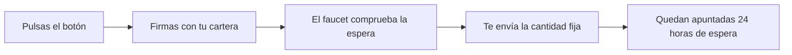

# CU-PR-01 · Conseguir dinero de prueba (solo en pruebas)

> En una frase: pides monedas de mentira para practicar compras y reventas sin arriesgar ni un céntimo de verdad.

## 1. Para qué sirve

Para probar el sistema necesitas dinero de la red. No para comprar de verdad, sino para pagar las comisiones y hacer compras simuladas. En la red de pruebas ese dinero no vale nada.

El **faucet** es el grifo que te lo da. Es un pequeño contrato (un programa con reglas fijas que vive en la red) que te envía una cantidad fija de ETH de prueba.

ETH es la moneda de la red. En pruebas se llama igual, pero no se puede cambiar por euros. Es como el dinero del Monopoly.

Este caso de uso es una **utilidad de desarrollo**. No es un producto para clientes. Lo usan los testers y los robots que hacen pruebas automáticas (el *pipeline de CI*).

## 2. Quién puede hacerlo

Cualquier persona que tenga una cartera conectada en la red de pruebas donde esté desplegado el faucet. El papel principal es el de **tester** o el de la máquina de pruebas.

No hace falta ningún permiso especial. No hay rol ni llave que pedir: el faucet paga a quien se lo pide.

El operador que monta el entorno decide si el faucet existe. También lo llena de dinero y puede vaciarlo cuando quiere. Ese operador sí necesita ser el dueño del contrato.

## 3. Antes de empezar

- Ten una cartera conectada a la web de pruebas. Si no la tienes, usa el botón **Conectar cartera**.
- Comprueba que estás en la red correcta. Si estás en otra red, el botón no aparece.
- Asegúrate de que el entorno tiene faucet. Si no está configurado, el botón no se pinta.
- Ten claro que esto es dinero de mentira. No lo podrás cambiar por euros.
- Ten paciencia con la espera: cada cartera puede pedir una vez cada 24 horas.

## 4. Paso a paso

1. Abre la web de pruebas y conecta tu cartera.
2. Mira la red en la que estás. Si no es la de pruebas, cámbiala.
3. Busca el botón **Conseguir ETH de prueba** en la barra de la cartera, arriba.
4. También lo tienes dentro del menú de la cartera, si lo prefieres.
5. Atajo útil: intenta comprar una noche sin saldo. El aviso de saldo insuficiente trae el mismo botón.
6. Pulsa **Conseguir ETH de prueba**.
7. Tu cartera te pide la firma. Revisa lo que vas a firmar y confirma.
8. Espera a que la red lo confirme. El botón te va contando el estado.
9. Mira tu saldo. Habrá subido justo la cantidad del faucet (30 ETH en el entorno de desarrollo).
10. Si vuelves a pulsar antes de 24 horas, te dirá a qué hora puedes pedir otra vez.

## 5. Qué ves cuando sale bien

- El botón anuncia el resultado: primero la firma, luego el envío y por último la confirmación.
- Tu saldo sube **exactamente** la cantidad configurada. Ni un wei más (el wei es la unidad más pequeña de ETH).
- El contrato deja apuntado un evento llamado `FaucetDispensed` con tu cartera y la cantidad.
- El contrato guarda la hora exacta del envío. Con esa hora calcula cuándo te toca otra vez.
- Puedes usar ya ese saldo para firmar compras y reventas de prueba.
- Si el faucet se queda por debajo de la cantidad, el botón avisa de que no hay fondos.

## 6. Si algo va mal

| Lo que ves | Qué significa | Qué hacer |
|-----------|---------------|-----------|
| No aparece el botón de prueba | El faucet no está configurado en este entorno | Pídele al responsable que lo despliegue y lo configure |
| El botón no sale con la cartera conectada | Estás en otra red o no hay cartera conectada | Cambia a la red de pruebas y vuelve a conectar |
| «El faucet no tiene fondos» | El grifo tiene menos dinero que la cantidad que reparte | Avisa al operador para que lo rellene |
| «Vuelve a intentarlo a partir de las 14:30» | Aún está activa la espera de 24 horas | Espera a esa hora y vuelve a pulsar |
| «No se pudo enviar el dinero» | Tu cartera rechazó el cobro por algún motivo | Revisa la cartera y, si sigue, avisa al técnico |
| Firmas y no llega nada | La red tarda un poco en reflejarlo | Espera un momento y refresca la página |
| Cancelas la firma en la cartera | No has firmado, así que no hay envío | Vuelve a pulsar y firma esta vez |
| El saldo no sube todo lo que esperabas | La cantidad del faucet es fija, no la eliges tú | Mira la cantidad configurada del entorno |

## 7. Un ejemplo de verdad

Marta es tester del Hotel Marina del Sol. Está en el entorno de pruebas con su cartera «Marta-pruebas».

Intenta comprar una noche y ve que no tiene saldo. En el aviso aparece el botón **Conseguir ETH de prueba**.

Lo pulsa. La cartera le pide la firma y ella confirma. Al cabo de unos segundos, la red confirma la operación.

Marta abre su cartera y ve 30 ETH de prueba recién llegados. Ya puede firmar compras y reventas sin gastar dinero real.

Esa misma tarde lo intenta otra vez. El botón le responde que podrá pedir de nuevo a partir de mañana a la misma hora. Es el turno de espera de 24 horas.

## 8. Preguntas frecuentes

### ¿Esto es dinero de verdad?

No. Es dinero de una red de pruebas. No se cambia por euros ni sirve fuera de ese entorno.

### ¿Cuánto me dan y cada cuánto puedo pedirlo?

En el entorno de desarrollo, 30 ETH de prueba por cartera. Después hay que esperar 24 horas para la siguiente vez.

### ¿Puedo pedir dinero para otra cartera?

No. El faucet siempre paga a la cartera que firma la petición. No puedes mandárselo a otra persona desde el botón.

### ¿El faucet existe en producción?

No. En producción no se despliega. El despliegue solo lo pone si se pide a propósito, y en la nube la dirección va vacía.
