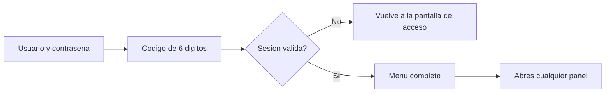

# CU-30 · Que el dueño lo vea y lo pueda todo

> En una frase: entras con la cuenta del dueño y se te abren todos los paneles del hotel, sin que el sistema te deje fuera de ninguno.

## 1. Para qué sirve

El panel del hotel tiene muchas pantallas: publicar noches, ver métricas, atender el mostrador, tocar ajustes del sistema. Cada una pide un permiso distinto.

La cuenta del dueño es la de arriba del todo. Su permiso se llama `DEFAULT_ADMIN_ROLE` y **vale por todos los demás**. Si eres el dueño, ninguna pantalla del panel te cierra la puerta.

Esto no es un capricho. El dueño responde del negocio y necesita poder entrar a todo para revisar, corregir o ayudar. Si un empleado no puede hacer algo, el dueño sí.

Ojo con una cosa importante. Aquí hablamos de **ver y abrir pantallas**. Firmar movimientos de verdad es otra historia y se decide más abajo, en la red.

La red es la *blockchain* (el libro de cuentas público donde se apuntan las noches). Allí manda el contrato, no la web. Lo vemos en el apartado de problemas.

## 2. Quién puede hacerlo

El **dueño**. En la práctica es la persona con la cuenta de gobierno del hotel, por ejemplo `admin@hotel.es`.

El dueño entra con tres cosas: su usuario, su contraseña y un código de seis dígitos. Ese código lo da una app del móvil y cambia cada pocos segundos.

El personal de **recepción** también tiene cuenta, pero con un permiso más corto. Puede atender el mostrador y poco más. Los paneles de administración no son para recepción.

El dueño es el único que ve además el grupo **Sistemas** en el menú. Es la zona más delicada del panel.

## 3. Antes de empezar

- Ten a mano tu usuario y tu contraseña de back-office.
- Ten configurada la app de códigos en el móvil. Sin ese código no hay sesión.
- Guarda algún **código de rescate**. Sirven si un día pierdes el móvil.
- Comprueba que tu cuenta tiene el permiso de dueño. Si no, verás menos menú.
- Que la web y la base de datos estén levantadas. Si el sistema está caído, no entra nadie.
- Ten claro que estás en la **red de pruebas**. No se vende al público todavía.

## 4. Paso a paso

1. Abre la dirección del panel del hotel en el navegador. Es la que empieza por `/admin`.
2. Escribe tu usuario y tu contraseña. Pulsa **Entrar**.
3. Ahora mismo no tienes sesión. El sistema te pide el segundo paso: el código de seis dígitos.
4. Abre la app de códigos del móvil, copia el número que toque y pégalo. Confirma.
5. Si el código es correcto, entras. Verás la pantalla principal con el menú lateral.
6. Repasa el menú lateral. Con la cuenta del dueño, **todas las entradas están activas y en color**.
7. Baja hasta el final del menú. Verás el grupo **Sistemas**, que solo sale para el dueño.
8. Pulsa cualquier entrada del menú. El panel se abre sin avisos de permiso.
9. Si algún día entras con una cuenta de recepción, verás paneles con un aviso de permiso denegado. Es lo normal.

El recorrido, de un vistazo:

## 5. Qué ves cuando sale bien

- El panel se abre con tu nombre de usuario en la cabecera.
- Todas las entradas del menú lateral aparecen como enlaces, en su color. Ninguna en gris.
- El grupo **Sistemas** está visible al final del menú.
- Cada panel que pulsas se carga con su contenido, sin aviso de permiso denegado.
- No aparece ningún cartel de sesión caducada mientras trabajas.
- Si abres la dirección de un panel directamente, también entra. No hay puertas cerradas para ti.

## 6. Si algo va mal

| Lo que ves | Qué significa | Qué hacer |
|-----------|---------------|-----------|
| «Usuario o contraseña incorrectos» | Los datos no cuadran | Repásalos con calma. Tras varios fallos, la cuenta se bloquea un rato |
| Te pide otra vez el código de seis dígitos | El código caducó o no era el actual | Espera al siguiente número de la app y vuelve a probar |
| «Cuenta bloqueada» | Demasiados intentos seguidos | Espera unos minutos y prueba de nuevo |
| «Demasiadas peticiones» | Has pedido pantallas muy rápido | Para un minuto. El límite es de 30 peticiones por minuto |
| «Sesión caducada» | La sesión vieja ya no vale | Vuelve a entrar con usuario, contraseña y código |
| Un panel con aviso de permiso denegado | Tu cuenta no tiene ese permiso | Pídeselo al dueño. Recepción no entra en administración |
| Una entrada del menú en gris | Esa pantalla no es para tu rol | Pasa el ratón por encima y lee el motivo |
| El panel deja pulsar, pero la firma falla | Tu cartera no tiene ese permiso en el contrato | Pide que te den el permiso en la red. La web sola no basta |

## 7. Un ejemplo de verdad

Marta es la dueña del Hotel Marina del Sol. Son las ocho de la mañana y quiere revisar cómo fue el fin de semana.

Abre el panel en su portátil y teclea `admin@hotel.es` con su contraseña. El sistema le pide el código de seis dígitos. Lo copia del móvil y entra.

En el menú lateral lo tiene todo en color: métricas, publicar noches, recepción y el grupo **Sistemas** al final. Nada en gris.

Marta entra en métricas y ve que el sábado se vendieron catorce noches. Luego abre el panel del día para comprobar que la habitación 101 está ocupada. Todo cuadra.

Más tarde llama su sobrina, que acaba de empezar en recepción. Entra con su cuenta y ve el menú corto y algún aviso de permiso denegado. Es exactamente lo que debe pasar.

## 8. Preguntas frecuentes

### ¿Por ser el dueño puedo hacer absolutamente todo?

En el panel sí: todas las pantallas se te abren. Pero cada acción que firma en la red la comprueba el contrato. Si tu cartera no tiene ese permiso concreto, la operación se rechaza.

### ¿Por qué veo una entrada del menú en gris?

Porque tu cuenta no tiene el permiso de esa pantalla. El sistema te lo dice en vez de dejarte entrar y fallar. Pasa el ratón por encima y verás el motivo.

### ¿Qué diferencia hay entre ver un panel y firmar una acción?

Ver solo necesita tu sesión. Firmar necesita además una cartera con el permiso correcto en la red. Son dos cerraduras distintas.

### ¿Y si pierdo el móvil con el código de seis dígitos?

Usa uno de tus códigos de rescate al entrar. Luego avisa a quien administra el sistema para que te configure un móvil nuevo.
