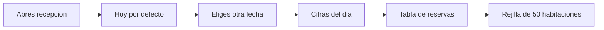

# CU-31 · La pantalla del día en recepción

> En una frase: abres una pantalla, eliges el día y ves de un vistazo qué reservas hay y cómo está cada una de las 50 habitaciones.

## 1. Para qué sirve

En el mostrador necesitas saber qué pasa hoy, y no dentro de tres pantallas distintas. Esta pantalla junta todo en una sola vista.

Arriba eliges la fecha. Debajo ves cinco cifras del día: habitaciones totales, reservadas, ocupadas, salidas y libres.

Después viene una tabla con las reservas de ese día. Cada fila trae la habitación, el tipo, el estado, el código de recuperación y el titular.

Y al final está la rejilla: las 50 habitaciones del hotel con un color por estado. De un vistazo sabes cuáles están libres y cuáles no.

La pantalla **solo mira**. No cambia nada de la reserva ni firma nada en la red. Para dar entrada o salida usa las otras pestañas.

Los estados que verás son siete: libre, pendiente, reservada, ocupada, salida, pendiente de limpieza y bloqueada. Los explicamos en el paso a paso.

Al tocar una habitación se abre una **ficha detalle** con dos zonas: Habitación y Huésped. La información
cambia según el estado (RF-51..RF-55).

## 2. Quién puede hacerlo

El personal de **recepción**. Es quien está en el mostrador y necesita la foto del día.

El **dueño** del hotel también entra. Su permiso vale por todos, así que esta pantalla no se le cierra.

Si no tienes sesión de recepción, no verás ningún dato. Te saldrá la pantalla de acceso o un aviso de permiso denegado. Los datos ni siquiera llegan a tu navegador.

## 3. Antes de empezar

- Ten tu usuario, tu contraseña y el código de seis dígitos a mano.
- Comprueba que tu cuenta tiene el permiso de recepción. Sin él, no hay panel.
- Ten claro en qué día estás trabajando. La fecha la toma el reloj de tu ordenador.
- Que la base de datos esté levantada. El panel lee de ahí, no de la red.
- Recuerda que estás en la **red de pruebas**. Los nombres son reales; el dinero, no.
- Si vas a pasar lista al turno siguiente, deja la pantalla abierta y refresca antes.

## 4. Paso a paso

1. Entra al panel con tu usuario, tu contraseña y el código de seis dígitos.
2. Abre la dirección `/recepcion`. También puedes llegar desde el menú de recepción.
3. Lo primero que ves es la pestaña de **Operaciones** con el día de hoy ya cargado.
4. Arriba del todo está el **selector de fecha**. Si el día no es el que quieres, cámbialo ahí.
5. Al cambiar la fecha, la pantalla se recarga sola. No hace falta tocar nada más.
6. Mira la franja de cifras. Son cinco: total, reservadas, ocupadas, salidas y libres.
7. Baja a la **tabla de reservas**. Trae habitación, tipo, estado, código y titular.
8. El titular sale como una dirección de cartera recortada. Es normal: no se muestran datos personales.
9. Fíjate en la columna de estado. Te dice en qué punto está cada reserva.
10. Baja hasta la **rejilla de habitaciones**. Son las 50 del hotel, cada una con su color.
11. Los colores siguen estos estados: libre, pendiente, reservada, ocupada, salida y bloqueada.
12. Si algo ha cambiado mientras mirabas, pulsa el botón de **refrescar** y vuelve a leer.
13. En la barra de arriba tienes dos zonas: **Operaciones** y **Reservas**. Cambia entre ellas según lo que busques.

El recorrido, de un vistazo:

## 5. Qué ves cuando sale bien

- El encabezado con el título de la pantalla y el día elegido.
- La franja con las cinco cifras del día ya calculadas.
- La tabla de reservas con una fila por reserva: habitación, tipo, estado, código y titular.
- La rejilla completa con las 50 habitaciones, cada una en su color.
- Las habitaciones sin reserva ese día aparecen como **libres**.
- El botón de refrescar vuelve a pedir los datos sin recargar toda la aplicación.

## 6. Si algo va mal

| Lo que ves | Qué significa | Qué hacer |
|-----------|---------------|-----------|
| Aviso de permiso denegado | Tu cuenta no tiene el permiso de recepción | Pídeselo al dueño. Sin ese permiso no hay panel |
| La pantalla de acceso en vez del panel | No hay sesión válida | Entra con usuario, contraseña y código |
| «No hay reservas para este día» | Esa fecha está vacía | Prueba otra fecha o revisa si te has equivocado de día |
| «Fecha no válida» | La fecha no tiene el formato correcto | Usa el selector de fecha en vez de escribirla a mano |
| Un aviso de error en la franja de cifras | La consulta a la base de datos ha fallado | Refresca. Si sigue, avisa a quien mantiene el sistema |
| La rejilla aparece vacía tras el error | El panel no ha podido leer las habitaciones | No es que estén todas libres: vuelve a refrescar |
| Todo en gris o muy lento | Has pedido pantallas muy rápido | Espera un minuto. El límite es de 30 peticiones por minuto |
| Las cifras no cuadran con lo que ves | Alguien acaba de mover una reserva | Pulsa refrescar y compara otra vez |

## 7. Un ejemplo de verdad

Son las siete y media de la mañana en el Hotel Marina del Sol. Lucas entra en recepción y abre la pantalla del día.

El selector marca el 15 de septiembre de 2026. En la franja de cifras lee: 50 habitaciones, 22 reservadas, 17 ocupadas, 6 salidas y 11 libres.

En la tabla ve que la habitación 101 tiene una reserva **reservada** a nombre de una cartera que empieza por `0x3f…`. El huésped todavía no ha llegado.

Baja a la rejilla y comprueba los colores. La 205 sale **salida**: el cliente se va hoy. La 210 está **bloqueada**, así que no se ofrece.

A las once llega una pareja que había reservado la 118. Lucas refresca la pantalla, cambia la habitación a **ocupada** desde la pestaña de check-in y la ve cambiar de color al instante.

## 8. Preguntas frecuentes

### ¿De dónde sale la fecha que aparece al abrir?

Del reloj de tu ordenador. El panel toma el día del puesto de trabajo, no de un reloj central. Si tu equipo tiene mal la hora, cambia la fecha a mano.

### ¿Puedo cambiar algo desde esta pantalla?

No. Esta pantalla solo enseña el día. Para dar entrada, dar salida o apuntar extras tienes las pestañas de check-in y de cargos.

### ¿Por qué no veo el nombre del cliente?

Porque el panel no guarda datos personales. El titular se enseña como una dirección de cartera recortada, solo para identificarla.

### ¿Qué significa que una habitación esté bloqueada?

Que esa noche ya no se puede usar: se ha retirado del sistema. Pasa con las noches caducadas o quemadas. No la ofrezcas.
