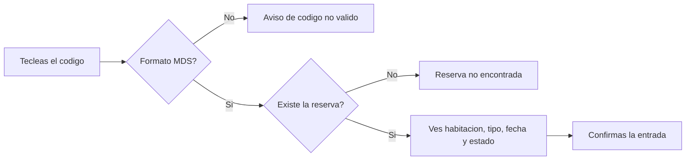

# CU-32 · Encontrar una reserva con el código de recuperación

> En una frase: el huésped no encuentra su QR, pero te dicta un código corto y con él localizas su reserva en dos segundos.

## 1. Para qué sirve

A veces el huésped llega al mostrador sin el móvil, con la batería muerta o con el papel arrugado. No puede enseñarte el QR de su reserva.

Para esos casos existe el **código de recuperación**. Es un código corto que empieza por `MDS-` y que el huésped lleva impreso o apuntado.

Tú lo tecleas y el sistema busca la reserva. Si la encuentra, te enseña la habitación, el tipo, la fecha y el estado. Así compruebas que es la reserva correcta antes de dar la entrada.

El código no es una contraseña. No da acceso a nada por sí solo y no lleva datos personales dentro. Es solo una etiqueta para encontrar la reserva.

Cada reserva tiene su propio código. Se calcula a partir del identificador de la noche, así que es siempre el mismo para esa noche.

## 2. Quién puede hacerlo

El personal de **recepción**, que es quien atiende el mostrador. También el **dueño**, cuyo permiso vale por todos.

El huésped participa, pero no entra al panel. Él solo aporta el código, dictado o en papel.

Necesitas sesión válida de recepción. Sin ella, la búsqueda ni se ejecuta.

## 3. Antes de empezar

- Ten tu sesión de recepción abierta en el panel del día.
- Pide al huésped el código completo. Empieza siempre por `MDS-`.
- Copia bien los caracteres. El código mezcla letras y números sin espacios.
- Si el huésped lo dicta, repítelo en voz alta antes de escribirlo.
- Comprueba que no te está dando un documento de identidad. Eso no vale como prueba.
- Ten a mano la fecha de entrada prevista para contrastarla con lo que salga.

## 4. Paso a paso

1. Abre el panel de recepción y entra en la pestaña **Check-in**.
2. Busca el campo del código de recuperación en el formulario de búsqueda.
3. Escribe el código tal cual, por ejemplo `MDS-AB12CD34`.
4. Pulsa el botón de buscar. El sistema consulta al momento.
5. Si el formato no vale, te lo dirá sin llegar a buscar nada. Repasa lo que has escrito.
6. Si el código está bien pero no existe, verás un aviso de reserva no encontrada. Confirma el código con el huésped.
7. Si la encuentra, aparece un bloque con la habitación, el tipo, la fecha de entrada y el estado.
8. Compara esos datos con lo que te dice el huésped. Habitación y fecha tienen que cuadrar.
9. Mira el estado. Solo se puede dar entrada a una reserva **reservada**.
10. Si todo cuadra, pulsa **Confirmar**. El botón solo se activa cuando el estado es el correcto.
11. La confirmación se apunta con el propio código como prueba, bajo el motivo **resguardo impreso**.
12. Espera el resultado. Si sale bien, la noche queda marcada como estancia en curso.

El recorrido, de un vistazo:

## 5. Qué ves cuando sale bien

- El bloque de resultado con la habitación, el tipo, la fecha de entrada y el estado.
- El botón de confirmar activo, porque la reserva está en estado **reservada**.
- Tras confirmar, un aviso de entrada hecha con la habitación y la fecha.
- Si el ancla se ha difundido, un enlace al explorador de la red con el comprobante.
- En el panel del día, esa habitación pasa a **ocupada** al refrescar.
- El código sigue siendo el mismo para esa noche. Puedes volver a consultarlo cuando quieras.

## 6. Si algo va mal

| Lo que ves | Qué significa | Qué hacer |
|-----------|---------------|-----------|
| «Código no válido» | Falta el prefijo `MDS-` o sobran o faltan caracteres | Revisa el código con el huésped y vuelve a escribirlo |
| «Reserva no encontrada» | El formato es correcto pero esa reserva no está | Confirma el código. Puede ser de otro hotel o estar mal copiado |
| El botón de confirmar está apagado | La reserva ya tiene entrada o salida | No insistas. Mira el estado y avisa al huésped |
| «Prueba no válida» | Has usado un documento de identidad como prueba | Usa el código del resguardo. El DNI no se admite |
| «Check-in en proceso» | Otro puesto está confirmando la misma noche ahora mismo | Espera unos segundos y reintenta |
| «Reserva ya consumida» | Esa noche ya se dio por entrada | Comprueba en el panel del día quién la registró |
| «Contrato en pausa» | El sistema está detenido por una emergencia | Avisa a quien gobierna el contrato. No se puede anclar nada |
| El código en minúsculas funciona igual | El sistema lo pasa a mayúsculas solo | Nada. Es normal y no rompe nada |

## 7. Un ejemplo de verdad

Son las nueve de la noche. Llega al Hotel Marina del Sol una señora con una maleta y un papel doblado. Se le ha quedado el móvil sin batería.

Le dice a Lucas, el recepcionista, que su reserva es de esa noche. El papel trae impreso `MDS-K7PM2Q4T`.

Lucas abre la pestaña de check-in y lo teclea. El sistema responde: habitación 214, tipo doble, entrada el 15 de septiembre de 2026, estado **reservada**.

La señora confirma que la habitación es la 214. Lucas pulsa **Confirmar** y aparece el aviso de entrada hecha, con un enlace al comprobante en la red.

En el panel del día, la habitación 214 pasa de reservada a ocupada. Lucas refresca y le enseña la pantalla a la señora, que ya tiene su llave.

## 8. Preguntas frecuentes

### ¿El código sirve para entrar en la habitación sin más?

No. El código solo localiza la reserva. La entrada la confirma recepción y queda apuntada en la red.

### ¿Dónde encuentra el huésped su código?

En su resguardo impreso o en su correo de confirmación. También aparece en la tabla del día del panel de recepción, en la columna de código.

### ¿Puedo usar el mismo código dos veces?

Para consultar, sí. Para dar entrada, no: cada noche solo se puede dar por entrada una vez. Si ya está hecha, el botón queda apagado.

### ¿Da igual escribirlo en mayúsculas o en minúsculas?

Da igual. El sistema quita los espacios y lo pasa todo a mayúsculas antes de buscar.
