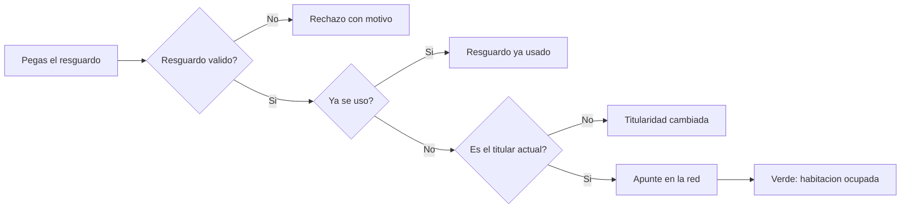

# CU-33 · Dar entrada al cliente escaneando su resguardo

> En una frase: el huésped te enseña el resguardo de su reserva, lo pegas en el panel y la habitación queda ocupada al momento.

## 1. Para qué sirve

Cuando el huésped llega al hotel, hay que dar su noche por empezada. Eso es el **check-in**, la entrada.

El resguardo es el papel o el correo que el huésped recibió al comprar. Lleva dentro un QR (el cuadrito de puntos) y un texto largo llamado **JWS**.

El JWS es el resguardo en formato texto. Es como el DNI de esa entrada: dice de qué noche es y quién es el titular. Nadie más puede fabricar uno igual.

Tú pegas ese texto en el panel del día y confirmas. El sistema comprueba que el resguardo es auténtico y que quien lo trae es el dueño de la noche.

Entonces apunta la entrada en la **blockchain** (el libro de cuentas público). Ese apunte no se puede borrar. Después, la habitación aparece como ocupada en el panel.

Ojo: aquí no hay cámara. No se "escanea" con el móvil. Se copia el texto del resguardo y se pega en el área del panel.

## 2. Quién puede hacerlo

El personal de **recepción**. Es el papel que tiene permiso para confirmar entradas.

El **huésped** pone el resguardo, pero no toca el panel. Él solo lo enseña.

En la red, la firma la hace la cartera de recepción del hotel. Para que funcione, esa cartera necesita el permiso de recepción en el contrato.

El **dueño** también puede, porque su permiso vale por todos.

## 3. Antes de empezar

- Ten tu sesión de recepción abierta en el panel del día.
- Pide al huésped el resguardo original, no una foto borrosa.
- Comprueba que el contrato no está en pausa. El panel te avisa si lo está.
- Mira que el resguardo esté vigente y sin usar. Cada uno sirve una sola vez.
- Si el huésped compró la noche a otra persona, el titular puede haber cambiado.
- Ten a mano el panel del día para ver la habitación antes y después.

## 4. Paso a paso

1. Entra al panel de recepción y abre la pestaña **Check-in**.
2. Mira si aparece un aviso de contrato en pausa. Si sale, no se puede continuar.
3. Abre el resguardo del huésped y copia el texto largo del JWS.
4. Si copias la dirección entera y trae un trozo con `#ticket=`, no te preocupes: el panel se queda solo con lo importante.
5. Pega el texto en el área del resguardo.
6. Pulsa el botón de confirmar la entrada. El botón está apagado si falta el texto o si el contrato está en pausa.
7. El sistema comprueba el resguardo y que no se haya usado antes.
8. Después comprueba en la red que la cartera del resguardo sigue siendo la dueña de esa noche.
9. Si todo cuadra, apunta la entrada en la red y luego en la base de datos.
10. Espera el aviso verde. Trae la habitación y la fecha de entrada.
11. Si hay enlace al explorador, puedes abrirlo para ver el comprobante público.
12. El campo se vacía solo. Vuelve a la pestaña del día para ver la habitación.

El recorrido, de un vistazo:

## 5. Qué ves cuando sale bien

- Un aviso verde de entrada hecha, con la habitación y la fecha.
- El enlace al comprobante en la red, si el apunte se ha difundido.
- El campo del resguardo se queda vacío, listo para el siguiente huésped.
- En el panel del día, la habitación cambia a **ocupada** después de refrescar.
- El huésped ya puede pasar a su habitación.
- Si otro puesto mira el panel, verá el cambio cuando pulse refrescar.

## 6. Si algo va mal

| Lo que ves | Qué significa | Qué hacer |
|-----------|---------------|-----------|
| «Resguardo no válido» | El texto está mal copiado o no es de este hotel | Vuelve a copiarlo entero, sin cortar trozos |
| «Resguardo ya usado» | Esa entrada ya se confirmó antes | No lo repitas. Mira quién la registró en el panel del día |
| «Titularidad cambiada» | La noche se revendió y ahora es de otra cartera | Pide el resguardo nuevo al comprador actual |
| «No se pudo comprobar el titular» | La red no responde ahora mismo | Espera un momento y reintenta |
| «Reserva ya consumida» | Esa noche ya está en estancia | Comprueba la habitación en el panel del día |
| «Noche no vendida» | Esa noche nunca se vendió | Revisa el resguardo. Puede ser de otra noche |
| «Contrato en pausa» | El sistema está detenido por una emergencia | Avisa a quien gobierna el contrato. No se puede anclar |
| «Check-in en proceso» | Otro puesto está confirmando la misma noche | Espera unos segundos y reintenta |
| «No se pudo anclar la entrada» | El apunte en la red falló | Reintenta. Si sigue, avisa a soporte |
| El botón está apagado y no hay aviso claro | Falta el texto del resguardo | Comprueba que has pegado algo en el área |

## 7. Un ejemplo de verdad

Son las tres de la tarde en el Hotel Marina del Sol. Llega un señor con una mochila y abre el correo en su móvil.

Le enseña a Lucas, el recepcionista, el resguardo de su reserva. Es la habitación 108, tipo doble, para el 15 de septiembre de 2026.

Lucas abre la pestaña de check-in, copia el texto largo del resguardo y lo pega en el área. Mira que no haya aviso de pausa y pulsa **Confirmar**.

A los pocos segundos aparece el aviso verde: entrada hecha, habitación 108. Debajo, un enlace al comprobante en la red.

Lucas vuelve a la pestaña del día, refresca y la habitación 108 ya está en **ocupada**. El señor recoge su llave y sube.

## 8. Preguntas frecuentes

### ¿Necesito un lector de QR o la cámara del móvil?

No. El panel no trae lector. Copias el texto del resguardo y lo pegas en el área del formulario. La foto del QR no vale: hace falta el texto.

### ¿Puedo dar entrada dos veces con el mismo resguardo?

No. Cada resguardo sirve una sola vez. Si lo repites, el sistema te avisa de que ya se usó.

### ¿Y si el huésped compró la noche a otra persona?

Entonces el titular de la red es el comprador nuevo. El resguardo viejo no vale y el sistema lo rechaza. Pide el resguardo actualizado.

### ¿Se puede deshacer una entrada?

No. El apunte en la red es definitivo. Si te equivocaste de habitación, avisa a quien administra el sistema antes de tocar nada más.
