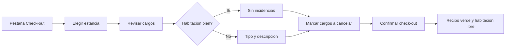

# CU-34 · Dar salida y cerrar la cuenta de la habitación

> En una frase: cuando el huésped se va, miras cómo quedó la habitación, tachas los extras que no se cobran y la dejas libre para limpiar.

## 1. Para qué sirve

El **check-out** es la salida. Cierra la estancia que ya tenía la entrada registrada.

Al cerrarla, el sistema guarda cómo quedó la habitación y tacha los extras que no se cobran. Después deja la noche como terminada.

Ojo con una cosa importante: **este paso no cobra**. El sistema apunta los cargos y los cancela, pero no pasa el cobro a nadie. El cobro se hace aparte, en el mostrador.

Otra cosa que conviene saber: la salida **no se anota en la blockchain** (el libro de cuentas público). Solo se anota la entrada. La salida vive en la base de datos del hotel.

## 2. Quién puede hacerlo

El personal de **recepción**. Es el papel que tiene permiso para cerrar estancias.

El **dueño** del hotel también puede, porque su permiso vale por todos.

El **huésped** solo entrega la habitación y las llaves. No toca el panel.

## 3. Antes de empezar

- Ten tu sesión de recepción abierta en el panel del día.
- Comprueba que esa estancia **ya tiene la entrada hecha**. Sin check-in no se cierra.
- Mira la lista de cargos de la estancia antes de tocar nada.
- Decide qué extras se cancelan y cuáles se cobran aparte.
- Pasa por la habitación o pide al personal de pisos que confirme cómo quedó.
- Ten a mano el panel del día para ver la habitación antes y después.

## 4. Paso a paso

1. Entra al panel de recepción y pulsa la pestaña **Check-out**.
2. En esa pestaña solo salen las estancias con la entrada ya hecha.
3. Elige la estancia en el desplegable. Al cambiarla, se recargan sus cargos.
4. Revisa la lista de cargos: verás el concepto, el importe y la moneda.
5. Si falta un extra, apúntalo aquí mismo. Eso es el caso de uso CU-35.
6. Marca **Sin incidencias** si la habitación está bien.
7. Si hay algún problema, marca **Con incidencia**. Entonces elige el tipo y escribe la descripción.
8. Los tipos de incidencia son: daños, falta de limpieza, objeto olvidado, minibar consumido, avería u otro.
9. Marca con la casilla los cargos que se cancelan.
10. El contador te dice cuántos cargos se van a cancelar antes de que pulses nada.
11. Pulsa **Confirmar check-out**.
12. Espera el recibo verde con la habitación y la fecha.
13. Vuelve a la pestaña del día y refresca. La habitación aparece como **Salida**.

El recorrido, de un vistazo:

## 5. Qué ves cuando sale bien

- Un recibo verde con la habitación y la fecha.
- El recibo distingue si acabas de registrar la salida o si ya estaba hecha.
- Los cargos marcados aparecen como cancelados, con quién los canceló y cuándo.
- En el panel del día, la habitación cambia a **Salida** después de refrescar.
- La habitación pasa a la lista de limpieza como pendiente de limpiar.
- La cuenta de esa estancia queda cerrada y no vuelve a la lista de salidas.

## 6. Si algo va mal

| Lo que ves | Qué significa | Qué hacer |
|-----------|---------------|-----------|
| No te deja entrar en la pestaña | Tu sesión no tiene el papel de recepción | Pide a quien administra que te dé el permiso |
| La estancia no sale en el desplegable | Nunca tuvo entrada, o ya se cerró | Comprueba el check-in en el panel del día |
| «Esa estancia no tiene la entrada hecha» | La noche está vendida pero nadie registró la entrada | Haz el check-in primero y vuelve a intentarlo |
| «Esa reserva no existe» | El código o la noche no están en el sistema | Refresca el panel y elige otra vez la estancia |
| Aviso de datos no válidos | El estado de la habitación o el tipo de incidencia no están en la lista | Elige una opción de las que ofrece el desplegable |
| Cierras y aparece el registro viejo | Otro compañero ya cerró esa estancia | No pasa nada: el sistema no duplica la salida |
| Un cargo que marcaste sigue sin cancelar | Ya estaba cancelado, o no es de esa estancia | Se ignora solo. Revisa la lista de cargos |
| El botón no responde o da error | La red o la base de datos fallaron | Refresca y reintenta. Si sigue, avisa a soporte |
| Buscas dónde cobrar y no hay botón | El sistema no cobra los cargos | El cobro se hace fuera del sistema |

## 7. Un ejemplo de verdad

Son las once de la mañana en el Hotel Marina del Sol. La habitación 205 sale hoy.

Marta, la recepcionista, abre la pestaña **Check-out** y elige la estancia 205. Es una noche doble del 15 de septiembre.

En la lista de cargos ve dos: una botella de agua del minibar, de 3,50 euros, y un desayuno de 12 euros. El desayuno ya está pagado en el mostrador, así que lo marca para cancelar.

Llama a pisos y le dicen que falta una toalla. Marta marca **Con incidencia**, elige **Objeto olvidado** y escribe «toalla de más pendiente de reponer».

El contador le avisa: se cancelará un cargo. Pulsa **Confirmar check-out**.

A los pocos segundos aparece el recibo verde: habitación 205, salida hecha. El cargo del desayuno queda cancelado y el del minibar sigue apuntado.

Marta vuelve al panel del día, refresca, y la 205 ya figura como **Salida**. En la lista de limpieza aparece como pendiente.

## 8. Preguntas frecuentes

### ¿Se puede deshacer un check-out?

No. La salida queda cerrada y no hay botón de deshacer. Si te equivocaste de estancia, avisa a quien administra el sistema antes de tocar nada más.

### ¿Esto le cobra algo al huésped?

No. El sistema solo apunta los cargos y tacha los que no se cobran. El cobro se hace aparte.

### ¿La salida se anota en la blockchain?

No. La entrada sí se anota en la red. La salida se guarda en la base de datos del hotel.

### ¿Qué pasa si otro compañero ya cerró la misma estancia?

El sistema no duplica nada. Te devuelve el registro que ya existía y te lo dice en el recibo.
