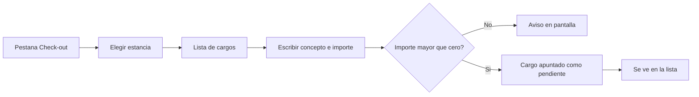

# CU-35 · Apuntar los extras del huésped (minibar, desayuno…)

> En una frase: apuntas en la ficha de la estancia lo que el huésped ha consumido o pedido, para tenerlo a la vista cuando cierre la cuenta.

## 1. Para qué sirve

Aquí apuntas los **cargos adicionales**: los extras que no vienen con la noche. Por ejemplo, un refresco del minibar, un desayuno o un late check-out.

Cada cargo es solo tres cosas: un **concepto** (qué es), un **importe** en euros y quién lo apuntó.

Los cargos quedan en la ficha de esa estancia. Así, cuando el huésped se marcha, los ves todos juntos y decides cuáles se cobran y cuáles no. Ese cierre es el caso de uso CU-34.

Importante: el sistema **no cobra**. Solo deja el apunte para la operación del mostrador. Tampoco manda nada a la **blockchain** (el libro de cuentas público): los extras son cosa del hotel.

## 2. Quién puede hacerlo

El personal de **recepción**. Es el papel que tiene permiso para apuntar cargos y verlos.

El **dueño** del hotel también puede, porque su permiso vale por todos.

El huésped no toca esta pantalla. Él solo consume; tú apuntas.

## 3. Antes de empezar

- Ten tu sesión de recepción abierta.
- Localiza la noche. Vale si está vendida o si ya tiene la entrada hecha.
- Ten claro el concepto y el importe. Si dudas, pregunta antes de apuntar.
- Recuerda que el importe va en euros y siempre mayor que cero.
- Si el extra ya está apuntado, no lo dupliques: revisa la lista primero.

## 4. Paso a paso

1. Entra al panel de recepción y abre la pestaña **Check-out**.
2. Elige la estancia en el desplegable.
3. El panel carga sola la lista de cargos de esa estancia.
4. Mira la lista antes de añadir nada, para no repetir un cargo.
5. Escribe el **Concepto**. Por ejemplo: «Minibar: agua 50 cl».
6. Escribe el **Importe (EUR)**. Por ejemplo: `3.50`.
7. Pulsa **Añadir cargo**.
8. Si el concepto está vacío o el importe es cero, el panel te avisa y no envía nada.
9. El formulario se queda vacío, listo para el siguiente.
10. El cargo nuevo aparece arriba de la lista.

Los cargos se ordenan del más reciente al más antiguo. Los que están cancelados salen etiquetados y sin casilla.

El recorrido, de un vistazo:

## 5. Qué ves cuando sale bien

- El cargo nuevo aparece en la lista, con su concepto, su importe y su moneda.
- El formulario se limpia solo.
- El cargo queda en estado **pendiente**, es decir, sin cobrar ni cancelar.
- Al cerrar la cuenta verás ese cargo con una casilla para cancelarlo o dejarlo.
- Si no hay ningún cargo, la lista pone que está vacía.

## 6. Si algo va mal

| Lo que ves | Qué significa | Qué hacer |
|-----------|---------------|-----------|
| Aviso de que falta el concepto | Has dejado el concepto en blanco | Escribe qué es el extra y vuelve a pulsar |
| Aviso de importe no válido | El importe es cero, negativo o está vacío | Escribe una cifra mayor que cero, en euros |
| «Esa reserva no existe» | Esa noche no está en el sistema | Refresca el panel y elige la estancia otra vez |
| No te deja añadir nada | Tu sesión no tiene el papel de recepción | Pide a quien administra que te dé el permiso |
| El importe sale con céntimos raros | Se redondea al céntimo más cercano | Escribe el importe exacto con dos decimales |
| Quieres corregir un cargo y no puedes | No hay botón de editar ni de borrar | Cancélalo al cerrar la cuenta y apunta otro bien |
| La lista sale vacía | Esa estancia no tiene cargos todavía | Es normal. Añade el primero |
| El panel da error al cargar | La red o la base de datos fallaron | Refresca y reintenta. Si sigue, avisa a soporte |

## 7. Un ejemplo de verdad

Son las ocho de la tarde en el Hotel Marina del Sol. El huésped de la habitación 310 llama a recepción.

Pide una cerveza y un sándwich del servicio de habitaciones. Javier, el recepcionista, apunta el primero.

Abre la pestaña **Check-out**, elige la estancia 310 y mira la lista. Está vacía: esa noche no tiene extras.

Escribe el concepto «Servicio de habitaciones: cerveza» y el importe `4.00`. Pulsa **Añadir cargo**. El cargo aparece arriba, con su importe y la etiqueta de pendiente.

Después apunta el sándwich, de `9.50`. El formulario se limpia solo entre uno y otro.

A la mañana siguiente, al cerrar la cuenta, Javier verá los dos cargos juntos. Marcará los que se cobren y cancelará los que no.

## 8. Preguntas frecuentes

### ¿Puedo cambiar o borrar un cargo que ya apunté?

No. No hay botón de editar ni de borrar. Al cerrar la cuenta puedes cancelarlo y apuntar otro corregido.

### ¿Puedo apuntar un descuento o un importe negativo?

No. Los importes tienen que ser mayores que cero. Para un descuento, habla con quien lleva la caja.

### ¿Puedo apuntar un cargo en una noche que aún no ha llegado?

Sí, si la noche ya está vendida. Solo hace falta que exista en el sistema.

### ¿Dónde veo los cargos cancelados?

En la misma lista, con su etiqueta de cancelados. No se borran: quedan como historial de la estancia.
