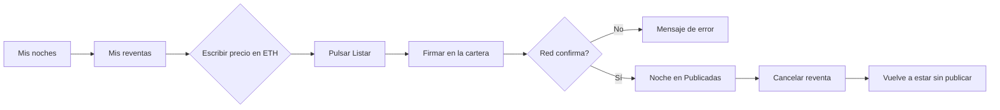

# CU-36 · Que el huésped publique, cambie o retire su reventa

> En una frase: pones tu noche en venta, le cambias el precio o la quitas cuando quieras, todo desde tu cartera y sin pasar por el hotel.

## 1. Para qué sirve

La noche que compraste es una **ficha digital** tuya. Puedes revenderla a otra persona si no la vas a usar.

Aquí decides tres cosas: publicarla, cambiarle el precio y retirarla. Todo desde una pantalla propia.

Cada acción es una operación en la **blockchain** (el libro de cuentas público). Por eso tu **cartera** (la cartera digital del móvil o del navegador) te pide firmar.

La pantalla no guarda copias. Lee el estado real de la red cada vez. Si algo cambia, lo ves al refrescar.

El hotel no interviene en esta pantalla. No hay que pedir permiso a nadie.

## 2. Quién puede hacerlo

El **huésped** que tiene la noche en su cartera. Es el titular.

No hay papel ni permiso especial: manda la propiedad de la ficha. Si la noche es tuya, puedes.

Si la noche ya no es tuya, no puedes tocarla. La red te lo dirá al firmar.

## 3. Antes de empezar

- Conecta tu cartera y ponte en la red correcta. Sin eso, la pantalla te avisa.
- Comprueba que la noche sigue en tu cartera.
- Asegúrate de que esa noche se compró alguna vez. Una noche que nunca se vendió no entra por aquí.
- Comprueba que no has hecho el check-in. Con la entrada hecha, ya no se puede revender.
- Mira que la noche no esté caducada.
- Piensa un precio por encima del suelo de reventa. Ahora mismo el suelo está en 0,01 ETH.
- Ten algo de saldo en la cartera para la comisión de la red.

## 4. Paso a paso

1. Conecta la cartera y entra en la red correcta.
2. Ve a **Mis noches** y pulsa el enlace a **Mis reventas**.
3. Verás dos secciones: **Publicadas** y **Vendidas**.
4. Para publicar una noche, escribe el precio en ETH en su tarjeta.
5. El precio tiene que ser un número mayor que cero.
6. Pulsa **Listar**.
7. Tu cartera te pide firmar. Revisa el precio y confirma.
8. Espera a que la red confirme la operación.
9. Para cambiar el precio, escribe uno nuevo y pulsa **Guardar nuevo precio**. Es otra operación: te vuelve a pedir firma.
10. Para retirar la noche, pulsa **Cancelar reventa** y firma.
11. Al confirmarse, la noche desaparece de **Publicadas**.

El recorrido, de un vistazo:

## 5. Qué ves cuando sale bien

- La noche aparece en **Publicadas**, con su precio en ETH.
- Si cambias el precio, la tarjeta muestra el nuevo al refrescar.
- Si retiras la noche, desaparece de **Publicadas**.
- La operación queda con su comprobante en la red.
- En **Vendidas** verás las reventas que ya se cerraron, con su precio y el comprador.

## 6. Si algo va mal

| Lo que ves | Qué significa | Qué hacer |
|-----------|---------------|-----------|
| Un aviso con la barra de cartera | No hay cartera conectada o la red no es la correcta | Conecta la cartera y cambia de red |
| «Precio no válido» en la tarjeta | El precio está vacío, es cero o no es un número | Escribe una cifra mayor que cero en ETH |
| «No eres el propietario de esta noche» | Esa ficha no está en tu cartera | Revisa que has conectado la cartera correcta |
| «Precio por debajo del mínimo» | Has puesto menos que el suelo de reventa | Sube el precio. El suelo está en 0,01 ETH |
| «Esta noche no se puede revender» | Ya tiene la entrada hecha, o nunca se vendió | No insistas. Esa noche no entra por aquí |
| «La noche ha caducado» | La fecha de la noche ya pasó | No se puede vender. Habla con el hotel |
| «Esa noche no está en venta» | Intentas retirar algo que no está publicado | Refresca la pantalla y mira **Publicadas** |
| Cancelaste la firma en la cartera | La operación no se llegó a enviar | Vuelve a intentarlo si lo quieres hacer |
| El envío falla o se queda colgado | La red rechazó la operación o hubo un fallo | Reintenta. Si sigue, avisa a soporte |
| No carga la lista de noches | Falló la lectura de la red | Pulsa **Reintentar** |

## 7. Un ejemplo de verdad

Ana compró una noche de habitación doble para el 20 de octubre de 2026 en el Hotel Marina del Sol. Al final no puede ir.

Entra en **Mis noches**, pulsa **Mis reventas** y ve que no tiene nada publicado. Abre la tarjeta de su noche doble.

Escribe `0.05` en el precio, en ETH. Pulsa **Listar** y su cartera le pide firmar. Confirma la firma en el móvil.

Unos segundos después, la noche aparece en **Publicadas** con el precio de 0,05 ETH.

Dos días más tarde quiere bajarlo. La gente mira pero nadie compra. Escribe `0.04` y pulsa **Guardar nuevo precio**. Firma otra vez.

El precio nuevo sustituye al viejo. Ana lo ve reflejado al refrescar. Ya no tiene que quitar la noche para volver a publicarla.

## 8. Preguntas frecuentes

### ¿Puedo cambiar el precio sin quitar la noche de la venta?

Sí. Escribes el precio nuevo y pulsas **Guardar nuevo precio**. Por dentro es otra vez la misma operación de listar, y el precio viejo se sobrescribe.

### ¿Publicar cuesta dinero?

Sí, cada operación en la red tiene su comisión. La paga tu cartera al firmar. La pantalla no cobra nada por su parte.

### ¿Puedo revender una noche que ya he usado?

No. Con la entrada hecha la noche queda consumida y la red rechaza la reventa.

### ¿Qué hago si la noche no aparece en la lista?

Refresca y pulsa **Reintentar**. Comprueba que la cartera conectada es la que compró la noche.
