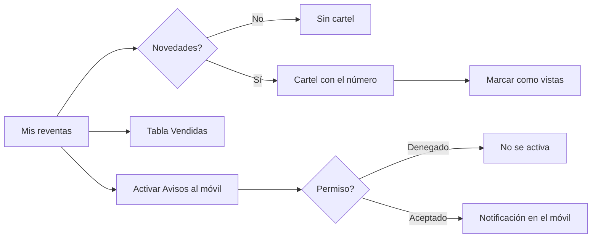

# CU-37 · Avisar al huésped cuando su reventa se mueve

> En una frase: te enteras de que una noche que tenías en venta se ha vendido, con un aviso en la pantalla y otro en el móvil si lo activas.

## 1. Para qué sirve

Cuando alguien compra una noche que tú tenías publicada, el sistema te avisa. Hay dos canales.

El primero es un aviso dentro de la web. Al entrar en **Mis reventas** verás un cartel con el número de reventas nuevas.

El segundo es una **notificación** en el móvil. Eso es el **push**: un mensaje que salta en el navegador aunque no tengas la web abierta. Hay que activarlo y dar permiso.

Los avisos **no guardan datos personales** tuyos. Solo dicen qué noche se ha vendido, de qué habitación y de qué tipo.

El canal con garantía es el correo, y ese va al hotel. El aviso al móvil es un extra: si falla, la venta no se cancela.

## 2. Quién puede hacerlo

El **huésped** que tiene noches publicadas o ya vendidas.

El aviso dentro de la web lo ve cualquiera que entre con su cartera conectada.

Los avisos al móvil los activa cada persona en su propio dispositivo. Es voluntario.

## 3. Antes de empezar

- Conecta tu cartera y ponte en la red correcta.
- Comprueba que tienes al menos una noche publicada o vendida.
- Para el aviso del móvil, usa un navegador que admita notificaciones.
- Ten a mano el móvil o el ordenador donde quieras recibirlas.
- Piensa que el permiso se pide una vez. Si lo deniegas, hay que cambiarlo en los ajustes del navegador.

## 4. Paso a paso

1. Conecta la cartera y entra en **Mis noches**.
2. Pulsa el enlace a **Mis reventas**.
3. Si hay reventas nuevas, verás el cartel de novedades con el número.
4. Pulsa **Marcar como vistas** cuando ya las hayas mirado. Así el contador vuelve a cero.
5. Baja a la tabla **Vendidas** para ver cada reventa cerrada.
6. Cada fila muestra la noche, el precio en ETH y el comprador.
7. Para activar el aviso al móvil, pulsa **Avisos al móvil** en esa misma pantalla.
8. El navegador te pide permiso. Acepta.
9. El sistema registra tu dispositivo y ya puede enviarte notificaciones.
10. Para dejarlo, pulsa otra vez el botón para desactivarlo.

El recorrido, de un vistazo:

## 5. Qué ves cuando sale bien

- Un cartel con el número de reventas nuevas desde tu última visita.
- La tabla **Vendidas** con la noche, el precio en ETH y el comprador.
- Un botón para marcar las novedades como vistas.
- Una notificación en el móvil con el título «Noche vendida» y el detalle de la habitación.
- Al pulsar la notificación se abre una página del sistema con el histórico.
- El botón de avisos al móvil cambia a desactivado cuando ya está puesto.

## 6. Si algo va mal

| Lo que ves | Qué significa | Qué hacer |
|-----------|---------------|-----------|
| No aparece el cartel de novedades | No hay reventas nuevas, o cambiaste de dispositivo | Mira la tabla **Vendidas**. La marca de visto es por navegador |
| El navegador no admite avisos | Ese navegador no sabe recibir notificaciones | Usa otro navegador actualizado |
| El botón de avisos sale como no disponible | El servidor no tiene las claves de aviso configuradas | Avisa a soporte. El resto de la pantalla funciona |
| Denegaste el permiso | El navegador tiene los avisos bloqueados | Cámbialo en los ajustes del navegador y reintenta |
| Activaste los avisos y no llega nada | La última entrega falló | No pasa nada grave: mira la tabla y el correo del hotel |
| El aviso del móvil te llega sin tener noches | El envío es general, no va dirigido a ti | Ignóralo o desactiva los avisos |
| La notificación abre otra página | El aviso apunta al histórico, no a reventas | Vuelve a **Mis reventas** desde el menú |
| No carga la lista de reventas | Falló la lectura de la red | Pulsa **Reintentar** |
| La cartera no está conectada | Falta la cartera o la red no es la correcta | Conecta la cartera y cambia de red |

## 7. Un ejemplo de verdad

Carlos compró tres noches en el Hotel Marina del Sol. Solo va a usar dos, así que publicó la tercera en reventa.

El jueves por la tarde, alguien compra esa noche. Carlos está en el autobús y no tiene la web abierta.

Su móvil suena: una notificación con el título «Noche vendida» y el detalle de la habitación. La había activado la semana anterior.

Carlos llega a casa y entra en **Mis reventas**. Arriba ve el cartel de novedades: una reventa nueva.

Baja a **Vendidas** y ahí está: su noche doble, el precio en ETH y la dirección del comprador.

Pulsa **Marcar como vistas**. El cartel desaparece y el contador vuelve a cero.

## 8. Preguntas frecuentes

### ¿Me llega el aviso aunque no tenga la web abierta?

Sí, si activaste los avisos al móvil y aceptaste el permiso. La notificación la muestra el navegador por su cuenta.

### ¿El aviso guarda mis datos?

No. Solo lleva el título, la habitación, el tipo de noche y unos identificadores técnicos. No hay nombres ni correos.

### ¿Por qué me llega un aviso de una noche que no es mía?

Porque el aviso al móvil se manda a todos los que lo hayan activado, no solo al vendedor. El aviso de la web sí es solo de tus noches.

### ¿Se entera el hotel de la venta?

Sí. El hotel recibe su propio correo cada vez que hay una venta. Ese canal es el que tiene garantía.
