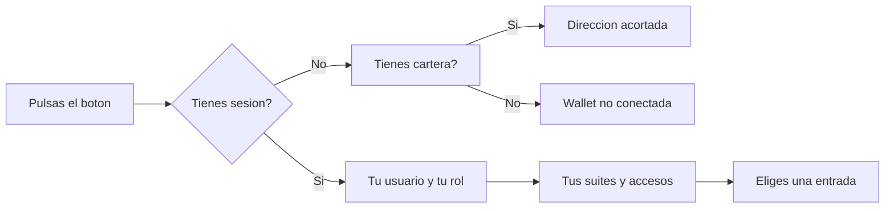

# CU-40 · El menú de la cartera y del usuario

> En una frase: pulsas un botón en la cabecera y se te abre un menú con tu nombre, tu cartera y todos los accesos que te tocan.

## 1. Para qué sirve

En la web del hotel hay dos mundos: el sitio público, donde mira cualquiera, y el panel del hotel, donde trabaja el personal. El menú de la cabecera es la puerta común a los dos.

Con un solo clic ves quién eres y qué puedes hacer. El menú enseña tu nombre y tu rol si has entrado. Si no has entrado, enseña la dirección de tu cartera.

La cartera es la *wallet* (la cartera digital del navegador, como una cuenta con contraseña). Desde este menú la conectas, cambias de red o la desconectas.

El menú también lleva a tus pantallas. Cada persona ve las suyas: el dueño lo ve todo, recepción ve lo del mostrador y un visitante solo ve el acceso al panel.

Importante: el menú **solo pinta accesos**. No cambia nada en la red ni en la base de datos. La seguridad de verdad se comprueba en el servidor.

## 2. Quién puede hacerlo

Cualquiera. No hace falta sesión ni tener la cartera conectada. El menú sale en la cabecera del sitio público y también dentro del panel.

Lo que cambia es lo que ves dentro:

- **Visitante sin entrar**: conectar la cartera, cambiar de red y el acceso al panel.
- **Recepción**: sus pantallas del mostrador, Seguridad y Salir. No ve Usuarios ni Roles.
- **Housekeeping y mantenimiento**: cada uno entra por su propia suite.
- **Minter, pauser, burner y tesorería**: entran por la pantalla de Administración.
- **El dueño**: las cuatro suites, Seguridad, Usuarios, Roles y Salir.

El dueño es la cuenta con permiso `DEFAULT_ADMIN_ROLE`. En palabras llanas, el jefe.

## 3. Antes de empezar

- Ten claro si vas a usar el sitio como visitante o con sesión iniciada.
- Si quieres conectar la cartera, instala una extensión de cartera en el navegador.
- Comprueba que la cartera está en la **red correcta**. Si no, el menú te ofrecerá cambiarla.
- Si vas a entrar al panel, ten a mano usuario, contraseña y el código de seis dígitos.
- Recuerda que estás en la **red de pruebas**. El dinero que se mueve ahí no vale nada.
- Si el menú sale raro o sin datos, refresca la página.

## 4. Paso a paso

1. Abre la web del hotel. Verás la cabecera con el botón del menú a la derecha.
2. Fíjate en el punto de color del botón. Si está encendido, hay cartera conectada.
3. Pulsa el botón. Se despliega el panel del menú.
4. Lee el título de arriba. Con sesión sale tu usuario y una insignia con tu rol.
5. Sin sesión, el título enseña tu cartera acortada, del estilo `0x1234…abcd`.
6. Si no hay nada conectado, el título dice «Wallet no conectada».
7. Elige **Conectar** para enlazar tu cartera. La extensión te pedirá permiso.
8. Si estás en otra red, elige **Cambiar de red**. El menú te lleva a la red de la casa.
9. Cuando ya estés conectado en la red buena, la acción de cartera es **Desconectar**.
10. Baja por las entradas de navegación. Cada una te lleva a una pantalla.
11. Con sesión verás el encabezado **Tus suites**. Debajo están tus accesos.
12. Si eres el dueño, al final aparecen **Usuarios** y **Roles**.
13. Pulsa **Iniciar sesión** para entrar al panel si aún no lo has hecho.
14. Para salir, pulsa **Salir**. Se cierra la sesión y vuelves a la web.
15. Al pie del panel puede salir el botón del grifo de pruebas. Sirve para pedir dinero falso.
16. Con el menú abierto, pulsa **Escape** y se cierra. El foco vuelve al botón.
17. También se cierra si pulsas fuera del panel, en la zona oscurecida.

El recorrido, de un vistazo:

## 5. Qué ves cuando sale bien

- El panel se despliega pegado al botón de la cabecera.
- Arriba sale tu identidad: usuario y rol, o la cartera acortada.
- El punto del botón está encendido si hay cartera conectada.
- Las entradas de cartera cambian según el estado: Conectar, Cambiar de red o Desconectar.
- Con sesión aparece el encabezado **Tus suites** y tus pantallas.
- El dueño ve además Usuarios y Roles.
- Al elegir una entrada, el panel se cierra y llegas a la pantalla.
- Al pulsar Salir, vuelves a la web como visitante.
- El grifo de pruebas se ve solo si te corresponde.

## 6. Si algo va mal

| Lo que ves | Qué significa | Qué hacer |
|-----------|---------------|-----------|
| Título «Wallet no conectada» | No hay cartera enlazada | Pulsa Conectar y acepta en tu cartera |
| La cartera no conecta | Cerraste el aviso de la extensión | Vuelve a pulsar Conectar y acepta el permiso |
| Sale **Cambiar de red** | Tu cartera está en otra red | Púlsalo y confirma el cambio en la extensión |
| No veo **Desconectar** | Estás en la red incorrecta | Primero cambia de red. Después podrás desconectar |
| No veo Usuarios ni Roles | Tu sesión no es la del dueño | Pídeselas al dueño. Es lo normal |
| El menú se cierra solo | La sesión ha caducado | Vuelve a entrar con usuario, contraseña y código |
| «Demasiadas peticiones» | Has pedido cosas muy rápido | Espera un minuto y reintenta |
| El botón del grifo no sale | No aplica en tu caso o en tu red | No pasa nada. Es una ayuda de pruebas |
| Pulsé Salir y no pasó nada | Falló la red al cerrar la sesión | El sistema cierra igual la sesión local. Refresca |

## 7. Un ejemplo de verdad

Marta es la dueña del Hotel Marina del Sol. Abre la web pública desde el móvil para enseñársela a una clienta.

Pulsa el botón de la cabecera. No tiene sesión iniciada, así que el menú dice «Wallet no conectada». Le sale Conectar y el acceso al panel.

Conecta su cartera y acepta en la extensión. El punto del botón se enciende y el título pasa a `0x1234…abcd`. Como está en la red buena, solo ve la opción de desconectar.

Más tarde, ya en el despacho, entra al panel con su usuario, su contraseña y el código del móvil. Ahora el menú enseña su nombre con la insignia de dueña. Debajo aparece **Tus suites** y, al final, **Usuarios** y **Roles**.

Su sobrina entra con la cuenta de recepción. En su menú no hay ni rastro de Usuarios ni de Roles. Solo sus pantallas, Seguridad y Salir.

## 8. Preguntas frecuentes

### ¿Necesito conectar la cartera para ver la web?

No. El menú y el catálogo se ven sin cartera. La cartera solo hace falta para comprar o firmar cosas.

### ¿Por qué el título enseña mi cartera y no mi nombre?

Porque en el sitio público no hay sesión. El sistema tira de la cartera conectada. Con sesión iniciada sí sale tu usuario.

### ¿Puedo cambiar de red y desconectar a la vez?

No. Si la cartera está en la red incorrecta, el menú ofrece cambiarla. Ya conectado en la red buena, ofrece desconectar.

### ¿El menú decide qué puedo hacer?

No. El menú solo enseña atajos. Los permisos de verdad se comprueban en el servidor cada vez que pides algo.
