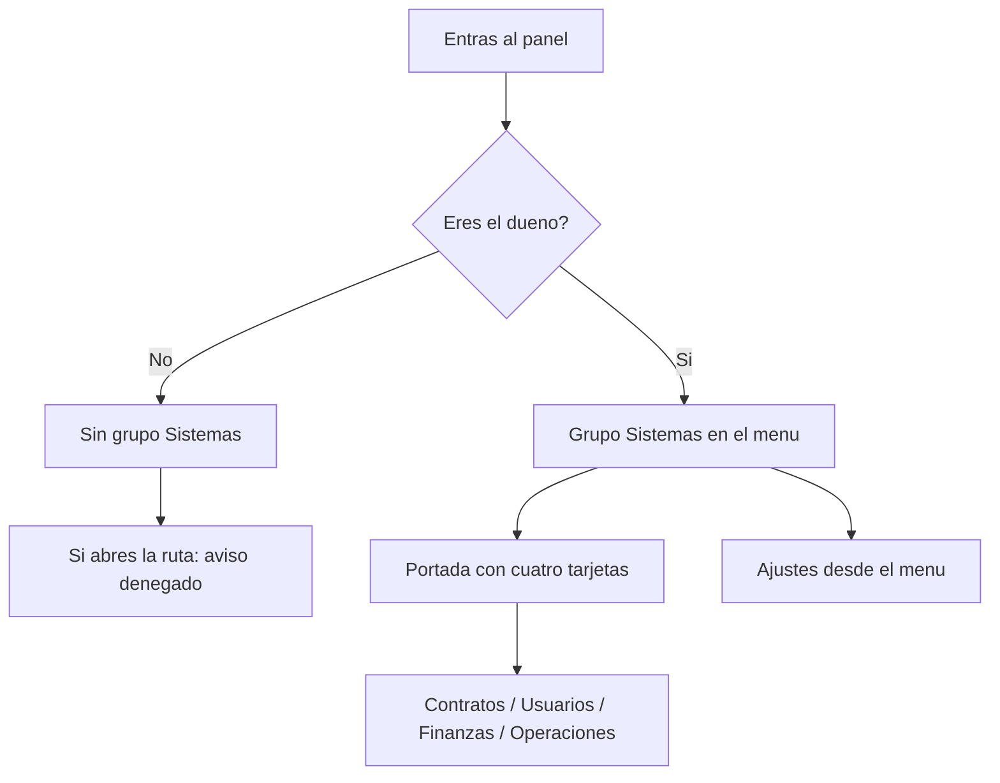

# CU-41 · La sección «Sistemas» (solo para el dueño)

> En una frase: en el panel del hotel hay una zona llamada Sistemas que solo ve el dueño, y dentro están las pantallas más delicadas del negocio.

## 1. Para qué sirve

El panel del hotel tiene muchas pantallas. Las del día a día están repartidas por el menú. Pero hay un puñado que tocan el corazón del sistema: contratos, usuarios, finanzas y operaciones.

Todo eso se junta en una zona llamada **Sistemas**. Así no se mezcla con el trabajo normal del mostrador.

Sistemas es la sala de máquinas. Aquí se gobierna la plataforma: quién entra, cómo está el contrato, cuánto dinero hay y qué está pasando ahora mismo.

La puerta se cierra en dos sitios a la vez. En el menú no te aparece el grupo si no eres el dueño. Y si escribes la dirección a mano, el servidor te corta el paso igual.

Esto último es importante. Esconder un botón no protege nada. La protección de verdad vive en el servidor.

Dentro de Sistemas hay seis entradas. La portada enseña cuatro tarjetas. **Ajustes** se alcanza desde el menú lateral, no desde la portada.

## 2. Quién puede hacerlo

Solo el **dueño** del hotel. Es la cuenta con el permiso `DEFAULT_ADMIN_ROLE`.

El personal de **recepción** no entra. No ve el grupo en el menú y, si teclea la dirección, recibe un aviso de acceso denegado.

El resto de roles del hotel tampoco. Housekeeping, mantenimiento y los demás tienen sus propias pantallas.

Aunque el dueño vale por todos los roles en general, esta puerta compara el rol de forma estricta. O eres dueño, o no pasas.

## 3. Antes de empezar

- Ten tu usuario del panel, tu contraseña y el código de seis dígitos.
- Comprueba que tu cuenta tiene el permiso de dueño.
- Que el panel y la base de datos estén levantados.
- Ten claro que estás en la **red de pruebas**.
- Si vas a tocar contratos o dinero, lee antes el manual de esa pantalla.
- No busques Ajustes en la portada: vive en el menú lateral.

## 4. Paso a paso

1. Entra al panel con tu usuario, tu contraseña y el código de seis dígitos.
2. Mira el menú lateral. Con la cuenta del dueño verás el grupo **Sistemas**.
3. Pulsa **Sistemas**. Se abre la portada de la sección.
4. Si el menú está plegado, verás un solo icono con forma de servidor. Púlsalo.
5. En la portada hay cuatro tarjetas: **Contratos**, **Usuarios**, **Finanzas** y **Operaciones**.
6. Pulsa la tarjeta que necesites. La pantalla se abre con su contenido.
7. Para **Ajustes**, baja al menú lateral. Ahí está la sexta entrada.
8. Arriba verás las migas de pan: Inicio → Sistemas → la pantalla donde estás.
9. Repite con cualquier otra entrada. Todas viven dentro de Sistemas.
10. Las acciones serias —pausar el contrato, cambiar roles, retirar dinero— se hacen dentro de estas pantallas.
11. Cada acción de esas firma en la red y tiene su propio manual.
12. Si cierras el panel y vuelves a entrar, Sistemas sigue esperándote ahí.
13. Si entras con una cuenta que no es la del dueño, la sección no aparece.

El recorrido, de un vistazo:

## 5. Qué ves cuando sale bien

- El grupo **Sistemas** aparece en el menú lateral, con su icono.
- La portada se abre con las cuatro tarjetas bien visibles.
- Las migas de pan marcan Inicio → Sistemas → la entrada.
- El menú lateral lista seis entradas: la portada, Contratos, Usuarios, Finanzas, Operaciones y Ajustes.
- Cada pantalla carga sus datos a través de una dirección protegida del servidor.
- Con el menú plegado, el grupo se queda en un solo icono.
- Nada de la sección se abre para una cuenta que no sea la del dueño.

## 6. Si algo va mal

| Lo que ves | Qué significa | Qué hacer |
|-----------|---------------|-----------|
| No veo el grupo **Sistemas** | Tu cuenta no es la del dueño | Pídeselo al dueño si lo necesitas |
| Aviso de acceso denegado | Entraste con un rol que no es dueño | Entra con la cuenta de dueño |
| Te manda a la pantalla de acceso | No hay sesión válida | Entra con usuario, contraseña y código |
| Página en blanco o error del servidor | Falta configuración o la base está caída | Avisa a quien mantiene el sistema |
| «Demasiadas peticiones» | Has pedido pantallas muy rápido | Espera un minuto. El límite es 30 por minuto |
| Ajustes no sale en la portada | Solo se llega por el menú lateral | Búscalo en el menú. Es lo normal |
| La entrada de Sistemas desapareció | El menú se plegó o cambió tu rol | Despliega el menú y comprueba tu sesión |
| Una pantalla carga muy lenta | Está leyendo datos reales | Espera un momento y refresca |

## 7. Un ejemplo de verdad

Marta es la dueña del Hotel Marina del Sol. Es lunes por la mañana. Abre el panel y entra con su usuario, su contraseña y el código del móvil.

En el menú lateral ve el grupo **Sistemas** al final. Lo pulsa y aparece la portada con cuatro tarjetas: Contratos, Usuarios, Finanzas y Operaciones.

Entra en **Usuarios** y revisa que todo el personal esté activo. Luego abre **Finanzas** y comprueba que el dinero recaudado del fin de semana está donde toca.

Más tarde pasa por su despacho la jefa de recepción. Entra con su cuenta y en su menú no hay ni rastro de Sistemas. Prueba a escribir la dirección a mano y salta el aviso de acceso denegado. Todo correcto.

Esa misma tarde Marta necesita tocar un ajuste. Como no está en la portada, lo busca en el menú lateral y ahí está: **Ajustes**.

## 8. Preguntas frecuentes

### ¿Por qué no veo la sección Sistemas?

Porque tu sesión no tiene el permiso de dueño. El grupo solo se monta para esa cuenta.

### ¿Basta con esconder el menú para proteger la sección?

No. El servidor comprueba la sesión en cada página y en cada dirección de datos. Aunque escribas la ruta a mano, no pasas.

### ¿Qué diferencia hay entre los cuatro paneles?

Contratos es el gobierno del contrato, Usuarios son las cuentas del personal, Finanzas es el dinero y Operaciones es lo que está pasando ahora. Cada uno tiene su manual.

### ¿Los cambios de Sistemas se apuntan en la red?

Depende de la pantalla. Mirar datos no toca la red. Las acciones serias, como pausar el contrato o retirar dinero, sí firman una transacción.
