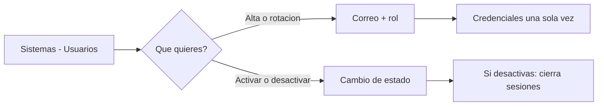

# CU-42 · Dar de alta, cambiar y quitar usuarios de la plataforma

> En una frase: desde una sola pantalla das de alta al personal, le cambias las credenciales y le quitas el acceso cuando ya no trabaja contigo.

## 1. Para qué sirve

Cada persona que trabaja en el panel necesita su propia cuenta. Esta pantalla es donde se crean y se cuidan.

Desde aquí ves la lista de operadores con su rol, su estado y si están bloqueados. Y desde aquí los das de alta, les cambias las credenciales o los desactivas.

La pantalla vive dentro de **Sistemas → Usuarios**. O sea, en la zona más protegida del panel.

Cuando creas una cuenta, el sistema te enseña **una sola vez** la contraseña, el secreto del código de seis dígitos y ocho códigos de rescate. Apúntalos en ese momento. Después ya no se vuelven a mostrar.

Desactivar a alguien no borra su ficha. Le quita el acceso y cierra sus sesiones abiertas. Puedes volver a activarlo más adelante.

Ojo con una cosa: aquí se dan los roles de la **web** (dueño, recepción, housekeeping y mantenimiento). Los permisos del contrato se conceden en otra pantalla, la de Contratos.

## 2. Quién puede hacerlo

Solo el **dueño** del hotel, la cuenta con el permiso `DEFAULT_ADMIN_ROLE`.

Recepción y el resto del personal no entran. Ni ven la pantalla ni pueden pedir sus datos al servidor.

El dueño tampoco puede desactivarse a sí mismo. El sistema se lo impide para que nadie se quede fuera de su propia casa.

## 3. Antes de empezar

- Ten tu sesión de dueño abierta: usuario, contraseña y código de seis dígitos.
- Ten a mano el correo de la persona que vas a dar de alta.
- Decide qué rol le toca: dueño, recepción, housekeeping o mantenimiento.
- Si vas a poner tú la contraseña, que tenga **12 caracteres o más**.
- Ten un sitio seguro para guardar las credenciales, porque salen una sola vez.
- Recuerda que estás en la **red de pruebas**.

## 4. Paso a paso

1. Entra al panel con tu cuenta de dueño.
2. Abre **Sistemas** en el menú lateral y luego **Usuarios**.
3. Verás la tabla de operadores. Cada fila trae usuario, rol, estado, bloqueo y fecha del último cambio.
4. Tu propia fila lleva la insignia **tú**. Su botón de estado sale deshabilitado.
5. Para dar de alta, ve al formulario de arriba.
6. Escribe el correo de la persona en el campo de usuario.
7. Elige su rol en el desplegable.
8. Deja la contraseña vacía si quieres que el sistema la genere sola.
9. Si prefieres ponerla tú, escríbela con 12 caracteres o más.
10. Pulsa **Crear**. El sistema comprueba los datos y crea la cuenta.
11. Aparece el bloque de **credenciales**: contraseña, secreto, enlace del código y códigos de rescate.
12. Pulsa el botón de copiar y guarda todo en un sitio seguro.
13. Cierra el bloque cuando lo tengas. No se vuelve a mostrar.
14. La tabla se refresca sola con la fila nueva, ya activa.
15. Para cambiar la contraseña de alguien, repite el alta con su mismo correo. Así se rota.
16. Al rotar también se renueva el código de seis dígitos y los códigos de rescate.
17. Para quitar el acceso, pulsa el botón de estado de esa fila.
18. Confirma. El operador queda inactivo y sus sesiones abiertas se cierran.

El recorrido, de un vistazo:

## 5. Qué ves cuando sale bien

- La tabla lista a todos los operadores, con su rol y su estado.
- Tu fila lleva la insignia **tú**.
- Tras el alta, la fila nueva aparece **activa**.
- El bloque de credenciales enseña la contraseña, el secreto, el enlace y los ocho códigos de rescate.
- Un aviso te recuerda que eso se ve una sola vez.
- Al desactivar, la fila cambia a inactiva.
- Las sesiones abiertas de esa persona dejan de valer.
- La lista nunca enseña contraseñas guardadas ni secretos. Solo los datos públicos.

## 6. Si algo va mal

| Lo que ves | Qué significa | Qué hacer |
|-----------|---------------|-----------|
| «Usuario no válido» | El correo está vacío, sin arroba o es muy largo | Repásalo. Debe ser un correo de verdad |
| «Rol no válido» | Ese rol no se puede asignar aquí | Elige dueño, recepción, housekeeping o mantenimiento |
| «Contraseña no válida» | Tiene menos de 12 caracteres | Alárgala o deja el campo vacío |
| «No puedes desactivar tu propia cuenta» | Intentaste quitarte el acceso a ti mismo | Hazlo desde otra cuenta de dueño |
| «Usuario no encontrado» | Esa persona ya no está en la lista | Refresca la pantalla y revisa el correo |
| Me pide volver a entrar | Tu sesión ha caducado | Entra otra vez con usuario, contraseña y código |
| No veo la pantalla de Usuarios | Tu cuenta no es la del dueño | Pídeselo al dueño |
| El bloque de credenciales no se va | Se queda hasta que cambies de pantalla | Cópialo y sigue. No se guarda en ningún sitio |
| Error del servidor al crear | Fallo de la base de datos o de configuración | Reintenta. Si sigue, avisa a quien mantiene el sistema |

## 7. Un ejemplo de verdad

Marta es la dueña del Hotel Marina del Sol. Ha contratado a Lucas para recepción y quiere darle su cuenta.

Entra al panel, abre **Sistemas → Usuarios** y rellena el formulario con `lucas@hotel.es`. Elige el rol de recepción y deja la contraseña en blanco para que la genere el sistema.

Pulsa **Crear**. Aparece el bloque de credenciales con una contraseña larga, un secreto para el móvil y ocho códigos de rescate. Marta lo copia todo y se lo pasa a Lucas en mano.

Lucas instala la app de códigos, escanea el enlace y ya puede entrar. En su menú no aparecen Usuarios ni Roles.

Meses después, a Lucas se le estropea el móvil. Marta repite el alta con el mismo correo. El sistema rota la contraseña y el secreto, y le da códigos nuevos. Lucas vuelve a entrar sin problema.

Cuando Lucas cambia de trabajo, Marta pulsa su botón de estado y lo desactiva. Sus sesiones abiertas se cierran al momento.

## 8. Preguntas frecuentes

### ¿Puedo ver la contraseña de un operador más adelante?

No. La contraseña se guarda cifrada y no se puede leer. Si se le olvida, se rota y se le da una nueva.

### ¿Qué pasa si repito el alta con un correo que ya existe?

Que se rota esa cuenta: contraseña y código nuevos. Sirve para recuperar el acceso. El sistema lo trata igual como un alta.

### ¿Desactivar a alguien borra su cuenta?

No. La ficha se queda en la lista como inactiva. Puedes volver a activarla cuando quieras.

### ¿Puedo dar permisos del contrato desde aquí?

No. Esta pantalla da roles de la web. Los permisos del contrato, como pausar o retirar dinero, se conceden en la pantalla de Contratos.
