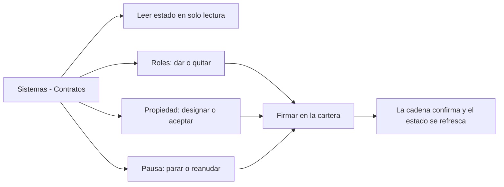

# CU-43 · Gobernar el contrato (pausar, roles, royalty, propiedad)

> En una frase: desde una sola pantalla ves cómo está el contrato del hotel y decides quién puede tocarlo.

## 1. Para qué sirve

El **contrato** es el programa que vive en la *blockchain* (el libro de cuentas público). Ahí están las noches y el dinero del hotel. Nadie lo cambia a mano: cada cambio se pide firmando una transacción.

Esta pantalla es el cuadro de mandos de ese contrato. Vive en **Sistemas → Contratos**.

Arriba ves el estado en solo lectura: si el sistema está en pausa, la tesorería, el precio mínimo de listado y el `owner`. También la dirección del contrato, su red y su bloque de despliegue.

Debajo están los tres bloques donde sí se toca algo: **roles**, **propiedad** y **pausa**. Nada de esto escribe en la base de datos de la web. Cada botón firma algo en la cadena.

Una cosa importante: aquí **no hay nada de royalty**. El royalty se fija al poner la noche a la venta, según el tipo de habitación (5 % en simple y doble, 10 % en suite), y ya no se cambia. No existe ningún permiso que lo pueda modificar.

## 2. Quién puede hacerlo

Solo el **dueño**, la cuenta de la web con el rol `DEFAULT_ADMIN_ROLE`. Si tu sesión no lo tiene, la pantalla ni se pinta.

Pero ojo: la web solo filtra por comodidad. Quien manda de verdad es el contrato. Para cada acción, la **cartera** que firma necesita su permiso en la cadena:

- Pausar y reanudar: `PAUSER_ROLE` (el permiso de pausa).
- Dar y quitar roles, y tocar la propiedad: `DEFAULT_ADMIN_ROLE`.

Si la cartera no tiene el permiso, la transacción se rechaza. No hay forma de saltárselo.

## 3. Antes de empezar

- Ten tu sesión de dueño abierta.
- Conecta la cartera (la cartera digital) que tenga el rol que vas a usar.
- Comprueba que estás en la **red de pruebas** correcta.
- Ten a mano la dirección `0x…` de la persona o cartera afectada.
- Piensa bien antes de revocar o de transferir: son acciones delicadas.
- Recuerda que pausar bloquea compras, reventas, creación y quema de noches.
- Recuerda que retirar dinero **sí** funciona aunque el sistema esté en pausa.

## 4. Paso a paso

1. Entra al panel con tu cuenta de dueño.
2. Abre **Sistemas** en el menú y entra en **Contratos**.
3. Lee el bloque de estado: pausa, tesorería, precio mínimo, `owner`, dirección, red y bloque.
4. Ese bloque es de solo lectura. No tiene ningún botón.
5. Para dar un permiso, baja al bloque **Conceder / revocar rol**.
6. Elige el rol en el desplegable y escribe la dirección `0x…` de la cuenta.
7. Pulsa **Conceder**. Esa acción se firma directo, sin pantalla de revisión.
8. Firma en tu cartera y espera a que la red la confirme.
9. Para quitar un permiso, elige el rol y la cuenta y pulsa **Revocar**.
10. Se abre una ventana de revisión. Léela y confirma con **Confirmar y firmar**.
11. El permiso no se quita hasta que confirmas.
12. Para la propiedad, baja a la tarjeta **Ownership**.
13. Escribe la dirección del nuevo titular y pulsa **Iniciar transferencia**.
14. Confirma el aviso. Verás que la propiedad es **solo informativa**.
15. Si te han designado a ti, pulsa **Aceptar ownership**. Esa no pide confirmación.
16. Para parar el sistema, baja al bloque **Pausa de emergencia**.
17. Si dice que está activo, pulsa **Pausar** y confirma en la ventana.
18. Para volver a arrancar, pulsa **Reanudar** y confirma.
19. Espera a que la transacción se mine. Al confirmarse, el estado se vuelve a leer solo.

El recorrido, de un vistazo:

## 5. Qué ves cuando sale bien

- La cartera te pide la firma y luego enseña el envío.
- El estado de la transacción pasa por firmar, minar y confirmar.
- Al confirmarse, el bloque de estado se vuelve a leer.
- Si pausaste, el indicador cambia a «El sistema está EN PAUSA.».
- Los botones se deshabilitan cuando no toca: no puedes pausar dos veces seguidas.
- Tras designar titular, el `owner` pendiente aparece actualizado.
- Los roles concedidos quedan en el contrato, no en la base de datos de la web.
- El aviso de error solo sale si algo falla.

## 6. Si algo va mal

| Lo que ves | Qué significa | Qué hacer |
|-----------|---------------|-----------|
| «Tu sesión no incluye el rol necesario…» | Tu cuenta de la web no es la del dueño | Entra con la cuenta del dueño |
| «Introduce una dirección 0x válida.» | La dirección está vacía o mal escrita | Repásala: debe empezar por `0x` |
| «El sistema está en pausa. Reanúdalo…» | Intentaste algo que está bloqueado en pausa | Reanuda el sistema y repite |
| «Has cancelado la firma.» | Cerraste la ventana de la cartera | Vuelve a intentarlo cuando quieras |
| «No se pudo completar la operación…» | Falta el rol en la cadena o estás en otra red | Revisa rol y red, y reintenta |
| Al pausar, la transacción se rechaza | La cartera no tiene `PAUSER_ROLE` | Concede ese permiso antes de pausar |
| **Pausar** sale apagado | El sistema ya está en pausa | No hagas nada, o pulsa **Reanudar** |
| **Reanudar** sale apagado | El sistema ya está activo | No hace falta hacer nada |
| Transferí el `owner` y no cambia nada | El `owner` es informativo y no da control | Cede el control con `DEFAULT_ADMIN_ROLE` |
| Te pide volver a entrar | La sesión ha caducado | Entra de nuevo con tu cuenta |

## 7. Un ejemplo de verdad

Marta es la dueña del Hotel Marina del Sol. Una noche alguien detecta un fallo raro en la reventa y ella decide parar el sistema mientras lo miran.

Abre **Sistemas → Contratos**, comprueba que el estado dice que está activo y pulsa **Pausar**. La ventana le avisa de que se bloquearán compras, reventas, creación y quema. Confirma y firma con la cartera. Un minuto después, el indicador ya dice que está en pausa.

Esa misma tarde el equipo necesita pasar el dinero sobrante a la tesorería. Aunque el sistema está parado, la retirada funciona: es la vía de emergencia.

Al día siguiente, con el fallo resuelto, Marta pulsa **Reanudar** y todo vuelve a la normalidad.

Semanas más tarde, Marta quiere que su socio Tomás pueda dar permisos. Le concede `DEFAULT_ADMIN_ROLE` a la cartera de Tomás y espera la confirmación. Después, como simple etiqueta de titularidad, lo designa como `owner` pendiente. Sabe que eso no le da el control real: el control va con el rol.

## 8. Preguntas frecuentes

### ¿Qué se bloquea exactamente cuando pauso el sistema?

Se bloquean la creación de noches, las compras, las reventas, el check-in y la quema. La retirada de dinero sigue permitida a propósito.

### ¿Transferir el `owner` me deja sin control del contrato?

No. El `owner` es una etiqueta informativa. Quien gobierna de verdad es quien tiene `DEFAULT_ADMIN_ROLE`.

### ¿Puedo cambiar el precio mínimo o la tesorería desde aquí?

Hoy no. La pantalla los muestra, pero no hay ningún botón en toda la aplicación que los cambie.

### ¿Puedo tocar el royalty desde esta pantalla?

No. No existe ningún panel de royalty. Se fija al publicar la noche, según el tipo de habitación, y es inmutable.
