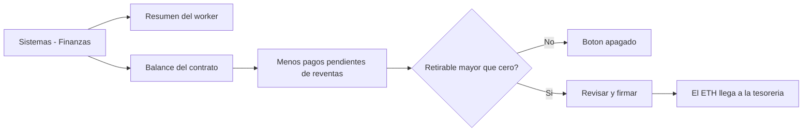

# CU-44 · Ver las finanzas del hotel y retirar el dinero

> En una frase: miras cuánto ha movido el hotel y pasas el dinero que sobra del contrato a la cuenta de la tesorería.

## 1. Para qué sirve

Esta pantalla te da dos cosas: el **resumen del negocio** y el **botón para retirar el dinero**. Vive en **Sistemas → Finanzas**.

El resumen lo calcula el *worker* (el programa que lee la cadena por detrás y guarda los totales). Verás el volumen de venta primaria, el de reventa, los royalties ganados, las noches vendidas, las creadas y las quemadas. El botón **Actualizar** vuelve a pedir los números.

Debajo está la tarjeta de **Fondos**. Muestra el **balance del contrato**, el **retirable ahora** y la **tesorería destino**.

La cuenta es sencilla: retirable = balance − pagos pendientes de reventas. El sistema nunca baja de cero. Esa reserva existe para que el dinero de los vendedores no se lo lleve otro.

La retirada manda el sobrante a la tesorería del hotel, la dirección configurada en el contrato. No se puede deshacer.

Ojo: si el sistema está en pausa, la retirada sigue permitida. El propio aviso de la pantalla lo dice: es la vía de remediación.

## 2. Quién puede hacerlo

La pantalla es para el **dueño**, la cuenta con `DEFAULT_ADMIN_ROLE`.

Para **retirar** hace falta algo más: la cartera que firma debe tener `TREASURER_ROLE` (el permiso de tesorería) en el contrato.

Puede pasar que tu cuenta de la web sea la del dueño y la cartera conectada no tenga ese permiso. Entonces la retirada se rechaza al firmar.

El resumen de arriba lo puede pedir cualquier rol de gestión, no solo el dueño.

## 3. Antes de empezar

- Ten tu sesión de dueño abierta.
- Conecta la cartera que tenga el permiso de tesorería.
- Comprueba que estás en la red correcta.
- Ten claro que el dinero va a la dirección de tesorería del contrato.
- Revisa que no haya reventas con pago pendiente: esa parte queda reservada.
- Recuerda que la operación es irreversible.
- Recuerda que estás en la **red de pruebas**.

## 4. Paso a paso

1. Entra al panel con tu cuenta de dueño.
2. Abre **Sistemas** y luego **Finanzas**.
3. Arriba verás el resumen: primaria, reventa, royalties, vendidas, creadas y quemadas.
4. Pulsa **Actualizar** si quieres refrescar los números.
5. Baja a la tarjeta **Fondos**.
6. Lee el **balance del contrato**.
7. Mira el **retirable ahora**: ya lleva descontados los pagos pendientes.
8. Comprueba la dirección de **tesorería destino**.
9. Si el retirable es cero, el botón **Retirar a tesorería** sale apagado.
10. Si hay saldo, pulsa **Retirar a tesorería**.
11. Se abre la ventana de revisión con el importe y el aviso de que es irreversible.
12. Léela y confirma con **Confirmar y firmar**.
13. Firma en tu cartera y espera a que la red confirme.
14. Al confirmarse, la pantalla vuelve a leer el balance y el pendiente.
15. El balance debe haber bajado y el retirable quedar en cero.

El recorrido, de un vistazo:

## 5. Qué ves cuando sale bien

- El resumen enseña las seis cifras del negocio: primaria, reventa, royalties, vendidas, creadas y quemadas.
- El retirable se calcula solo y se ve en la tarjeta.
- La ventana de revisión te dice el importe exacto y que es irreversible.
- Tras firmar, la cartera muestra el envío y la confirmación.
- El balance baja y la pantalla se refresca sola.
- El dinero reservado a reventas no se toca.
- La retirada deja rastro público en la cadena con el evento `Withdrawn`.

## 6. Si algo va mal

| Lo que ves | Qué significa | Qué hacer |
|-----------|---------------|-----------|
| «No hay saldo retirable en este momento.» | El retirable es cero | Espera a que entren ventas nuevas |
| El botón **Retirar a tesorería** está apagado | No hay residual positivo | No insistas: no hay nada que sacar |
| «No hay saldo retirable. El balance bruto puede estar reservado…» | Todo el dinero está reservado a reventas | Revisa los pagos pendientes y reintenta más tarde |
| Un aviso de error en el resumen | El worker o su base de datos no responden | Pulsa **Actualizar**. Si sigue, avisa a quien mantiene el sistema |
| «El contrato está en pausa…» | El sistema está parado, pero retirar sí se puede | Continúa: es una vía de emergencia |
| La transacción se rechaza al firmar | La cartera no tiene el permiso de tesorería | Pide que te concedan `TREASURER_ROLE` |
| El envío falla al final | La tesorería rechazó el pago | Revisa la dirección de tesorería del contrato |
| El balance pone «no se pudo leer» | La lectura de la cadena ha fallado | Refresca la pantalla y reintenta |
| Te pide volver a entrar | La sesión ha caducado | Entra de nuevo con tu cuenta |

## 7. Un ejemplo de verdad

Marta es la dueña del Hotel Marina del Sol. El verano ha ido bien y quiere pasar el dinero sobrante a la cuenta del hotel.

Abre **Sistemas → Finanzas**. El resumen dice que se han vendido 48 noches y que las reventas han movido 1,2 ETH. El royalty acumulado es de 0,06 ETH.

En la tarjeta de fondos ve un balance de 4 ETH. El retirable ahora marca 3,7 ETH: los 0,3 ETH que faltan están reservados para dos reventas que aún no han cobrado sus dueños.

Marta comprueba que la tesorería destino es la cartera del hotel. Pulsa **Retirar a tesorería**, lee la ventana y confirma. Firma con la cartera del hotel, que tiene el permiso de tesorería.

Un minuto después el balance baja a 0,3 ETH y el retirable queda en cero. Esa cantidad seguirá ahí hasta que los vendedores cobren.

## 8. Preguntas frecuentes

### ¿Por qué el retirable es menos que el balance del contrato?

Porque el contrato aparta el dinero de las reventas que todavía no han cobrado sus dueños. Ese dinero no es del hotel.

### ¿Puedo retirar dinero con el sistema en pausa?

Sí. La retirada no se bloquea con la pausa, justo para poder sacar fondos en una emergencia.

### ¿Adónde va el dinero exactamente?

A la dirección de tesorería guardada en el contrato. La pantalla te la enseña antes de firmar.

### ¿Puedo elegir yo cuánto retirar?

No. El contrato retira todo el sobrante de una vez. No hay campo para poner un importe.
