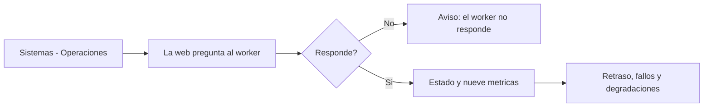

# CU-45 · Ver qué está pasando ahora mismo (operaciones)

> En una frase: miras si el motor que lee la cadena va al día y ves de un vistazo si algo se ha quedado atascado.

## 1. Para qué sirve

Detrás del hotel hay un *worker* (un programa que lee la cadena por detrás y prepara los datos). Si se atasca, las cifras y los avisos llegan tarde. Esta pantalla te lo cuenta.

Vive en **Sistemas → Operaciones** y es **de solo lectura**. Aquí no se firma nada ni se cambia nada.

Arriba verás el estado del worker y la hora de la comprobación. Debajo, nueve datos que resumen su salud.

Los más útiles son el **último bloque indexado**, el **bloque de la cadena** y el **retraso** entre ambos. Si el retraso crece, el worker se está quedando atrás.

También verás el último bloque agregado, su retraso, los fallos seguidos de conexión, los fallos seguidos de agregados, y si el correo o el proceso están degradados.

El sistema no se refresca solo. Cuando quieras el dato bueno, pulsa **Actualizar**.

## 2. Quién puede hacerlo

Solo el **dueño**, la cuenta con `DEFAULT_ADMIN_ROLE`. Lo comprueba el servidor, no solo la pantalla.

Recepción y el resto del personal no entran. Si lo intentan, el servidor les responde que no.

No hay ningún botón que cambie el estado del worker desde aquí. Solo se mira.

## 3. Antes de empezar

- Ten tu sesión de dueño abierta.
- No necesitas cartera: esta pantalla no firma transacciones.
- Ten claro el número de bloque actual si quieres comparar.
- Recuerda que el estado vive en memoria del worker y se pierde si se reinicia.
- Recuerda que la hora que se enseña es UTC (la del meridiano de Greenwich).
- Recuerda que estás en la **red de pruebas**.

## 4. Paso a paso

1. Entra al panel con tu cuenta de dueño.
2. Abre **Sistemas** en el menú y entra en **Operaciones**.
3. Espera un momento: la pantalla pide el estado nada más abrirse.
4. Mira la primera línea: el **estado del worker** y la **hora de la comprobación**.
5. Si pone `ok`, el worker está sano. Si pone `down`, algo va mal.
6. Repasa las nueve casillas de debajo.
7. Compara el **último bloque indexado** con el **bloque de la cadena**.
8. Mira el **retraso**: es la diferencia entre los dos.
9. Comprueba el **retraso de los agregados**, que se calcula igual.
10. Revisa los **fallos consecutivos** de conexión y de agregados.
11. Mira si el **correo** o el **proceso** salen degradados.
12. Pulsa **Actualizar** cuando quieras volver a preguntar.
13. Si el worker no responde, verás un aviso claro en lugar de ceros falsos.

El recorrido, de un vistazo:

## 5. Qué ves cuando sale bien

- La línea de estado pone `ok` junto a la hora de la comprobación.
- El retraso es un número bajo: el worker va pegado a la cadena.
- Los contadores de fallos consecutivos están en cero.
- El correo y el proceso aparecen como «no» degradados.
- Si un dato no llega, se enseña «…» en vez de un cero engañoso.
- Los datos de sí o no se traducen a «sí» y «no».
- El botón **Actualizar** trae cifras nuevas sin recargar la página.

## 6. Si algo va mal

| Lo que ves | Qué significa | Qué hacer |
|-----------|---------------|-----------|
| «El worker no responde; no se puede leer su estado.» | El programa no contesta a la web | Comprueba que el worker está encendido |
| El estado pone `down` | El worker se declara enfermo | Mira el dato concreto que lo delata |
| Un aviso de error distinto | El worker contestó con un fallo raro | Vuelve a pulsar **Actualizar** |
| El retraso pasa de 50 bloques | El worker va muy por detrás | Revisa la conexión con la red |
| El retraso sale en negativo | El worker cree estar por delante de la cadena | Suele pasar tras un reinicio. Avisa a quien mantiene el sistema |
| Tres fallos seguidos de conexión | No consigue hablar con la red | Revisa el proveedor de la red |
| Tres fallos seguidos de agregados | No consigue calcular los totales | Revisa la base de datos del worker |
| El correo sale degradado | Los avisos por email no se entregan | Revisa la configuración de correo |
| El proceso sale degradado | El último ciclo terminó con error | Mira los registros del worker |
| Una casilla pone «…» | Ese dato no ha llegado | Pulsa **Actualizar** |
| Te pide volver a entrar | La sesión ha caducado | Entra de nuevo con tu cuenta |

## 7. Un ejemplo de verdad

Marta es la dueña del Hotel Marina del Sol. Un cliente le dice que su reventa no aparece en el histórico y ella quiere saber si el sistema va fino.

Abre **Sistemas → Operaciones** y se encuentra el estado en `down`. El worker está vivo, pero va mal.

Mira las casillas: el último bloque indexado va 120 bloques por detrás del bloque de la cadena. Eso pasa del límite de 50, así que el worker se declara enfermo. Además ya lleva dos fallos seguidos de conexión.

Llama a quien mantiene el sistema. El problema era el proveedor de la red, que estaba lento. Lo cambian, el worker se pone al día y el retraso vuelve a cero.

Al día siguiente Marta entra otra vez, ve el estado `ok` y los contadores a cero, y se queda tranquila.

## 8. Preguntas frecuentes

### ¿Qué es el worker?

El programa que lee la cadena por detrás, guarda el histórico y calcula los totales. No es la web, pero la web vive de sus datos.

### ¿Cuándo se considera que el worker está enfermo?

Si supera 50 bloques de retraso, si el retraso sale negativo o si acumula tres fallos seguidos. También si el correo o el proceso salen degradados.

### ¿La pantalla se actualiza sola?

No. Solo carga al abrirse y cuando pulsas **Actualizar**. No hay sondeo automático.

### ¿Por qué la hora no es la de España?

Porque se enseña en UTC, sin avisar de la zona. Ahora mismo es una hora menos en invierno y dos en verano.
