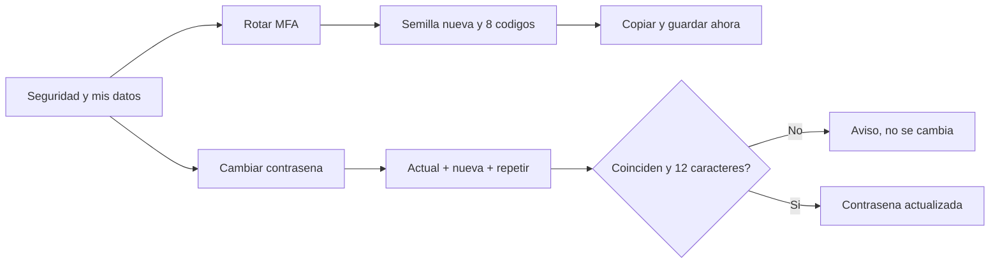

# CU-46 · Proteger la cuenta del que manda

> En una frase: cada operador cambia su propia contraseña y renueva el código de seis dígitos desde una pantalla privada.

## 1. Para qué sirve

Tu cuenta del panel tiene dos llaves: la **contraseña** y un **código de seis dígitos** que genera una app del móvil. Ese segundo factor se llama **MFA**.

Esta pantalla sirve para renovar las dos. Vive en **Seguridad y mis datos**, dentro del menú de tu cuenta.

Cuando pulsas **Rotar MFA**, el sistema te da una **semilla nueva** (el texto con el que se enlaza la app) y **ocho códigos de rescate**. Todo eso se enseña **una sola vez**. Apúntalo o cópialo en ese momento.

La semilla vieja deja de valer en cuanto se guarda la nueva. Y los códigos de rescate antiguos se reemplazan por completo.

El otro bloque es el cambio de contraseña: pides la actual, escribes la nueva dos veces y listo.

Aquí nadie toca la cuenta de otro. Cada persona solo puede cambiar la suya.

## 2. Quién puede hacerlo

Cualquier operador de back-office con rol de gestión: el **dueño** y **recepción** sí.

Housekeeping y mantenimiento se quedan fuera por ahora, porque sus roles no son de gestión. Si lo intentan, el servidor les responde que no.

Y siempre sobre **tu propia cuenta**. El sistema no acepta que le digas el usuario de otra persona. Ni siquiera el dueño puede cambiar la contraseña de un compañero desde aquí.

## 3. Antes de empezar

- Ten tu sesión de back-office abierta con tu contraseña y tu código.
- Ten instalada en el móvil una app de códigos de autenticación.
- Busca un sitio seguro para guardar la semilla y los ocho códigos.
- Ten a mano tu contraseña actual si vas a cambiarla.
- Prepara una contraseña nueva de **12 caracteres o más**.
- Recuerda que la semilla y los códigos **no se vuelven a mostrar**.

## 4. Paso a paso

1. Entra al panel con tu cuenta.
2. Abre el menú de tu cuenta, arriba, y elige **Seguridad y mis datos**.
3. Comprueba arriba en qué cuenta estás actuando.
4. Para renovar el segundo factor, pulsa **Rotar MFA**.
5. El sistema genera una semilla nueva y ocho códigos de rescate.
6. Verás un aviso: se muestran una sola vez. Guárdalos ahora.
7. Pulsa el botón **Copiar** para llevártelo todo al portapapeles.
8. Si funciona, la etiqueta cambia a **Copiado**.
9. Abre tu app de códigos y enlaza la semilla nueva. La vieja ya no sirve.
10. Guarda también los ocho códigos de rescate en un sitio aparte.
11. Para cambiar la contraseña, baja al formulario.
12. Escribe tu contraseña actual.
13. Escribe la nueva, con 12 caracteres o más.
14. Repítela en el tercer campo.
15. Pulsa el botón de guardar.
16. Si las dos nuevas no coinciden, la pantalla te avisa y no llama al servidor.
17. Si todo cuadra, verás el mensaje de contraseña actualizada.
18. Los tres campos se vacían solos.

El recorrido, de un vistazo:

## 5. Qué ves cuando sale bien

- Arriba se lee el usuario con el que estás trabajando.
- Al rotar, aparece el bloque de credenciales con el enlace, la semilla y los ocho códigos.
- Un aviso te recuerda que eso se ve una sola vez.
- El botón de copiar pasa a **Copiado** cuando el texto está en el portapapeles.
- Al guardar la contraseña, sale el mensaje de contraseña actualizada.
- Los tres campos de contraseña se vacían.
- Al entrar de nuevo, el código viejo ya no vale y el nuevo sí.

## 6. Si algo va mal

| Lo que ves | Qué significa | Qué hacer |
|-----------|---------------|-----------|
| «No se pudo rotar el MFA.» | Falló la generación o el guardado | Vuelve a intentarlo |
| «Las contraseñas nuevas no coinciden.» | La repetición no es igual | Escríbela otra vez con cuidado |
| «La nueva contraseña debe tener al menos 12 caracteres.» | La nueva es demasiado corta | Alárgala |
| «La contraseña actual no es correcta.» | Te has equivocado con la de ahora | Vuelve a escribirla. La contraseña no cambia |
| «El operador no existe.» | Tu cuenta ya no está en la lista | Avisa a quien administra la plataforma |
| El botón **Copiar** vuelve a su nombre | No se pudo copiar al portapapeles | Copia el texto a mano |
| No veo la pantalla de Seguridad | Tu rol no es de gestión | Pídeselo a la cuenta de dueño |
| Te pide volver a entrar | La sesión ha caducado | Entra de nuevo |
| Cierro la pestaña y ya no veo los códigos | Solo se muestran una vez | Rota el MFA otra vez y guarda los nuevos |

## 7. Un ejemplo de verdad

Lucas trabaja en recepción del Hotel Marina del Sol. Lleva un año con el mismo código de seis dígitos y quiere cambiarlo.

Entra al panel, abre el menú de su cuenta y elige **Seguridad y mis datos**. Arriba ve que está actuando sobre su usuario.

Pulsa **Rotar MFA**. Aparece un bloque con un enlace, una semilla larga y ocho códigos de rescate. El aviso le recuerda que eso se enseña una sola vez. Lucas pulsa **Copiar**, lo pega en su gestor de contraseñas y lo guarda.

Luego abre la app de códigos del móvil, enlaza la semilla nueva y comprueba que genera un código que funciona al entrar. El código viejo ya no vale.

Esa misma tarde cambia su contraseña: escribe la actual, una nueva de 14 caracteres y la repite. El sistema le dice que se ha actualizado y le vacía los campos.

Un mes después, Lucas pierde el móvil. Como tenía los códigos de rescate guardados, entra con uno de ellos y rota el MFA desde un móvil nuevo.

## 8. Preguntas frecuentes

### ¿Dónde está el código QR?

No hay. La pantalla solo imprime el enlace y la semilla en texto. Cópialos y enlázalos a mano en tu app. Si pierdes el móvil, entra con un código de rescate o pide que te roten el alta.

### ¿La contraseña antigua deja de valer al cambiarla?

Sí, para entrar. Pero las sesiones ya abiertas siguen funcionando hasta que caducan: el cambio no las cierra.

### ¿Puedo cambiar la contraseña de un compañero?

No. Esta pantalla solo trabaja con tu propia cuenta. Para la de otro, se rota el alta desde la pantalla de Usuarios.

### ¿Me pide la contraseña para rotar el MFA?

No. Basta con tener la sesión abierta. Por eso conviene no dejar el panel abierto en un ordenador compartido.
