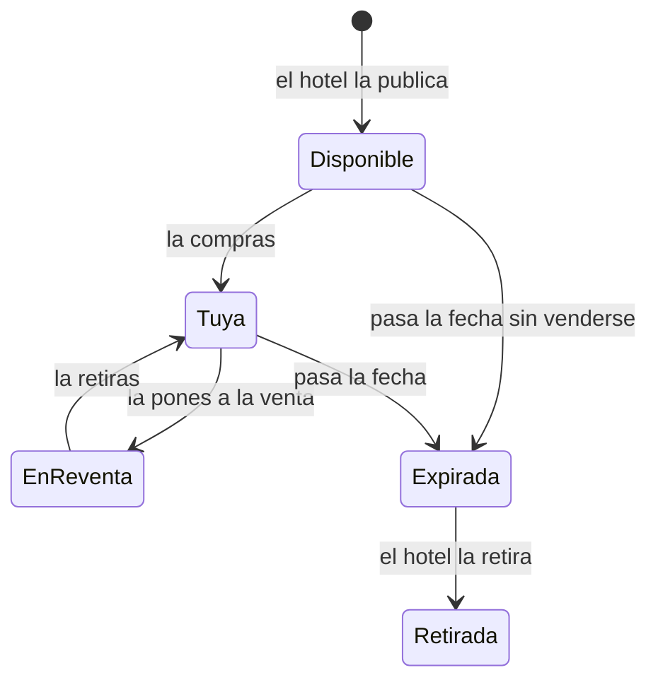

# Qué es una noche del hotel (y por qué pasa a ser tuya)

> Para quien se aloja en el Hotel Marina del Sol y quiere entender, sin tecnicismos, qué está comprando cuando reserva una noche por la web. Al terminar sabrás qué es la ficha de una noche, de quién es y cuándo deja de servir.

## Empezar en 5 minutos

1. Una **noche** es una habitación concreta en una fecha concreta.
2. Cada noche del hotel es una **ficha digital** distinta de todas las demás: no hay dos iguales.
3. Quien tiene esa ficha, tiene esa noche.
4. Cuando la compras, la ficha pasa a tu cartera (tu monedero digital) y desde ese momento es tuya.
5. Si al final no la usas, puedes volver a ponerla a la venta para que la compre otro cliente.

## Paso a paso

Esta parte no tiene botones: es la explicación de lo que verás en pantalla cuando entres al catálogo.

1. Abre el catálogo de noches. Verás una tarjeta por cada noche que el hotel tiene a la venta.
2. Cada tarjeta te enseña la foto de la habitación, su número («Habitación 102»), el tipo de habitación, la fecha escrita en largo y el precio en ETH (la moneda de esta red).
3. En cada tarjeta hay una etiqueta de color:
   - **Disponible**, con un punto verde: la vende el hotel.
   - **Suite**, en ámbar: es una suite y la vende el hotel.
   - **Reventa**, en coral: la vende otro cliente, no el hotel.
4. Debajo del precio leerás siempre la misma frase: «La noche pasa a ser tuya: podrás revenderla cuando quieras.»
5. El hotel tiene 50 habitaciones, numeradas de la 101 a la 130 (planta baja) y de la 201 a la 220 (primera planta).
6. Hay tres tipos de habitación: **simple**, **doble** y **suite**. El tipo se sabe por el número de habitación.

<!-- PENDIENTE DEL CLIENTE: el reparto real de tipos por habitación (qué números son simples, dobles y suites) -->

7. El catálogo solo enseña las noches de los próximos **90 días**. Más allá de esa fecha no hay nada que comprar.
8. Las fechas se guardan siempre en **UTC** (la hora del meridiano de Greenwich). Gracias a eso, la ficha de una noche es la misma aunque la mires desde otro país.
9. Cuando compras, la ficha queda a nombre de tu dirección de cartera. Esa es toda la prueba de que la noche es tuya: no hay un papel aparte.
10. En «Mis noches» verás tus fichas con la etiqueta **Tuya** si no están en venta, o **En reventa** si las has puesto a la venta.

### Los estados por los que pasa una noche

Una misma noche cambia de estado a lo largo de su vida. Lo que ves tú es siempre uno de estos:

- **Disponible**: el hotel la tiene a la venta y nadie la ha comprado todavía.
- **Tuya** (en el sistema, «en poder de un cliente»): ya se vendió una vez y su dueño es un cliente.
- **En reventa**: su dueño la ha puesto a la venta para que la compre otra persona.
- **Expirada**: la fecha ya pasó. Manda siempre: una noche caducada no se puede comprar ni revender, aunque estuviera en venta.
- **Retirada**: el hotel la quita cuando caduca sin haberse vendido nunca. Una noche que ya es de un cliente no se retira.

Este es el recorrido, en dibujo:

<!-- GENERAR_IMAGEN: doc-huesped-estados-de-una-noche.svg -->

## Si algo no funciona

- **No encuentras la noche que quieres.** Puede estar a más de 90 días vista: el catálogo no llega más allá de esa ventana.
- **Una noche que ayer veías ya no está.** El hotel la ha retirado de la lista porque se vendió. Solo hay una venta por noche, así que cuando alguien la compra desaparece. El catálogo lo dice con honestidad: «Hemos retirado 1 noche que ya está vendida. Estamos sincronizando el calendario: puede aparecer disponibilidad nueva en unos minutos.»
- **En la tarjeta pone «Ventas en pausa».** El hotel ha pausado las operaciones y no se pueden comprar noches mientras dure. No es un fallo tuyo ni de tu cartera.
- **No carga nada.** Verás «No se pudo cargar el catálogo. Revisa tu conexión e inténtalo de nuevo.» con un botón **Reintentar**. Pulsa Reintentar.
- **Todo esto es una red de pruebas.** Hoy la plataforma funciona sobre una red de pruebas: sirve para practicar y ver el sistema entero, pero no es todavía la venta al público del hotel.

Si el problema no es ninguno de estos, díselo al personal del hotel: no tenemos aquí la causa confirmada.

## Preguntas rápidas

- **¿Qué compro exactamente?** Una habitación y una fecha concretas, no un rango de noches.
- **¿Puedo alojarme varias noches seguidas?** Sí, comprando una ficha por cada noche.
- **¿Cómo se sabe que la noche es mía?** Porque la ficha figura a nombre de la dirección de mi cartera. No hay más trámite.
- **¿Mi noche caduca?** Sí. Cuando pasa la fecha, la noche queda expirada y ya no sirve para alojarse ni para revender.
- **¿Puedo revenderla?** Sí, mientras no la hayas usado en recepción. Una noche ya consumida no se puede volver a vender.
