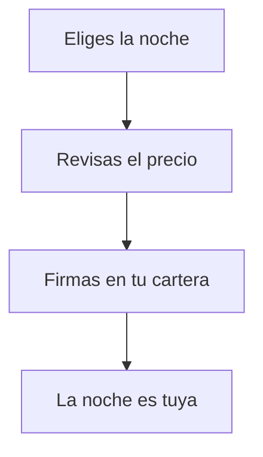

# Compra una noche al hotel

> Para quien ya ha elegido una noche del catálogo y quiere pagarla con su cartera. Aquí ves los pasos, qué comprueba la web antes de dejarte firmar y qué hacer si algo se tuerce.

## Empezar en 5 minutos

1. En el catálogo, busca la noche que quieras y pulsa **Reservar** en su tarjeta.
2. Si te lo pide, conecta la cartera y cambia a la red del hotel.
3. Se abre la ventana «Revisar tu reserva»: comprueba habitación, noche, importe, token y contrato.
4. Espera a que termine la verificación del precio.
5. Pulsa **Confirmar y firmar** y firma en tu cartera.

<!-- GENERAR_IMAGEN: doc-huesped-flujo-compra.svg -->

## Paso a paso

1. **Elige la noche** en el catálogo. Si te hace falta, filtra por tipo, mes, precio máximo o número de habitación.
2. **Mira el botón de la tarjeta.** Cambia según cómo estés: **Reservar** si la cartera está lista, **Conecta para reservar** si no lo está, **Cambia de red para reservar** si estás en otra red e **Instala una wallet** si no tienes ninguna.
3. **Pulsa Reservar.** Si te falta saldo para esa noche, el botón se queda bloqueado y te dice cuánto te falta: «Te faltan 0,01 ETH (tienes 0,04, necesitas 0,05).»
4. **Conecta la cartera y cambia de red** si la web te lo pide. Es lo mismo que hiciste antes de empezar; acepta en tu cartera.
5. **Se abre la ventana «Revisar tu reserva»** con este aviso: «Esto es lo que vas a firmar. Comprueba el importe y la noche antes de confirmar.»
6. **Lee las cinco líneas** de la ventana: **Habitación**, **Noche**, **Importe**, **Token** y **Contrato**.
7. **Espera a la verificación.** Mientras dura verás «Verificando el precio on-chain…» (es decir, consultando el precio en la red) con un indicador. La web vuelve a leer el precio para no firmar un importe viejo.
8. **Pulsa «Confirmar y firmar».** El botón está deshabilitado hasta que la verificación termina bien: si algo no cuadra, no te deja firmar.
9. **Firma en tu cartera.** Verás pasar tres mensajes: «Confirma en tu wallet», «Reservando tu noche…» y «¡Noche reservada!»
10. **Espera unos segundos** a que la red confirme la operación. Si cierras la ventana durante la espera, la reserva sigue su curso: «Puedes cerrar: la reserva continúa y aparecerá en «Mis noches».»
11. **Guarda el recibo.** Al terminar verás el recibo con el identificador de la operación y el botón **Ver en Mis noches**.
12. **Comprueba el resultado.** En «Mis noches», tu noche aparece con la etiqueta **Tuya**.

Tres cosas que hace la web por ti y conviene que sepas:

- **Revisa lo mismo que vas a firmar.** La ventana no enseña una promesa: lee el identificador real de la operación, saca de ahí la habitación y la fecha, y vuelve a consultar el precio en la red antes de dejarte firmar.
- **No firma nada sin verificar.** Si la comprobación no termina bien, el botón «Confirmar y firmar» se queda deshabilitado. Es a propósito: mejor no firmar que firmar a ciegas.
- **Envía exactamente lo revisado.** Cuando firmas, se manda el mismo contenido que viste, sin recalcularlo por el camino.

En la red se comprueba además que la noche no esté ya vendida, que no se haya consumido con una entrada en recepción, que no esté caducada y que el importe sea exactamente el precio. Si todo cuadra, la ficha pasa a tu cartera y el importe va entero al hotel: en esta compra no hay comisión.

## Si algo no funciona

- **«Saldo insuficiente para reservar esta noche.» o «Te faltan …».** Tu cartera no llega al precio. Recarga saldo y vuelve a intentarlo. Deja además algo para la comisión de la red, que se paga aparte del precio.
- **«El precio de esta noche acaba de cambiar; por tu seguridad no la firmamos con un importe antiguo. Vuelve a abrir la reserva.»** El precio en la red ya no es el que viste. Cierra la ventana, vuelve a abrirla y revisa el importe nuevo.
- **«No pudimos verificar el precio on-chain. Comprueba tu conexión a la red e inténtalo de nuevo.»** Con el botón **Reintentar verificación**. Es un problema de lectura de la red, distinto del anterior.
- **«Esta noche ya está vendida. Elige otra noche del catálogo.»** Alguien la compró antes. Pulsa el enlace **Elegir otra noche**: no es culpa de tu conexión.
- **«Has cancelado la firma. Puedes intentarlo de nuevo cuando quieras.»** Cerraste tu cartera sin firmar. No se ha cobrado nada; vuelve a pulsar Confirmar y firmar.
- **«No se completó la reserva» y «No se realizó ningún cargo. Puedes intentarlo de nuevo.»** La operación no salió adelante, pero no se te ha cobrado. Reintenta.
- **«No se pudo completar la reserva. Revisa que estés en la red correcta y vuelve a intentarlo.»** Revisa la red y prueba otra vez.
- **En la tarjeta pone «Ventas en pausa».** El hotel ha pausado las operaciones y no hay botón de compra. Espera a que se reanuden.
- **No puedes cerrar la ventana.** Mientras tu cartera está firmando, la ventana no se cierra. Durante la espera de confirmación sí puedes cerrarla: la reserva continúa.
- **Te has confundido de botón.** El **Reservar** de la tarjeta compra la ficha de una noche. El **Reservar** del menú abre otra cosa: la reserva de una estancia, con anticipo por transferencia. No son lo mismo.
- **La noche ya había pasado.** Una noche caducada no se puede comprar: la red rechaza la operación aunque la tarjeta siguiera en pantalla.
- **Todo esto es una red de pruebas.** La compra funciona hoy sobre una red de pruebas; no es todavía la venta al público del hotel.

## Preguntas rápidas

- **¿Qué firmo exactamente?** La compra de esa noche por ese importe, al destino correcto. Lo que revisas es lo que se firma, sin cambios.
- **¿Me pueden cobrar de más si cambia el precio?** No. Si el precio ya no coincide, la web no te deja firmar y te pide volver a abrir la reserva.
- **¿Puedo cancelar la compra después de firmar?** No desde la web. Si ya no la quieres, puedes ponerla en reventa y recuperar parte del importe.
- **¿Puedo comprar varias noches seguidas?** Sí, una detrás de otra: cada noche es una compra distinta con su propia firma.
- **¿La página me cobra antes de firmar?** No. «No se cobrará nada hasta que firmes.»
