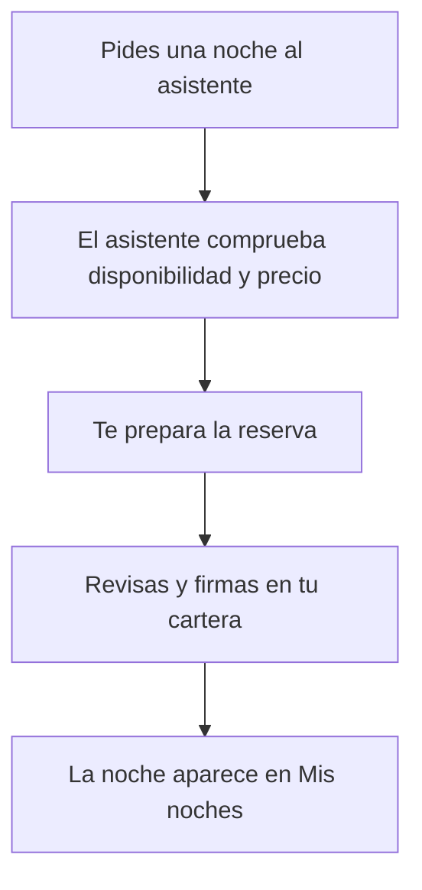

# Pídele una noche al asistente

> Es para ti, que quieres una noche en el Hotel Marina del Sol sin buscar a mano en el catálogo. Le cuentas al asistente qué noche buscas, él comprueba si está libre y a qué precio, y te deja la reserva lista para que la firmes tú.

## Empezar en 5 minutos

1. Conecta tu cartera (la aplicación donde guardas tus monedas digitales) y ponla en la red del hotel.
2. Abre el menú **Descubre** de la cabecera y entra en **Asistente**.
3. Escribe la noche que quieres, por ejemplo «¿hay alguna suite disponible en junio?», y pulsa **Enviar**.
4. Cuando el asistente te diga la noche y el precio, contéstale que sí.
5. En la tarjeta **Reserva preparada — revisa y firma**, revisa los datos y pulsa **Firmar reserva**. La firma se hace en tu cartera.

## Paso a paso

1. Entra en la página del asistente. Verás el título **Asistente IA** y, debajo, la frase «Pregunta por disponibilidad y prepara tu reserva; tú firmas en tu wallet.»
2. Antes de que escribas nada, el chat te saluda: «Hola, soy el asistente del Hotel Marina del Sol. Puedo ayudarte a consultar disponibilidad y preparar la reserva de una noche.»
3. Debajo del saludo hay tres sugerencias que puedes pulsar: **Ver suites en junio**, **Mis reservas** y **Reservar una noche**.
4. Escribe tu pregunta en el cuadro de abajo. El marcador de posición dice «Ej.: ¿hay alguna suite disponible en junio?». Con **Enter** envías y con **Mayús + Enter** haces un salto de línea.
5. Pulsa **Enviar**. El botón está apagado si el cuadro está vacío o si el asistente todavía está pensando.
6. Mientras esperas, en el chat se lee **Pensando…**.
7. Lee la respuesta: te dirá si esa noche existe, si se puede comprar y cuánto cuesta. Si no existe o ya no está libre, te propondrá alternativas del mismo tipo de habitación.
8. Cuando tengas clara la noche, contéstale que sí. Es normal que te pida confirmar la noche y el precio antes de seguir.
9. Con tu confirmación aparece la tarjeta **Reserva preparada — revisa y firma**. Ahí ves cinco datos: **Habitación** (por ejemplo, «116 (Doble)»), **Noche** (en formato AAAAMMDD, es decir, año, mes y día seguidos), **Token** (el número que identifica tu noche), **Contrato** e **Importe** (en ETH, la moneda digital de esta red de pruebas).
10. Si tu cartera ya está lista, la tarjeta añade la línea «Firmarás con la wallet conectada» y la dirección de tu cartera.
11. Mientras se comprueba el precio verás «Verificando el precio on-chain…». Esa comprobación lee el precio real anotado en el registro del hotel. Si cierra bien, lo único que cambia es que se activa el botón de firmar.
12. Según cómo tengas la cartera, el botón dirá **Conecta tu wallet para reservar**, **Cambia de red para reservar** o **Firmar reserva**.
13. Pulsa **Firmar reserva**. Se abre tu cartera con el importe a la vista y firmas ahí. El asistente no firma nunca por ti.
14. Cuando la red confirme la operación, la tarjeta se pliega y muestra **¡Noche reservada!**, la frase «Tu reserva se ha confirmado. Ya puedes verla en tus noches.» y el botón **Ver en Mis noches**.
15. Si cierras la página, la reserva continúa: aparecerá en **Mis noches** de todos modos.

Así se ve el recorrido, de un vistazo:

<!-- GENERAR_IMAGEN: doc-huesped-flujo-asistente.svg -->

## Si algo no funciona

- **No tienes la cartera conectada.** Puedes preguntar y leer la respuesta, pero el botón dirá **Conecta tu wallet para reservar** y no podrás firmar. Conecta la cartera y vuelve a intentarlo.
- **Estás en otra red.** El botón dirá **Cambia de red para reservar**. Cambia a la red del hotel en tu cartera.
- **Esa noche ya se vendió.** Verás «Esta noche ya está vendida. Pide otra al asistente o elígela en el catálogo.» Pídele otra al asistente.
- **No se pudo comprobar el precio.** Aparece «No pudimos verificar el precio on-chain. Comprueba tu conexión a la red e inténtalo de nuevo.» con un botón **Reintentar verificación**. Revisa tu conexión y reintenta.
- **Los datos no cuadran con el precio.** Verás «Los datos de la transacción no coinciden con el precio on-chain. No firmes: vuelve a intentarlo.» Haz caso: no firmes y repite la petición.
- **Te falta saldo.** El aviso dice cuánto te falta, cuánto tienes y cuánto necesitas. Añade fondos a tu cartera o elige otra noche.
- **Has cerrado la ventana de la cartera.** Se muestra «Has cancelado la firma. Puedes intentarlo de nuevo.» No has reservado nada; repite la firma cuando quieras.
- **La operación no termina bien.** Aparece «No se pudo completar la reserva. Revisa la red y vuelve a intentarlo.» con **Intentar de nuevo**.
- **El asistente no está disponible.** Sale el aviso «El asistente no está disponible ahora mismo. Puedes seguir reservando desde el catálogo.» con **Reintentar** e **Ir al catálogo**. No es culpa de tu petición: puedes reservar desde el catálogo.
- **La conversación se corta.** Si escribes muchísimo o muy seguido, el sistema te frena (admite unas 10 peticiones por minuto). Verás el aviso de asistente no disponible: espera un minuto y vuelve a preguntar.
- **El asistente no entiende la petición.** Responde «Lo siento, no he podido responder ahora mismo. Inténtalo de nuevo en un momento.» Solo atiende temas de disponibilidad, precios y compra de noches del hotel.
- **La noche existe pero no se puede comprar.** Puede estar expirada, ya vendida o no puesta a la venta. El asistente te lo dirá y te ofrecerá alternativas del mismo tipo de habitación.
- **Le pides algo que no es del hotel.** Contesta «Solo puedo ayudarte con disponibilidad, precios y la compra de noches del hotel.» No es un fallo: el asistente tiene ese límite.
- **La conversación se alarga mucho.** El sistema admite 40 mensajes por conversación. Si te pasas, la rechaza: empieza una conversación nueva.
- **Cierras la página después de firmar.** No pasa nada. Verás la frase «Puedes cerrar: la reserva continúa y aparecerá en «Mis noches».» y la noche estará ahí.

## Preguntas rápidas

- **¿El asistente puede firmar por mí?** No. Nunca firma ni toca tus claves: la firma es siempre tuya, en tu cartera.
- **¿Se guarda la conversación?** No queda guardada: vive solo en tu navegador mientras la tienes abierta.
- **¿Con qué se paga?** Con ETH, la moneda digital de la red de pruebas del hotel; el importe aparece en la tarjeta antes de firmar.
- **¿Puedo pedir la reserva sin cartera?** Puedes preguntar, pero para reservar necesitas conectar la cartera y firmar.
- **¿El asistente se inventa los precios?** No: lee el precio real anotado en el registro del hotel y lo vuelve a comprobar antes de dejarte firmar.
