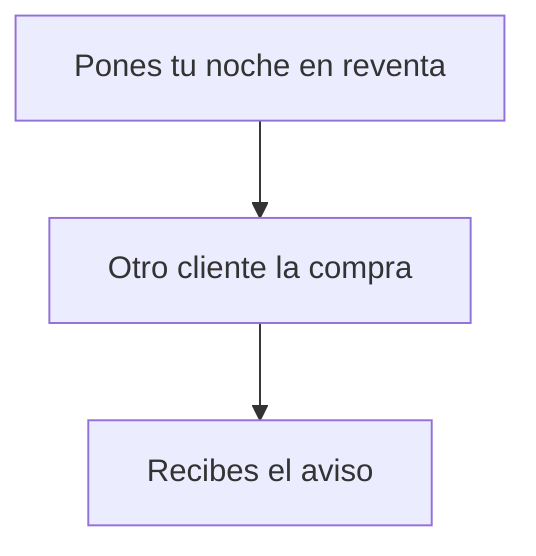

# Pon tu noche en reventa, cambia el precio o retírala

> Es para ti, que ya tienes una noche tuya y quieres venderla a otra persona. Aquí ves cómo publicarla con su precio, cómo cambiarlo y cómo quitarla del mercado firmando tú en tu cartera.

## Empezar en 5 minutos

1. Conecta tu cartera (la aplicación donde guardas tus monedas digitales) y ponla en la red del hotel.
2. Abre **Mis noches**.
3. En la tarjeta de la noche, escribe el precio que quieres en **Precio de reventa (ETH)**.
4. Pulsa **Listar** y firma en tu cartera.
5. La etiqueta de la noche pasa a **En reventa**.

## Paso a paso

1. Abre **Mis noches**. Si te falta conectar la cartera o estás en otra red, en lugar de la lista verás «Conecta tu wallet para ver y gestionar tus noches.» con la barra de conexión.
2. Mientras carga se lee «Cargando tus noches…».
3. Arriba del listado aparece el aviso «¿Quieres gestionar lo que tienes en venta?» con el enlace **Ir a Mis reventas**.
4. En una noche que aún no está en venta verás la etiqueta **Tuya**, el campo **Precio de reventa (ETH)** y el botón **Listar**.
5. Escribe una cifra mayor que cero y pulsa **Listar**. Si dejas el campo vacío o pones cero, el sistema ni siquiera abre tu cartera: marca el campo y muestra «Introduce un precio mayor que 0.»
6. Se abre la ventana de la operación y tu cartera te pide firmar. Mientras firmas se lee **Confirma en tu wallet** y el aviso «Revisa y firma la transacción en MetaMask.» (MetaMask es una cartera que funciona en el navegador).
7. Enviada la operación, la ventana pasa a **Reservando tu noche…** con «Esperando confirmación en la red…» y el recibo de la operación. Ese texto es general del sistema y no habla de reventa.
8. Al confirmarse, la tarjeta se actualiza sola: la etiqueta cambia a **En reventa** y debajo aparece «Precio de reventa:» con tu cifra.
9. Para gestionar lo que tienes publicado, entra en **Mis reventas**. La cabecera dice **Mis reventas** y el subtítulo «Gestiona las noches que has puesto en venta y consulta las que ya has vendido.»
10. Dentro hay dos secciones: **Publicadas** y **Vendidas**. En **Publicadas** salen tus noches en venta; si no hay ninguna, se lee «No tienes ninguna noche publicada ahora mismo.»
11. En **Vendidas** hay una tabla con tres columnas: **Noche**, **Precio** y **Comprador**. Si todavía no has vendido nada, se lee «Todavía no has vendido ninguna noche.»
12. Sobre **Publicadas** tienes el enlace **Publicar otra noche**, que te devuelve a **Mis noches**.
13. Para cambiar el precio de una noche publicada, pulsa **Cambiar precio** en su tarjeta. El campo se abre vacío: hay que escribir la cifra nueva completa.
14. Escribe el precio nuevo y pulsa **Guardar nuevo precio**. Te pedirá firmar otra vez, porque es otra operación. Si te arrepientes antes de firmar, **Cancelar** cierra el formulario sin enviar nada.
15. Para retirar la noche del mercado, pulsa **Cancelar reventa** y firma. Al confirmarse, la noche desaparece de **Publicadas**.
16. Si tienes dinero pendiente de reventas ya vendidas, verás el panel **Saldo pendiente** con «Tienes fondos de reventas listos para cobrar.» y el botón **Cobrar** con el importe.
17. Al final de la pantalla está el bloque **Avisos al móvil**, con **Activar avisos** o **Desactivar avisos** y el aviso «Recibe un aviso cuando se venda alguna de tus noches. Es anónimo y puedes desactivarlo cuando quieras.»

Así se ve el recorrido, de un vistazo:

<!-- GENERAR_IMAGEN: doc-huesped-flujo-reventa.svg -->

## Si algo no funciona

- **El precio está vacío o es cero.** El sistema no llama a tu cartera y marca el campo con «Introduce un precio mayor que 0.»
- **El precio es demasiado bajo.** Verás «El precio está por debajo del mínimo de reventa que fija el hotel.» Hay un precio mínimo de reventa (en esta red de pruebas arranca en 0,01 ETH, pero la pantalla no te lo muestra). Sube la cifra y vuelve a intentarlo.
- **Pusiste demasiados decimales.** Si escribes un precio con más de 18 decimales, la operación falla antes de llegar a tu cartera. El texto exacto que verás está pendiente de confirmar; escribe una cifra con pocos decimales.
- **La noche no es tuya.** Aparece «No eres la propietaria de esta noche.» Solo se revende lo que está a tu nombre en ese momento.
- **La noche ya pasó.** Sale «La noche ha expirado y no puede listarse.» Ya no se puede revender.
- **La noche ya se usó en recepción.** El aviso es «Esta noche ya se consumió en recepción y no puede revenderse.»
- **Intentas retirar algo que no está publicado.** Sale «Esta noche no está en reventa.» Es una operación que ya no hace falta.
- **Has cerrado la ventana de la cartera.** Se lee «Has cancelado la firma. Puedes intentarlo de nuevo cuando quieras.» y el formulario sigue ahí.
- **La operación no se completa.** Aparece «No se pudo completar la operación. Revisa la red y vuelve a intentarlo.» Si el motivo no está en la lista anterior, el sistema no lo detalla: revisa tu conexión y reintenta.
- **No se carga la lista.** Sale «No se pudieron cargar tus reventas. Inténtalo de nuevo.» con el botón **Reintentar**, que repite la consulta.
- **No ves la noche en la lista.** Si la vendiste o la traspasaste, desaparece de **Mis noches**; es lo normal. Si crees que sigue siendo tuya, recarga la página.
- **El estado no cambia después de firmar.** La tarjeta se refresca sola y vuelve a leer la información del registro del hotel. Si aun así no cambia, recarga la página.
- **El hotel pone el sistema en pausa.** Publicar y retirar siguen funcionando, porque la pausa no bloquea esas dos operaciones. Comprar una reventa sí queda bloqueado.
- **Ya tenías la noche publicada con un precio bajo.** Un anuncio ya publicado no se toca solo aunque cambie el mínimo del hotel: el mínimo solo se mira al publicar. Si quieres subirlo, usa **Cambiar precio**.
- **El sistema no reconoce el motivo del fallo.** Cuando el error no es uno de los anteriores, solo verás el mensaje genérico «No se pudo completar la operación. Revisa la red y vuelve a intentarlo.» y el detalle no aparece en pantalla.

## Preguntas rápidas

- **¿Puedo cambiar el precio sin retirar la noche primero?** Sí: pulsa **Cambiar precio**, escribe la cifra nueva y firma; el precio anterior se sustituye.
- **¿Qué se queda el hotel de la venta?** Un porcentaje del precio: un 5 % en habitaciones simples y dobles y un 10 % en suites.
- **¿Cuándo cobro mi dinero?** Queda en **Saldo pendiente** y lo cobras con el botón **Cobrar** cuando quieras.
- **¿Puedo revender una noche que no compré?** No: solo se revende una noche que ya tuvo una venta; el inventario del hotel no entra por aquí.
- **¿Es una venta al público de verdad?** De momento todo ocurre en una red de pruebas del hotel, no es una venta al público.
