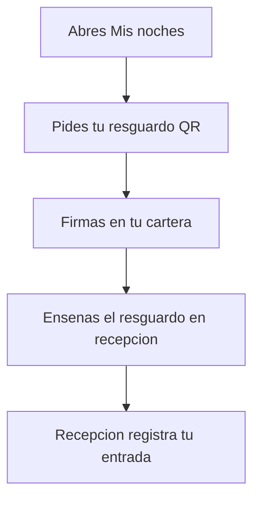

# Entra en el hotel con tu resguardo QR

> Es para ti, que llegas al Hotel Marina del Sol con una noche tuya. Desde **Mis noches** generas un resguardo con código QR, lo enseñas en recepción y el personal registra tu entrada. Tú no tocas el panel de recepción.

## Empezar en 5 minutos

1. Conecta tu cartera (la aplicación donde guardas tus monedas digitales) y ponla en la red del hotel.
2. Abre **Mis noches** y busca la tarjeta de tu noche.
3. En el bloque **Resguardo de check-in**, pulsa **Ver mi resguardo QR**.
4. Firma en tu cartera cuando te lo pida. Es para comprobar que la noche es tuya.
5. Enseña el código QR (o el texto del token) en recepción.

## Paso a paso

1. Abre **Mis noches** y busca la tarjeta de tu noche. Dentro verás el bloque **Resguardo de check-in** con la explicación «Genera el resguardo de esta noche para enseñarlo en recepción. Te pediremos una firma para comprobar que la noche es tuya.»
2. Pulsa **Ver mi resguardo QR**. Mientras trabaja, el botón pasa a **Generando resguardo…**.
3. Firma en tu cartera. Esa firma solo sirve para demostrar que la noche está a tu nombre y caduca en pocos minutos; si tardas, te pedirá firmar otra vez.
4. Aparece el código QR, con la descripción «Código QR del resguardo de la habitación» y el número de habitación y la fecha. Debajo se lee «Válido hasta el» con la fecha y la frase «Cada resguardo sirve una sola vez.»
5. Tienes tres botones: **Descargar el QR** para guardar la imagen, **Abrir la pantalla de recepción** para verlo a pantalla completa y **Ocultar** para cerrar el bloque.
6. En el mismo bloque está el área **Token del resguardo (para el camino manual)**, con la nota «Recepción puede pegar este texto si el escáner no funciona.» Ese texto largo es tu resguardo: tenlo a mano.
7. Si pulsas **Abrir la pantalla de recepción**, llegas a una pantalla con la cabecera **Resguardo de check-in** y el aviso «Muestra esta pantalla en recepción. El personal escaneará el código con su lector.»
8. En esa pantalla ves la habitación, la línea **Noche:** con la fecha, el QR grande y la nota «Personal de recepción: escanee el código o pegue el token en la pantalla de recepción. El resguardo solo se puede canjear una vez.»
9. Si el dibujo del QR fallara, verás «No se pudo dibujar el código QR, pero el resguardo sigue valiendo: copia el token y enséñalo en recepción.» El resguardo no se pierde.
10. En esa misma pantalla, el desplegable **¿No funciona el escáner? Muestra este token** enseña el texto para copiarlo.
11. Entrega el resguardo en recepción. El recepcionista abre el panel del día, entra en la pestaña **Check-in**, pega el texto en el área **Token JWS o URL del resguardo** y pulsa **Confirmar check-in**.
12. Si todo cuadra, aparece el aviso verde **Check-in confirmado**, con la habitación y la fecha y la línea «Anclado on-chain» con el enlace al comprobante (es el registro público del hotel). Tu habitación queda **OCUPADA**.
13. Aviso importante: en la versión actual no hay lector de cámara. Aunque las pantallas hablen de «escanear», lo que funciona de verdad es que recepción pegue el texto del resguardo. Una foto del QR no sirve: hace falta el texto.
14. El resguardo vale 7 días desde que lo generas, y sirve una sola vez.
15. Dentro del resguardo van tu habitación, la fecha y la dirección de tu cartera: no vale para otra noche ni para otra persona.
16. Cada resguardo lleva un identificador único, así que no se puede canjear dos veces aunque alguien copie el texto.

Así se ve el recorrido, de un vistazo:

<!-- GENERAR_IMAGEN: doc-huesped-flujo-checkin.svg -->

## Si algo no funciona

- **No tienes la cartera conectada.** No se puede generar nada: verás «Conecta tu cartera para obtener el resguardo.» Conecta la cartera y vuelve a intentarlo.
- **Cierras la ventana de la cartera.** Se lee «Firma cancelada en tu cartera.» No es un fallo: repite el paso y firma.
- **La firma caduca o se repite.** La firma dura muy poco y solo se puede usar una vez. Si reutilizas una, el sistema responde «Esta autorización ya se utilizó; firma una nueva.» Vuelve a pulsar **Ver mi resguardo QR**.
- **Ya no eres el dueño de la noche.** Si la vendiste o la traspasaste, el resguardo se rechaza porque la noche ya no está a tu nombre. El titular nuevo es quien debe generar su propio resguardo.
- **La noche ya no existe.** La respuesta es «Esa noche no existe (quemada o nunca emitida).» No se puede emitir resguardo para esa noche.
- **No se pudo emitir el resguardo.** Aparece «No se pudo emitir el resguardo. Inténtalo de nuevo.» Revisa tu conexión y reintenta; si el sistema da un motivo concreto, lo verás en pantalla.
- **Abres la pantalla de recepción sin resguardo.** Sale «Esta página no tiene ningún resguardo. Abre el enlace que generaste desde «Mis noches».» con el botón **Ir a Mis noches**.
- **El resguardo ya se usó.** El recepcionista lee «Este resguardo ya se utilizó para un check-in; cada pase sirve una sola vez.» Genera uno nuevo desde **Mis noches**.
- **El resguardo es de otra persona.** Sale «El resguardo corresponde a un propietario anterior de la noche; el titular actual debe emitir uno nuevo.» El titular actual tiene que generar el suyo.
- **Otra persona está registrando tu entrada a la vez.** El aviso es «Otro puesto está procesando el check-in de esta noche; espera unos segundos y reinténtalo.» Espera un momento y repite.
- **Tu habitación ya tenía la entrada hecha.** El sistema dice que esa habitación ya hizo el check-in. Si crees que es un error, dilo en el mostrador.
- **El hotel tiene las operaciones en pausa.** El panel de recepción avisa de que no se puede registrar ningún check-in hasta que el hotel reanude las operaciones. No es un problema de tu resguardo: espera a que lo reanuden.
- **El resguardo se emitió y luego vendiste la noche.** El resguardo vive días y vale para el dueño del momento; si la noche cambia de manos, el titular nuevo debe emitir otro.
- **No se pudo comprobar que la noche es tuya.** La emisión se corta y no entrega resguardo en lugar de darte uno sin comprobar. Suele ser un problema momentáneo de conexión con el registro del hotel: espera y vuelve a intentarlo.
- **Cierras la pantalla del resguardo.** El resguardo sigue valiendo hasta su fecha. Puedes volver a **Mis noches** y generar otro cuando lo necesites.

## Preguntas rápidas

- **¿Cuánto dura el resguardo?** 7 días desde que lo generas, y solo se puede usar una vez.
- **¿Sirve una foto del código QR?** No en la versión actual: hace falta el texto del token.
- **¿Puedo usarlo desde el móvil de otra persona?** Sí: la pantalla del resguardo no pide cartera, así que puedes abrir el enlace en otro dispositivo.
- **¿A qué hora puedo entrar en la habitación?** <!-- PENDIENTE DEL CLIENTE: hora oficial de entrada del hotel -->
- **¿Caduca la firma que me pide?** Sí: dura unos dos minutos. Si tardas, te pedirá firmar otra vez; no has perdido nada.
