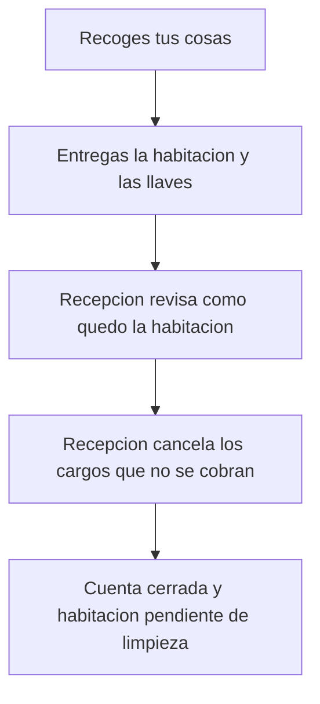

# Sal del hotel y cierra tu cuenta

> Es para ti, que terminas tu estancia en el Hotel Marina del Sol. Tú entregas la habitación y las llaves; recepción revisa cómo quedó, cancela los cargos que no se cobran y cierra la cuenta. Tú no firmas nada.

## Empezar en 5 minutos

1. Recoge tus cosas y entrega la habitación y las llaves.
2. Si quieres repasar la cuenta, pídelo en el mostrador.
3. Espera a que recepción cierre la estancia en su pantalla.
4. No hay nada que firmar: la salida no pide cartera ni firma.

## Paso a paso

Lo que haces tú:

1. Recoges tus cosas y entregas la habitación y las llaves. No abres ninguna pantalla.
2. El resguardo QR que usaste para entrar ya se gastó en la entrada: aquí no hace falta.
3. Si quieres repasar la cuenta, se te enseña el desglose en el mostrador. No existe una vista de huésped que lea los cargos.
4. Esperas a que recepción cierre la estancia. El cierre lo hace el personal, no tú.

Lo que hace recepción delante de ti:

5. Entra en el **Puesto de recepción** y pulsa la pestaña **Check-out**. Ahí solo salen las estancias con la entrada ya registrada.
6. Elige tu estancia en el desplegable **Estancia con entrada registrada**. Debajo se confirma con «Estancia de la habitación» y la fecha.
7. En **Cargos adicionales** se ve la lista: concepto, importe, moneda y la etiqueta **Pendiente** o **Cancelado**.
8. Tú dices qué cargos no se cobran y recepción marca sus casillas. El contador avisa «Se cancelarán X de Y cargos pendientes.»
9. Pulsa **Confirmar check-out** y se abre la ventana **Confirmar check-out** con el aviso «Verifica la habitación y cancela los cargos que correspondan antes de cerrar la estancia.»
10. En **Verificación de la habitación** se marca **Sin incidencias** o **Con incidencia**. Si hay incidencia, se elige el tipo (Daños, Falta de limpieza, Objeto olvidado, Minibar consumido, Avería u Otro) y se puede escribir una descripción.
11. También se pueden añadir **Notas (opcional)**.
12. Al confirmar, aparece el recibo verde **Check-out registrado** y la línea con los cargos cancelados. Si otro puesto se adelantó, se lee «Esta estancia ya tenía el check-out registrado.»
13. Después, tu habitación queda **Pendiente de limpieza** hasta que recepción la libere. Es lo normal: la habitación no vuelve a estar disponible hasta que se limpia.
14. Cosas que conviene saber: la salida no se anota en la red del hotel (solo la entrada), no hay pasarela de pago y el sistema no cobra. El cobro se resuelve aparte, en el mostrador (pendiente de confirmar cómo).
15. El cierre no se puede deshacer. Si se elige la estancia equivocada, hay que avisar a administración antes de tocar nada más.
16. Si no hay ningún cargo, en la lista se lee «Esta estancia no tiene cargos.» y el recibo indicará cero cancelaciones.

Así se ve el recorrido, de un vistazo:

<!-- GENERAR_IMAGEN: doc-huesped-flujo-checkout.svg -->

## Si algo no funciona

- **Tu entrada no estaba registrada.** Si recepción intenta cerrar una noche sin la entrada hecha, ve «Solo puede hacerse el check-out de una estancia con la entrada ya registrada.» Hay que registrar antes la entrada con tu resguardo QR.
- **Tu estancia no sale en el desplegable.** Es la misma causa: solo aparecen las estancias con la entrada registrada. Revisa en el mostrador que tu entrada está hecha.
- **Otro puesto ya cerró tu cuenta.** Verás «Esta estancia ya tenía el check-out registrado.» No se duplica la salida; es un aviso, no un error.
- **La pantalla de recepción no carga.** Se lee «No se pudo cargar el panel. Revisa la conexión e inténtalo de nuevo.» Que lo recarguen; tu cuenta no se ve afectada.
- **La lista de cargos no se actualiza.** La pantalla de recepción no avisa cuando falla esa lectura: simplemente deja de refrescar. Pide que recarguen el panel.
- **Un cargo se canceló y no debía.** Cancelar solo funciona en un sentido y no hay botón para reactivarlo. Hay que apuntarlo otra vez, y solo si la estancia sigue abierta.
- **La cuenta se cerró con la estancia equivocada.** No hay forma de deshacerlo desde el sistema. Hay que avisar a administración, sin tocar nada más.
- **La habitación no se puede liberar.** Si no está pendiente de limpieza, el sistema responde «La habitación está en estado X; no se puede liberar.» Es una tarea de recepción: espera a que la limpien.
- **No aparece el cobro por ninguna parte.** Es lo previsto: el sistema apunta y cancela cargos, pero no cobra ni genera un recibo de pago. No te pedirá ninguna firma ni ningún dato de tarjeta.
- **Quieres saber a qué hora tienes que dejar la habitación.** El sistema no fija ninguna hora de salida. <!-- PENDIENTE DEL CLIENTE: hora oficial de salida del hotel -->
- **Quieres saber cómo se devuelven las llaves o cómo se paga.** Eso tampoco está en el sistema. <!-- PENDIENTE DEL CLIENTE: procedimiento de devolución de llaves y de cobro en el mostrador -->
- **La cuenta ya está cerrada y falta cancelar un cargo.** Una vez cerrada la estancia, el sistema no permite corregir cargos: hay que avisar a administración.
- **No hay cargos que revisar.** Si la estancia no tiene ninguno, la lista lo dice con «Esta estancia no tiene cargos.» y el recibo marca cero cancelaciones.

## Preguntas rápidas

- **¿Tengo que firmar algo para salir?** No: la salida no pide firma ni cartera.
- **¿Me cobra el sistema al salir?** No; solo apunta y cancela cargos. El cobro se hace aparte, en el mostrador.
- **¿Puedo volver atrás si cierran mi cuenta por error?** No hay forma de deshacerlo; hay que avisar a administración.
- **¿A qué hora tengo que dejar la habitación?** <!-- PENDIENTE DEL CLIENTE: hora oficial de salida del hotel -->
- **¿Qué pasa con la habitación después?** Queda como **Pendiente de limpieza** hasta que recepción la libere.
