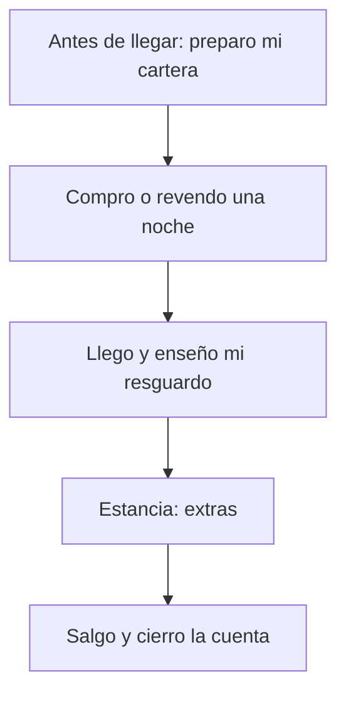

# Si algo no funciona

> Es una ayuda para cuando te atascas: la cartera, la red, una compra, el código QR
> o una noche que se vende antes de que te dé tiempo a firmar.

<!-- GENERAR_IMAGEN: doc-huesped-infografia-casos.svg -->

## Paso a paso

**Si tu cartera no conecta**

1. Mira si tienes una cartera instalada en el navegador. Si no la tienes, la web te muestra un enlace para instalar MetaMask.
2. Si la tienes, pulsa **Conectar wallet** y aprueba el permiso en tu móvil.
3. Si cerraste el aviso sin querer, no pasa nada: vuelve a pulsar **Conectar wallet**.
4. Cuando esté conectada, verás tu dirección acortada arriba a la derecha, con una forma parecida a `0x1234…abcd`.

**Si estás en la red equivocada**

1. Verás el aviso **«Estás en la red equivocada.»** y un botón **Cambiar de red**.
2. Púlsalo. Tu cartera te pedirá aprobar el cambio.
3. Si te dice que tu cartera no tiene esa red, apruébala cuando te la ofrezca y vuelve a intentarlo.
4. Si cerraste el aviso sin aceptar, vuelve a pulsar **Cambiar de red**.
5. Si sigue sin funcionar, cambia la red a mano en tu cartera y recarga la página.

**Si una compra no sale**

1. Si cerraste la firma en tu cartera, no se te ha cobrado nada. Puedes intentarlo otra vez cuando quieras.
2. Si el mensaje dice que la reserva no se completó, tampoco hay cobro. Vuelve a intentarlo.
3. Si el aviso dice que te falta saldo, mira cuánto te falta y cuánto tienes.
4. Si el hotel ha pausado las ventas, verás un aviso. No se puede comprar hasta que las reanude.
5. Cuando la operación sale bien, aparece un recibo. Si la red tiene explorador, el recibo lleva un enlace. Si no, muestra un código que puedes copiar.

**Si no ves el código QR de tu resguardo**

1. Entra en **Mis noches**, busca la noche y pulsa **Ver mi resguardo QR**.
2. Firma con tu cartera. Es para demostrar que la noche es tuya.
3. Si el código no se dibuja en pantalla, tu resguardo **sigue valiendo**. Copia el texto largo que aparece debajo (el token) y enséñalo en recepción.
4. Recepción puede pegar ese texto a mano si el escáner no funciona.
5. Si abres la pantalla de check-in y te dice que no hay resguardo, vuelve a **Mis noches** y genéralo otra vez.
6. Si en recepción te dicen que el resguardo ya se usó, pide ayuda en el mostrador.

**Si la noche que querías ya está vendida**

1. Antes de que firmes, el sistema comprueba si la noche sigue disponible.
2. Si ya está vendida, verás **«Esta noche ya está vendida. Elige otra noche del catálogo.»**
3. Pulsa el enlace y elige otra noche.
4. Si te lo dice el asistente, pídele otra noche o búscala tú en el catálogo.

**Si una página no carga**

1. Verás un aviso con un botón **Reintentar**. Púlsalo.
2. Si sigue igual, espera unos minutos y vuelve a probar.
3. Si el problema es del asistente, aparecerá un aviso con **Reintentar** y un enlace al catálogo.

## Si algo no funciona

- **«No detectamos una wallet web3.»** No tienes cartera instalada. Instala MetaMask desde el enlace que aparece.
- **«Estás en la red equivocada.»** Tu cartera está en otra red. Pulsa **Cambiar de red**.
- **«Tu wallet aún no tiene esta red. Aprueba añadirla cuando MetaMask te lo pida y vuelve a intentarlo.»** Aprueba añadirla y repite el cambio.
- **«Has cancelado el cambio de red. Para reservar, cambia a la red de la aplicación.»** Vuelve a pulsar **Cambiar de red** y acepta.
- **«No se pudo cambiar de red. Cámbiala manualmente en tu wallet a la red de la aplicación e inténtalo de nuevo.»** Cámbiala a mano en tu cartera.
- **«Has cancelado la firma. Puedes intentarlo de nuevo cuando quieras.»** No se ha cobrado nada. Reinténtalo si quieres.
- **«No se pudo completar la reserva. Revisa que estés en la red correcta y vuelve a intentarlo.»** Comprueba la red y reinténtalo.
- **«El hotel ha pausado las operaciones: no se pueden comprar noches mientras dure la pausa.»** No hay nada que puedas hacer desde la web. Inténtalo más tarde.
- **No se pudo comprobar si las ventas están en pausa.** El sistema te lo dice en vez de prometer que todo va bien. Si intentas comprar y siguen en pausa, la operación se rechazará.
- **«Esta noche ya está vendida. Elige otra noche del catálogo.»** Otra persona se te adelantó. Elige otra noche.
- **«Conecta tu cartera para obtener el resguardo.»** Conecta la cartera y vuelve a pedir el resguardo.
- **«Firma cancelada en tu cartera.»** No firmaste. Vuelve a pulsar para generar el resguardo y firma.
- **«No se pudo dibujar el código QR, pero el resguardo sigue valiendo: copia el token y enséñalo en recepción.»** El código no se pudo dibujar, pero tu resguardo sirve igual. Copia el texto y muéstralo en recepción.
- **«Esta página no tiene ningún resguardo. Abre el enlace que generaste desde «Mis noches».»** Genera el resguardo otra vez desde **Mis noches**.
- **«No se pudo emitir el resguardo. Inténtalo de nuevo.»** Vuelve a intentarlo. Si sigue fallando, no sabemos la causa exacta: coméntalo en recepción.
- **«No se pudieron cargar tus noches. Inténtalo de nuevo.»** Pulsa **Reintentar**.
- **«No se pudo cargar el histórico. Inténtalo de nuevo.»** Pulsa **Reintentar**.
- **«El asistente no está disponible ahora mismo. Puedes seguir reservando desde el catálogo.»** Pulsa **Reintentar** o reserva desde el catálogo.
- **Un mensaje que no está en esta lista.** No sabemos la causa exacta. Apunta lo que veías y coméntalo en recepción.

## Preguntas rápidas

- **¿Pierdo dinero si algo falla a mitad de una compra?** No. Si cancelas la firma o la operación no se completa, no se te cobra nada.
- **¿Necesito saber de tecnología?** No. Solo tienes que pulsar los botones y aprobar en tu cartera cuando te lo pida.
- **¿Con quién hablo si sigo atascado?** Con recepción. En la página **Contacto** tienes el teléfono y el correo del hotel.
- **¿A qué hora puedo pasar por recepción?** <!-- PENDIENTE DEL CLIENTE: horario de atención de recepción -->
- **¿Por qué no aparece el botón del dinero de prueba?** Porque este entorno no lo tiene configurado, o porque tu cartera no está conectada en la red correcta.
- **¿Puedo usar el hotel sin cartera?** Puedes mirar el catálogo y el histórico; para comprar, revender o enseñar tu resguardo necesitas la cartera.
