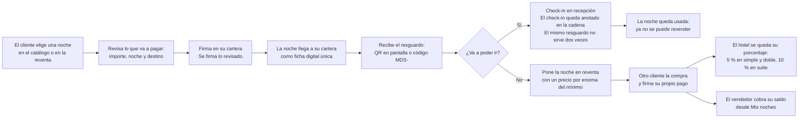
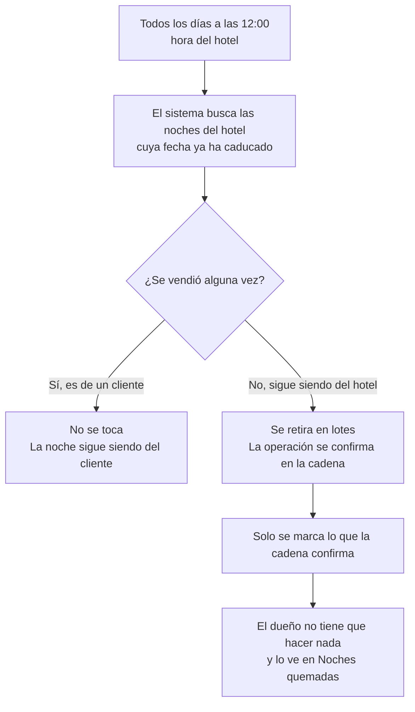

# Índice de ilustraciones para los manuales

Esta carpeta reúne las imágenes que acompañan a los manuales de `docs/`. Cada imagen corresponde
a un momento concreto de un manual. Las descripciones dicen **qué tiene que verse**, no cómo está
hecho por dentro.

**Cómo usar esta página**

1. **Las nueve imágenes ya están dibujadas y guardadas** en esta carpeta con el nombre de fichero
   que figura en la tabla (columna «Estado»). Los manuales ya las muestran, cada una al final de su
   apartado, con la línea ``.
2. Si **cambia un manual**, mantén la imagen a juego: actualiza el SVG para que diga lo mismo que el
   texto (mismos nombres de pantalla, mismos mensajes y mismos pasos), vuelve a mirarla entera y
   comprueba que no se corta ni se solapa ningún texto.
3. Si añades una imagen nueva, dibújala en SVG con el estilo y la paleta de esta página, añádela a
   la tabla con su estado y enlázala desde el manual con ``.

**Reglas que siguen las imágenes ya generadas** (para que las nuevas salgan iguales): SVG puro y
autocontenido (sin imágenes externas, sin fuentes descargadas y sin scripts), con `viewBox` y
`width`/`height` iguales a las medidas de la tabla, `role="img"` con `<title>` y `<desc>`, todo el
texto en elementos `<text>` (títulos en Fraunces, cuerpo en Hanken Grotesk) y **ningún texto por
debajo de 18 px** dentro del lienzo.

**Paleta de la marca** (para que todo combine): arena clara de fondo (`sand`), blanco (`shell`),
verde azulado oscuro (`sea`) para acciones y títulos, terracota para avisos, verde oliva para
«correcto» y dorado para la etiqueta de suite. Nada de colores fuera de estos.

## Imágenes necesarias

| # | Fichero | Formato | Medidas | Dónde se usa | Qué debe mostrar | Estado |
|---|---|---|---|---|---|---|
| 1 | `portada-hotel.svg` | SVG (y PNG a 1600×900) | 1600×900 | Portada de los tres manuales | El hotel visto desde el paseo marítimo con el mar al fondo. Encima, el nombre **«Hotel Marina del Sol»** y debajo, en una sola línea, **«50 habitaciones · Alicante · noches en propiedad»**. Sin logotipos de terceros y sin precios. | **Generada** (`portada-hotel.svg` + `portada-hotel.png`) |
| 2 | `compra-tres-pasos.svg` | SVG | 1400×600 | `manual-comprador.md` §3 | Una fila de tres recuadros numerados, con una flecha entre cada uno. Recuadro 1: una rejilla de tarjetas de habitación con foto, fecha y precio, titulado **«1 · Elegir»**. Recuadro 2: una ventana con cinco líneas (Habitación, Noche, Importe, Token, Contrato) y el título **«2 · Revisar»**. Recuadro 3: un móvil con el aviso de la cartera y el título **«3 · Firmar»**. Bajo los tres, una frase: **«Se firma exactamente lo que se ha revisado»**. | **Generada** (`compra-tres-pasos.svg`) |
| 3 | `panel-dueno.svg` | SVG | 1600×1000 | `manual-cliente.md` §4 | Una maqueta del panel del dueño: menú lateral con las palabras **Publicar noche, Métricas, Royalty, Pausa, Fondos, Caducadas, Roles**; arriba, siete cifras en tarjetas (**Vendido, Royalties, Reventa, Noches vendidas, Minteadas, Quemadas, Ocupación**); debajo, tres gráficos: barras por mes, barras por tipo de habitación (simple/doble/suite) y una lista de ranking de las más revendidas. Números de ejemplo redondos y creíbles, nunca datos reales de clientes. | **Generada** (`panel-dueno.svg`) |
| 4 | `pantalla-recepcion.svg` | SVG | 1400×900 | `manual-recepcion.md` §2 y §3 | La pantalla de recepción: título **«Validación de Recepción & Check-in»**, dos pestañas (**Escaneo QR / JWS** y **Protocolo de Contingencia (Sin Móvil)**), un lector de mano escaneando un móvil, el botón **Confirmar Check-in Inmediato** y, justo debajo, el cartel verde de éxito con habitación, fecha y el texto **«Anclado on-chain: 0x…»**. | **Generada** (`pantalla-recepcion.svg`) |
| 5 | `resguardo-qr-codigo.svg` | SVG | 1200×800 | `manual-comprador.md` §5 y `manual-recepcion.md` §3 | Dos mitades. Izquierda: un móvil con un **código QR** grande y el texto **«Enséñalo en recepción»**. Derecha: una tarjeta de papel con un **código corto tipo `MDS-A1B2C3D4`** y el texto **«Plan B: apúntalo»**. Abajo, en una franja, el aviso **«Cada resguardo sirve una sola vez»**. | **Generada** (`resguardo-qr-codigo.svg`) |
| 6 | `pantalla-reventa.svg` | SVG | 1400×900 | `manual-comprador.md` §6 | La pantalla **Reventa**: una rejilla de tarjetas con la etiqueta **Reventa**, el nombre de la habitación, la fecha, el precio y el botón **Reservar reventa**. Al lado, otra tarjeta con la etiqueta **En reventa** y los botones **Cambiar precio** y **Cancelar reventa**, titulada **«Mis noches»**. | **Generada** (`pantalla-reventa.svg`) |
| 7 | `esquema-compra-reventa.svg` | SVG | 1600×500 | `docs/README.md` y `manual-comprador.md` §1 | Una línea de tiempo de cinco paradas con iconos sencillos y una flecha que las une: **Comprar** (móvil con cartera) → **Resguardo** (QR en un móvil) → **Check-in** (mostrador con lector) → **Reventa** (dos manos intercambiando una tarjeta) → **Cobro** (moneda entrando en una cartera). Debajo de cada parada, una frase de máximo seis palabras. | **Generada** (`esquema-compra-reventa.svg`) |
| 8 | `esquema-quemado-12h.svg` | SVG | 1400×600 | `manual-cliente.md` §1 | Un reloj marcando las **12:00** en el centro. A la izquierda, tres tarjetas de noche con la etiqueta **«no vendida»** y una flecha hacia el centro. A la derecha, esas tarjetas con un sello **«retirada»** y el texto **«Sin intervención humana»**. Abajo, un cartel destacado: **«Una noche ya vendida a un cliente NUNCA se retira»**. | **Generada** (`esquema-quemado-12h.svg`) |
| 9 | `acceso-doble-factor.svg` | SVG | 1200×700 | `manual-cliente.md` §2 y `manual-recepcion.md` §1 | Tres cajas en fila con un candado cada una: **1. Usuario y contraseña**, **2. Código de 6 dígitos del móvil**, **3. Cartera conectada**. Debajo, una nota con el texto **«El código de 6 dígitos es solo para el personal del hotel»**. | **Generada** (`acceso-doble-factor.svg`) |

## Bloques Mermaid listos para pegar

Los dos diagramas siguientes se pueden pegar tal cual en cualquier visor de Mermaid (por ejemplo
GitHub, que los dibuja solo). Sirven como versión corregible de las imágenes 7 y 8.

### Diagrama 1 · Compra → resguardo → check-in → reventa → cobro

### Diagrama 2 · Quemado diario de las 12:00

---

*Índice de ilustraciones · Hotel Marina del Sol · cualquier imagen nueva, con el mismo estilo y la
misma paleta, evita que los manuales parezcan de proyectos distintos.*
