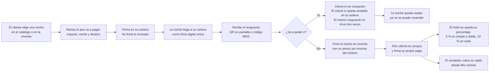
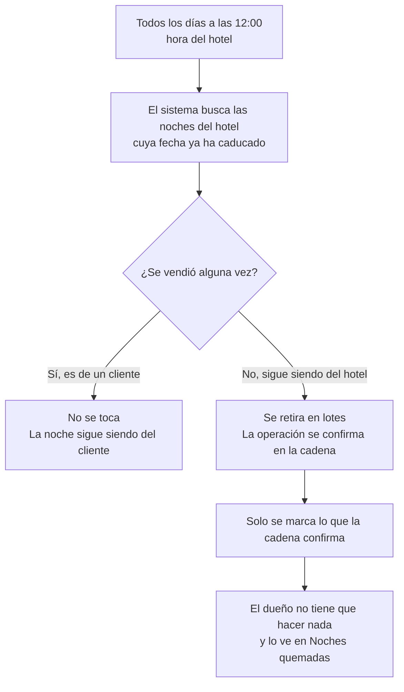

# Índice de imágenes de la plataforma

Esta carpeta reúne **tres familias** de imágenes, y el nombre de cada una dice a cuál pertenece y
dónde se ve (catálogo completo, con el mapa de las 50 habitaciones:
[`RepoTecnico/catalogo_imagenes.md`](../../RepoTecnico/catalogo_imagenes.md)):

| Familia | Patrón | Se sirve en |
|---|---|---|
| **Habitación** | `<nº>-<Simple\|Doble\|Suite>-<AAAA-MM-DD>-<1..5>.jpg` | `GET /api/rooms/images/<fichero>` |
| **Contenido público** (hero, galería, planes) | `hotel-<hero\|services\|experience\|activities\|contact\|other>-<AAAA-MM-DD>-<1..20>.jpg` | `GET /api/content/images/<fichero>` |
| **Ilustraciones de manual** | `doc-<pantalla>-<elemento>.svg` (o `.png` en la portada) | `GET /manual/imagenes/<fichero>` |

Las dos primeras se **suben desde el back-office** (el sistema construye el nombre) y son **JPG ≤ 2 MB**.
Las de manual se guardan aquí a mano con el prefijo `doc-` y se regeneran con
`pnpm --filter @hotel/web run manuals`.

## Fotografías de habitación

Material actual: **una portada por tipo**, en la habitación representativa de cada uno (101 simple,
116 doble, 201 suite). El nombre es el canónico y, al subirlas desde `/admin/habitacion`, el sistema
lo vuelve a generar con la fecha del día.

| Fichero | Habitación | Posición |
|---|---|---|
| `101-Simple-2026-09-28-1.jpg` | 101 (simple) | Portada (1) |
| `116-Doble-2026-09-28-1.jpg` | 116 (doble) | Portada (1) |
| `201-Suite-2026-09-28-1.jpg` | 201 (suite) | Portada (1) |

## Ilustraciones para los manuales

Cada imagen corresponde a un momento concreto de un manual. Las descripciones están escritas para que **las pueda dibujar
alguien que no conoce el sistema**: dicen qué tiene que verse, no cómo está hecho por dentro.

**Cómo usar esta página**

1. Elige la imagen de la tabla.
2. Dibújala con el nombre de fichero propuesto y guárdala en esta misma carpeta (`docs/imagenes/`).
3. En los manuales solo hay que cambiar la línea de texto por la imagen:
   ``.

**Paleta de la marca** (para que todo combine): arena clara de fondo (`sand`), blanco (`shell`),
verde azulado oscuro (`sea`) para acciones y títulos, terracota para avisos, verde oliva para
«correcto» y dorado para la etiqueta de suite. Nada de colores fuera de estos.

## Imágenes necesarias

| # | Fichero propuesto | Formato | Medidas | Dónde se usa | Qué debe mostrar |
|---|---|---|---|---|---|
| 1 | `doc-portada-hotel.svg` + `doc-portada-hotel.png` | SVG (y PNG a 1600×900) | 1600×900 | Portada de los tres manuales | El hotel visto desde el paseo marítimo con el mar al fondo. Encima, el nombre **«Hotel Marina del Sol»** y debajo, en una sola línea, **«50 habitaciones · Alicante · noches en propiedad»**. Sin logotipos de terceros y sin precios. |
| 2 | `doc-compra-tres-pasos.svg` | SVG | 1400×600 | `manual-comprador.md` §3 | Una fila de tres recuadros numerados, con una flecha entre cada uno. Recuadro 1: una rejilla de tarjetas de habitación con foto, fecha y precio, titulado **«1 · Elegir»**. Recuadro 2: una ventana con cinco líneas (Habitación, Noche, Importe, Token, Contrato) y el título **«2 · Revisar»**. Recuadro 3: un móvil con el aviso de la cartera y el título **«3 · Firmar»**. Bajo los tres, una frase: **«Se firma exactamente lo que se ha revisado»**. |
| 3 | `doc-panel-dueno.svg` | SVG | 1600×1000 | `manual-cliente.md` §4 | Una maqueta del panel del dueño: menú lateral con las palabras **Publicar noche, Métricas, Royalty, Pausa, Fondos, Caducadas, Roles**; arriba, siete cifras en tarjetas (**Vendido, Royalties, Reventa, Noches vendidas, Minteadas, Quemadas, Ocupación**); debajo, tres gráficos: barras por mes, barras por tipo de habitación (simple/doble/suite) y una lista de ranking de las más revendidas. Números de ejemplo redondos y creíbles, nunca datos reales de clientes. |
| 4 | `doc-pantalla-recepcion.svg` | SVG | 1400×900 | `manual-recepcion.md` §2 y §3 | La pantalla de recepción: título **«Validación de Recepción & Check-in»**, dos pestañas (**Escaneo QR / JWS** y **Protocolo de Contingencia (Sin Móvil)**), un lector de mano escaneando un móvil, el botón **Confirmar Check-in Inmediato** y, justo debajo, el cartel verde de éxito con habitación, fecha y el texto **«Anclado on-chain: 0x…»**. |
| 5 | `doc-resguardo-qr-codigo.svg` | SVG | 1200×800 | `manual-comprador.md` §5 y `manual-recepcion.md` §3 | Dos mitades. Izquierda: un móvil con un **código QR** grande y el texto **«Enséñalo en recepción»**. Derecha: una tarjeta de papel con un **código corto tipo `MDS-A1B2C3D4`** y el texto **«Plan B: apúntalo»**. Abajo, en una franja, el aviso **«Cada resguardo sirve una sola vez»**. |
| 6 | `doc-pantalla-reventa.svg` | SVG | 1400×900 | `manual-comprador.md` §6 | La pantalla **Reventa**: una rejilla de tarjetas con la etiqueta **Reventa**, el nombre de la habitación, la fecha, el precio y el botón **Reservar reventa**. Al lado, otra tarjeta con la etiqueta **En reventa** y los botones **Cambiar precio** y **Cancelar reventa**, titulada **«Mis noches»**. |
| 7 | `doc-esquema-compra-reventa.svg` | SVG | 1600×500 | `docs/README.md` y `manual-comprador.md` §1 | Una línea de tiempo de cinco paradas con iconos sencillos y una flecha que las une: **Comprar** (móvil con cartera) → **Resguardo** (QR en un móvil) → **Check-in** (mostrador con lector) → **Reventa** (dos manos intercambiando una tarjeta) → **Cobro** (moneda entrando en una cartera). Debajo de cada parada, una frase de máximo seis palabras. |
| 8 | `doc-esquema-quemado-12h.svg` | SVG | 1400×600 | `manual-cliente.md` §1 | Un reloj marcando las **12:00** en el centro. A la izquierda, tres tarjetas de noche con la etiqueta **«no vendida»** y una flecha hacia el centro. A la derecha, esas tarjetas con un sello **«retirada»** y el texto **«Sin intervención humana»**. Abajo, un cartel destacado: **«Una noche ya vendida a un cliente NUNCA se retira»**. |
| 9 | `doc-acceso-doble-factor.svg` | SVG | 1200×700 | `manual-cliente.md` §2 y `manual-recepcion.md` §1 | Tres cajas en fila con un candado cada una: **1. Usuario y contraseña**, **2. Código de 6 dígitos del móvil**, **3. Cartera conectada**. Debajo, una nota con el texto **«El código de 6 dígitos es solo para el personal del hotel»**. |

## Bloques Mermaid listos para pegar

Los dos diagramas siguientes se pueden pegar tal cual en cualquier visor de Mermaid (por ejemplo
GitHub, que los dibuja solo). Sirven como versión corregible de las imágenes 7 y 8.

### Diagrama 1 · Compra → resguardo → check-in → reventa → cobro

### Diagrama 2 · Quemado diario de las 12:00

## Infografías de los casos de uso

Las **32 infografías** de los manuales por caso de uso (más el mapa de iniciación) se generan con el
brief `RepoTecnico/Manuales/05-casos-de-uso/00-BRIEF-equipo-manuales.md`, se referencian desde
`docs/Manuales/05-casos-de-uso/**` y se sirven en `/manual/imagenes/`. Mismo estilo y misma paleta
que las anteriores: banda `sea-deep` con el número de CU, 3–5 pasos numerados en tarjetas y una
franja inferior con **Quién · Qué consigues · Si falla**.

| Fichero | Caso de uso representado | Bloque |
|---|---|---|
| `doc-cu-01-acceso-back-office.svg` | CU-01 · Entrar al panel del hotel con la cartera y el rol correcto | Bloque 1 · Iniciación |
| `doc-cu-12-royalty.svg` | CU-12 · Decidir cuánto se queda el hotel en cada reventa | Bloque 1 · Iniciación |
| `doc-cu-16-roles.svg` | CU-16 · Dar de alta a quien puede tocar el sistema (roles y propiedad) | Bloque 1 · Iniciación |
| `doc-cu-02-mintear-noche.svg` | CU-02 · Poner una noche a la venta (crear la ficha digital) | Bloque 2 · Inventario |
| `doc-cu-04-catalogo.svg` | CU-04 · Ver y filtrar las noches disponibles | Bloque 3 · Onboarding |
| `doc-cu-08-asistente-ia.svg` | CU-08 · Pedirle una noche al asistente y que prepare la compra | Bloque 3 · Onboarding |
| `doc-cu-09-historico.svg` | CU-09 · Mirar el histórico público de ventas | Bloque 3 · Onboarding |
| `doc-cu-17-onboarding-web3.svg` | CU-17 · Conectar la cartera y ponerse en la red correcta | Bloque 3 · Onboarding |
| `doc-cu-05-compra-primaria.svg` | CU-05 · Comprar una noche al hotel | Bloque 4 · Ventas |
| `doc-cu-06-listar-reventa.svg` | CU-06 · Poner mi noche en reventa (y quitarla) | Bloque 4 · Ventas |
| `doc-cu-07-compra-secundaria.svg` | CU-07 · Comprar una noche que otro cliente revende | Bloque 4 · Ventas |
| `doc-cu-10-aviso-email.svg` | CU-10 · Avisar al hotel por email cada vez que hay una venta | Bloque 5 · Postventa |
| `doc-cu-11-dashboard.svg` | CU-11 · Ver las métricas del negocio en el panel | Bloque 5 · Postventa |
| `doc-cu-13-caducadas.svg` | CU-13 · Retirar las noches del hotel que ya han caducado | Bloque 6 · Operación |
| `doc-cu-14-pausa.svg` | CU-14 · Parar el sistema en una emergencia y volver a arrancarlo | Bloque 6 · Operación |
| `doc-cu-15-retirar-fondos.svg` | CU-15 · Pasar el dinero recaudado a la cuenta del hotel | Bloque 6 · Operación |
| `doc-cu-pr-01-faucet.svg` | CU-PR-01 · Conseguir dinero de prueba (solo en pruebas) | Bloque 7 · Pruebas |
| `doc-cu-30-acceso-owner.svg` | CU-30 · Que el dueño lo vea y lo pueda todo | Bloque 8 · Hotelera (v2) |
| `doc-cu-31-panel-dia-recepcion.svg` | CU-31 · La pantalla del día en recepción | Bloque 8 · Hotelera (v2) |
| `doc-cu-32-buscar-reserva.svg` | CU-32 · Encontrar una reserva con el código de recuperación | Bloque 8 · Hotelera (v2) |
| `doc-cu-33-checkin-qr.svg` | CU-33 · Dar entrada al cliente escaneando su resguardo | Bloque 8 · Hotelera (v2) |
| `doc-cu-34-checkout.svg` | CU-34 · Dar salida y cerrar la cuenta de la habitación | Bloque 8 · Hotelera (v2) |
| `doc-cu-35-cargos-adicionales.svg` | CU-35 · Apuntar los extras del huésped (minibar, desayuno…) | Bloque 8 · Hotelera (v2) |
| `doc-cu-36-reventa-huesped.svg` | CU-36 · Que el huésped publique, cambie o retire su reventa | Bloque 8 · Hotelera (v2) |
| `doc-cu-37-avisos-reventa.svg` | CU-37 · Avisar al huésped cuando su reventa se mueve | Bloque 8 · Hotelera (v2) |
| `doc-cu-40-menu-wallet.svg` | CU-40 · El menú de la cartera y del usuario | Bloque 9 · Back-office (v3) |
| `doc-cu-41-seccion-sistemas.svg` | CU-41 · La sección «Sistemas» (solo para el dueño) | Bloque 9 · Back-office (v3) |
| `doc-cu-42-gestion-usuarios.svg` | CU-42 · Dar de alta, cambiar y quitar usuarios de la plataforma | Bloque 9 · Back-office (v3) |
| `doc-cu-43-gobernar-contrato.svg` | CU-43 · Gobernar el contrato (pausar, roles, royalty, propiedad) | Bloque 9 · Back-office (v3) |
| `doc-cu-44-finanzas-retirar.svg` | CU-44 · Ver las finanzas del hotel y retirar el dinero | Bloque 9 · Back-office (v3) |
| `doc-cu-45-operaciones.svg` | CU-45 · Ver qué está pasando ahora mismo (operaciones) | Bloque 9 · Back-office (v3) |
| `doc-cu-46-seguridad-operador.svg` | CU-46 · Proteger la cuenta del que manda | Bloque 9 · Back-office (v3) |
| `doc-mapa-iniciacion-sistema.svg` | Mapa de la iniciación del sistema: las 9 fases y sus 32 casos de uso | Portada de los índices |

---

*Índice de imágenes · Hotel Marina del Sol · cualquier imagen nueva, con el mismo estilo y la
misma paleta, evita que los manuales parezcan de proyectos distintos. El cumplimiento de los
nombres lo comprueba `apps/web/src/lib/images-naming.test.ts`.*
