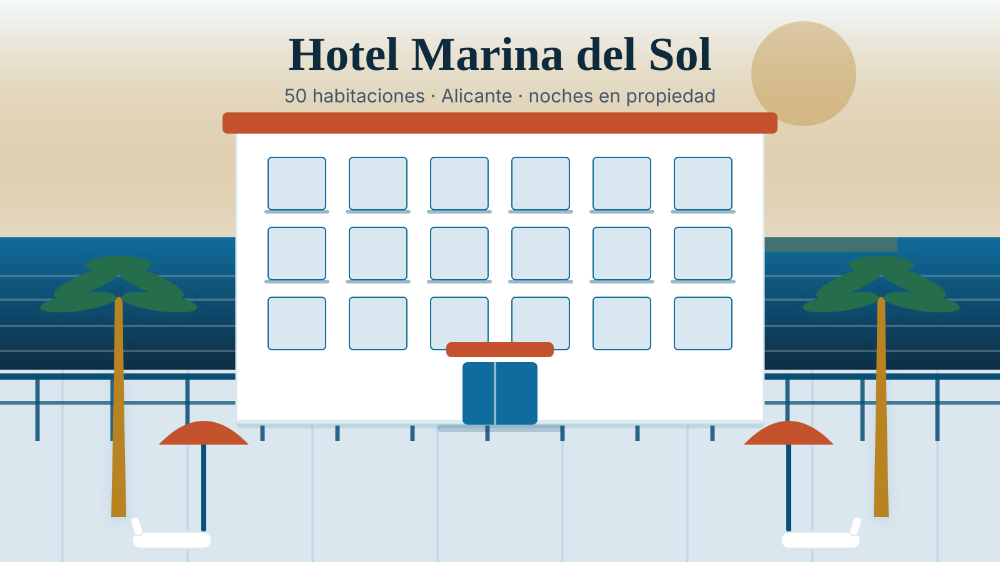
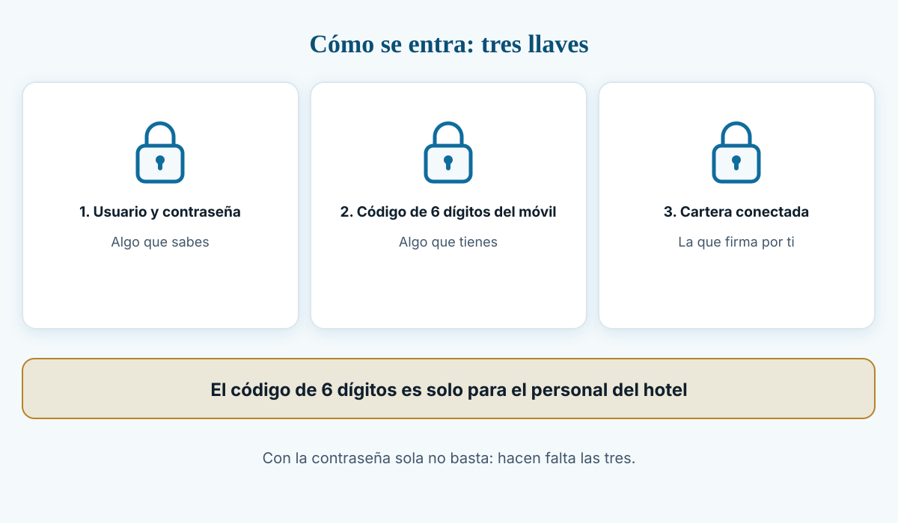
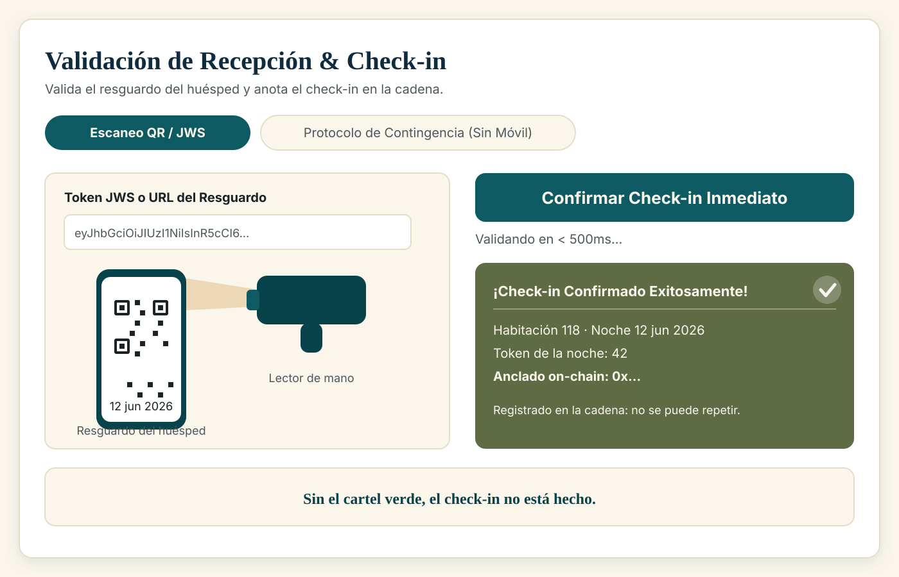
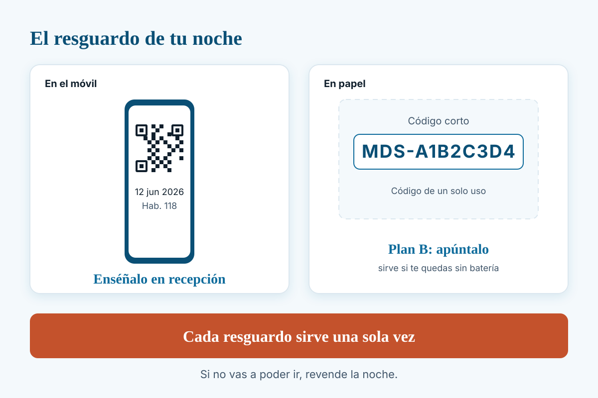

# Manual de recepción — Hotel Marina del Sol

> Para el personal del mostrador. Explica cómo se hace el **check-in** de una noche comprada en
> la web del hotel y qué significa cada mensaje que aparece en pantalla.
> Escrito en lenguaje llano, con las palabras exactas que verás en la pantalla.
> Hoy todo funciona en una **red de pruebas**: sirve para practicar y validar, no para vender al
> público todavía.

---

## 1. Cómo entrar

La pantalla de recepción está en la dirección del hotel seguida de **`/recepcion`**.

Se entra con **tres cosas** (doble factor: algo que sabes y algo que tienes):

1. **Tu usuario y tu contraseña** de recepción (son tuyos; no los compartas).
2. **Un código de 6 dígitos** de la aplicación de autenticación del móvil del puesto de trabajo.
3. **La cartera del hotel** conectada en la barra superior. La pantalla lo pide al principio:
   pulsa **Conectar wallet** y acepta en el puesto.

Pasos:

1. Abre `/recepcion`.
2. Escribe **usuario** y **contraseña**. Pulsa **Continuar**.
3. Escribe el **código de 6 dígitos** y pulsa **Entrar**.
4. Comprueba arriba a la derecha que aparece tu sesión (usuario) y la cartera conectada.

Si la pantalla dice **«Tu sesión ha caducado. Vuelve a iniciar sesión.»**, es la protección
normal: la sesión dura 15 minutos. Vuelve a entrar (usuario, contraseña y código). No hay nada
roto.

---

## 2. Qué se ve al abrir la pantalla

Arriba, el título **«Validación de Recepción & Check-in»** y una frase que resume para qué sirve:
validar los resguardos de los huéspedes o usar el protocolo de contingencia cuando no tienen
móvil.

Debajo hay **dos pestañas**:

| Pestaña | Cuándo se usa |
|---|---|
| **Escaneo QR / JWS** | El camino normal: el huésped te enseña el código QR de su resguardo. |
| **Protocolo de Contingencia (Sin Móvil)** | El huésped **no puede** mostrar el QR: se le ha muerto el móvil, no lo trae, o el aparato falla. |

Y dos avisos que pueden aparecer:

- **Banner verde de éxito** («¡Check-in Confirmado Exitosamente!»): el check-in se ha registrado.
  Muestra la habitación, la fecha, el número de la noche, cuántos milisegundos ha tardado y el
  **código de la operación que quedó anotada en la cadena**. Ese código es la prueba de que el
  check-in existe de verdad y no solo en la pantalla.
- **Banner en pausa**: si el hotel ha pausado el sistema, aparece un aviso que dice que **no se
  puede registrar ningún check-in** hasta que se reanude, y te pide que avises a administración.
  En ese caso el botón de confirmar queda desactivado a propósito (mejor eso que dejarte pulsar y
  que la operación falle).

---

## 3. Escanear un resguardo, paso a paso

### Antes de empezar

El resguardo del huésped es un **código QR** (o su versión impresa en papel, un código que empieza
por **`MDS-`**). **Cada resguardo sirve una sola vez**: al confirmarlo queda gastado.

### El procedimiento

1. Pide al huésped el resguardo (móvil o papel).
2. Comprueba que la pestaña activa es **Escaneo QR / JWS**.
3. Lee el código QR con el lector de mano. El texto del resguardo aparece en la caja
   **«Token JWS o URL del Resguardo»**. Si el lector no lo pega solo, puedes pegar ahí el texto
   completo que te muestre el huésped.
4. Pulsa **Confirmar Check-in Inmediato**.
5. Espera un instante. La pantalla pone **«Validando en < 500ms…»** y normalmente tarda mucho
   menos (en las pruebas, unos 40 milisegundos).
6. **Mira el resultado antes de dar la llave:**
   - Si sale el **banner verde**, el check-in está hecho: verás la **habitación**, la **fecha** y,
     si todo ha ido bien, la línea **«Anclado on-chain: 0x…»**. **Anotado en la cadena** significa
     que la noche queda marcada como usada de forma definitiva.
   - Si sale un **mensaje de error**, **no hay check-in**: mira la tabla del apartado 4 y sigue lo
     que dice. El error se queda en pantalla hasta que hagas la siguiente operación.
7. Si el banner verde no muestra la línea del ancla y en su lugar dice **«Sin ancla on-chain»**,
   **no des el check-in por bueno**: avisa a administración y repite la operación.

### Lo que nunca debes hacer en esta pantalla

- **No escanees dos veces el mismo resguardo** para "asegurarte". La segunda vez dará error. Eso
  no es un fallo: es la garantía de que una noche no se usa dos veces.
- **No inventes ni teclees** un resguardo a mano si no lo tienes delante.
- **No apuntes datos personales** en ningún campo de la pantalla (ver apartado 5).

---

## 4. Qué significa cada mensaje

Estos son los mensajes que puede devolver el sistema, explicados en lenguaje llano.

| Mensaje en pantalla | Qué ha pasado | Qué hacer |
|---|---|---|
| «Este resguardo ya se utilizó para un check-in; cada pase sirve una sola vez» | Ese resguardo **ya se usó**. El sistema lo tiene apuntado. | **No es un error del sistema.** Comprueba en el listado del hotel si esa noche ya tiene entrada hecha. Si el huésped insiste, avisa a administración: no se puede repetir. |
| «Otro puesto está procesando el check-in de esta noche; espera unos segundos y reinténtalo» | **Otro puesto de recepción** está haciendo el check-in de la misma noche en este mismo momento. | Espera unos segundos y repite la operación. El resguardo del huésped **no se ha gastado**. |
| «El contrato canónico está en pausa: el hotel ha detenido las operaciones y el check-in no puede registrarse on-chain hasta reanudarlo» | El hotel ha **pausado el sistema** de forma deliberada. No es una avería. | Avisa a administración. El resguardo del huésped **sigue siendo válido** para cuando se reanude. No lo tires. |
| «No se pudo comprobar la titularidad en la cadena; el check-in no se registra hasta poder verificarla» | La red **no ha respondido** a la consulta de quién es el dueño de la noche. | No es culpa del huésped. Espera un momento y reintenta. Si sigue igual, avisa a administración. |
| «El resguardo corresponde a un propietario anterior de la noche; el titular actual debe emitir uno nuevo» | El huésped enseña un resguardo **antiguo**: la noche se revendió después y ya no es suya. | Pide al titular actual su resguardo. Si el que está delante dice ser el comprador, que consulte con quien le vendió. |
| «La habitación X ya ha realizado el check-in (noche Y consumida)» | La noche **ya está usada** en el sistema. | Como en el primer caso: no se puede repetir. Avisa a administración si hay duda. |
| «La noche Y fue quemada por expiración» | Esa noche **caducó sin venderse** y el sistema la retiró a las 12:00. Por tanto lo que trae el huésped no es válido. | Avisa a administración antes de alojar. No es una noche vendida. |
| «La noche no tiene venta primaria registrada: solo puede hacerse check-in de noches vendidas» | Ese número de noche **no se vendió nunca** por el hotel. | Comprueba el resguardo con administración. |
| «No se pudo anclar el check-in on-chain: …» | El sistema **no ha podido anotar** el check-in en la cadena (problema de red o de la cartera del puesto). | **No hay check-in.** Reintenta pasados unos segundos. Si vuelve a fallar, avisa a administración. El resguardo no se ha gastado. |
| «Resguardo inválido o corrupto» o «El resguardo no identifica una noche válida» | El código leído **no es un resguardo** o se ha leído mal. | Vuelve a escanear con cuidado. Si el huésped lo tiene en el móvil, pídele que suba el brillo de la pantalla. |
| «La prueba debe ser un código de resguardo emitido por el hotel (MDS-XXXXXXXX)» | En contingencia has escrito algo que **no tiene el formato** del código del hotel. | Revisa el código: empieza por `MDS-` y sigue con letras y números en mayúsculas. |
| «No se admiten documentos de identidad: el registro de viajeros (RD 933/2021) se hace en el PMS del hotel, fuera de la plataforma» | Has escrito un DNI, un NIE o un pasaporte en el campo de la prueba. El sistema **lo rechaza a propósito**. | Escribe un código de resguardo, un hash o una dirección de cartera. El documento se anota donde siempre: en el PMS del hotel. |
| «Motivo de contingencia no admitido» | El motivo elegido no es uno de la lista. | Elige uno de la lista desplegable. **No se escribe texto libre.** |
| «No se encontró reserva para la habitación X en fecha Y» | No hay ninguna noche vendida con esa habitación y esa fecha. | Revisa la habitación y la fecha (formato año-mes-día). |
| «Cuenta bloqueada temporalmente por intentos fallidos. Reinténtalo en 15 minutos.» | Demasiados intentos de acceso fallidos. | Espera 15 minutos. Si no recuerdas la contraseña, pide que te la renueven. |

**Regla de oro:** si no ves el banner verde con la habitación y la fecha, **el check-in no está
hecho**. No lo des por bueno de palabra.

---

## 5. Check-in cuando el cliente no tiene el QR (contingencia)

Se usa cuando el huésped **no puede** mostrar el QR. Está en la pestaña **Protocolo de
Contingencia (Sin Móvil)**. La contingencia cambia **cómo se demuestra** que la noche es suya;
**no** cambia la garantía: el check-in se anota en la cadena exactamente igual.

### Qué se admite como prueba

Pide **una sola** prueba de posesión, por este orden de preferencia:

1. **El código de resguardo impreso** que emitió el hotel (empieza por `MDS-`, mayúsculas).
2. **El código de la operación de compra** (el hash de la transacción, una cadena larga que
   empieza por `0x`).
3. **La dirección de la cartera del comprador** (también empieza por `0x`, y es más corta que el
   hash).

### Pasos

1. Abre la pestaña **Protocolo de Contingencia (Sin Móvil)**.
2. Rellena:
   - **Número de Habitación** (por ejemplo 101).
   - **Fecha de Entrada** (formato año-mes-día).
   - **Factor de Posesión a Verificar**: elige cuál de las tres pruebas vas a usar.
   - **Valor de Prueba / Dato de Cotejo**: escribe la prueba (el código `MDS-…`, el hash o la
     dirección de la cartera).
   - **Motivo de Contingencia**: elige de la lista (huésped sin dispositivo, resguardo impreso,
     fallo técnico, u otro).
3. **Antes de confirmar**, comprueba con el huésped que la habitación y la fecha son las suyas.
4. Pulsa **Validar y Autorizar Entrada**.
5. Mira el resultado igual que en el camino del QR: **sin banner verde no hay check-in**.

Ten en cuenta el sistema avisa de que, al confirmar, declaras haber registrado el parte de
entrada de viajeros en el programa oficial del hotel. Es decir: **la parte legal la sigues
haciendo en el PMS**, no aquí.

### Lo que NUNCA se escribe en esta pantalla

- **Nunca** el **nombre** del huésped.
- **Nunca** su **DNI, NIE o pasaporte**.
- **Nunca** su **teléfono**, su **correo** ni su **nacionalidad**.
- **Nunca** un texto libre: ni "viene con su mujer", ni "es cliente habitual", ni nada parecido.
  El motivo es una **lista cerrada** y el sistema rechaza lo que no esté en ella.

Todo eso **no entra en la web**. Si necesitas dejar constancia, se anota donde siempre: en el
registro de viajeros del hotel. **La web no guarda DNI ni nombres.**

---

## 6. Si el sistema no responde

Puede pasar: la red va lenta, el puesto se queda sin conexión o la cartera del hotel no puede
firmar. Qué hacer, en orden:

1. **No hagas el check-in "de palabra".** La plataforma no tiene un modo sin conexión: **lo que no
   queda anotado en la cadena, no está registrado**, y no aparece en ningún listado.
2. **Atiende al huésped mientras tanto.** No le dejes esperando de pie: explícale que hay una
   incidencia técnica y que lo estás resolviendo. La parte del registro de viajeros se hace como
   siempre, en el PMS del hotel.
3. **Espera y reintenta** pasados unos segundos: pulsa otra vez el botón. El resguardo del
   huésped **no se gasta** si el check-in no llega a registrarse, así que puedes reintentar con
   el mismo resguardo. Si te dice **«ya se utilizó»**, entonces sí se registró antes: comprueba el
   listado antes de repetir.
4. **Avisa a administración** con estos tres datos: habitación, fecha y lo que decía la pantalla.
5. **Si el sistema no vuelve en un rato**, deja constancia en el **parte de incidencias del hotel**
   (en papel o en el PMS, donde el hotel lo tenga por costumbre): fecha, hora, habitación, nombre
   del huésped y el código `MDS-…` si lo tiene. Ese parte es del hotel, no de la plataforma: la
   web no guarda nada de esto.
6. **Cuando el sistema vuelva**, haz el check-in normal y avisa a administración de que ya está
   hecho, para que no quede ninguna noche sin anotar.

Si la pantalla muestra el aviso de **contrato en pausa**, no es una avería: el hotel ha detenido
las operaciones. Avisa a administración y guarda el resguardo del huésped para reintentarlo.

---

## 7. Recordatorio: qué hace la web y qué no

| La web **sí** hace | La web **no** hace |
|---|---|
| Validar el resguardo del huésped y **anotar el check-in en la cadena** | Pedir o guardar el nombre, el DNI, el teléfono o la nacionalidad |
| Aceptar una prueba de posesión (código `MDS-…`, código de operación o dirección de cartera) | Enviar nada al registro oficial de viajeros ni generar una ficha policial |
| Registrar el **motivo** de la contingencia de una lista cerrada | Guardar texto libre donde se pueda escribir un DNI |
| Avisar al programa de gestión del hotel de que la estancia se ha validado (sin datos personales) | Guardar el contenido de la conversación con el huésped |

El **registro de viajeros (RD 933/2021)** es responsabilidad del establecimiento y se sigue
haciendo **en el mostrador**, como hoy.

---

*Manual de recepción · Hotel Marina del Sol · cualquier duda con un mensaje que no aparezca aquí:
avisa a administración antes de improvisar.*
